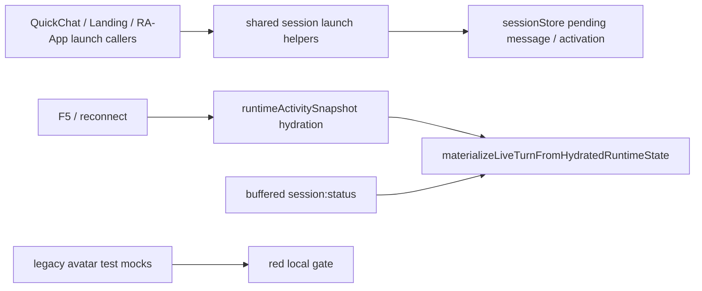
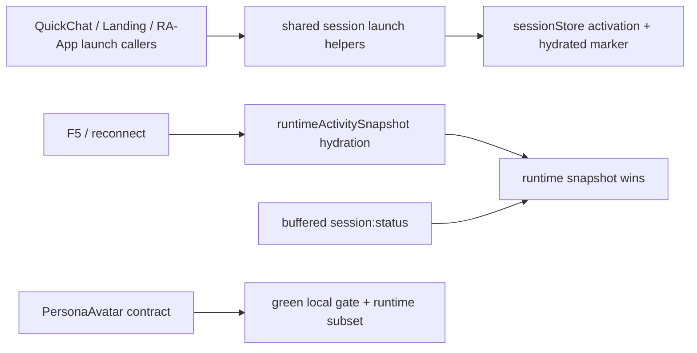
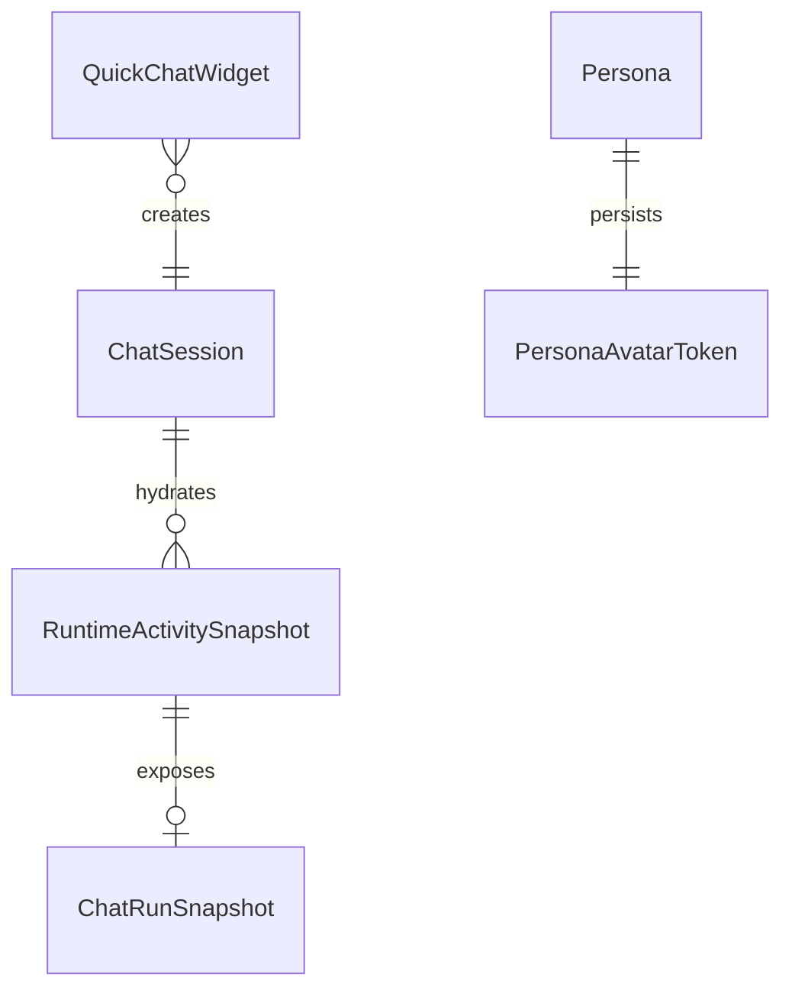

# Red Gate Runtime Blockers Closure

Date: 2026-06-19
Status: completed

## Goal

Domknac czerwony local gate po runtime-unification bez kolejnego ruszania core wire contractu. Ten pass zamyka test drift, precedence hydratacji i dowod, ze krytyczny runtime slice dalej przechodzi build oraz E2E.

## Current Architecture

## Target Architecture

## Affected Model Relations

## Checklist

- [x] Migrate persona avatar tests from legacy `boring-avatars` assumptions to `PersonaAvatar`.
- [x] Remove stale `vi.mock('boring-avatars')` usage where components no longer import it.
- [x] Update shared type comments to neutral deterministic-avatar wording.
- [x] Remove `boring-avatars` from `apps/kalio-web/package.json` and refresh lockfile.
- [x] Fix hydration precedence so `runtimeActivitySnapshot.active === false` blocks stale buffered `session:status` replay.
- [x] Add direct helper coverage for the new hydration precedence rule.
- [x] Fix `QuickChatWidget` test drift so the shared launch helper contract includes `markSessionHydrated()`.
- [x] Pass `corepack pnpm test`.
- [x] Pass `corepack pnpm --filter kalio-web typecheck`.
- [x] Pass `corepack pnpm --filter kalio-web build`.
- [x] Pass runtime acceptance subset in Playwright.

## Closed In This Pass

- Persona avatar contract cleanup is complete in tests and dependency graph.
- Runtime hydration now treats runtime snapshot presence as authoritative, even when the snapshot says the turn is inactive.
- Quick chat tests now reflect the shared activation helper instead of a stale partial store mock.
- Local gate, affected frontend build/typecheck, and the requested runtime E2E subset are green.

## Left Outside This Pass

Functional follow-up, not addressed here:

- richer sync of CLI live-progress if testers still expect more than current child-session/runtime visibility
- `fs_read` handling without hard `LINE_OUT_OF_RANGE`
- subagent timeout/settings proof
- reconnect / `tool:confirm rejected` observability proof

Deferred UX, not addressed here:

- file-label truncation
- autoscroll
- bottom status duplication
- graph tool collapse
- thinking animation glitches
- richer long-operation feedback

## Verification

- `corepack pnpm --filter kalio-web test -- src/features/persona/PersonaAvatarModal.test.tsx src/features/persona/PersonaListItem.test.tsx src/features/chat/hooks/useChatSocketEvents.helpers.test.ts src/features/chat/hooks/useChatSessionActivation.test.ts`
- `corepack pnpm --filter kalio-web test -- src/features/landing/QuickChatWidget.test.tsx`
- `corepack pnpm test`
- `corepack pnpm --filter kalio-web typecheck`
- `corepack pnpm --filter kalio-web build`
- `corepack pnpm --filter @kalio/e2e run test:e2e -- tests/ac-12-reload-history.spec.ts tests/ac-13-anti-spam.spec.ts tests/regression-stop-follow-up.spec.ts tests/regression-seeded-chat-graph-states.spec.ts tests/regression-cli-child-canvas-preview.spec.ts`

## Notes

- Official Socket.IO 4.x recovery guidance still treats reconnection recovery as best-effort, so keeping runtime-snapshot-first hydration is the correct invariant.
- This pass intentionally did not widen architecture scope again; it closed the red gate around the already-implemented runtime-unification slice.
