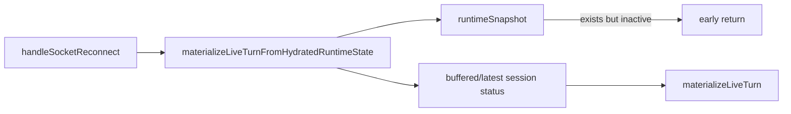
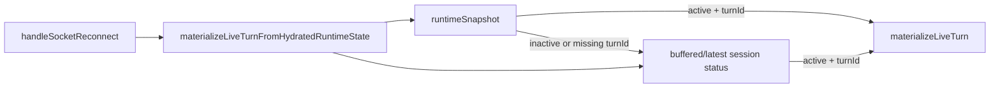
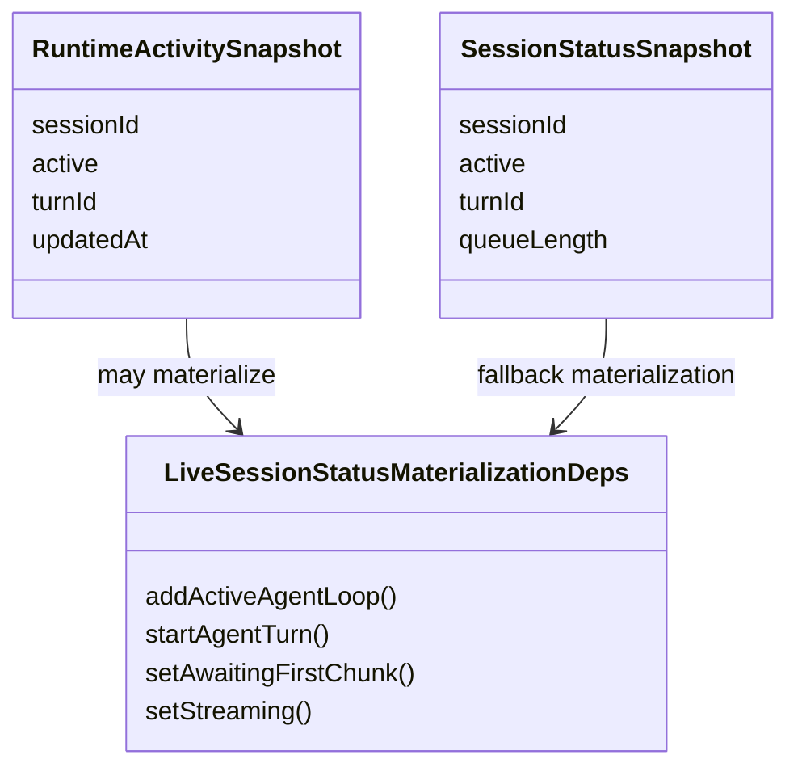

# 2026-06-19 Test Gap Detection: reconnect fallback

- [x] Ustalić zawężony obszar ostatnich zmian.
  - Zakres: `apps/kalio-web/src/features/chat/hooks/useChatSocketEvents.helpers.ts`
  - Powód: nowa ścieżka `runtimeSnapshot -> reconnect materialization` ma prawdopodobną lukę fallbacku.
- [x] Dodać test red dla nieaktywnego `runtimeSnapshot` i aktywnego buforowanego `session:status`.
  - Red potwierdzony: helper nie wywoływał materializacji fallbacku.
- [x] Naprawić minimalnie helper bez rozszerzania zakresu.
  - Zmiana: `runtimeSnapshot` ma priorytet tylko dla `active === true` i obecnego `turnId`.
- [x] Uruchomić testy skupione na zmienionej ścieżce.
  - `corepack pnpm exec vitest run src/features/chat/hooks/useChatSocketEvents.helpers.test.ts`
  - `corepack pnpm exec vitest run src/features/chat/hooks/useChatSocketEvents.reconnect.test.ts`
  - `corepack pnpm --filter kalio-web run typecheck`

## Acceptance

- Gdy `runtimeSnapshot` istnieje, ale `active !== true` albo brak `turnId`, reconnect nadal ma użyć ostatniego aktywnego `session:status`.
- Gdy `runtimeSnapshot` jest aktywny i ma `turnId`, zachowuje priorytet nad `session:status`.
- Bez zmian w szerszym flow reconnect poza tą decyzją wyboru źródła.

## Current Architecture

## Target Architecture

## Models Affected

## Notes

- Ten przebieg ma dodać tylko brakujący test i minimalną poprawkę, jeśli test ujawni realny błąd.
