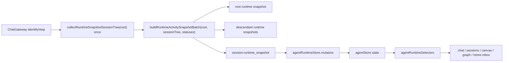
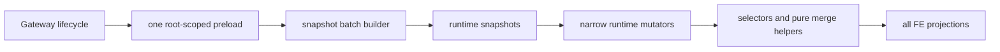
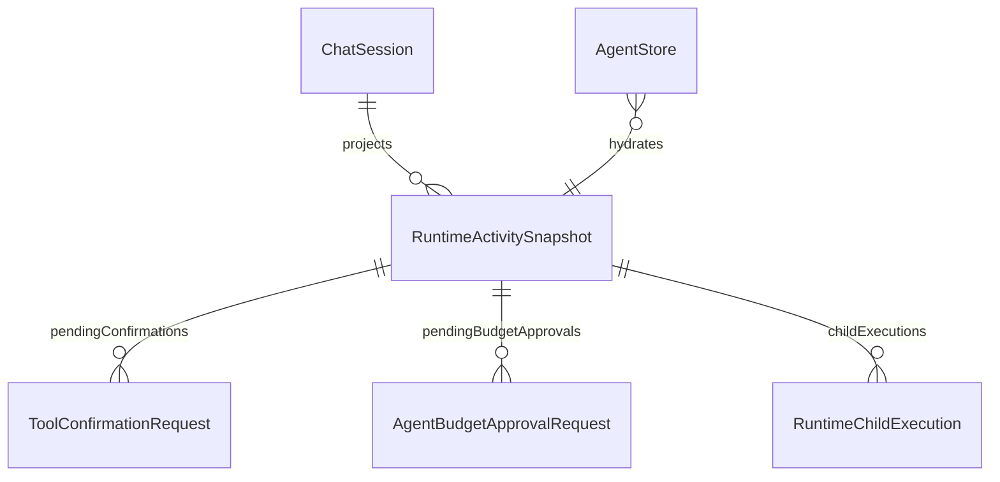

# Runtime BE Closure Plan

Date: 2026-06-20
Status: completed

## Goal

Domknac runtime po FE HITL fixie bez dorabiania kolejnego protokolu i bez pozornej refaktoryzacji backendu. Ten pass mial potwierdzic trzy rzeczy:
- reconnect/F5/stop nadal sa stabilne,
- multi-entry HITL nie gubi wpisow po hydratacji,
- FE merge-policy ma wezsze granice odpowiedzialnosci.

## Review Outcome

- Finding 1 byl juz zamkniety przed tym passem:
  - runtime snapshot wygrywa ze starym buffered `session:status`,
  - regresja ma test w `useChatSessionActivation.test.ts`.
- Finding 2 zostal domkniety:
  - `pendingConfirmations` i `pendingBudgetApprovals` sa tablicami per session,
  - hydratacja i akcje removal dzialaja per `requestId`,
  - doszly brakujace regresje dla budget approvals i multi-entry replay.
- Finding 3 okazal sie czesciowo przestarzaly:
  - `ChatGateway` juz robi jeden root-scoped preload drzewa sesji dla `identify` i `stop`,
  - batch builder reuzywa ten preload zamiast robic drugi descendant walk per emit,
  - zostaje koszt in-memory descendant walk przy skladaniu `childExecutions`, ale to nie byl brak batch preloadu w gateway.

## Current Architecture

## Target Architecture

## Affected Models

## What Changed

1. Backend proof, no fake rewrite
- kept the existing root-scoped preload path in `apps/kalio-api/src/modules/chat/chat.gateway.ts`,
- revalidated that `buildRuntimeActivitySnapshotBatch(...)` reuses the provided `sessionTree`,
- kept the BE call-count regressions proving bounded preload behavior.

2. Frontend runtime helper split
- added `apps/kalio-web/src/store/agentRuntimeStore.mutators.ts`,
- moved runtime mutation policy for:
  - pending confirmations,
  - pending budget approvals,
  - runtime snapshot sync,
  - buffered status replay,
  - CLI child projection sync.
- moved pure read-path merge for session tool activities into `apps/kalio-web/src/store/agentRuntimeStore.helpers.ts`.

3. Missing regression coverage
- added budget-approval collection tests in `apps/kalio-web/src/store/agentStore.spec.ts`,
- added runtime snapshot replay proof for multiple confirmations and multiple budget approvals in one session.

## Verification

- `corepack pnpm --filter kalio-api test -- src/modules/chat/__tests__/chat.gateway.spec.ts src/modules/chat/chat.runtime-snapshot.spec.ts`
- `corepack pnpm --filter kalio-web test -- src/store/agentStore.spec.ts src/store/agentRuntimeSelectors.test.ts src/features/chat/hooks/useChatSocketEvents.reconnect.test.ts src/features/chat/hooks/useChatSessionActivation.test.ts src/features/chat/graph/ExecutionGraphView.test.tsx src/features/landing/LandingPage.test.tsx src/features/sessions/ConversationManagerPanel.test.tsx src/features/chat/AgentTurnBubble.test.tsx`
- `corepack pnpm --filter kalio-web typecheck`
- `corepack pnpm --filter kalio-web build`
- `corepack pnpm --filter @kalio/e2e run test:e2e -- tests/ac-12-reload-history.spec.ts tests/ac-13-anti-spam.spec.ts tests/regression-stop-follow-up.spec.ts tests/regression-seeded-chat-graph-states.spec.ts tests/regression-cli-child-canvas-preview.spec.ts`

## Result

- reconnect/F5/stop/queue/child-session proof is green on the runtime subset,
- FE HITL replay is green for multi-entry confirmations and budget approvals,
- review finding 3 is narrowed to an in-memory descendant projection cost, not a missing gateway batch preload.

## Remaining Risk

- `apps/kalio-web/src/store/agentStore.ts` is still above the 500 LOC guardrail, even after the helper extraction,
- `buildChildExecutionsForSession(...)` still re-walks descendant ids per session snapshot; if we want real scaling work next, that is the next honest backend target,
- this pass intentionally did not touch UX polish.
