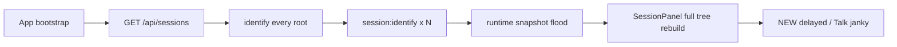
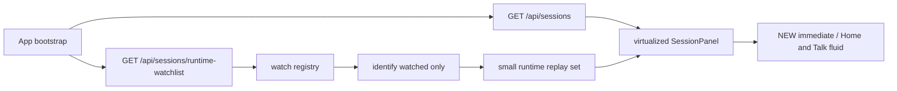
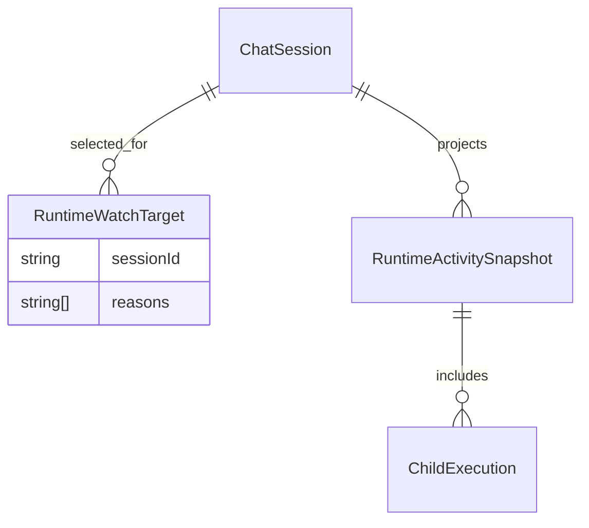

# Runtime Watchlist and Session Panel Performance

- [x] Confirm root cause: `NEW` lag comes from mass `session:identify` plus full sidebar recompute, not slow `POST /api/sessions`.
- [x] Add backend runtime watchlist endpoint for active and pending roots only.
- [x] Add frontend watch registry and move bootstrap or reconnect replay from `identify all roots` to `identify watched sessions`.
- [x] De-duplicate concurrent `/api/sessions` bootstrap loads between `App` and `SessionPanel`.
- [x] Split `SessionPanel` list rendering out of the oversized file.
- [x] Add sidebar virtualization with `@tanstack/react-virtual` for large lists.
- [x] Run focused FE and BE tests.
- [x] Run `kalio-web` typecheck and build.
- [x] Rebuild QA stack and verify Home or Talk fluidity, repeated `NEW`, and reconnect hydration.

## Current Architecture

## Target Architecture

## Models

## Notes

- This pass keeps backend runtime snapshots as the only durable runtime truth.
- `@tanstack/react-query` stays deferred. It does not solve the socket replay flood.
- QA proof on random-port stack `64084/64085` with seeded `120+` sessions:
  - `NEW`: `244ms`, `322ms`, `198ms`
  - Home RA-App open: `874ms`
  - Reload back to ready Talk: `2016ms`
- Full local gate passed with `corepack pnpm test`.
- Added regression tests for the new FE watch helpers:
  - `apps/kalio-web/src/services/sessionBootstrap.test.ts`
  - `apps/kalio-web/src/services/sessionWatchRegistry.test.ts`
- Demo screenshots captured from QA stack:
  - `apps/kalio-web/output/qa/runtime-watchlist-demo-home.png`
  - `apps/kalio-web/output/qa/runtime-watchlist-demo-talk.png`
