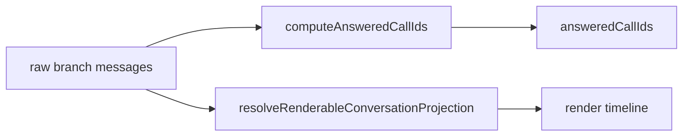
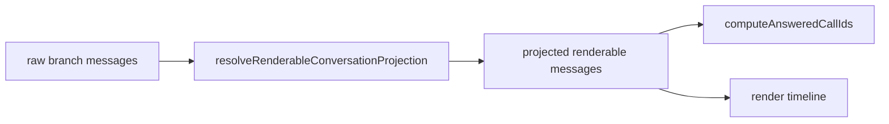
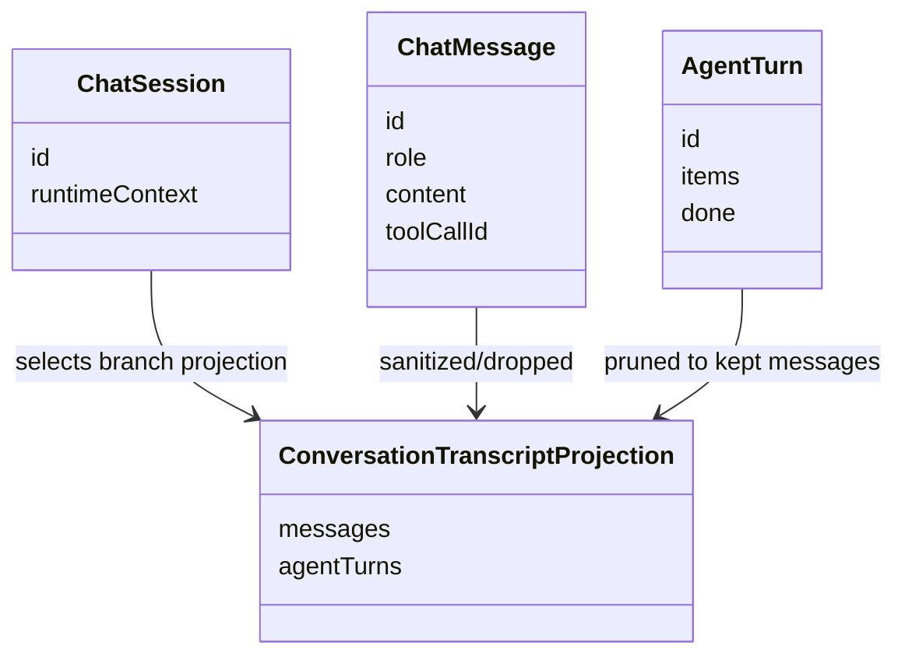

# 2026-06-20 Test Gap Detection: HEAD frontend branch transcript

- [x] Ustalić jedną lukę testową wynikającą z ostatniego commita FE.
  - Zakres: `apps/kalio-web/src/features/chat/ChatInterface.tsx`, `conversationTranscriptProjection.ts`, testy obok.
  - Hipoteza: ukryty scaffold branch-session może błędnie oznaczać wcześniejszy `tool_result` jako `answered`, jeśli liczenie opiera się na surowych `messages`.
- [x] Dodać test regresyjny dla projekcji branch-session + `computeAnsweredCallIds`.
  - Dodano test, że scaffold-only `user` w `conversation-branch` znika po projekcji i nie oznacza `tool_result` jako `answered`.
- [x] Uruchomić skupione testy i potwierdzić wynik.
  - `corepack pnpm exec vitest run src/features/chat/AgentTurnBubble.test.tsx --testNamePattern "prefers renderedMessages over raw store scaffold text for branch transcript output"`
  - `corepack pnpm exec vitest run src/features/chat/ChatInterface.test.tsx --testNamePattern "ignores scaffold-only branch user messages after projection|computeAnsweredCallIds freezes old RA-App widgets"`
  - `corepack pnpm exec vitest run src/features/chat/conversationTranscriptProjection.test.ts`

## Acceptance

- Scaffold-only wiadomość `user` w `conversation-branch` nie może sama oznaczać wcześniejszego `tool_result` jako `answered`.
- Projekcja musi usuwać taki scaffold przed liczeniem `answeredCallIds`.
- Brak zmian poza testami i minimalnym kodem, jeśli test ujawni realny błąd.

## Current Architecture

## Target Architecture

## Models Affected

## Notes

- Ten przebieg ma dodać tylko test dla ścieżki z ostatniej zmiany FE i nie dotykać backendu.
- Dodatkowo dodano test `AgentTurnBubble`, że `renderedMessages` mają pierwszeństwo nad surowym scaffoldem ze store.
