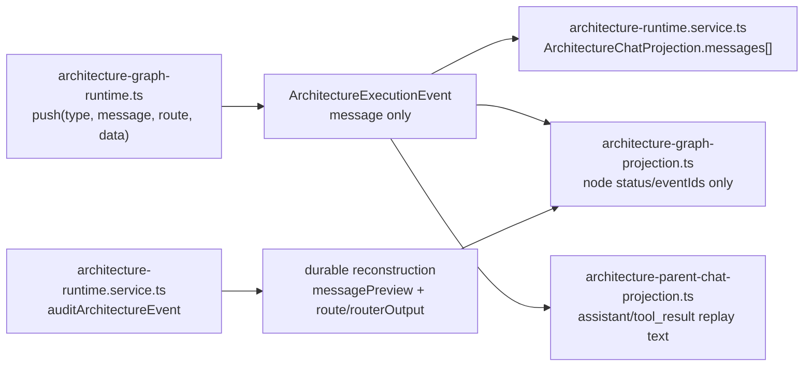
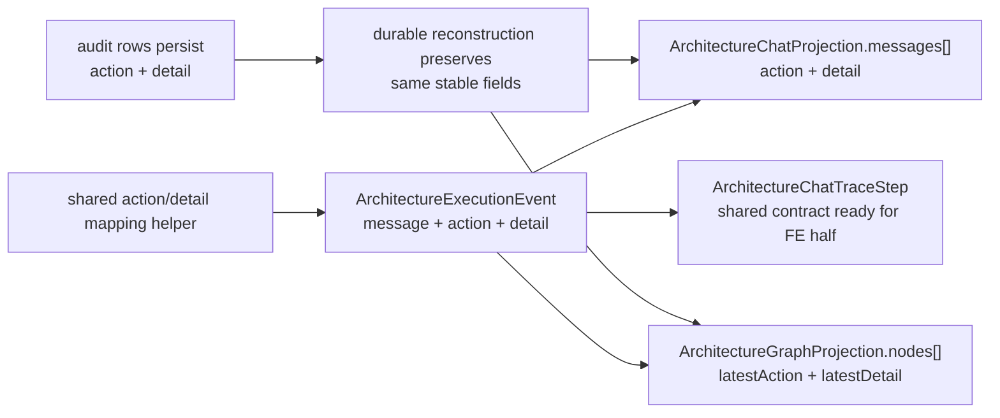
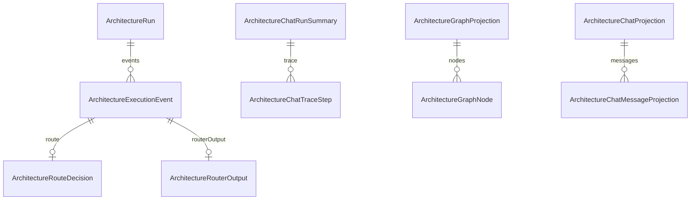

# Architecture Action Summary Backend Slice

- [x] Confirm scope: `packages/@kalio/types` plus `apps/kalio-api/src/modules/architecture`; no frontend edits.
- [x] Inspect current architecture event, chat projection, parent projection, durable reconstruction, and graph projection surfaces.
- [x] Add focused failing tests for stable `action` / `detail` fields on backend/shared-contract surfaces.
- [x] Implement shared contract changes for architecture events, chat trace/messages, and graph nodes.
- [x] Populate `action` / `detail` in backend runtime/projection code for participant/router/finalizer flow.
- [x] Verify focused backend/types tests, build, and typecheck.
- [x] Write session note with the exact files changed, evidence, and remaining frontend follow-up.

## Acceptance Criteria

1. `ArchitectureExecutionEvent` exposes stable `action` and `detail` fields.
2. `ArchitectureChatTraceStep`, `ArchitectureChatProjection.messages[]`, and `ArchitectureGraphProjection.nodes[]` expose stable action/detail data in shared contracts.
3. Backend runtime/projection code populates those fields for participant, router, and finalizer flow without relying on frontend parsing of free-text `message`.
4. Durable reconstruction preserves or reconstructs the same stable fields where the backend already rebuilds graph/chat state.
5. Focused tests prove the new fields on contract-level and backend projection surfaces.

## Current Architecture

## Target Architecture

## Models

## Notes

- `message` stays for rich narrative and backwards compatibility.
- This slice adds stable action/detail metadata; the frontend follow-up can consume it without more backend parsing work.
- 2026-06-21 implementation note:
  - Kept existing `actionSummary` as a compatibility string and added stable `action` / `detail` alongside it.
  - Runtime event creation now derives `action` / `detail` from structured route/routerOutput/incomplete state instead of from `message`.
  - Chat projection, graph projection, audit replay, and durable graph reconstruction now expose the new fields on owned backend surfaces.
- 2026-06-21 focused verification:
  - `corepack pnpm --filter @kalio/types test -- src/__tests__/contracts.test.ts`
  - `corepack pnpm --filter @kalio/types run build`
  - `corepack pnpm --filter kalio-api test -- src/modules/architecture/architecture-graph-projection.spec.ts src/modules/architecture/architecture-durable-graph.spec.ts src/modules/architecture/architecture-runtime.service.spec.ts`
  - `corepack pnpm --filter kalio-api run typecheck`
  - `corepack pnpm --filter kalio-api run build`
