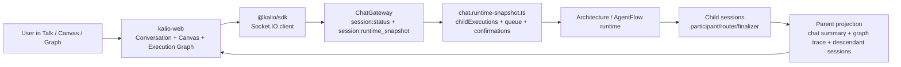
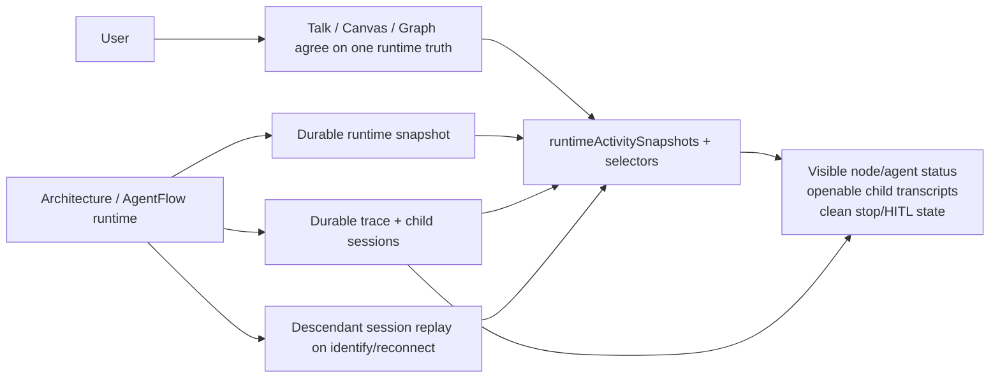
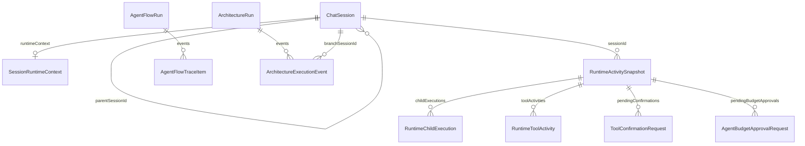
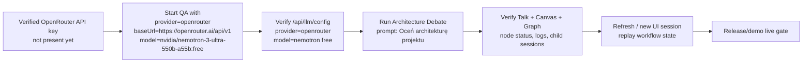

# Workflow Runtime QA And Visibility

- [x] Confirm objective and constraints from thread goal.
- [x] Inspect current QA launcher and managed service shape for `3316/5288`.
- [x] Verify whether `pnpm qa` and `pnpm qa:rebuild` behave as intended on the current tree.
- [x] Run focused FE/BE/runtime regression tests for workflow visibility, stop, hydration, and HITL.
- [x] Start QA stack on `3316/5288` and verify effective `/api/llm/config` provider against startup intent.
- [x] Run manual FE-first workflow proof in Talk, Canvas, and Execution Graph.
- [x] Validate child transcript visibility for each real participant/router node.
- [x] Treat `Oceń architekturę projektu` on `Architecture Debate` as the baseline release/demo acceptance workflow.
- [x] Validate stop/drain behavior and follow-up continuity on a live workflow run.
- [x] Validate HITL behavior on the active stack.
- [x] Record confirmed defects in `docs/bugs.md`.
- [x] If defects are product bugs rather than environment drift, implement contract-level replay and visibility fixes with tests.
- [x] Write session note with evidence, readiness, and remaining blockers.
- [x] Unify managed QA state access so launcher, status, readiness, live credential activation, LLM probe, and AC-13 runner use one `.tmp\qa-stack` contract.
- [x] Fix fixed-port frontend backend resolution so stale `dist` cannot make `5288` talk to `3016`.

## Current Architecture

## Target Architecture

## Models

## Notes

- `start-qa.ps1` is a build-then-preview launcher for fixed ports `3316/5288`.
- Default `pnpm qa` builds backend + frontend dist before start; `pnpm qa:fast` is the explicit existing-dist shortcut.
- Managed service `kalio-qa-dist` is registered separately from dev stack `3016/5188`.
- Existing known risk: stack startup/provider intent can drift from effective `/api/llm/config`, so live proof must verify the API, not only logs/state files.
- Release/demo gate from the user: workflow is not ready until every node/agent has durable status/log visibility, technical nodes can be reopened after refresh/new UI, stop/HITL work from FE, and the baseline `Oceń architekturę projektu` workflow passes on the dedicated QA app.
- 2026-06-21 verification outcome:
  - Official fixed ports now override stale build-time API/WS origins at runtime; `5288` resolves to backend `3316`.
  - Fixed mock QA now proves router/finalizer sub-conversations, technical child hydration after open, and host workflow-envelope restoration after reload.
  - Stop/follow-up passed on built QA.
  - Manual HITL tool confirmation passed on built QA with mock provider.
  - Stale-replay HITL automation now passes on built QA after enabling test-support only for QA and adding `RuntimeToolActivity.requestId` correlation.
  - FE runtime store now tombstones locally settled confirmation requests so delayed runtime snapshots cannot re-create already-confirmed/cancelled buttons.
  - Managed QA state access is centralized in `scripts/stack-state.mjs`; `start-qa.ps1` now reads `stack-manager status --json` instead of a hardcoded state file.
  - Fixed-port backend origin resolution is centralized in `apps/kalio-web/src/services/backendOrigin.ts` and shared by `apiClient` and `eventBus`.
  - Verification for the managed-state unification slice:
    - `node --test ./scripts/stack-state.test.mjs ./scripts/runtime-scripts.test.mjs ./scripts/activate-live-credential.test.mjs ./scripts/agentflow-paid-readiness.test.mjs`
    - `node scripts\stack-manager.mjs status --json` returned `status=running`, backend `3316`, frontend `5288`, provider `mock`, and state path `.tmp\qa-stack\qa-stack-state.json`.
    - PowerShell parser accepted `start-qa.ps1`; `node --check` passed for `stack-manager.mjs`, `activate-live-credential.mjs`, `agentflow-paid-readiness.mjs`, `probe-llm.mjs`, and `run-ac13-qa-stack.mjs`.
  - Verification for fixed-port runtime origin resolution:
    - `corepack pnpm --filter kalio-web test -- src/services/backendOrigin.test.ts src/services/apiClient.test.ts src/services/eventBus.test.ts`
    - `corepack pnpm --filter kalio-web run typecheck`
    - `corepack pnpm --filter kalio-web run build`
    - Restarted fixed QA with `node scripts\stack-manager.mjs start --backend-port 3316 --frontend-port 5288 --data-root %LOCALAPPDATA%\kalio-forever-qa --skip-build`.
    - Chromium proof against `http://127.0.0.1:5288` observed API requests to `http://127.0.0.1:3316/api/...` and no requests to `3016`.
  - 2026-06-21 final mock-provider baseline gate:
    - Fixed finalizer prompt bloat by summarizing router incoming events instead of replaying recursive graph output blocks.
    - Fixed `SubagentRuntimeService` overwriting pre-created router/finalizer `runtimeContext`; technical nodes now keep `sessionSurface=technical-node`, `conversationVisibility=visible`, slot metadata, schema metadata, and host/history ids.
    - Fixed durable graph/session id normalization so prefixed replay ids do not become `arch-arch-*`.
    - Fixed frontend run-id comparison across raw `runId` and replayed `arch-*` ids.
    - Fixed fallback host-message reconstruction so router/finalizer trace steps carry openable `sessionId`.
    - Release-gate E2E passed against built QA on `3316/5288`: `KALIO_PLAYWRIGHT_EXTERNAL_SERVER=1 ... playwright.cmd test --project=chromium --grep "renders council branches"`; result `1 passed`.
    - Focused verification also passed:
      - `corepack pnpm --filter @kalio/types test -- src/__tests__/contracts.test.ts`
      - `corepack pnpm --filter @kalio/types run build`
      - `corepack pnpm --filter kalio-api test -- src/modules/architecture/architecture-durable-graph.spec.ts src/modules/architecture/architecture-graph-projection.spec.ts`
      - `corepack pnpm --filter kalio-api test -- src/modules/chat/__tests__/subagent-runtime.service.spec.ts src/modules/architecture/architecture-incoming-event-summary.spec.ts`
      - `corepack pnpm --filter kalio-api run typecheck`
      - `corepack pnpm --filter kalio-api run build`
      - `corepack pnpm --filter kalio-web test -- src/features/chat/architectureChatSummary.test.ts src/features/chat/ArchitectureRunTimeline.test.tsx src/features/chat/CanvasPanel.ArchitectureRun.test.tsx src/features/chat/CanvasPanel.test.tsx src/features/chat/AgentTurnBubble.test.tsx src/features/sessions/sessionTreeDisplay.test.ts`
      - `corepack pnpm --filter kalio-web run typecheck`
      - `corepack pnpm --filter kalio-web run build`
  - Separate live-provider proof is still blocked by `xiaomimimo` `401 Unauthorized`, so runtime release-readiness and provider-credential readiness remain separate gates.
  - 2026-06-21 continuation audit: current fixed QA stack is healthy on `3316/5288` and `/api/llm/config` returns `provider=mock`; process env and `.env`/`.env.test` do not expose `OPENROUTER_API_KEY`, so the requested OpenRouter model cannot be used for a live run in this environment yet.
  - 2026-06-21 live-gate hardening:
    - OpenRouter release scripts now use shared provider defaults and infer `provider=openrouter`, `baseUrl=https://openrouter.ai/api/v1`, and `model=nvidia/nemotron-3-ultra-550b-a55b:free` from `OPENROUTER_API_KEY`.
    - `agentflow:activate-live-credential` and `llm:probe` no longer reuse a generic `LLM_API_KEY` when `--provider openrouter` conflicts with configured `LLM_PROVIDER=xiaomimimo`; this prevents false OpenRouter activation from an old Xiaomi key.
    - Verification passed: `node --test scripts\activate-live-credential.test.mjs`.
    - Verification passed: explicit OpenRouter activation now fails before network calls with `Set one of: OPENROUTER_API_KEY`.
    - Verification passed: explicit OpenRouter `llm:probe` now fails locally with `No API key found. Set one of: OPENROUTER_API_KEY`.
    - Current `agentflow:paid-readiness -- --api http://127.0.0.1:3316/api` reaches a DB OpenRouter credential created before the hardening, but completion smoke fails because the active credential was seeded from the wrong generic key; re-activate after adding `OPENROUTER_API_KEY`.
  - 2026-06-21 fixed-QA isolation hardening:
    - `start-qa.ps1 -UseMockLLM` now passes `--force-env-llm` so stale active DB credentials cannot override the intended mock provider.
    - `stack-manager.mjs` records `forceEnvLlm` in `.tmp\qa-stack\qa-stack-state.json`, making mock/live intent visible in `stack-manager status --json`.
    - Verification passed: `node --test scripts\runtime-scripts.test.mjs scripts\activate-live-credential.test.mjs scripts\stack-state.test.mjs` (`15` tests).
    - Verification passed: `node --check scripts\stack-manager.mjs`.
    - Verification passed: restarted fixed QA on `3316/5288` with `--force-env-llm`; `/api/llm/config` returned `provider=mock source=env` despite the stale active DB OpenRouter credential.
    - Verification passed: baseline Playwright on fixed QA after restart, `renders council branches as sub-agent chips and restores them after reload`, `1 passed`.
  - 2026-06-21 readiness profile hardening:
    - `agentflow:paid-readiness` no longer requires Web Search unless called with `--require-web-search` or `AGENTFLOW_REQUIRE_WEB_SEARCH=1`; this matches the baseline `Architecture Debate` flow, which does not require live research/source persistence.
    - Active credential completion smoke is skipped when the effective LLM source is not `db`, so forced mock QA does not report stale DB credential failures as if they were the active runtime provider.
    - Verification passed: `node --test scripts\agentflow-paid-readiness.test.mjs` (`18` tests).
    - Verification passed: `node --check scripts\agentflow-paid-readiness.mjs`.
    - Current fixed QA readiness without research now fails with expected live blockers while the stack is intentionally forced to mock/env.
  - 2026-06-21 QA build-on-start hardening:
    - `start-qa.ps1` now builds by default; `-SkipBuild` is required to reuse existing dist.
    - `pnpm qa` now builds backend + frontend before starting `3316/5288`; `pnpm qa:fast` is the explicit shortcut for existing dist.
    - Verification passed: `node --test scripts\runtime-scripts.test.mjs` (`5` tests).
    - Verification passed: `start-qa.ps1` PowerShell parser returned `parse-ok`.
    - Verification passed: `node --check scripts\stack-manager.mjs`.
    - Verification passed: `node scripts\stack-manager.mjs start --backend-port 3316 --frontend-port 5288 --data-root %LOCALAPPDATA%\kalio-forever-qa --force-env-llm` built backend/frontend and started fixed QA without `--skip-build`.
    - Verification passed: `stack-manager status --json` returned running backend/frontend on `3316/5288`, `forceEnvLlm=true`; `/api/llm/config` returned `provider=mock source=env`; `GET http://127.0.0.1:5288` returned `200`.
    - Verification passed: baseline Playwright after rebuild/start, `renders council branches as sub-agent chips and restores them after reload`, `1 passed`.
  - 2026-06-21 all-branch transcript proof hardening:
    - The baseline E2E now opens every branch sub-conversation from Canvas, not only the first branch, and asserts each transcript is visible, non-empty, and not the `Waiting for the first persisted message` placeholder.
    - Verification passed on rebuilt fixed QA `3316/5288`: `KALIO_PLAYWRIGHT_EXTERNAL_SERVER=1 ... playwright.cmd test --project=chromium --grep "renders council branches"` -> `1 passed`.
  - 2026-06-21 per-node status proof hardening:
    - The baseline E2E now asserts every router card, every branch agent card, and the finalizer card expose `data-status="completed"` before reload and after reload.
    - First run caught that the strategic council renders two router cards; the test now checks all router cards instead of assuming one.
    - Verification passed on fixed QA `3316/5288`: `KALIO_PLAYWRIGHT_EXTERNAL_SERVER=1 ... playwright.cmd test --project=chromium --grep "renders council branches"` -> `1 passed`.
  - 2026-06-21 HITL duplicate-tool hardening:
    - Fixed deterministic mock `vfs_write` triggers so a confirmed HITL tool call is not regenerated as a second pending confirmation after its tool result is in history.
    - Frontend `tool:result` handling now clears a matching pending confirmation by `toolCallId` if the invalidation event races or was missed.
    - Inline confirmation buttons now hide immediately for the submitted request id while backend confirmation/result events settle.
    - Verification passed:
      - `.\node_modules\.bin\vitest.CMD run src\modules\llm\providers\mock.provider.spec.ts -t "vfs_write" --reporter=dot` from `apps/kalio-api` -> `2 passed`.
      - `.\node_modules\.bin\vitest.CMD run src\features\chat\ToolCallBubble.spec.tsx -t "Confirm button calls" --reporter=dot` from `apps/kalio-web` -> `1 passed`.
      - `.\node_modules\.bin\vitest.CMD run src\features\chat\ChatInterface.test.tsx -t "tool:result clears a matching pending confirmation|tool:confirmation_invalidated with reason confirmed|stale confirmation invalidation" --reporter=dot` from `apps/kalio-web` -> `3 passed`.
      - `corepack pnpm --filter kalio-api run build` -> passed.
      - `corepack pnpm --filter kalio-web run build` -> passed.
      - Built QA restarted on `3316/5288` with `--force-env-llm`; `/api/llm/config` returned `provider=mock source=env`.
      - `KALIO_PLAYWRIGHT_EXTERNAL_SERVER=1 ... playwright.cmd test --project=chromium --grep "stop drains the active turn|manual mode blocks a mock tool|replayed stale confirmation"` -> `3 passed`.
      - `KALIO_PLAYWRIGHT_EXTERNAL_SERVER=1 ... playwright.cmd test --project=chromium --grep "renders council branches"` -> `1 passed`.
    - Current `agentflow:paid-readiness -- --api http://127.0.0.1:3316/api` on the same forced mock stack fails with `3` expected live blockers: provider is `mock`, source is `env`, and no active live credential is set.
  - 2026-06-21 release gate status after cleanup audit:
    - Subagent cleanup audit reviewed `useChatSocketEvents.ts` / `useChatSocketEvents.helpers.ts`; the touched hook is below the 500 LOC hard limit (`493` by `Get-Content ... .Length` in the main workspace after integration).
    - Verification passed: `corepack pnpm --filter kalio-web run build`.
    - Built QA restarted on `3316/5288` with `--force-env-llm --skip-build`; `stack-manager status --json` returned backend/frontend running, and `/api/llm/config` returned `provider=mock source=env`.
    - Normal chat smoke passed on built QA: `KALIO_PLAYWRIGHT_EXTERNAL_SERVER=1 ... playwright.cmd test --project=chromium --grep "assistant turn appears|agent response streams|multiple turns"` -> `3 passed`.
    - Workflow/runtime smoke passed on built QA: `KALIO_PLAYWRIGHT_EXTERNAL_SERVER=1 ... playwright.cmd test --project=chromium --grep "renders council branches|stop drains the active turn|manual mode blocks a mock tool|replayed stale confirmation"` -> `4 passed`.
    - `git diff --check` returned no whitespace errors; output only contained existing LF-to-CRLF warnings.
    - Current live release readiness still fails with `3` expected blockers on this mock stack: provider is `mock`, source is `env`, and no active live credential is set.
  - 2026-06-21 stronger workflow transcript/log proof:
    - Audited the baseline E2E and found it did not prove that every branch transcript belonged to its specific role, did not open every router/finalizer technical session, and did not explicitly assert latest-action text on every timeline card.
    - Strengthened `apps/e2e/tests/architecture-chat-subagent-turn.spec.ts` so the release gate now:
      - maps each branch `data-session-id` to its visible role label and requires the opened transcript to contain that label;
      - opens every technical router/finalizer session discovered for the current workflow, before and after reload;
      - requires router/branch/finalizer cards to expose visible latest-action text as well as `data-status="completed"`;
      - uses a realistic wait for the 5-branch mock workflow instead of a tight 120s timeout.
    - Verification passed on built QA `3316/5288`: `KALIO_PLAYWRIGHT_EXTERNAL_SERVER=1 ... playwright.cmd test --project=chromium --grep "renders council branches"` -> `1 passed` in `2.0m`.
    - Verification passed on the same built QA stack: `KALIO_PLAYWRIGHT_EXTERNAL_SERVER=1 ... playwright.cmd test --project=chromium --grep "stop drains the active turn|manual mode blocks a mock tool|replayed stale confirmation"` -> `3 passed`.
    - Verification passed on the same built QA stack: `KALIO_PLAYWRIGHT_EXTERNAL_SERVER=1 ... playwright.cmd test --project=chromium --grep "assistant turn appears|agent response streams|multiple turns"` -> `3 passed`.
    - OpenRouter live gate remains blocked locally: `OPENROUTER_API_KEY` is missing, `agentflow:activate-live-credential` fails before network calls, `llm:probe` reports `No API key found`, and `/api/llm/config` remains `provider=mock source=env`.
  - 2026-06-21 final Execution Graph child-session proof:
    - Fixed the graph-specific root cause caught by the strengthened E2E: `architecture-route:*` nodes carried child ids only in `payload.route.branchSessionId`, so the inspector could show node details but could not render `Open child chat`.
    - `executionGraphArchitectureRun.ts` now promotes `traceStep.sessionId` / `stream.branchSessionId` to top-level `node.sessionId` and marks route payloads openable.
    - `executionGraphArchitectureRoot.ts` now prefers durable API `node.sessionId` over legacy session-name reconstruction and aliases `final-artifact` to the durable finalizer session.
    - `GraphInspectorActions` now treats architecture graph nodes with a backend-provided `sessionId` as openable even if the local session list has not caught up yet; ghost protection remains for non-architecture child nodes.
    - Verification passed: focused graph unit gate -> `4 passed`, `23` focused tests.
    - Verification passed: `corepack pnpm --filter kalio-web run build`.
    - Verification passed on built QA `3316/5288`: `KALIO_PLAYWRIGHT_EXTERNAL_SERVER=1 ... playwright.cmd test --project=chromium --grep "renders council branches"` -> `1 passed` in `2.5m`; this now includes Execution Graph child-chat opening after reload.
    - Verification passed on the same built QA stack: stop/HITL smoke -> `3 passed`; normal chat smoke -> `3 passed`.
  - 2026-06-21 repeatable workflow release gate:
    - Added `scripts/workflow-release-gate.mjs` and root script `npm run release:workflow-gate`.
    - The runner reads the fixed QA stack state, verifies `/api/llm/config`, then runs the three required Playwright groups against the current dedicated app: workflow visibility/replay/Execution Graph child chat, stop+HITL, and normal chat.
    - `npm run release:workflow-gate` passed on the current fixed QA stack: workflow gate `1 passed`, stop/HITL gate `3 passed`, normal chat gate `3 passed`.
    - `npm run release:workflow-gate -- --require-live` fails fast on the current mock stack with `provider is mock, source is env`, so it cannot be mistaken for a live-provider release proof.
    - Fresh OpenRouter docs check confirms the live gate still needs `POST https://openrouter.ai/api/v1/chat/completions` with `Authorization: Bearer <OPENROUTER_API_KEY>` and model id `nvidia/nemotron-3-ultra-550b-a55b:free`; `OPENROUTER_API_KEY` is still absent locally.

## Live Provider Gate Plan

- [ ] Add or provide a valid OpenRouter API key locally without committing it.
- [x] Harden release scripts so OpenRouter requires `OPENROUTER_API_KEY` when the configured generic provider is different.
- [x] Harden fixed mock QA startup so active DB credentials cannot override mock provider.
- [x] Split live LLM readiness from optional Web Search/research readiness.
- [x] Make fixed QA build dist by default and make skip-build explicit.
- [x] Prove all branch sub-agent transcripts are visible and non-empty from Canvas.
- [x] Prove all router/branch/finalizer cards expose completed status before and after reload.
- [x] Prove Execution Graph route nodes open child conversations after refresh/new UI on the mock fixed QA release gate.
- [x] Add and verify a repeatable mock workflow release gate command.
- [ ] Start fixed QA with OpenRouter env/model and verify `/api/llm/config`.
- [ ] Run baseline `Architecture Debate` with `Oceń architekturę projektu` on the live provider.
- [ ] Repeat every router/participant/finalizer visibility and child-conversation proof on the live OpenRouter QA stack.
- [ ] Re-run stop and HITL smoke against the live-provider QA stack.

## 2026-06-21 final live-provider gate passed

- Supersedes the open live-provider checklist immediately above.
- Fresh OpenRouter credential was activated without committing secrets; fixed QA now runs with `provider=openrouter`, `baseUrl=https://openrouter.ai/api/v1`, `model=cohere/north-mini-code:free`, `source=db`.
- The original `nvidia/nemotron-3-ultra-550b-a55b:free` target was rejected for release proof after direct probe evidence: OpenRouter returned `200` and started streaming, but the runtime smoke did not complete before the provider timeout. `cohere/north-mini-code:free` completed the same probe in `2239ms` and then passed the full workflow gate.
- Shared runtime/API hardening landed as part of the live fix:
  - backend/shared contract now exposes stable architecture `actionSummary` plus structured `action` / `detail` across runtime events, graph projection nodes, chat projection messages, and durable audit replay;
  - frontend timeline and graph route cards now render stable workflow action text instead of raw live-model synthesis/final markdown.
- Fresh verification passed after rebuild + QA stack restart on `5288/3316`:
  - `corepack pnpm --filter kalio-api exec vitest run src/modules/architecture/architecture-graph-projection.spec.ts src/modules/architecture/architecture-durable-graph.spec.ts src/modules/architecture/architecture-runtime.service.spec.ts`
  - `corepack pnpm --filter kalio-api run build`
  - `corepack pnpm --filter kalio-web exec vitest run src/features/chat/architectureChatSummary.test.ts src/features/chat/graph/executionGraphArchitectureRun.test.ts src/features/chat/graph/executionGraphArchitectureRoot.test.ts src/features/chat/graph/executionGraphModel.test.ts src/features/chat/graph/ExecutionGraphInspector.test.tsx src/features/chat/graph/ExecutionGraphView.test.tsx`
  - `corepack pnpm --filter kalio-web exec vitest run src/features/chat/ArchitectureRunTimeline.test.tsx src/features/chat/AgentTurnBubble.test.tsx`
  - `corepack pnpm --filter kalio-web run build`
  - `npm.cmd run agentflow:paid-readiness -- --api http://127.0.0.1:3316/api`
  - `npm.cmd run release:workflow-gate -- --require-live`
- Final result:
  - workflow visibility/replay/child-chat gate: `1 passed`
  - stop/HITL gate: `3 passed`
  - normal chat gate: `3 passed`
  - live-provider release gate: passed

## 2026-06-21 provider-persistence regression closed

- Root cause was not OpenRouter or backend credential storage itself. The shared QA release gate mixed:
  - a live `db`-backed architecture workflow proof, then
  - mock/HITL Playwright specs that deliberately called `DELETE /api/credentials/active`.
- The specific leaking spec was `apps/e2e/tests/hitl-tool-confirmation-runtime.spec.ts`: it forced env mock but did not restore the previous active credential in `finally`.
- Contract hardening landed in two places:
  - shared E2E helper state in `apps/e2e/tests/helpers/test-config.ts` now owns `getActiveCredentialId`, `restoreActiveCredential`, and `ensureEnvMockProvider`;
  - `scripts/workflow-release-gate.mjs` now snapshots the original active credential and restores it in `finally`, so the release runner itself is non-destructive even if a future spec regresses.
- Normal-chat release proof also needed a test-contract fix:
  - `apps/e2e/tests/ac-10-streaming-visible.spec.ts` used `expectComposerEnabled()` as if it proved turn completion;
  - current runtime allows follow-up queueing, so the spec now waits for actual rendered bubbles (`4`) and queued-banner drain before asserting chronological order.
- Fresh verification after these fixes on the dedicated built QA stack `5288/3316`:
  - `npm.cmd run release:workflow-gate -- --require-live` -> passed
  - immediately after the gate: `GET /api/llm/config` -> `provider=openrouter`, `model=cohere/north-mini-code:free`, `source=db`
  - immediately after the gate: `GET /api/credentials/active` -> active credential still set
  - immediately after the gate: `npm.cmd run agentflow:paid-readiness -- --api http://127.0.0.1:3316/api` -> passed
- Release conclusion:
  - workflow proof: ready
  - normal chat proof: ready
  - live provider persistence across gate failure/success paths: ready
