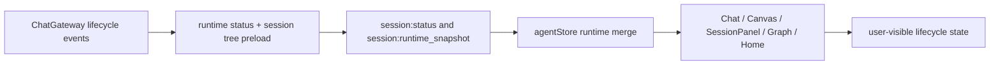
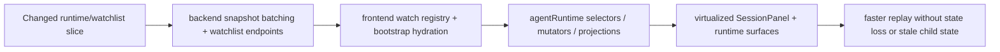
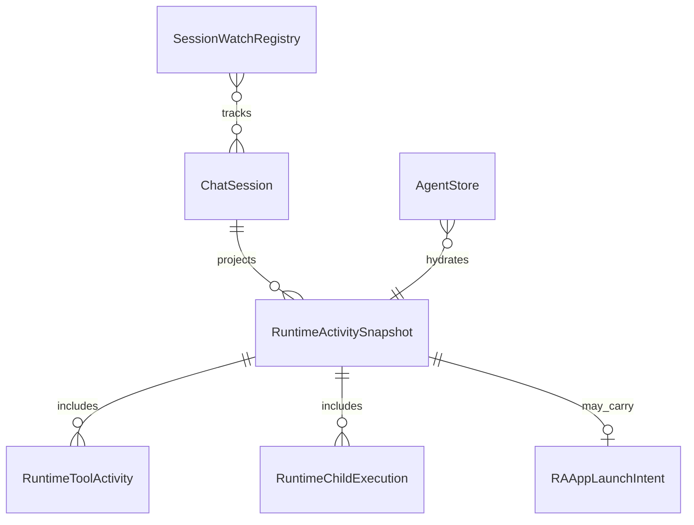

# Working Tree Review Runtime Slice

- [x] Confirm review target: current working tree diff against `HEAD` on `codex/mvp-prep`.
- [ ] Dispatch parallel review agents:
  - backend/runtime + API diff review
  - frontend/runtime + session panel diff review
- [ ] Run orchestrator pass on hotspot files, contracts, and tests.
- [ ] Check security-sensitive diff surfaces and runtime contract regressions.
- [ ] Summarize findings, verification evidence, and remaining gaps.

## Current Architecture

## Target Architecture

## Models

## Notes

- Review assumption: "ostatnie zmiany" means the unstaged and untracked working tree changes visible in `git status`.
- If that assumption is wrong and the target should be the last commit range instead, the review scope needs to be rerun against that exact diff.
