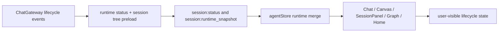
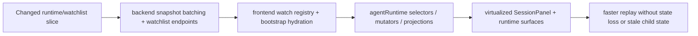
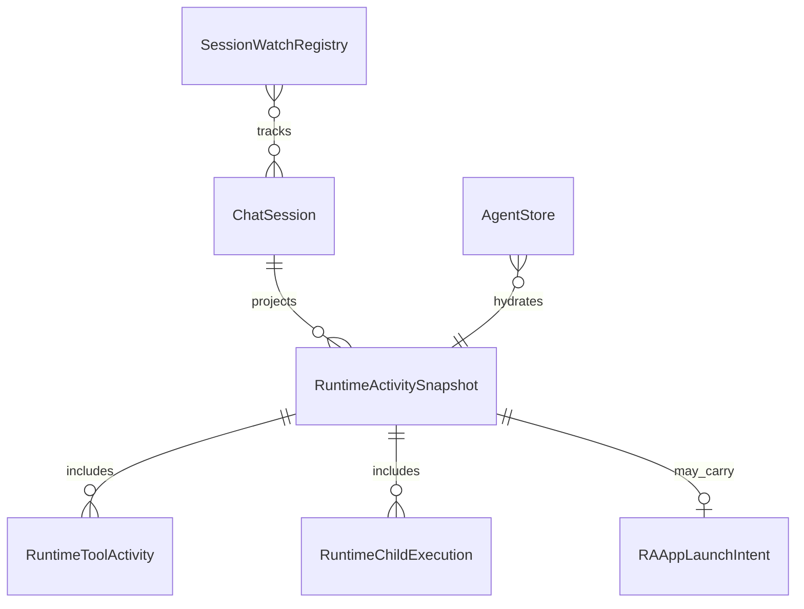

# Working Tree Review Runtime Slice

- [x] Confirm review target: current working tree diff against `HEAD` on `codex/mvp-prep`.
- [x] Dispatch parallel review agents:
  - backend/runtime + API diff review
  - frontend/runtime + session panel diff review
- [x] Run orchestrator pass on hotspot files, contracts, and tests.
- [x] Check security-sensitive diff surfaces and runtime contract regressions.
- [x] Summarize findings, verification evidence, and remaining gaps.

## Current Architecture

## Target Architecture

## Models

## Notes

- Review scope shifted during the session because the large working tree diff was committed while review was running.
- Final review target: `HEAD~1..HEAD` for commit `34e29619a451da4100e3c1dac6eb79a6fc4b7a98`.
- 2026-06-21 test-gap follow-up narrowed to two unverified branches in the current working tree:
  - backend runtime contract emission in `architecture-session-context.ts`
  - frontend activation replay when runtime snapshot restores a running tool without pending confirmations

## Test Gap Follow-up

- [x] Re-read current automation memory and existing runtime-slice todo.
- [x] Compare changed source files against nearby tests to avoid broad refactors.
- [x] Add backend contract coverage for `conversationVisibility` on root and branch runtime contexts.
- [x] Add frontend activation coverage for restored `running` tool activity with empty `pendingConfirmations`.
- [x] Run focused Vitest verification for the touched specs and record the result here.

### Verification

- `corepack pnpm --filter kalio-api exec vitest run src/modules/architecture/architecture-session-context.spec.ts`
- `corepack pnpm --filter kalio-web exec vitest run src/features/chat/hooks/useChatSessionActivation.test.ts`

### Outcome

- Added direct backend guardrails proving architecture root sessions stay hidden while branch contexts are emitted as visible conversations with the correct surface.
- Added frontend regression coverage proving session activation preserves restored running tool activity even when stale pending-confirmation UI state should be cleared.
