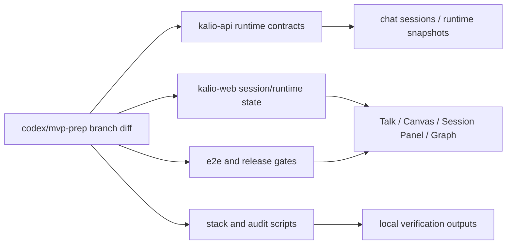
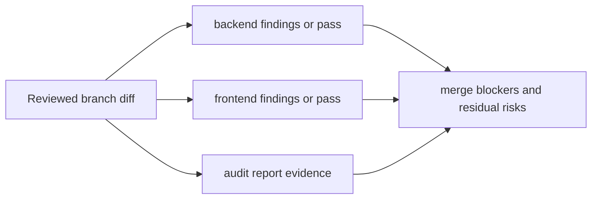
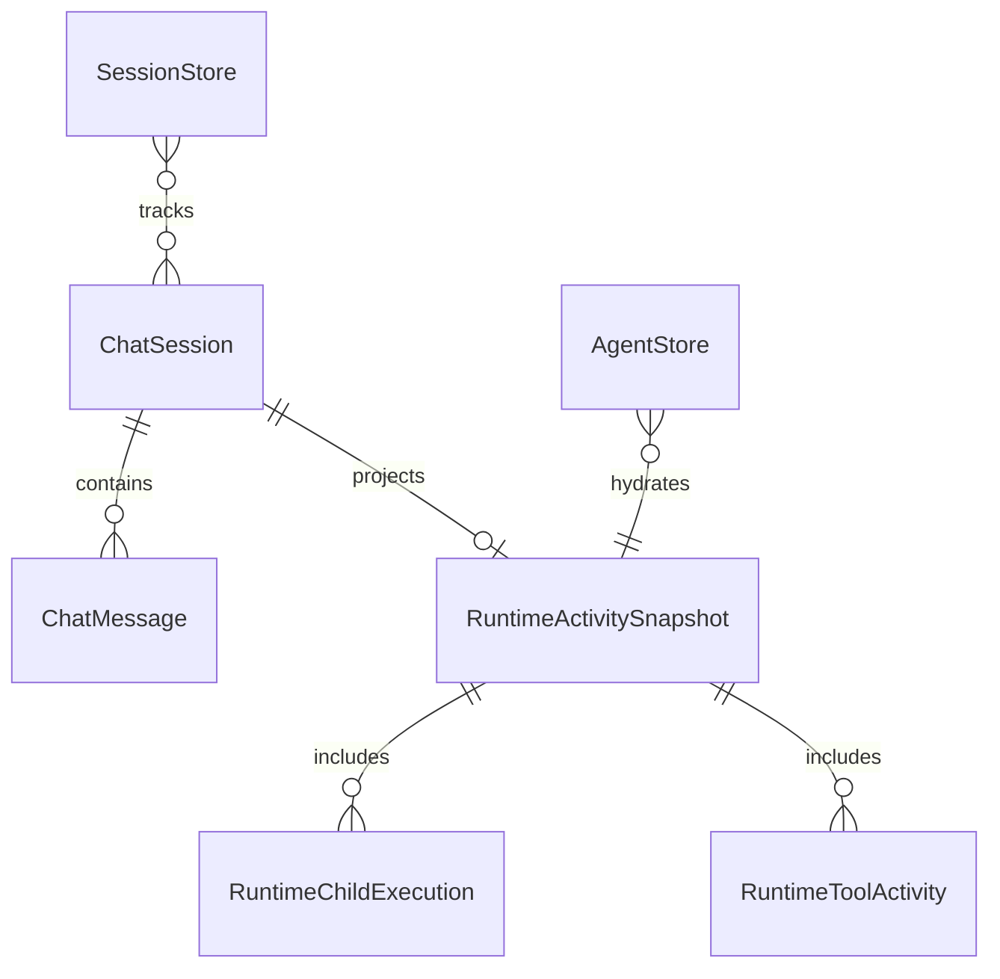

# Branch Review And Audit: codex/mvp-prep

## Acceptance Criteria

- [x] Confirm review target for a clean working tree.
- [x] Run the repository audit entrypoint and capture concrete failures, warnings, or green status.
- [x] Review backend/runtime contract changes against `origin/main`.
- [x] Review frontend/session/runtime/UI changes against `origin/main`.
- [x] Summarize only verified findings with file references and explicit verification gaps.

## Current Architecture

## Target Architecture

## Models And Relations

## Notes

- 2026-06-22: Working tree is clean, so the review target is the branch diff `origin/main...HEAD` on `codex/mvp-prep`.
- 2026-06-22: Scope size is large (`340 files`, about `33k` insertions net), so backend and frontend review are split into parallel review slices plus an orchestrator pass.
- 2026-06-22: CodeRabbit CLI is not installed in the current environment, so automated CodeRabbit review could not be started from this machine.
- 2026-06-22: `npm.cmd run audit:report` completed successfully and wrote [docs/audit/2026-06-22-report.md](/C:/Projekty/kalio-forever/docs/audit/2026-06-22-report.md:1) with totals `26 critical / 4 high / 54 medium / 62 low`. The most relevant non-size blocker from the audit output is the silent catch at [apps/kalio-api/src/modules/chat/chat.gateway.ts](/C:/Projekty/kalio-forever/apps/kalio-api/src/modules/chat/chat.gateway.ts:399).
- 2026-06-22: Confirmed backend review blocker: public session create/update now auto-registers `projectPath` / `executionCwd` into allowed roots through `AllowedPathsService.ensurePath()`, effectively turning `/api/sessions` into an allowlist-expansion path.
- 2026-06-22: Confirmed frontend review blockers: workflow-envelope replay drops participant branches when stream metadata is missing; `SessionPanel` bootstrap can overwrite a user-selected session because the async load callback reads stale `activeSessionId`; `conversationTreeModel` no longer passes `activeAgentLoops` into `selectLiveSessionIds`.
- 2026-06-22: Focused verification around the touched review surfaces produced a mixed result:
  - `corepack pnpm --filter kalio-api exec vitest run src/modules/chat/__tests__/sessions.service.spec.ts src/modules/allowed-paths/allowed-paths.service.spec.ts` passed (`40/40`).
  - `corepack pnpm --filter kalio-web exec vitest run src/features/chat/architectureChatSummary.test.ts src/features/sessions/SessionPanel.test.tsx src/features/sessions/conversationTreeModel.test.ts` failed because `SessionPanel.test.tsx` is currently red (`8` failing tests, `74` passing). The failures show the new session-history bootstrap path no longer matches the existing test contract and now depends on paged-history response headers.
