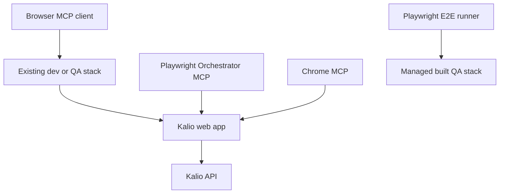
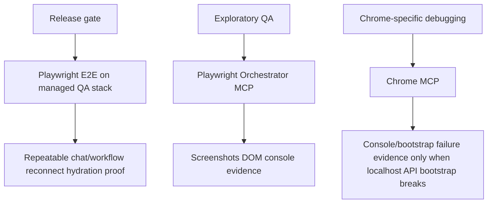
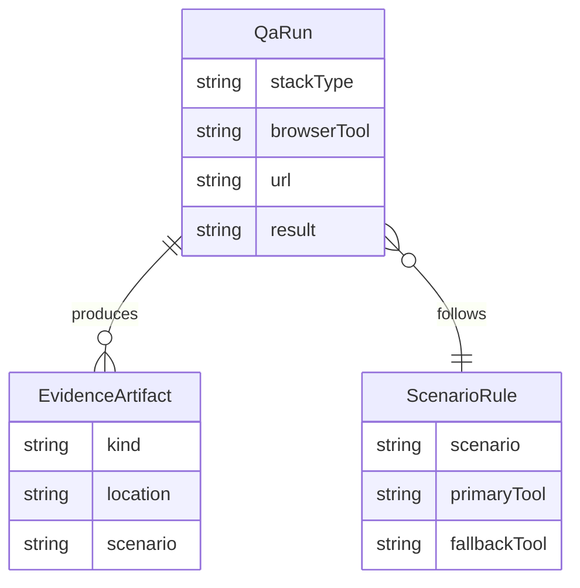

# Browser MCP QA Skill

## Acceptance Criteria

- [x] Record the reliable QA path for Kalio when Playwright Orchestrator MCP and Chrome MCP are both available.
- [x] Capture the observed Chrome MCP localhost bootstrap failure as an explicit known limitation instead of tribal knowledge.
- [x] Define which scenarios require full Playwright E2E instead of exploratory browser MCP smoke.
- [x] Save the guidance in repo docs so future sessions can reuse it after refresh.

## Current Architecture

## Target Architecture

## Models And Relations

## Notes

- 2026-06-22: Playwright Orchestrator MCP successfully opened the managed QA stack and verified the Kalio shell on `http://127.0.0.1:57583`.
- 2026-06-22: Chrome MCP opened the same stack but failed bootstrap API requests with repeated `AxiosError: Network Error`, so it is currently a debugging surface, not a reliable release gate for localhost Kalio on this machine.
- 2026-06-22: Full architecture workflow proof still belongs to Playwright E2E on a managed/built stack, not to exploratory MCP browsing alone.
