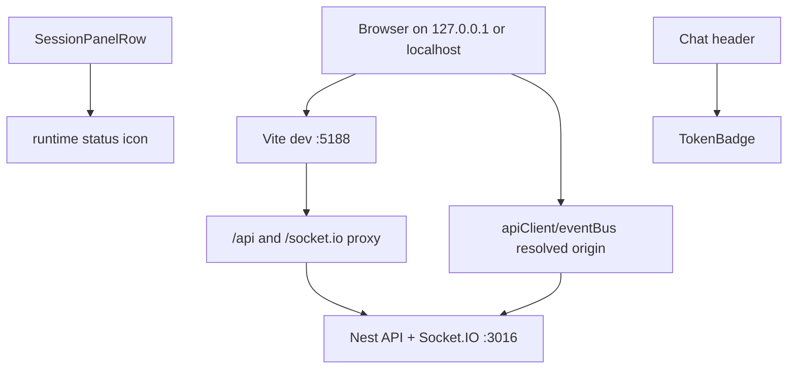
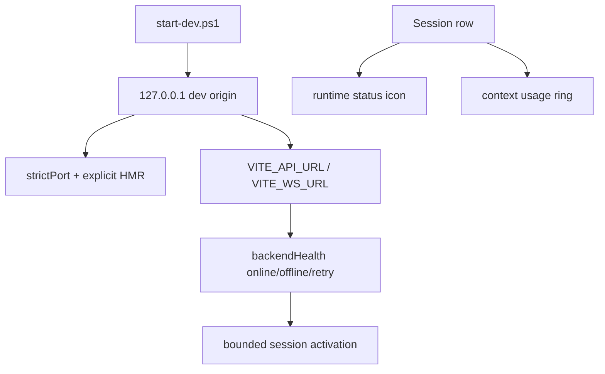
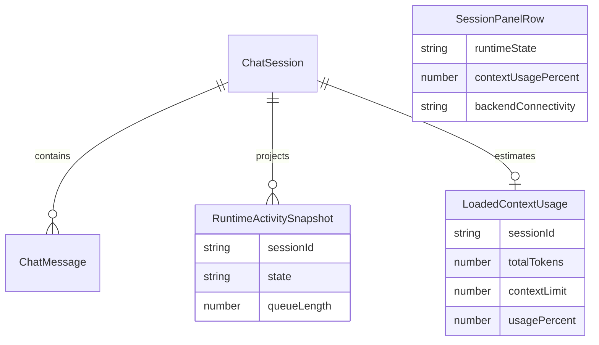

# Dev Stack And Session Indicators

## Acceptance Criteria

- [x] Dev stack uses one canonical local origin for API and WS on manual ports 3016/5188.
- [x] Vite dev server has strict port and explicit HMR configuration.
- [x] Session activation reports backend offline/retry state instead of hanging silently on network failure.
- [x] Session runtime icon remains runtime-only and exposes clear labels: Pending, Running, Waiting, Completed, Failed, Stopped.
- [x] Prepare QA build/stack for user testing after chat/workflow focused gates pass.
- [x] Skip session row context ring for this release slice per user direction.
- [ ] Focused frontend tests, typecheck, and dev stack smoke pass before release readiness is claimed.

## Current Architecture

## Target Architecture

## Models And Relations

## Notes

- 2026-06-22: User clarified release/demo readiness requires workflow observability, current state, spec-aligned behavior, and refresh/new-UI session replay.
- 2026-06-22: Review attachment adds release blockers outside this slice: mock-tool retry can skip missing tool result, recoverable finalizer failure can be summarized as success, and technical architecture sessions can render empty.
- 2026-06-22: User asked whether the UI still fetches 251 sessions without pagination/lazy loading. Current answer: yes, `SessionPanel` still loads `/api/sessions` as a full list; this slice must not add per-row context fetches, but real session pagination is a separate backend/frontend contract change.
- 2026-06-22: User clarified architecture should be simplified around known libraries, not custom wheels. Follow-up direction: session list pagination should use TanStack Query `useInfiniteQuery` or paginated `useQuery` with backend cursor contract, not another local cache layer.
- 2026-06-22: Focused gates passed: chat/session/VFS/dev-origin tests, workflow reload/tree/graph tests, and `kalio-web` typecheck. QA stack is running on backend 61907 and frontend 61908.
- 2026-06-22: Fixed QA/release audit found a stronger blocker outside the earlier frontend slice. `stack-manager start --backend-port 3316 --frontend-port 5288` can succeed against already-occupied ports because the new children fail with `EADDRINUSE` while health checks pass against stale listeners. State files then capture dead wrapper PIDs, so `status`, `stop`, and `release:workflow-gate` become untrustworthy until port-owner refresh and unmanaged-port refusal are enforced.
- 2026-06-22: Fixed the QA stack-manager false-success path. `status --json` now reports `unmanaged listeners` when fixed managed ports are occupied without state, `start` refuses occupied unmanaged target ports, and managed state refreshes listener PIDs from live port owners after startup/status/stop.
- 2026-06-22: Verification after the stack-manager fix:
  - `node --test scripts/runtime-scripts.test.mjs scripts/stack-state.test.mjs` passed.
  - Fixed QA lifecycle proof passed: clean `stop`, clean `start --backend-port 3316 --frontend-port 5288`, `status=running`, real listener PIDs matched state, then clean `stop`, then restart from existing dist with `--skip-build`.
  - Live fixed QA gate passed on `http://127.0.0.1:5288` -> `http://127.0.0.1:3316` with `provider=xiaomimimo model=mimo-v2.5 source=db`.
  - `npm.cmd run agentflow:paid-readiness -- --api http://127.0.0.1:3316/api` passed.
  - `npm.cmd run release:workflow-gate -- --require-live` passed: workflow visibility/replay/graph child chat `1 passed`, stop/HITL `3 passed`, normal chat `3 passed`.
- 2026-06-22: Remaining release-audit gaps after the live gate:
  - no dedicated real-browser forced disconnect/reconnect Playwright spec proving Socket.IO replay plus FE hydration in one run;
  - `apps/e2e/tests/ac-02-hitl-confirmation.spec.ts` still has skipped confirm-result/cancel/argument-visibility cases, so HITL E2E proof is not yet exhaustive.
