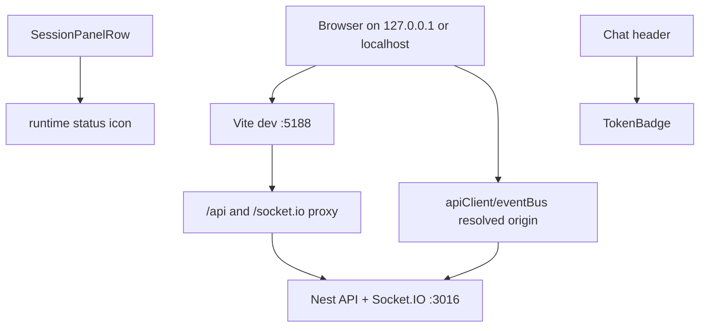
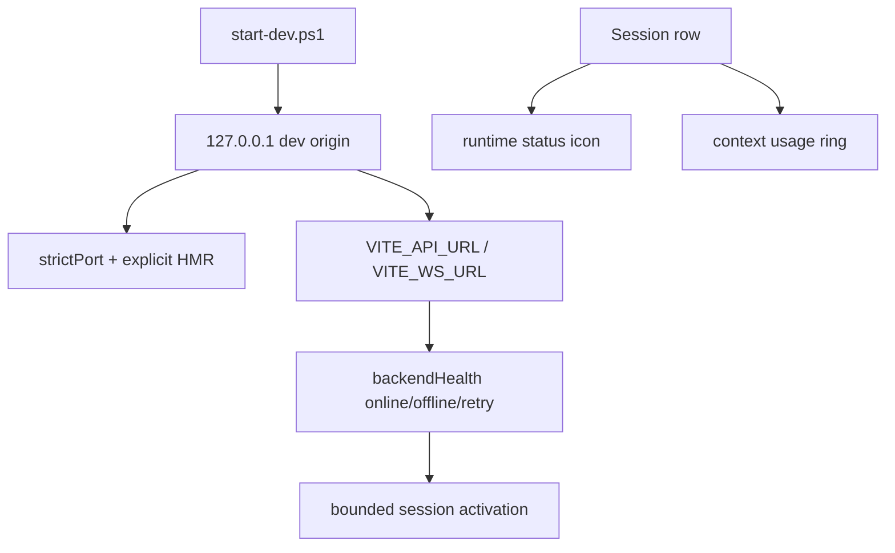
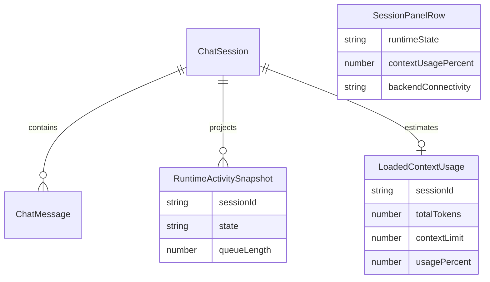

# Dev Stack And Session Indicators

## Acceptance Criteria

- [x] Dev stack uses one canonical local origin for API and WS on manual ports 3016/5188.
- [x] Vite dev server has strict port and explicit HMR configuration.
- [x] Session activation reports backend offline/retry state instead of hanging silently on network failure.
- [x] Session runtime icon remains runtime-only and exposes clear labels: Pending, Running, Waiting, Completed, Failed, Stopped.
- [x] Prepare QA build/stack for user testing after chat/workflow focused gates pass.
- [x] Skip session row context ring for this release slice per user direction.
- [ ] Focused frontend tests, typecheck, and dev stack smoke pass before release readiness is claimed.

## Current Architecture

## Target Architecture

## Models And Relations

## Notes

- 2026-06-22: User clarified release/demo readiness requires workflow observability, current state, spec-aligned behavior, and refresh/new-UI session replay.
- 2026-06-22: Review attachment adds release blockers outside this slice: mock-tool retry can skip missing tool result, recoverable finalizer failure can be summarized as success, and technical architecture sessions can render empty.
- 2026-06-22: User asked whether the UI still fetches 251 sessions without pagination/lazy loading. Current answer: yes, `SessionPanel` still loads `/api/sessions` as a full list; this slice must not add per-row context fetches, but real session pagination is a separate backend/frontend contract change.
- 2026-06-22: User clarified architecture should be simplified around known libraries, not custom wheels. Follow-up direction: session list pagination should use TanStack Query `useInfiniteQuery` or paginated `useQuery` with backend cursor contract, not another local cache layer.
- 2026-06-22: Focused gates passed: chat/session/VFS/dev-origin tests, workflow reload/tree/graph tests, and `kalio-web` typecheck. QA stack is running on backend 61907 and frontend 61908.
