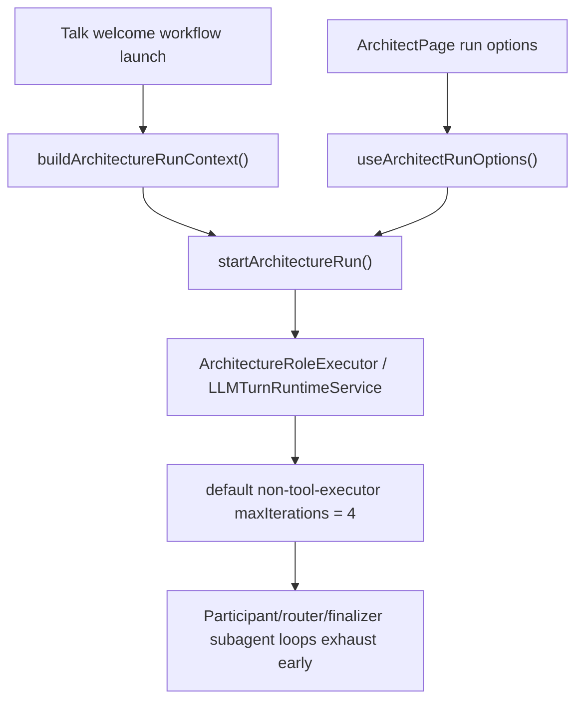
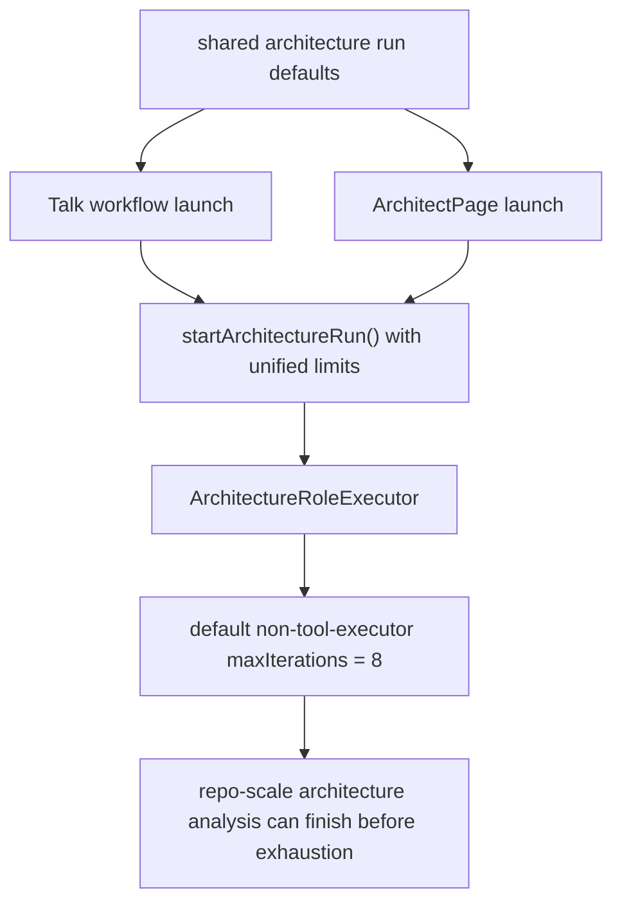
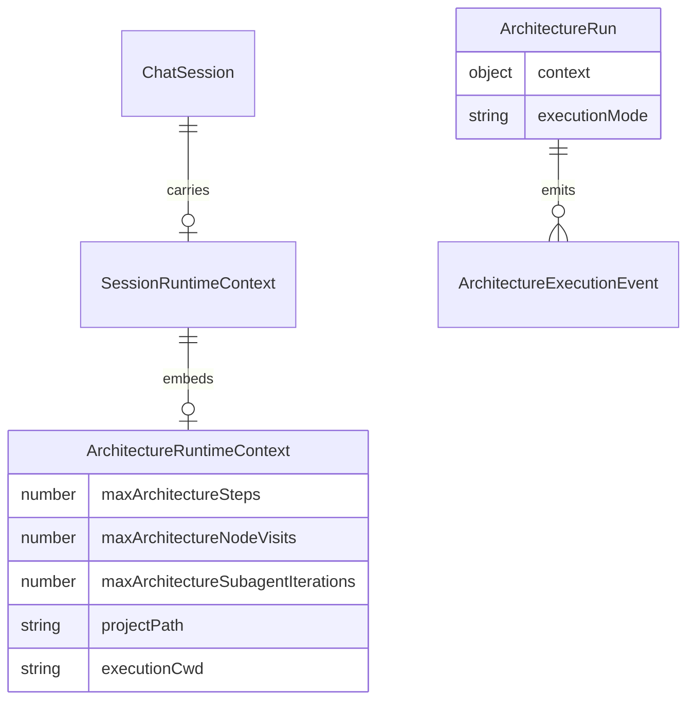

# FamilyQuest workflow runtime proof

## Status

- [x] Reproduce the real FamilyQuest workflow failure on the QA stack with a live LLM.
- [x] Trace the failure boundary through backend logs and launch/runtime contracts.
- [x] Unify workflow launch defaults between Talk launch and Architect launch.
- [x] Raise the shared non-executor fallback iteration budget for architecture slots.
- [x] Rebuild the QA stack and rerun the real FamilyQuest workflow proof.
- [x] Confirm finalizer completion, child transcript visibility, and normal chat stream on the rebuilt stack.

## Current architecture

## Target architecture

## Affected models

## Notes

- Root cause evidence from live logs: all strategic-decision-council branch slots exhausted at `4` iterations, then router exhausted too.
- Talk workflow launch did not send architecture iteration defaults at all, while ArchitectPage kept a separate local `4`-iteration default.
- This slice moves both paths to one shared frontend default and raises the backend fallback for non-tool-executor architecture slots to `8`.
- 2026-06-22 QA proof on fixed `3316/5288` isolated a second runtime bug in `architecture_debate`: the orchestrator node is configured as `fan_out_all`, but the router-role executor let the agent's `route_to(researcher, ...)` narrow the route to a single child. Result: only one branch ran while `pragmatist` and `user-advocate` stayed `pending`.
- 2026-06-22 Fix: `apps/kalio-api/src/modules/architecture/architecture-graph-runtime.ts` now ignores agent route narrowing for router-role nodes whose behavior mode is `fan_out_all`; graph semantics win over the branch prose.
- 2026-06-22 Focused verification:
  - `corepack pnpm --filter kalio-api exec vitest run src/modules/architecture/architecture-runtime.service.spec.ts -t "fan_out_all|router-role narrow"` passed.
  - Real QA rerun on `http://127.0.0.1:3316` with `schemaId=architecture_debate`, `projectPath=C:\Projekty\FamilyQuest`, prompt `oceń architekturę` now shows all three child branches (`researcher`, `pragmatist`, `user-advocate`) starting and completing before `synthesizer` begins.
- 2026-06-22 Built-QA runtime-config proof closed the remaining fixed-port drift:
  - `node --test apps/e2e/scripts/start-playwright-stack.test.mjs` passed `12/12` after hardening runtime-config generation for prebuilt/skip-build flows.
  - `npm.cmd run test` passed repo-wide after the runtime-config change.
  - `npm.cmd run typecheck` passed repo-wide.
  - `node scripts/stack-manager.mjs start --backend-port 3316 --frontend-port 5288 --data-root %LOCALAPPDATA%\kalio-forever-qa` rebuilt the fixed QA stack and wrote the runtime backend override into the built frontend.
  - `node scripts/stack-manager.mjs status --json` reported `status=running` on `3316/5288`; effective `/api/llm/config` resolved to `openrouter / cohere/north-mini-code:free / db`.
  - `npm.cmd run release:workflow-gate -- --require-live --api http://127.0.0.1:3316/api --web http://127.0.0.1:5288` passed end to end: workflow visibility/replay/graph child chat `1 passed`, reconnect hydration `1 passed`, stop/HITL `3 passed`, normal chat `3 passed`.
