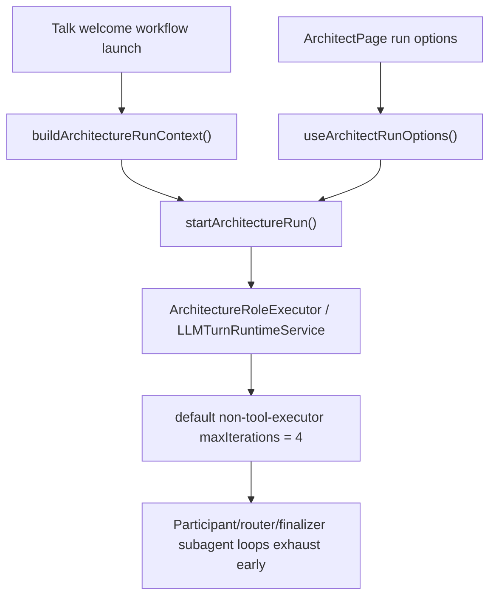
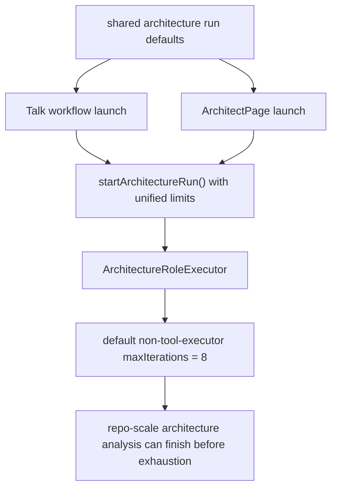
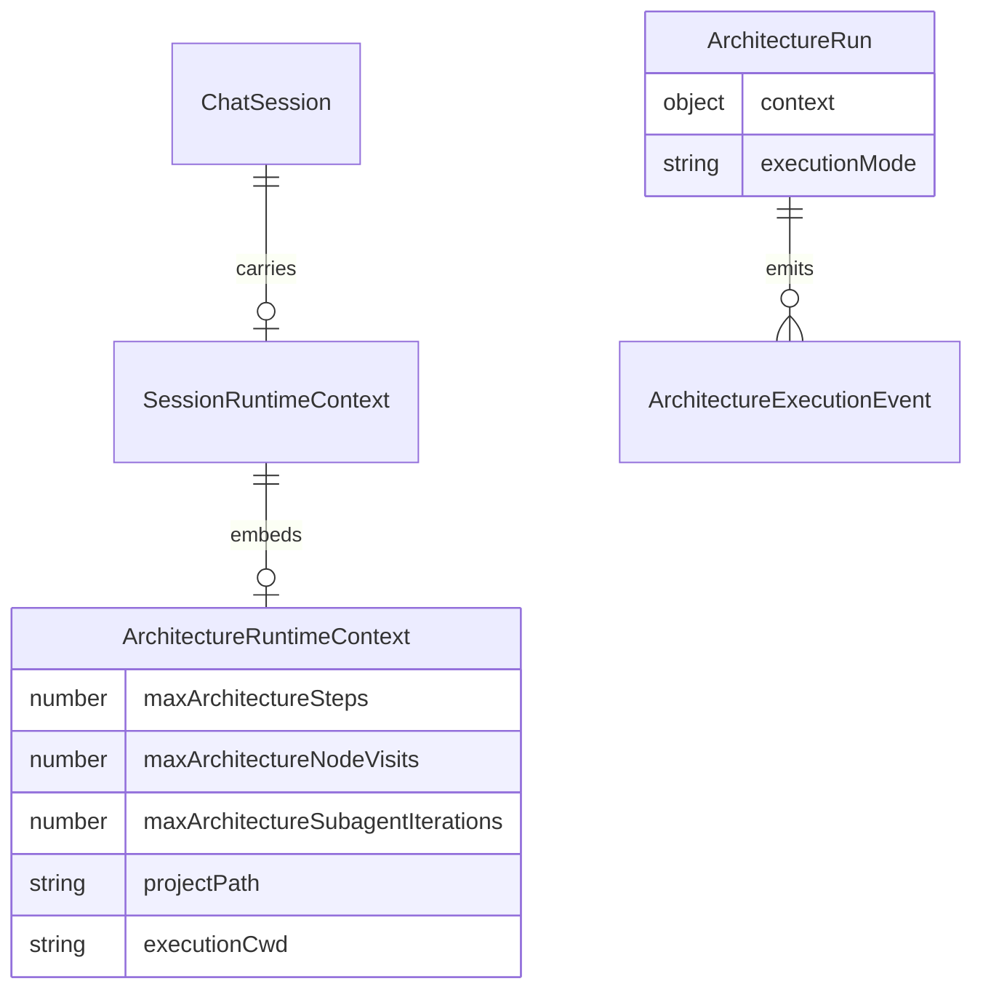

# FamilyQuest workflow runtime proof

## Status

- [x] Reproduce the real FamilyQuest workflow failure on the QA stack with a live LLM.
- [x] Trace the failure boundary through backend logs and launch/runtime contracts.
- [x] Unify workflow launch defaults between Talk launch and Architect launch.
- [x] Raise the shared non-executor fallback iteration budget for architecture slots.
- [ ] Rebuild the QA stack and rerun the real FamilyQuest workflow proof.
- [ ] Confirm finalizer completion, child transcript visibility, and normal chat stream on the rebuilt stack.

## Current architecture

## Target architecture

## Affected models

## Notes

- Root cause evidence from live logs: all strategic-decision-council branch slots exhausted at `4` iterations, then router exhausted too.
- Talk workflow launch did not send architecture iteration defaults at all, while ArchitectPage kept a separate local `4`-iteration default.
- This slice moves both paths to one shared frontend default and raises the backend fallback for non-tool-executor architecture slots to `8`.
