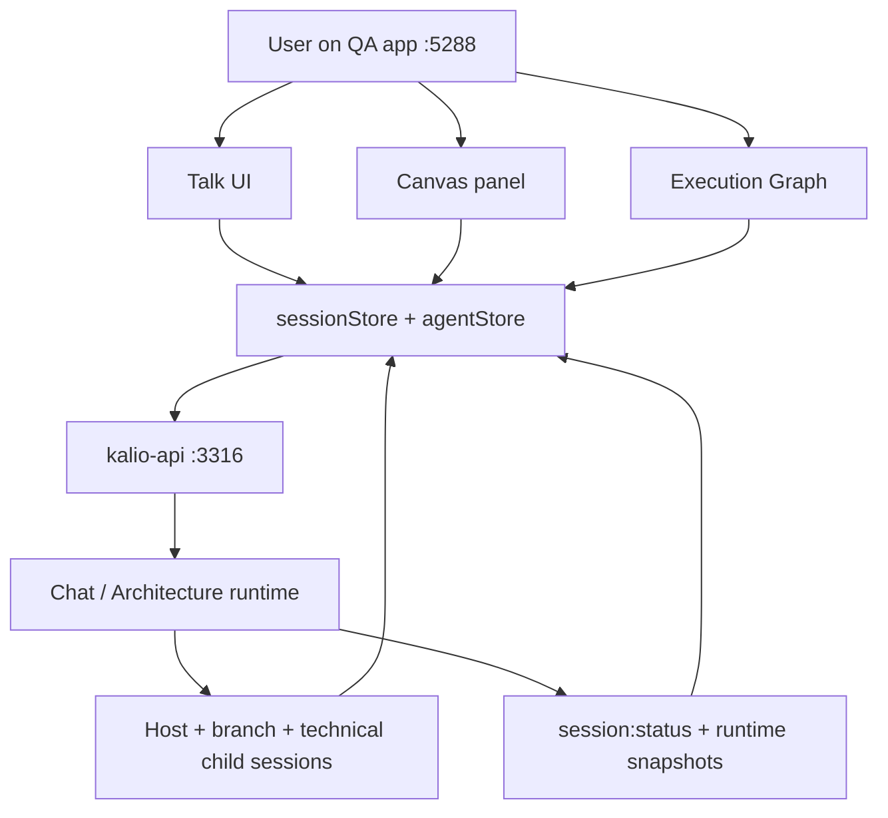
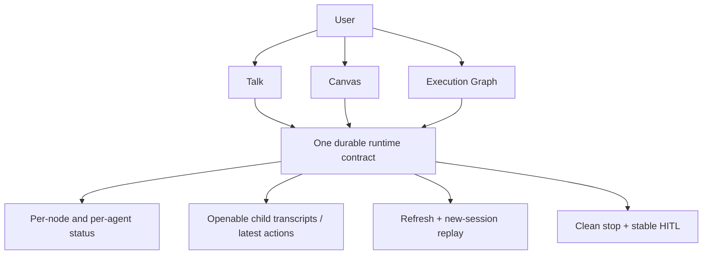
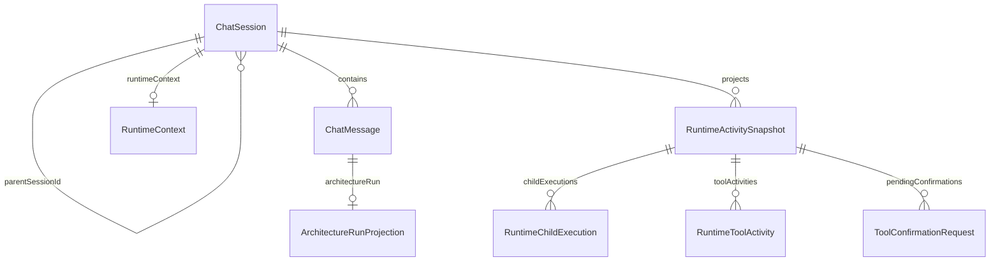

# Manual Release Audit: Workflow Control And QA Startup

## Acceptance Criteria

- [x] `pnpm qa` / `start-qa.ps1` proves fixed QA on `3316/5288` builds fresh `dist` by default and runs against the dedicated QA data root.
- [x] Baseline workflow `Oceń architekturę projektu` runs from the Talk UI on QA and exposes visible per-node / per-agent status.
- [x] Every visible branch/router/finalizer session can be reopened as a sub-conversation and shows persisted transcript content instead of a placeholder.
- [x] Refresh or opening the same workflow in a new UI session restores the active workflow state, node statuses, and child session visibility.
- [ ] User-visible stop on a running workflow drains the active run cleanly and does not leave ghost running state.
- [ ] HITL confirmation is user-visible and actionable on QA, and the resulting state does not resurrect stale confirmations.
- [x] Confirmed defects discovered during the audit are recorded in `docs/bugs.md`.

## Current Architecture

## Target Architecture

## Models And Relations

## Notes

- 2026-06-22: This audit starts after the broad runtime/release-gate commit `252145cb`.
- 2026-06-22: Live gates are already green, but the remaining question is user-visible confidence: dedicated QA startup, real workflow observability, refresh replay, stop, and HITL from the FE.
- 2026-06-22: Any defect confirmed during the manual audit must be logged in `docs/bugs.md` before claiming release readiness.
- 2026-06-22: Verified on rebuilt QA `3316/5288` that workflow launch from Talk UI auto-registers `C:\Projekty\kalio-forever` in `allowed_paths`, all five branch sessions complete successful `fs_*` reads without `ACCESS_DENIED`, and a branch sub-conversation opens with persisted transcript content.
- 2026-06-22: Reload proof passed on host session `-GTTXQNr1Fdzyy9W0l2Xn`: timeline remained visible, eight completed node badges survived F5, finalizer content was still visible, and branch transcript reopened without the `Waiting for the first persisted message` placeholder.
- 2026-06-22: Stop and HITL still need fresh FE proof on this rebuilt QA slice. Live provider stability is also still a release blocker because one branch hit malformed streamed tool args and another timed out during the same baseline run.
