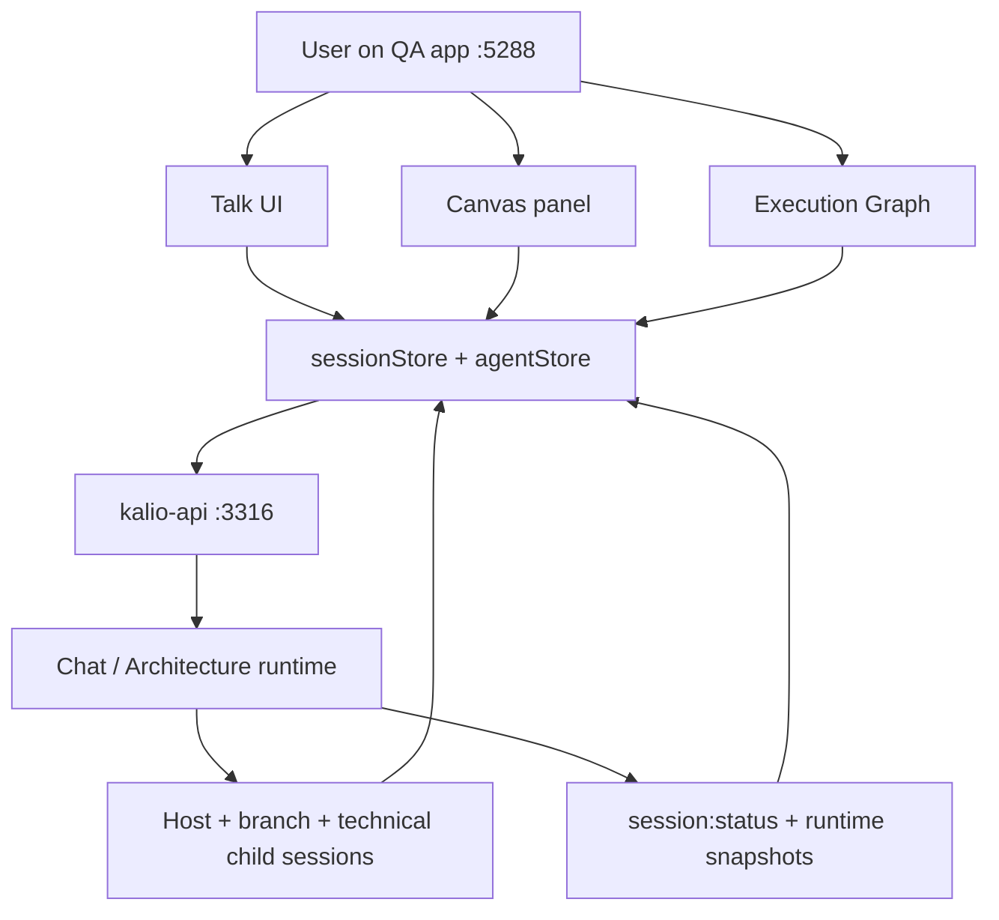
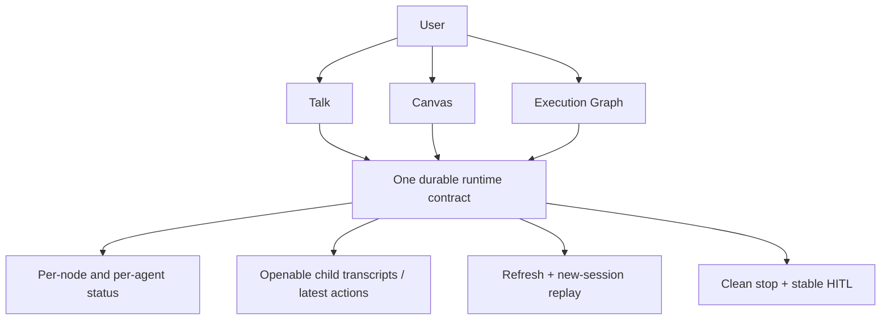
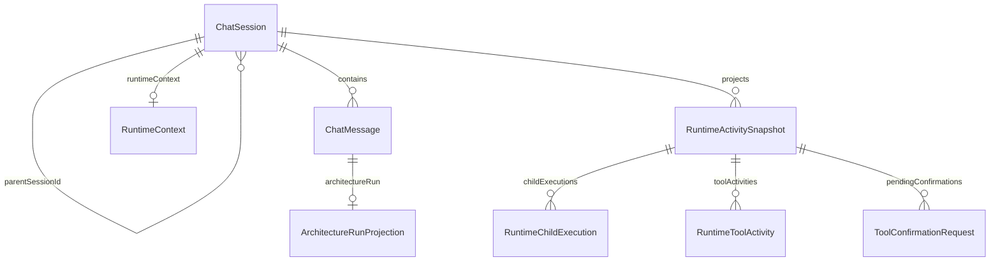

# Manual Release Audit: Workflow Control And QA Startup

## Acceptance Criteria

- [x] `pnpm qa` / `start-qa.ps1` proves fixed QA on `3316/5288` builds fresh `dist` by default and runs against the dedicated QA data root.
- [x] Baseline workflow `Oceń architekturę projektu` runs from the Talk UI on QA and exposes visible per-node / per-agent status.
- [x] Every visible branch/router/finalizer session can be reopened as a sub-conversation and shows persisted transcript content instead of a placeholder.
- [x] Refresh or opening the same workflow in a new UI session restores the active workflow state, node statuses, and child session visibility.
- [x] User-visible stop on a running workflow drains the active run cleanly and does not leave ghost running state.
- [x] HITL confirmation is user-visible and actionable on QA, and the resulting state does not resurrect stale confirmations.
- [x] Confirmed defects discovered during the audit are recorded in `docs/bugs.md`.

## Current Architecture

## Target Architecture

## Models And Relations

## Notes

- 2026-06-22: This audit starts after the broad runtime/release-gate commit `252145cb`.
- 2026-06-22: Live gates are already green, but the remaining question is user-visible confidence: dedicated QA startup, real workflow observability, refresh replay, stop, and HITL from the FE.
- 2026-06-22: Any defect confirmed during the manual audit must be logged in `docs/bugs.md` before claiming release readiness.
- 2026-06-22: Verified on rebuilt QA `3316/5288` that workflow launch from Talk UI auto-registers `C:\Projekty\kalio-forever` in `allowed_paths`, all five branch sessions complete successful `fs_*` reads without `ACCESS_DENIED`, and a branch sub-conversation opens with persisted transcript content.
- 2026-06-22: Reload proof passed on host session `-GTTXQNr1Fdzyy9W0l2Xn`: timeline remained visible, eight completed node badges survived F5, finalizer content was still visible, and branch transcript reopened without the `Waiting for the first persisted message` placeholder.
- 2026-06-22: Fixed FE ghost-running state after `chat:stop` when the backend only emitted a terminal `session:status` / `session:runtime_snapshot` and no `agent:done`. Shared lifecycle handlers now release stale local active-loop state on terminal snapshots instead of waiting for a separate done event.
- 2026-06-22: Focused FE gates passed: `corepack pnpm --filter kalio-web exec vitest run src/features/chat/hooks/useChatSocketEvents.helpers.spec.ts src/features/chat/hooks/useChatSocketEvents.helpers.test.ts src/features/chat/hooks/useChatSocketEvents.queued.test.ts src/features/chat/ChatInterface.test.tsx` and `corepack pnpm --filter kalio-web run typecheck`.
- 2026-06-22: Built-QA browser proofs passed on fixed ports `3316/5288`:
  - `regression-stop-follow-up.spec.ts` passed against external fixed QA.
  - `workflow-stop-runtime.spec.ts` passed against external fixed QA and proved the stop button hides after a workflow launch.
  - `hitl-tool-confirmation-runtime.spec.ts` passed against fixed QA after starting QA with `--force-env-llm` / mock provider.
  - `corepack pnpm run release:workflow-gate` passed end to end on fixed QA and covered workflow visibility/replay, reconnect hydration, stale confirmation invalidation, normal chat streaming, plain stop, and workflow stop.
- 2026-06-22: The prior live-provider blocker was reproduced as a config-drift issue: shared OpenRouter activation/probe defaults still targeted `nvidia/nemotron-3-ultra-550b-a55b:free`, even though the verified release gate had already standardized on `cohere/north-mini-code:free`.
- 2026-06-22: Release-facing OpenRouter defaults were unified on `cohere/north-mini-code:free`, and live/provider gates now pass again on fixed QA `3316/5288`: `node --test scripts/activate-live-credential.test.mjs scripts/llm-provider-config.test.mjs scripts/agentflow-paid-readiness.test.mjs`, `corepack pnpm --filter @kalio/e2e exec playwright test tests/architecture-chat-subagent-turn.spec.ts --project=chromium --grep "renders council branches as sub-agent chips and restores them after reload|launches Architecture Debate from the welcome screen with projectPath and keeps child transcripts repo-scoped after reload"`, `corepack pnpm --filter @kalio/e2e exec playwright test tests/ac-26-history-reload.spec.ts tests/chat-reconnect-hydration.spec.ts tests/workflow-stop-runtime.spec.ts --project=chromium`, `npm.cmd run agentflow:paid-readiness -- --api http://127.0.0.1:3316/api`, and `npm.cmd run release:workflow-gate`.
- 2026-06-22: Manual QA confirmed `pnpm qa` / fixed-QA startup still rebuilds `dist` before launching the dedicated QA app: `node scripts/stack-manager.mjs start --backend-port 3316 --frontend-port 5288 --data-root %LocalAppData%\\kalio-forever-qa --force-env-llm` and later `--use-env-llm` both recompiled API/web, then served `apps/kalio-api/dist/main.js` and `vite preview --strictPort` on `3316/5288` with the isolated QA AppData root.
- 2026-06-22: Manual live workflow proof on `5288` with `projectPath=C:\Projekty\kalio-forever` showed the expected release behavior after a short poll: a branch child chat exposed repo-scoped transcript content immediately, a technical router child chat exposed synthetic node activity instead of the `Waiting for the first persisted message` placeholder, and the host workflow completed on OpenRouter `cohere/north-mini-code:free`.
- 2026-06-22: Manual stop proof on live fixed QA passed: after launching `Architecture Debate` from the Talk welcome screen, `chat-stop-btn` cleared, queued/pending badges drained to zero, and the composer became interactive again without reload.
- 2026-06-22: Manual HITL proof on mock fixed QA passed: after restarting fixed QA with `--force-env-llm`, setting HITL mode to `Manual`, and sending the deterministic mock `vfs_write` trigger, the confirm dialog appeared in the QA app, `Confirm` cleared the dialog, and `e2e/mock-tool-trigger.txt` was written with `mock-trigger-confirmation`.
- 2026-06-22: Fixed the final manual-QA blocker in the managed-stack status contract. `node scripts/stack-manager.mjs status --json` now keeps the startup snapshot under `state` but also exposes authoritative live config under `effectiveLlm`, so operators and release tooling can see `openrouter / cohere/north-mini-code:free / db` even when the original startup snapshot still shows `xiaomimimo / mimo-v2.5-pro`.
- 2026-06-22: Verification for the status-contract fix passed on fixed QA `3316/5288`: `node --test scripts/stack-state.test.mjs scripts/stack-status.test.mjs scripts/runtime-scripts.test.mjs`, `node scripts/stack-manager.mjs status --json`, `GET /api/llm/config`, `node scripts/agentflow-paid-readiness.mjs --api http://127.0.0.1:3316/api`, and `npm.cmd run release:workflow-gate`.
