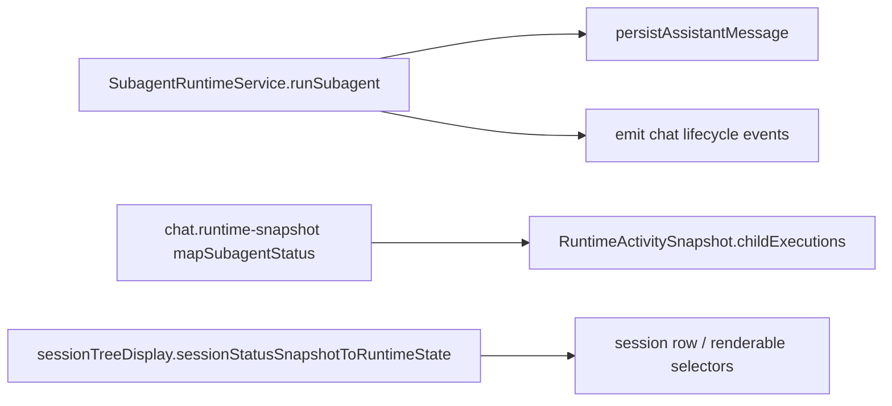
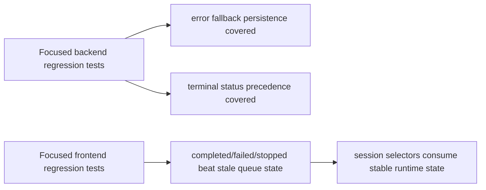
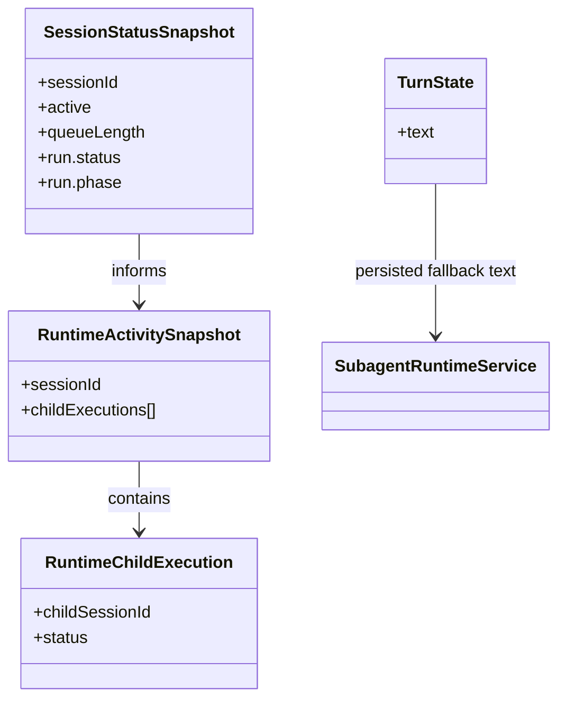

# Test Gap Detection 2026-06-22

## Acceptance criteria

- [x] Identify only untested paths introduced by the current uncommitted runtime/session diff.
- [x] Add the smallest focused regression tests for those paths.
- [x] Run the narrowest practical Vitest commands first, then a slightly broader affected-suite pass.
- [x] Record what was verified and any remaining nearby gaps.

## Current architecture

## Target architecture

## Affected models and relations

## Steps

- [x] Confirm current changed files and existing coverage around the new branches.
- [x] Add one backend test for the missing error-fallback persistence path if still uncovered.
- [x] Add one frontend test for the highest-value uncovered terminal-status precedence path if still uncovered.
- [x] Run targeted backend/frontend Vitest commands.
- [x] Update this note with outcomes and remaining gaps.

## Notes

- Scope intentionally excludes broad runtime refactors and unchanged session-panel behavior.
- Official docs checked before implementation: Vitest guide currently shows `v4.1.7`; repo backend still pins Vitest `^3.1.0`, so tests should stay on existing APIs and remain small/user-facing.
- Added backend regression coverage in `apps/kalio-api/src/modules/chat/__tests__/subagent-runtime.service.spec.ts` for:
  - error fallback persistence including last streamed text on thrown child run
  - silent completion fallback persistence when a child finishes with no visible output
- Added backend regression coverage in `apps/kalio-api/src/modules/chat/chat.runtime-snapshot.spec.ts` proving failed child runs beat stale queued depth.
- Added frontend regression coverage in `apps/kalio-web/src/features/sessions/sessionTreeDisplay.test.ts` proving `interrupted_needs_retry` beats stale queued depth.
- Added frontend selector regression coverage in `apps/kalio-web/src/store/agentRuntimeSelectors.test.ts` proving stale queued interrupted retry snapshots do not remain in the live-session set.
- Verification passed:
  - `corepack pnpm --filter kalio-api exec vitest run src/modules/chat/__tests__/subagent-runtime.service.spec.ts src/modules/chat/chat.runtime-snapshot.spec.ts`
  - `corepack pnpm --filter kalio-web exec vitest run src/features/sessions/sessionTreeDisplay.test.ts`
  - `corepack pnpm --filter kalio-web exec vitest run src/features/sessions/sessionTreeDisplay.test.ts src/store/agentRuntimeSelectors.test.ts src/features/sessions/sessionRowRuntimeState.test.ts`
  - `corepack pnpm --filter kalio-web exec vitest run src/features/sessions/sessionRowRuntimeState.test.ts src/store/agentRuntimeSelectors.test.ts`
  - `corepack pnpm --filter kalio-api run typecheck`
  - `corepack pnpm --filter kalio-web run typecheck`
- Remaining nearby gap not covered in this run:
  - `subagent-runtime.service` completion path where fallback persistence fails and `chat:complete` should keep `loopResult.lastMessageId`.
