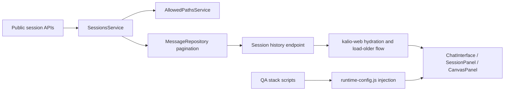
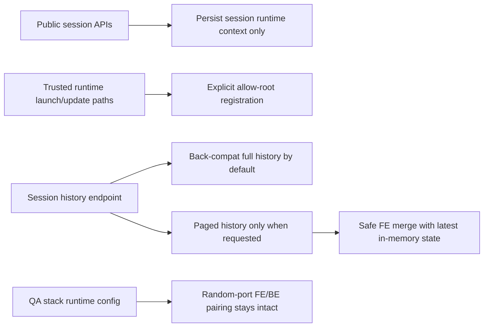
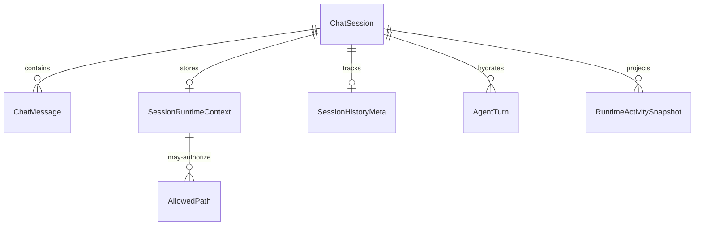

# Uncommitted Review Fix Pass

## Acceptance Criteria

- [x] Confirm the task scope is the current uncommitted working tree on `2026-06-22`.
- [x] Capture concrete review candidates from local diff inspection and delegated review slices.
- [x] Fix only verified high-value issues that are critical or cheap to repair.
- [x] Run focused regression tests for each touched slice.
- [x] Run the repository test gate and record any remaining failures or blockers.
- [x] Commit the verified fixes in logical packages.

## Current Architecture

## Target Architecture

## Models And Relations

## Work Plan

- [x] Verify CodeRabbit availability from this machine and record the exact limitation if blocked.
- [x] Patch backend session/runtime handling so public session writes do not silently widen allowed roots.
- [x] Patch session history API so old callers still receive full history unless they explicitly request paging.
- [x] Patch frontend older-history merge to use the latest store state instead of a stale closure snapshot.
- [x] Run targeted backend/frontend tests for the touched files.
- [x] Run full repository tests and log the result.
- [x] Commit the fixes in small reviewable batches.

## Notes

- 2026-06-22: Review target is the current uncommitted working tree, not `origin/main...HEAD`.
- 2026-06-22: Official CodeRabbit CLI docs still recommend the CLI install/auth/review flow from the command line and agent mode via `cr --agent`; local Windows shell currently has no `coderabbit` binary available.
- 2026-06-22: Confirmed candidate issues before edits:
  - public session create/update currently persist `projectPath` / `executionCwd` and also auto-register those paths into `AllowedPathsService`;
  - `GET /api/sessions/:id/messages` now pages by default through the controller and risks truncating legacy callers to `40` items;
  - frontend "load older messages" merges against a captured `messages` array, which can drop newly arrived live messages while the older-page request is in flight.
- 2026-06-22: Targeted verification passed:
  - `corepack pnpm --filter kalio-api exec vitest run src/modules/chat/__tests__/sessions.service.spec.ts src/modules/chat/sessions.controller.spec.ts src/modules/chat/__tests__/subagent-runtime.service.spec.ts src/modules/chat/__tests__/chat.service.spec.ts`
  - `corepack pnpm --filter kalio-api exec vitest run src/modules/chat/__tests__/agent-loop-limits.spec.ts --reporter=verbose`
  - `corepack pnpm --filter kalio-api exec vitest run src/modules/chat/__tests__/chat-max-iterations.spec.ts src/modules/chat/__tests__/chat.service.event-ordering.spec.ts src/modules/chat/__tests__/issues-verification.spec.ts`
  - `corepack pnpm --filter kalio-web exec vitest run src/features/chat/ChatInterface.test.tsx`
  - `corepack pnpm --filter kalio-api run typecheck`
  - `corepack pnpm --filter kalio-web run typecheck`
- 2026-06-22: Full-repo verification remains red on the current branch:
  - `corepack pnpm test` still fails in aggregate; the chat suites that failed there passed in isolation, so the remaining issue looks like cross-suite interference or unrelated branch state rather than a deterministic failure from this slice.
  - `corepack pnpm test:e2e` still fails across broader workflow/runtime specs (`ac-07-mcp-server`, `ac-21-embedding-credentials`, multiple `agentflow-goal-guard`, `architecture-follow-up-stability`, `familyquest-live-proof`, `regression-stop-follow-up`).
- 2026-06-22: Verified fixes were split into reviewable commits:
  - `36b9506a` `Harden session runtime scope and history reads`
  - `4382bafb` `Wire paged session history into the web client`
