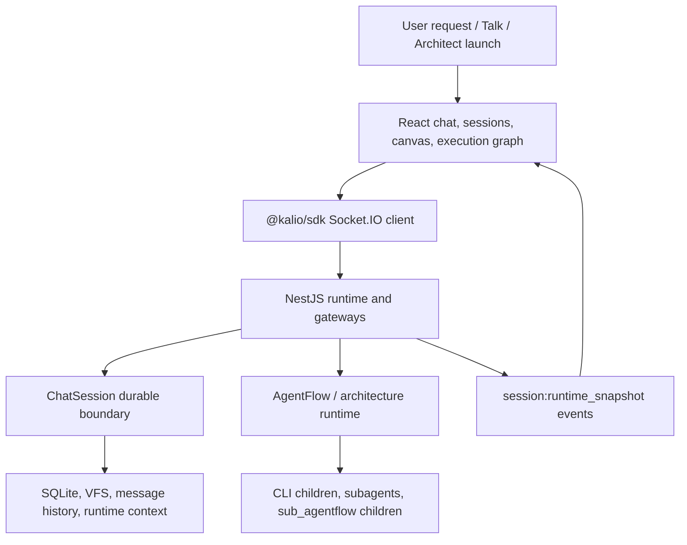
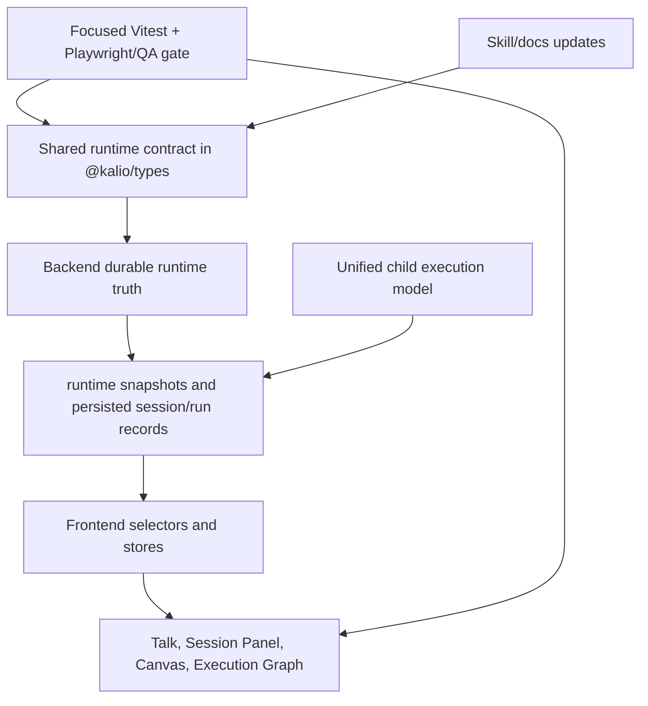
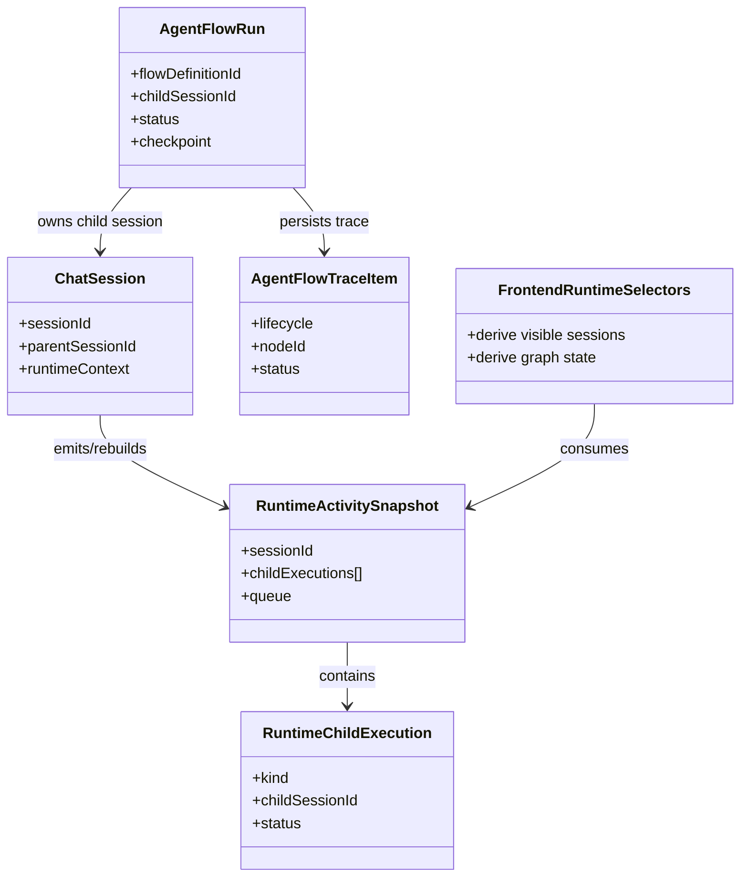

# Workflow Architecture, Test, And Skill Audit 2026-06-22

## Acceptance criteria

- [x] Assess the current workflow/AgentFlow runtime architecture against the repo contract: backend durable truth, FE rebuildable projection, unified child execution model.
- [x] Check whether workflow/runtime tests cover real user-visible and durable-state edge cases rather than shallow implementation details.
- [x] Check installed/repo skill docs for stale or missing guidance and update only concrete inconsistencies.
- [x] Use Serena, ast-grep, subagents, web research, and focused local verification where practical.
- [x] Record bugs, risks, verification evidence, and remaining gaps without claiming unverified readiness.

## Current architecture affected by this audit

## Target architecture represented by final findings

## Models and relations affected

## Steps

- [x] Activate Serena and read Serena instructions.
- [x] Read relevant skills and project memories.
- [x] Spawn independent architecture/test/docs audit subagents.
- [x] Check current web best practices for workflow/E2E/component testing.
- [x] Inventory relevant workflow/runtime source, docs, and tests.
- [x] Use Serena/ast-grep to inspect concrete symbols and repeated code shapes.
- [x] Run the narrowest practical verification commands for audit-relevant tests.
- [x] Update stale docs/skills only when evidence shows a concrete mismatch.
- [x] Summarize result, verification, orchestration, quality review, risks, process improvements, and next best action.

## Notes

- User asked to continue after interruption and explicitly re-check Serena. Serena was found via `tool_search`, activated for `C:\Projekty\kalio-forever`, and the instructions manual was read.
- Worktree already contains many unrelated modified/untracked files. This audit must not revert or normalize them.
- Web references checked during setup:
  - Playwright best practices: user-visible behavior, isolated tests, locators, web-first assertions, up-to-date browser dependencies.
  - Testing Library guiding principles: tests should resemble how users use the software.
  - Vitest component testing: component tests should cover contracts, interactions, loading/error/empty states, and avoid internals.
  - NestJS testing: automation should cover unit, integration, and e2e layers with DI-aware testing utilities.
- Architecture audit found and fixed two backend edge bugs:
  - `chat:stop` emitted terminal `session:runtime_snapshot` only to the initiating socket. It now uses the same initiator/subscriber fan-out path as normal session events.
  - AgentFlow stop lookup preferred `findAll()` even when scoped `findByParentSessionId()` was available. It now prefers the scoped lookup and keeps `findAll()` as fallback.
- Added backend regressions in `apps/kalio-api/src/modules/chat/__tests__/chat.gateway.spec.ts` for subscriber terminal stop snapshots and scoped AgentFlow stop lookup.
- Documentation updates:
  - `docs/sub-agentflow-target-architecture.md` gap table now separates current gaps from historical implementation notes and no longer lists implemented return modes/copy-back as missing.
  - `docs/local-dev-guide.md`, `docs/agent-skills/kalio-browser-mcp-qa.md`, and `docs/agent-skills/kalio-manual-qa.md` now clarify `localhost` for ordinary manual QA versus `127.0.0.1` as browser MCP fallback while requiring both origins.
  - `docs/agent-skills/README.md` records the repo-copy-to-installed-skill sync rule.
- Installed skill sync completed for:
  - `kalio-manual-qa`
  - `ast-grep-kalio-structural-search`
  - `serena-kalio-code-navigation`
  - `kalio-architecture-runtime-guard`
  - `kalio-browser-mcp-qa`
  Hash verification showed repo and installed copies match after sync.
- Verification passed:
  - `corepack pnpm --filter kalio-api exec vitest run src/modules/chat/__tests__/chat.gateway.spec.ts` -> 36 tests passed.
  - `corepack pnpm --filter kalio-api exec vitest run src/modules/chat/chat.runtime-snapshot.spec.ts src/modules/agent-flow/agent-flow-runtime.service.spec.ts src/modules/tool/tools/run-sub-agentflow.tool.spec.ts src/modules/chat/__tests__/chat.gateway.spec.ts` -> 4 files, 97 tests passed.
- Remaining test quality gaps:
  - `apps/e2e/tests/workflow-stop-runtime.spec.ts` proves stop UI cleanup but still does not assert terminal backend AgentFlow run state or child-session drain from the browser flow.
  - Live/manual FE proof for the current Dev/Implementer <-> Goal Guard loop remains required before calling paid/live workflow generation release-ready.
