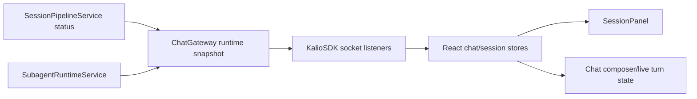
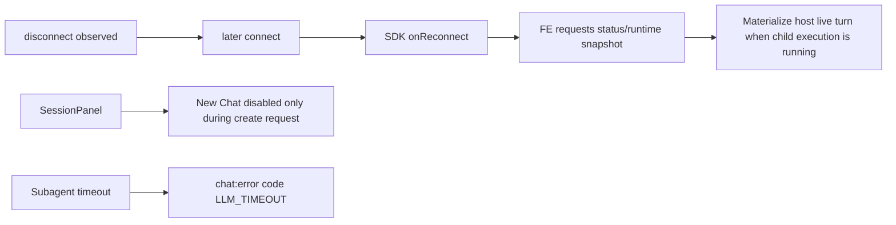
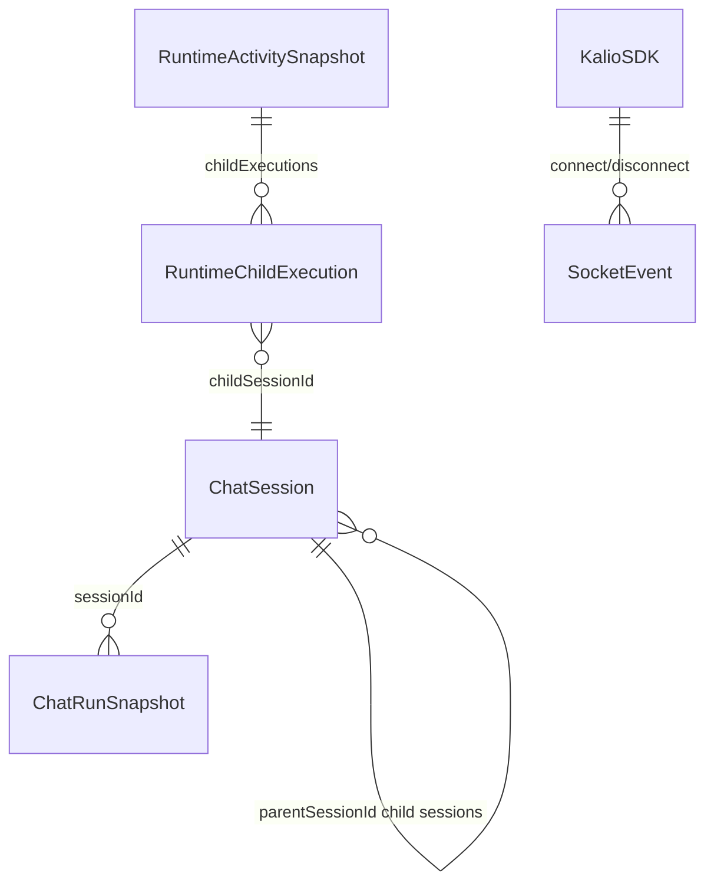

# Workflow reconnect demo regression

Date: 2026-06-22

## Acceptance criteria

- [x] New Chat is clickable while the full historical session list is still loading.
- [x] App-level reconnect callbacks fire only after a real disconnect/connect cycle.
- [x] Workflow host sessions stay visibly live after reconnect/F5 when a child execution is running.
- [x] Subagent timeout errors surface as `LLM_TIMEOUT`, not a generic `LLM_ERROR`.
- [x] Focused regression tests, full local test gate, API/web typecheck, API/web build, and workflow release gate pass.

## Current architecture affected

## Target architecture after this slice

## Models and relations affected

## Evidence

- `corepack pnpm --filter @kalio/sdk exec vitest run src/index.test.ts` passed.
- `corepack pnpm --filter kalio-web exec vitest run src/features/sessions/SessionPanel.test.tsx` passed.
- `corepack pnpm --filter kalio-web exec vitest run src/features/chat/hooks/useChatSocketEvents.helpers.test.ts src/features/chat/hooks/useChatSocketEvents.reconnect.test.ts` passed.
- `corepack pnpm --filter kalio-api exec vitest run src/modules/chat/__tests__/subagent-runtime.service.spec.ts` passed.
- `corepack pnpm --filter kalio-api exec vitest run src/modules/chat/chat.runtime-snapshot.spec.ts src/modules/chat/__tests__/chat.gateway.spec.ts --reporter dot` passed: 41 tests.
- `corepack pnpm --filter kalio-api exec vitest run src/modules/chat/chat.runtime-snapshot.spec.ts --reporter dot` passed after hardening status edge cases: 29 tests.
- `corepack pnpm --filter kalio-api run typecheck` passed.
- `corepack pnpm --filter kalio-web run typecheck` passed.
- `corepack pnpm --filter @kalio/sdk run typecheck` passed.
- `corepack pnpm --filter kalio-api run build` passed.
- `corepack pnpm --filter kalio-web run build` passed.
- `corepack pnpm --filter @kalio/sdk run build` passed.
- `corepack pnpm test` passed after the final test fixes: preflight 41/41, `@kalio/types` 13/13, API 2230/2230, web 1423/1423, launcher script tests 12/12.
- `corepack pnpm release:workflow-gate` passed on the built QA stack at `http://127.0.0.1:5288` -> `http://127.0.0.1:3316`.
- `corepack pnpm --filter kalio-api run test:cov` passed. Critical backend reconnect/status snapshot file coverage: statements 94.84%, branches 86.54%, functions 100%, lines 94.84%.
- `corepack pnpm --filter kalio-web run test:cov` passed. Frontend workflow/reconnect slice coverage: statements 88.11%, branches 85.21%, functions 87.88%, lines 88.70%.

## Web check

- Socket.IO 4.x docs say `connect` fires on both connection and reconnection, so app-level reconnect logic must gate on a preceding `disconnect`.
- Testing Library docs recommend awaiting async queries and `waitFor` for async UI effects; the New Chat regression test keeps the sessions promise unresolved and waits only for the create request.

## Notes

- No broad backend architecture rewrite was needed for this slice. Runtime snapshots already support terminal child subagent states; the visible regression was the FE materialization guard and SDK reconnect semantics.
- The normal chat E2E multi-turn test was unstable with vague live-provider prompts because the model could choose `image_generate` and pause on HITL. The test now asks for text-only replies, and the release gate passed.
- Global all-app branch coverage remains below 85% (`kalio-api` around 81%, `kalio-web` around 76% in the latest coverage runs). The critical workflow/reconnect slices now meet or exceed 85% where the regression lived.
- The repository has many unrelated dirty files from prior work. Do not commit this slice with a blanket `git add .`.
