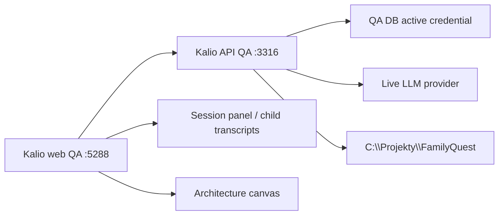
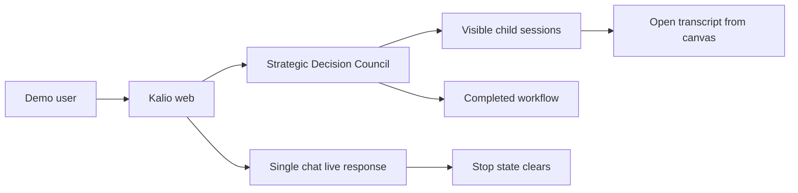
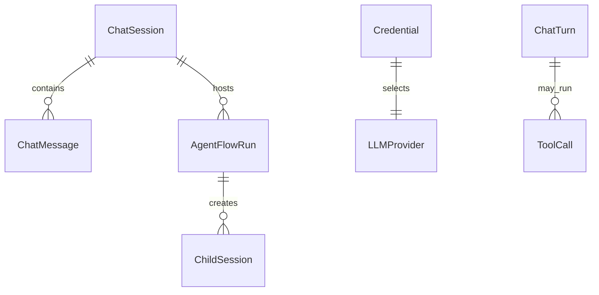

# FamilyQuest Live Provider QA

## Goal

Verify the FamilyQuest workflow demo on a real provider, using the fixed QA stack and browser/E2E evidence.

## Current Architecture Checked

## Target Demo Contract

## Affected Models / Relations

## Notes

- First run with effective `openrouter/cohere/north-mini-code:free`:
  - workflow passed on FamilyQuest in about 3.5 minutes;
  - single chat failed because the free model kept issuing `fs_list` tool calls until `Agent loop exceeded 8 iterations`;
  - this is provider/model behavior, not evidence of reconnect/rehydrate breakage.
- Activated `xiaomimimo/mimo-v2.5` via the local credential activator for the same QA stack.
- Rerun with effective `xiaomimimo/mimo-v2.5`:
  - workflow passed in about 3.0 minutes;
  - single chat passed in about 41 seconds;
  - full FamilyQuest live proof passed: `2 passed (3.7m)`.
- Added a post-completion refresh/rehydrate assertion to the FamilyQuest workflow proof:
  - reloads the UI after the workflow completes;
  - verifies the host session is restored as active;
  - verifies the architecture timeline is still `completed`;
  - opens the architecture canvas after refresh;
  - opens a child branch transcript after refresh and verifies it is not empty and not `ACCESS_DENIED`.
- Final rerun with effective `xiaomimimo/mimo-v2.5`:
  - focused workflow refresh proof passed: `1 passed (3.0m)`;
  - full FamilyQuest live proof passed: `2 passed (4.7m)`.
- MCP Playwright orchestrator session was created for the browser path, but the exposed tool set had no usable new-page/click flow. The actual UI proof used the repo Playwright E2E runner against the live QA stack. The MCP session was closed after verification.

## Status

- [x] Confirm fixed QA stack health.
- [x] Confirm effective provider through `/api/llm/config`.
- [x] Run FamilyQuest live workflow proof on OpenRouter free.
- [x] Diagnose OpenRouter free single-chat loop.
- [x] Activate Xiaomi Mimo 2.5.
- [x] Run FamilyQuest live workflow proof on Xiaomi Mimo 2.5.
- [x] Extend FamilyQuest workflow proof with refresh/rehydrate assertions.
- [x] Run focused FamilyQuest workflow refresh proof on Xiaomi Mimo 2.5.
- [x] Run full FamilyQuest live proof after adding refresh assertions.
- [x] Close MCP orchestrator browser session.

## Release Read

Use `xiaomimimo/mimo-v2.5` for the live demo. The workflow completion plus refresh/rehydrate path is verified on `C:\Projekty\FamilyQuest`. Do not use `openrouter/cohere/north-mini-code:free` as the demo provider for project-analysis single chat because it can tool-loop to the max-iterations guard.
