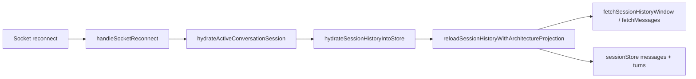
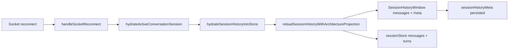
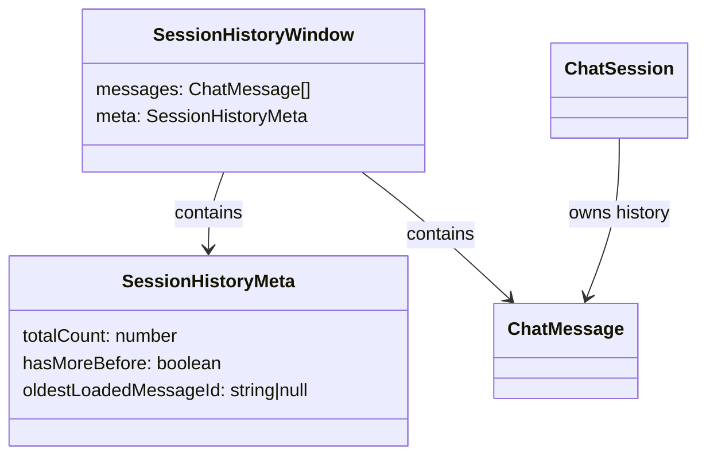

# Test gap detection: reconnect session history metadata

- [x] Review current dirty diff and prior automation memory.
- [x] Check current testing-tool docs and repo guidance.
- [x] Confirm the narrowest untested path in the changed reconnect/session-history slice.
- [x] Add a targeted reconnect regression test for `SessionHistoryWindow` metadata propagation.
- [x] Apply the minimal fix required by that test only.
- [x] Re-run the focused tests and record evidence.

## Scope

Current architecture affected by this slice:

Target architecture after this slice:

Models and relations touched by the changed code:

## Notes

- Narrowing to the reconnect/session-history path because the current diff explicitly changed `fetchMessages` from `ChatMessage[]` to `SessionHistoryFetchResult` and threaded `setSessionHistoryMeta` through reconnect handlers.
- If a better untested path appears from the parallel diff review, replace this plan instead of widening scope.
- Parallel diff review confirmed the same hotspot: reconnect/hydration and child-preview paths changed to carry bounded history metadata, while older tests mostly pinned message/turn reconstruction only.
- Implemented coverage in `useChatSocketEvents.reconnect.test.ts` proving reconnect persists `SessionHistoryMeta` for both the host session and the workflow envelope child session when `fetchMessages` returns `SessionHistoryWindow`.

## Verification

- `corepack pnpm --filter kalio-web exec vitest run src/features/chat/hooks/useChatSocketEvents.reconnect.test.ts --testNamePattern "persists session history metadata when reconnect hydration uses SessionHistoryWindow results"`
- `corepack pnpm --filter kalio-web exec vitest run src/features/chat/hooks/useChatSocketEvents.reconnect.test.ts`
