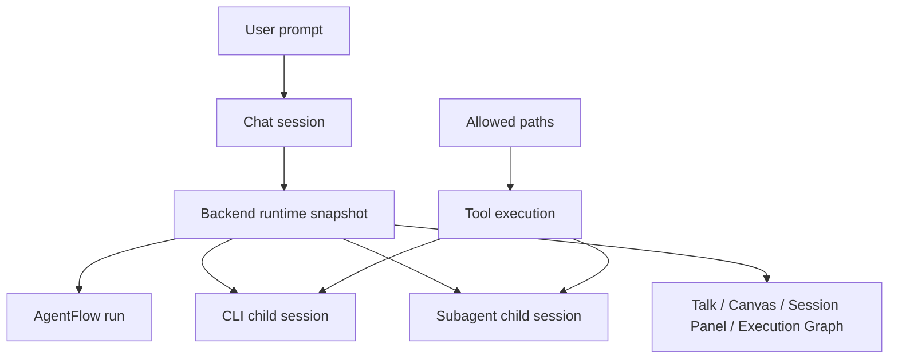
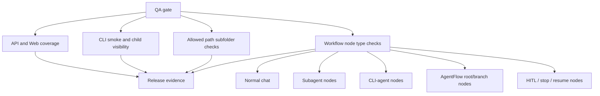
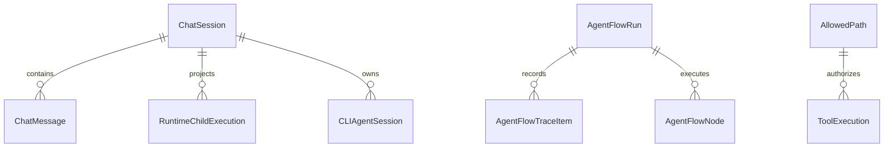

# Workflow node QA and coverage - 2026-06-23

## Goal

Verify current coverage, CLI child execution, allowed-path inheritance for subfolders, and workflow behavior across node types before demo release.

## Current Architecture

## Target QA Architecture

## Affected Models

## Checklist

- [x] Measure API coverage.
- [x] Measure Web coverage.
- [x] Verify CLI command resolution and CLI child tests.
- [x] Verify allowed-path inheritance for subfolders.
- [x] Verify workflow behavior across normal chat, subagent, CLI-agent, AgentFlow, stop/resume/HITL, reload/reconnect.
- [x] Record gaps and release risk.

## Evidence

- API coverage: statements 87.62%, branches 81.29%, functions 89.38%, lines 87.62%.
- Web coverage: statements 84.04%, branches 76.78%, functions 84.34%, lines 85.40%.
- `corepack pnpm --filter kalio-api run test:cov`: passed.
- `corepack pnpm --filter kalio-web run test:cov`: passed.
- `corepack pnpm --filter kalio-api exec vitest run src/modules/allowed-paths/allowed-paths.service.spec.ts src/modules/tool/tools/run-cli-agent.tool.spec.ts src/modules/tool/tools/cli-agent-session.tools.spec.ts src/modules/cli-agent/adapters/codex.adapter.spec.ts src/modules/cli-agent/cli-agent.service.spec.ts src/modules/cli-agent/cli-agent-pty.service.spec.ts --reporter=dot`: 6 files, 84 tests passed.
- `corepack pnpm --filter kalio-web exec vitest run src/features/chat/graph/ExecutionGraphView.test.tsx src/features/chat/hooks/useChatSocketEvents.reconnect.test.ts src/features/sessions/SessionPanel.test.tsx src/features/sessions/conversationTreeModel.test.ts src/features/chat/ChatInterface.Parts.test.tsx --reporter=dot`: 5 files, 112 tests passed.
- `corepack pnpm --filter @kalio/e2e run test:e2e -- tests/agentflow-goal-guard.spec.ts tests/regression-cli-child-canvas-preview.spec.ts tests/architecture-follow-up-stability.spec.ts tests/regression-session-history-window.spec.ts`: 16 tests passed.
- `corepack pnpm release:workflow-gate -- --require-live`: passed on fixed QA stack `3316/5288` with provider `xiaomimimo`, model `mimo-v2.5`, source `db`.
- `corepack pnpm --filter @kalio/types exec vitest run src/__tests__/contracts.test.ts --reporter=dot`: 13 tests passed.
- Direct Codex CLI smoke: `codex-cli 0.130.0`, `KALIO_CLI_SMOKE_OK`.

## Findings

- CLI runtime path is operational when called through `C:\Users\Radomiej\AppData\Roaming\npm\codex.cmd`; direct `codex` remains unsafe on Windows because it can hit the WindowsApps alias.
- Allowed-path behavior covers normal children, Windows casing, outside-root rejection, symlink escape rejection, missing write target parent resolution, CLI workdir rejection, and AgentFlow projectPath inheritance into subfolder scope markers.
- Workflow node coverage exercised normal chat, council/subagent branch nodes, router/finalizer sessions, CLI-agent child nodes, AgentFlow root/branch nodes, stop/HITL, resume, reload, and reconnect.
- Test output still has noisy FE stderr from mocks that return incomplete history/session payloads and React `act(...)` warnings. The tests pass, but this should be cleaned because noisy expected errors make real regressions easier to miss.
- Direct Codex CLI startup/shutdown logs expose unrelated local environment issues: invalid local skill frontmatter, MCP OAuth refresh failures, and a missing `thread_goals` table warning. The smoke still completed, and the QA stack remained healthy afterward.

