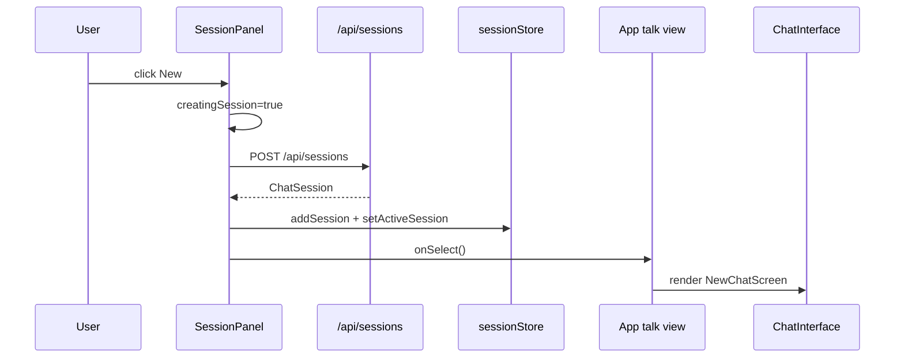
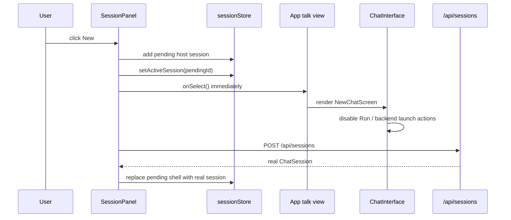
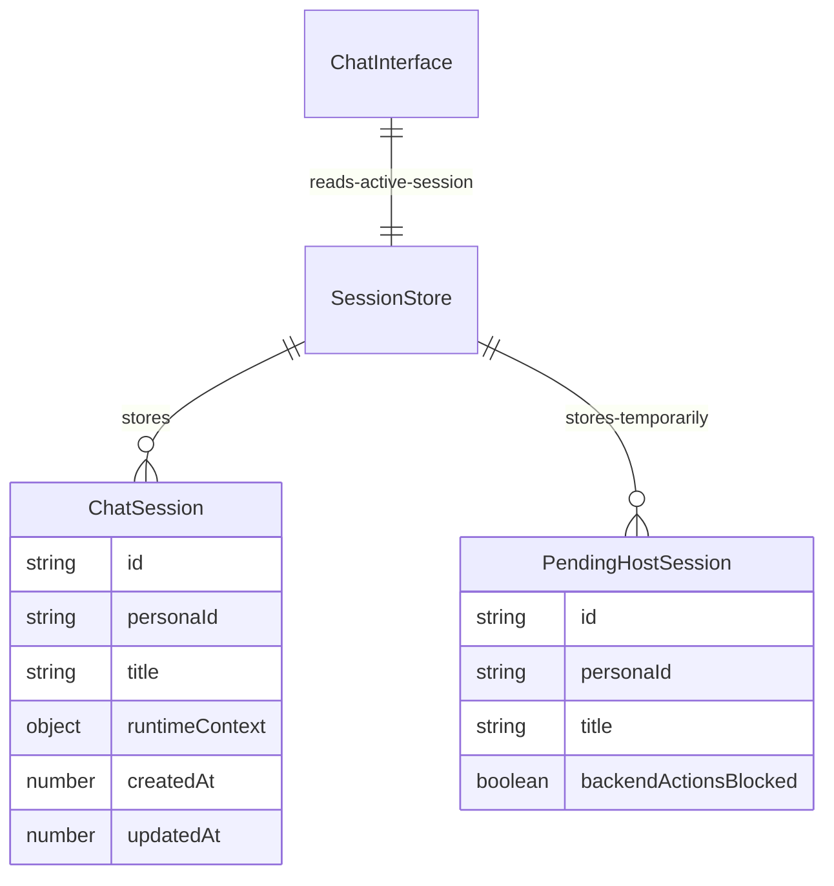

# Plan: natychmiastowy ekran `New Chat`

## Goal

Po kliknieciu `New` frontend ma natychmiast pokazac ekran `New Chat`, bez czekania na `POST /api/sessions`.
Jednoczesnie nie wolno wysylac promptu ani robic backendowych akcji na tymczasowym `sessionId`.

## User Decision

- 2026-06-24: wybrany wariant `Ekran od razu`.
- Frontend pokazuje nowy ekran natychmiast.
- `Run` i kontrolki launch screen pozostaja zablokowane do czasu otrzymania realnego backendowego `sessionId`.

## Execution Checklist

- [x] Zapisac plan wykonawczy w `docs/todos`.
- [x] Dodac fail-first regresje dla natychmiastowego wejscia na ekran `New Chat`.
- [x] Dodac pending host-session helper i odfiltrowanie backend-only side effects dla pending IDs.
- [x] Przepiac `SessionPanel` na optimistic shell z blokada launch actions do czasu odpowiedzi backendu.
- [x] Zweryfikowac focused FE tests i typecheck.
- [x] Dodac notatki z ryzyk i finalnej weryfikacji.

## Current Architecture

## Target Architecture

## Affected Models

## Progress Notes

- 2026-06-24: root cause potwierdzony. `SessionPanel.createSession()` czeka na `createAndActivateEmptyHostSession()`, a ta czeka na backend zanim ustawi aktywna sesje.
- 2026-06-24: odrzucono pelny optimistic temp-id reconciliation. Za duze ryzyko dla `sessionStorage`, watchlist i map kluczowanych po `sessionId`.
- 2026-06-24: przyjety wariant to optimistic shell + disabled launch controls do czasu realnej sesji.
- 2026-06-24: dodano `pendingHostSession` oraz helper `startPendingSessionFromPanel()`, ktory natychmiast dodaje lokalny shell sesji, przelacza aktywna sesje i dopiero potem czeka na backend.
- 2026-06-24: backend-only side effects dla pending IDs zostaly odfiltrowane w `activeConversationSession`, `useContextPreview` i `sessionWatchRegistry`.
- 2026-06-24: merge sesji przy bootstrap/reconnect zostal zawężony do zachowania tylko lokalnych pending host sessions; zwykle payloady backendowe zostaja bez zmian.
- 2026-06-24: manualny smoke test ujawnil drugi bug - `useChatSessionActivation` nadal ladowal historie dla `pending-host-session:*`, a `ConversationFilesBar` odpalal `/vfs` po samym mount. Dodano guardy, zeby pending host session nie wykonywala backendowych akcji pomocniczych.

## Final Verification

- Focused FE tests:
  `corepack pnpm --filter kalio-web test -- src/features/sessions/SessionPanel.test.tsx src/features/chat/ChatInterface.Parts.test.tsx src/features/chat/hooks/useContextPreview.test.ts src/features/chat/hooks/useChatSessionActivation.test.ts src/services/sessionWatchRegistry.test.ts src/features/chat/activeConversationSession.test.ts --reporter=dot`
  -> `6 passed`, `110 passed`
- Typecheck:
  `corepack pnpm --filter kalio-web run typecheck`
  -> passed
- Build:
  `corepack pnpm --filter kalio-web run build`
  -> passed
- Manual QA:
  fixed QA stack `http://localhost:5288` + Playwright Orchestrator
  -> po kliknieciu `New` od razu renderuje sie `New Chat` screen i nie ma juz bledow konsoli / 404 dla `pending-host-session:*`

## Risks / Follow-up

- Managed QA na losowych portach (`stack-manager.mjs start --backend-port 0 --frontend-port 0`) ujawnil osobny problem srodowiskowy: bundle probowal trafic w `localhost:3016`, co powoduje CORS. To nie jest regresja tej poprawki, ale blokuje wiarygodne manualne QA na tym trybie bez osobnego fixu.
- Build nadal raportuje istniejace ostrzezenie Vite o duzym JS chunku; to nie jest regresja tej zmiany.
