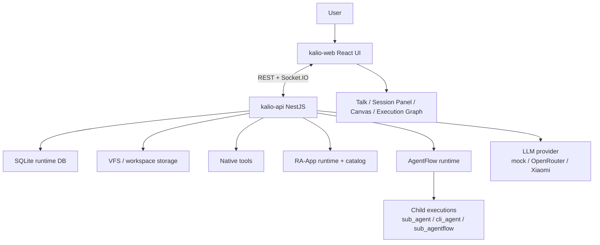
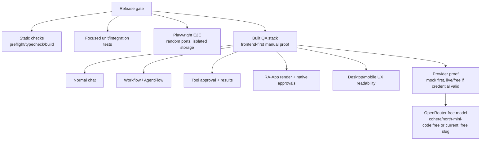
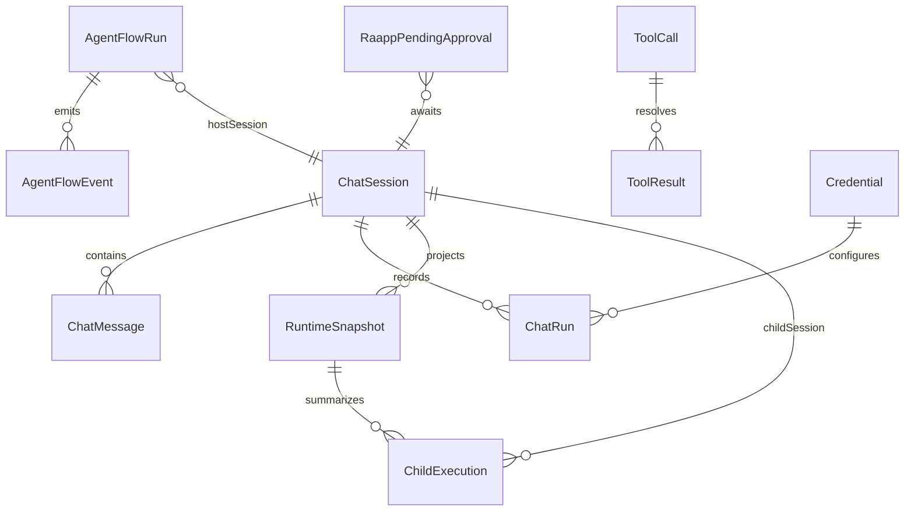

# Public Release QA Audit

Goal: verify Kalio release readiness across automated tests, architecture, QA stack, live/free-provider readiness, normal chat, workflow/AgentFlow, tools, RA-App, and UX clarity.

Assumptions:
- Use fixed QA or managed QA built stack for manual/browser proof.
- Treat `/api/llm/config` as authoritative for effective provider state.
- Do not print secrets. Live OpenRouter checks may only proceed if a usable key is available in env or ignored local files.
- Browser proof must start from Kalio FE, with API checks used as supporting evidence.

## Current Architecture Affected

## Target Release-Proof Architecture

## Runtime Models And Relations

## Acceptance Criteria

- [ ] Repo context and relevant skills loaded.
- [ ] Subagents produce independent architecture, tests, and UX/readiness findings.
- [ ] Test scripts and release gates are identified and at least the strongest practical local gates are run.
- [ ] Architecture is checked against runtime guardrails and structural searches.
- [ ] QA stack starts with known effective provider; provider drift is checked through `/api/llm/config`.
- [ ] OpenRouter/free-model live path is probed only if valid local credential is available.
- [ ] Browser/Playwright Orchestrator verifies app load, console health, normal chat, workflow/AgentFlow surface, tools/RA-App surface where reachable, and UX readability.
- [ ] Findings are documented with exact commands, evidence, blockers, and release recommendation.
- [ ] If architecture/runtime changes are made, a `docs/sessions/2026-06-24-*.md` note is added.

## Work Plan

1. [x] Activate Serena, read Serena manual, load AGENTS.md and QA/test/runtime skills.
2. [x] Confirm current OpenRouter/free-model guidance with native web and MCP web search.
3. [x] Dispatch subagents for architecture, test quality, and UX/manual QA exploration.
4. [ ] Inspect scripts, existing release notes, current QA docs, and risky runtime/RA-App files.
5. [ ] Run local/static gates: preflight, test gate or focused tests, typecheck/build as time allows.
6. [ ] Start/reuse QA stack through MCP/dev-server path where possible; verify health and provider state.
7. [ ] Use Playwright Orchestrator for FE-first manual QA: load, chat, workflow, tools, RA-App, UX screenshots.
8. [ ] Probe live/free provider readiness if credentials allow; otherwise record credential blocker.
9. [ ] Review subagent reports and local evidence; classify blockers vs risks.
10. [ ] Update this plan with results and write a session/release-readiness note if needed.

## Notes

- 2026-06-24: `OPENROUTER_API_KEY` is unset in current process; `.env.test` exists and must be probed through repo scripts without printing secrets.
- 2026-06-24: Prior docs mention `cohere/north-mini-code:free` as the verified OpenRouter release default; Nemotron Ultra has historical timeout risk.
- 2026-06-24: UX subagent found the current `release:workflow-gate` covers core workflow/chat/reconnect/stop/HITL, but not the broader public-release shell. Manual/browser QA must also cover Landing, Quick Chat, RA-App tiles, HITL inbox, Settings, Tools/MCP/RAApp manager, Mind, Observability, and mobile readability.
- 2026-06-24: Test subagent found `pnpm test` is not a browser release gate and `release:workflow-gate` assumes a fresh fixed QA stack; public release requires `pnpm test:e2e` plus broader RAApp/tools/live-tool specs or equivalent browser proof.
