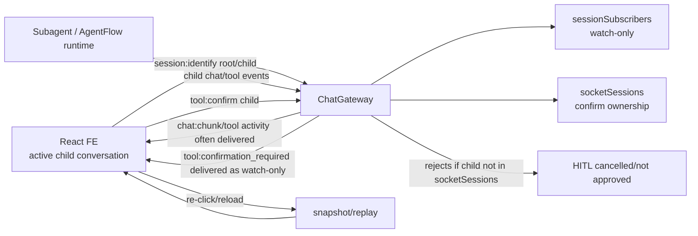
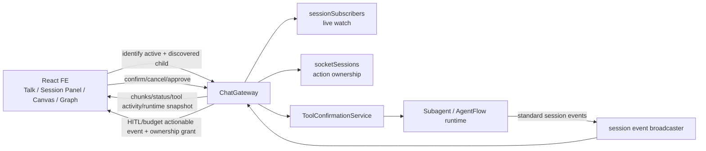
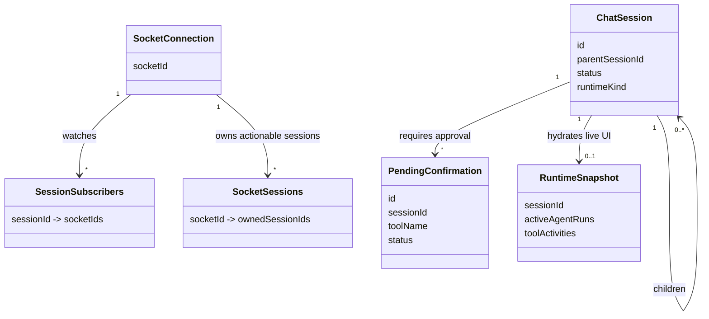

# Subconversation Live Events + HITL

Date: 2026-06-24

## Goal

Fix live updates for child/sub-agent conversations so selecting a child session streams new agent/tool events without re-clicking or relying on snapshot reloads. Fix the same path for HITL confirmations so pending tool approvals appear live and can be approved/cancelled immediately. Verify sub-agent auto-approval still works only for allowed tools.

## Acceptance Checklist

- [x] Backend child `tool:confirmation_required` grants only the initiating socket enough action ownership to confirm/cancel that child request immediately.
- [x] Backend child budget approval events follow the same actionable-event ownership rule if they use the same guard.
- [x] Ordinary child stream events still do not grant confirmation rights.
- [x] Frontend identifies active child sessions before/while hydrating history.
- [x] Frontend keeps discovered child sessions watched/sticky on live lifecycle updates.
- [x] Child HITL events update pending confirmations, tool activity, HITL inbox count, and tree waiting state without a re-click.
- [x] Auto-approved sub-agent tools proceed without creating a manual pending confirmation.
- [x] Focused backend tests pass.
- [x] Focused frontend tests pass.
- [x] Affected typecheck/build gates are run or explicitly documented as not run.
- [x] Dedicated browser E2E covers live child manual HITL and isolated child auto-approval.

## Current Architecture

## Target Architecture

## Affected Models

## Execution Notes

- 2026-06-24: User extended scope to include missing HITL notification and auto-approval verification for sub-agents.
- 2026-06-24: Official references checked: Socket.IO rooms, Socket.IO React guide, React `useEffect`.
- 2026-06-24: Existing worktree has unrelated/user changes; do not revert them.
- 2026-06-24: RED confirmed: backend child confirm/cancel/budget tests failed because live child events did not grant action ownership; frontend active-session identify and `session:updated` child watch tests failed.
- 2026-06-24: GREEN confirmed: focused backend tests passed 71/71 and focused frontend tests passed 32/32 after the gateway and watchlist fixes.
- 2026-06-24: Typecheck/build confirmed: `kalio-api` typecheck/build passed; `kalio-web` typecheck/build passed. Browser E2E `tests/hitl-tool-confirmation-runtime.spec.ts` passed 1/1 on isolated built Playwright stack.
- 2026-06-24: Added deterministic child-subconversation browser E2E with two cases: shared child manual HITL for live approve flow, and isolated child built-in `vfs_write` auto-approval without manual inbox noise.
