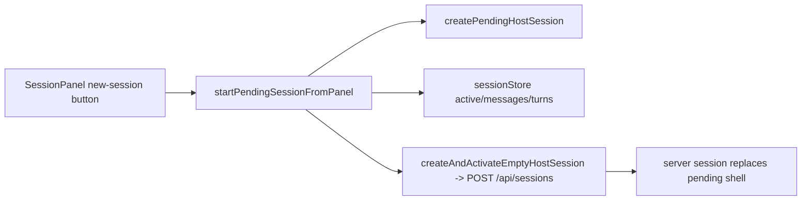
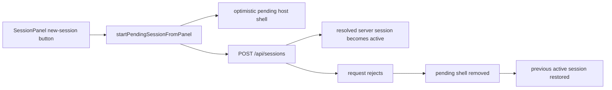
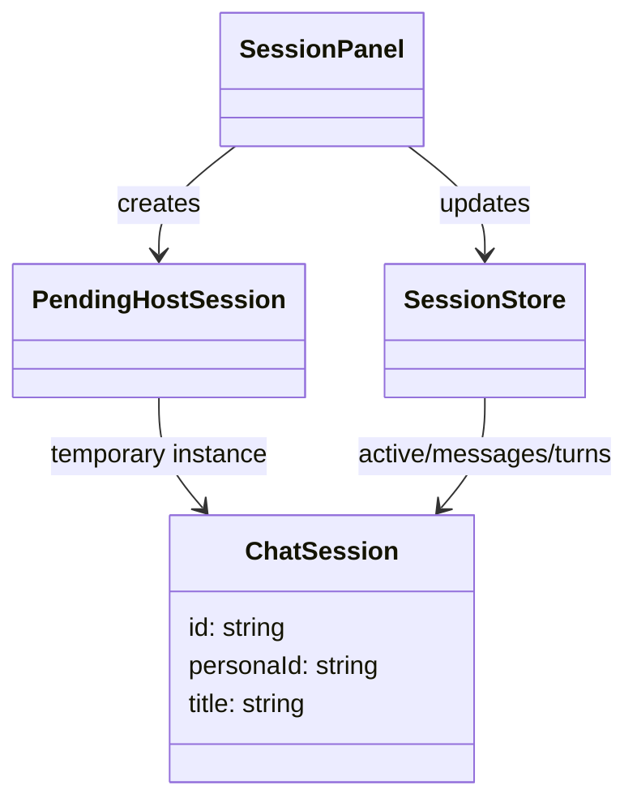

# Test gap detection: pending host-session rollback

- [x] Review automation memory, current diff, and repo test patterns.
- [x] Check current official testing guidance for Vitest and Playwright.
- [x] Narrow scope to a single changed path with missing regression coverage.
- [x] Add focused regression tests for pending host-session rollback and local pending-session merge preservation.
- [x] Run the smallest relevant frontend test target and confirm the new cases pass.
- [x] Record verification evidence and residual risk.

## Scope

Current architecture affected by this slice:

Target architecture after this slice:

Models and relations touched by the changed code:

## Notes

- Narrowed to `apps/kalio-web/src/features/sessions/sessionPanelCreateSession.ts` and `SessionPanel.tsx`.
- The current diff adds optimistic pending-host creation and tests the success path, but not the rejection path that should roll back UI state.
- Kept the main slice in frontend regression coverage and added one backend guard regression for the new `run_subagent` repeat-prevention branch because that logic changed in the same working diff and had no follow-up test.

## Verification

- `corepack pnpm --filter kalio-web exec vitest run src/features/sessions/SessionPanel.test.tsx --testNamePattern "restores the previous active session when pending New Chat creation fails"`
- `corepack pnpm --filter kalio-web exec vitest run src/features/sessions/SessionPanel.test.tsx`
- `corepack pnpm --filter kalio-web exec vitest run src/features/sessions/mergeSessionsPreservingLocal.test.ts src/features/sessions/SessionPanel.test.tsx`
- `corepack pnpm --filter kalio-api exec vitest run src/modules/llm/providers/mock.provider.spec.ts --testNamePattern "stops repeating deterministic run_subagent after the child HITL tool result exists"`
- `corepack pnpm --filter kalio-api exec vitest run src/modules/llm/providers/mock.provider.spec.ts`

## Residual risk

- `apps/kalio-api/src/modules/chat/chat.gateway.event-routing.ts` still has no direct unit test for the actionable-event table or malformed payloads; current coverage is indirect through gateway tests.
