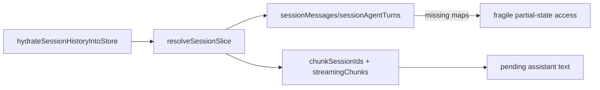
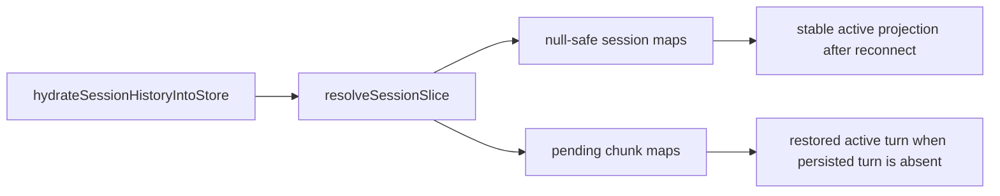
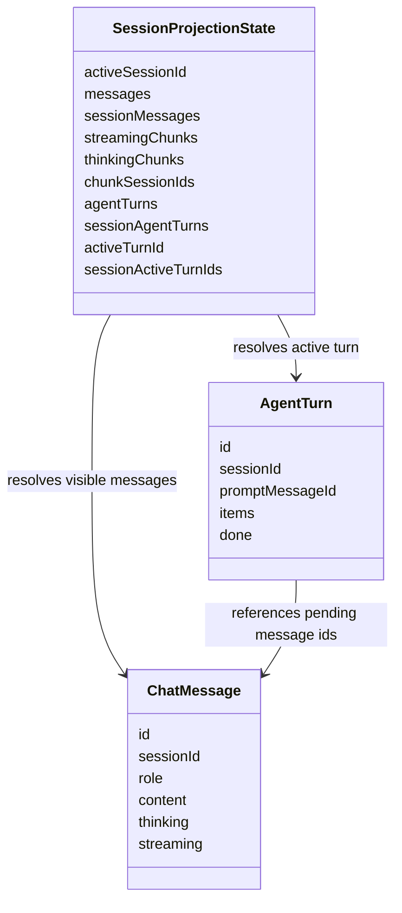

# 2026-06-25 Test Gap Detection: session projection helpers

- [x] Zawęzić zakres do świeżo zmienionego reconnect/session-projection slice.
  - Zakres: `apps/kalio-web/src/store/sessionStore.helpers.ts`
  - Powód: ostatni commit utwardził helpery pod częściowy stan runtime/testowy, ale ten fallback nie ma jeszcze testów bezpośrednich.
- [x] Dodać małe testy regresyjne dla null-safe fallbacków i odbudowy pending turna.
  - Cel: `resolveSessionSlice()` ma zwracać stabilny wynik nawet przy brakujących mapach store oraz ma odtwarzać aktywny turn z pending chunków.
- [x] Uruchomić skupioną weryfikację helpera oraz najbliższych reconnect/hydration suite.
  - Plan:
    - `corepack pnpm --filter kalio-web exec vitest run src/store/sessionStore.helpers.test.ts`
    - `corepack pnpm --filter kalio-web exec vitest run src/features/chat/historyHydration.test.ts src/features/chat/hooks/useChatSocketEvents.reconnect.test.ts`

## Acceptance

- `resolveSessionSlice()` nie rzuca wyjątkiem, gdy `sessionMessages`, `sessionAgentTurns`, `sessionActiveTurnIds`, `streamingChunks`, `thinkingChunks` lub `chunkSessionIds` są puste albo nieobecne w częściowym stanie.
- Jeśli dla sesji istnieją pending chunki, ale brak zapisanych `agentTurns`, helper odbudowuje tymczasowy aktywny turn z poprawnym `promptMessageId`.
- Zakres pozostaje lokalny dla helpera projekcji i jego bezpośrednich regresji reconnect/hydration.

## Current Architecture

## Target Architecture

## Models Affected

## Notes

- Poprzedni przebieg automatu domknął rollback pending host-session; ten przebieg nie duplikuje tamtych testów.
- Najmniejszy sensowny punkt wejścia to test bezpośredni helpera, bo obecne suite przykrywają ten kod tylko pośrednio.

## Verification

- `corepack pnpm --filter kalio-web exec vitest run src/store/sessionStore.helpers.test.ts`
- `corepack pnpm --filter kalio-web exec vitest run src/features/chat/historyHydration.test.ts src/features/chat/hooks/useChatSocketEvents.reconnect.test.ts`

## Residual risk

- Backendowy `chat.gateway.event-routing` nadal wygląda na słabiej pokryty bezpośrednimi testami, ale ten przebieg celowo nie rozszerza zakresu poza frontendowy reconnect/session-projection slice.
