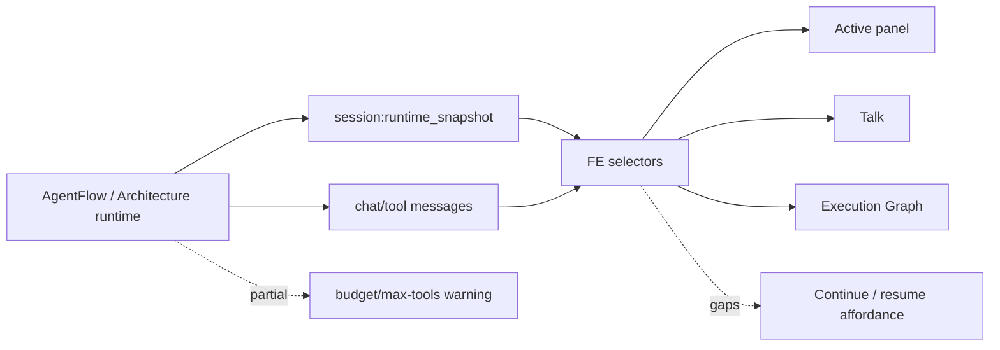
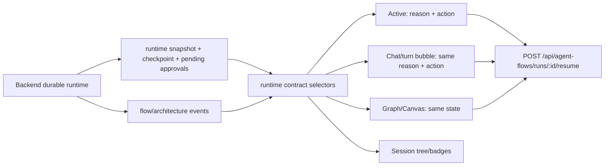
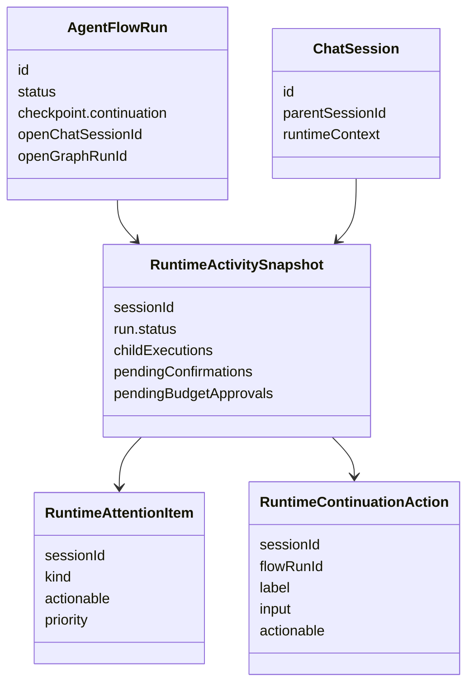

# AAA AgentFlow Runtime Contract

## Summary

Goal: make architecture/runtime state contract-grade across waiting, HITL, budget, timeout, stop, resume, and child-flow projections. Backend remains durable truth; frontend renders rebuildable projections after F5/reconnect.

## Current Architecture

## Target Architecture

## Affected Model Relations

## Acceptance Checklist

- [x] RED backend tests added for runtime snapshot ids, budget precedence, and gateway ownership.
- [x] RED frontend tests added for continuation/action projection.
- [x] FE-internal `RuntimeContinuationAction` selector implemented without changing `@kalio/types`.
- [x] Generic FE AgentFlow resume API wrapper added around existing `/api/agent-flows/runs/:id/resume`.
- [x] `ConversationManagerPanel` renders the same waiting/resume contract as chat/canvas/graph.
- [x] Chat AgentFlow turn/result surface renders waiting reason and resume action.
- [x] Canvas and Execution Graph consume the same continuation state.
- [x] Backend runtime snapshots keep waiting AgentFlow child ids stable after reconstruction.
- [x] Budget/HITL precedence remains explicit; plain runtime error does not become fake HITL.
- [ ] Stop/follow-up drain contract was not expanded in this slice; existing behavior was not changed.
- [x] Focused unit tests pass.
- [x] Affected typecheck/build pass.
- [x] Deterministic browser proof covers reload/waiting across Talk and Canvas.
- [x] Runtime attention survives F5 for recent child/runtime sessions because bootstrap now preloads non-active runtime history correctly.
- [ ] Dedicated E2E coverage for budget-before-timeout and stop/follow-up remains follow-up work.

## TDD Notes

- No production code changes before RED tests.
- Each production behavior change needs at least one focused regression test.
- E2E can use test-support seeding if real LLM/CLI would make the scenario non-deterministic.

## Execution Notes

- 2026-06-26: implementation started from the existing runtime-attention slice without reverting uncommitted changes.
- 2026-06-26: official direction checked against current LangGraph runtime patterns: durable checkpoint, HITL interrupt/resume, and typed streaming projections.
- 2026-06-26: added `RuntimeContinuationAction` selector and a neutral AgentFlow resume API wrapper; Architect QA now calls the neutral wrapper instead of owning the generic path.
- 2026-06-26: wired the same waiting/resume action into Active, chat turn/result bubbles, Canvas, and Execution Graph inspector. Graph model file was left out of the new behavior because it is already above the repo 500 LOC limit.
- 2026-06-26: hardened backend runtime snapshot projection for reconstructed waiting AgentFlow children and added budget/HITL ownership regressions.
- 2026-06-26: focused unit/integration tests, typecheck, build, and the deterministic AgentFlow Goal Guard E2E passed. E2E startup still logs the existing pnpm no-TTY install warning before continuing with the local stack.
- 2026-06-26: follow-up QA exposed a reconnect gap: background runtime-history preload passed `getActiveSessionId`, so hydration aborted for every non-active child session after F5.
- 2026-06-26: fixed the reload gap by removing the active-session guard from background preload, adding recent agent-started sessions to the bootstrap preload set, and keeping timeout/budget attention visible for recent runtime children without fake HITL.
- 2026-06-26: focused FE vitest and `apps/e2e/tests/regression-runtime-attention-panel.spec.ts` now pass on the managed built QA stack.
