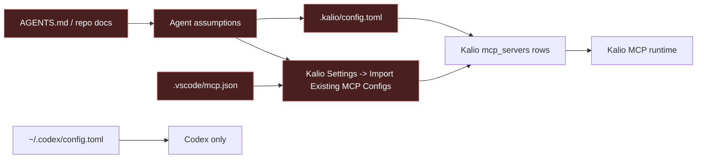
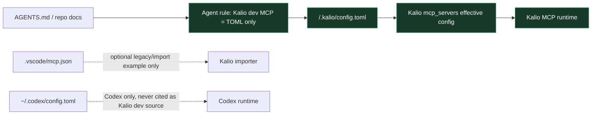
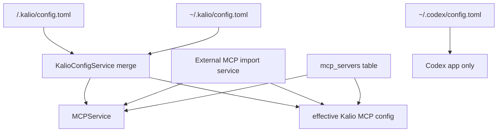

# Kalio Dev MCP Source Of Truth

## Summary

- Goal: remove repo guidance that mixed Kalio dev MCP setup with Codex MCP setup.
- Decision: for Kalio-Forever dev, MCP source of truth is TOML only: `<repo>/.kalio/config.toml` or `~/.kalio/config.toml`.
- Scope completed: `AGENTS.md`, durable MCP docs, repo copy of the manual QA skill, and the canonical TOML example.

## Checklist

- [x] Add a repo todo note that records the documentation correction.
- [x] Update `AGENTS.md` to state that Kalio dev MCP uses `.kalio/config.toml` as source of truth.
- [x] Add an explicit rule that agents must not diagnose Kalio MCP from `~/.codex/config.toml`.
- [x] Update `docs/kalio-toml-config.md` to make TOML the canonical local-dev path and UI import legacy/manual only.
- [x] Update `docs/agent-skills/kalio-manual-qa.md` to point QA setup at `.kalio/config.toml` first.
- [x] Confirm `docs/examples/kalio-agent-qa-mcp.config.toml` is described as the canonical dev example.
- [x] Update other durable repo docs that still described UI import as preferred dev flow.

## Current Architecture

## Target Architecture

## Config Model Relations

## Notes

- User clarification during planning: Kalio dev MCP should be `TOML only`.
- `.vscode/mcp.json` remains in repo as a legacy/manual import example and importer-debug surface, not as the preferred development workflow.
- Historical session notes that mention import-based proof were left untouched as evidence, not as current process documentation.
