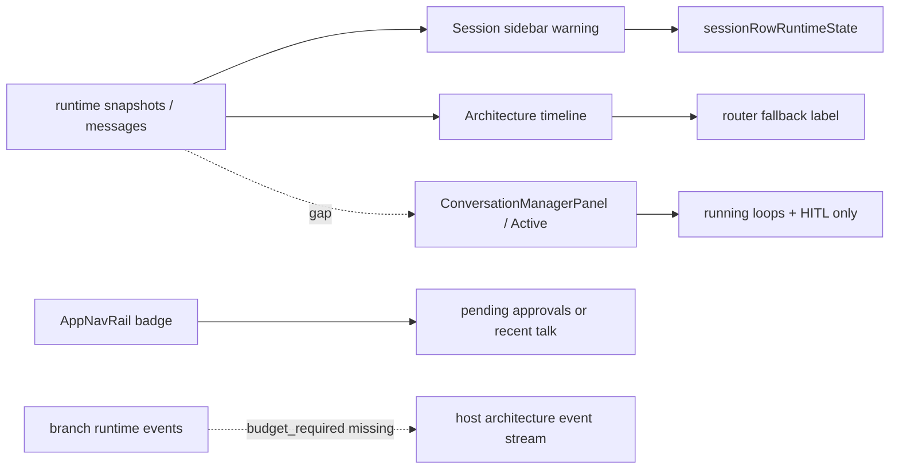
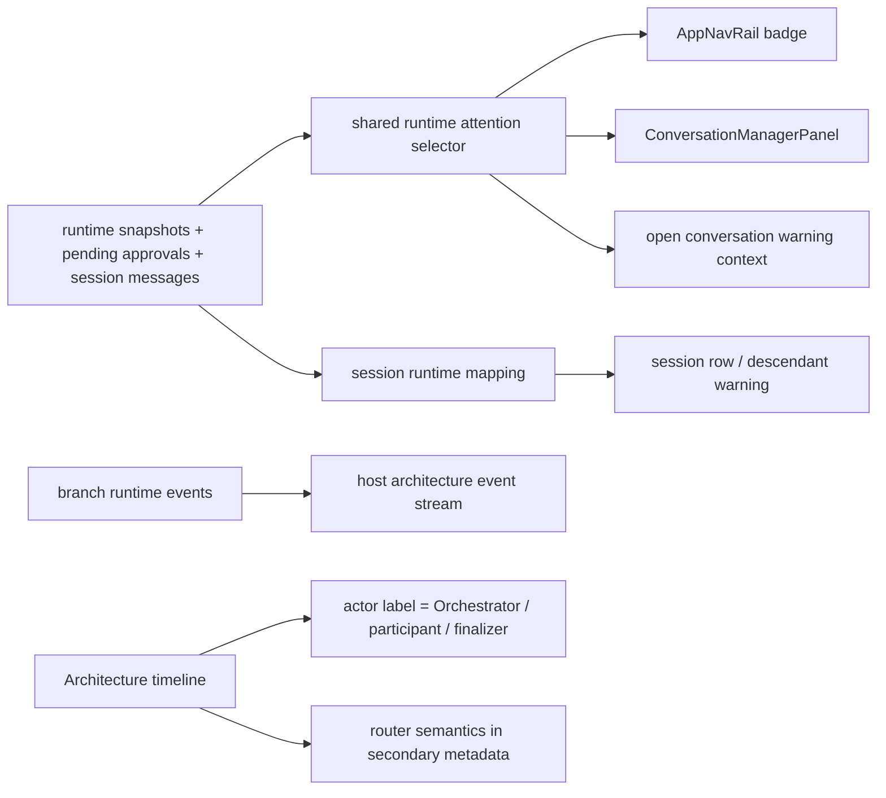
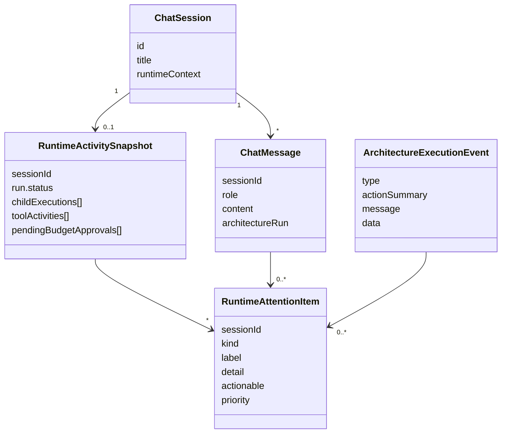

# Runtime Warning, Active Panel, and Orchestrator Label Alignment

## Summary

This slice fixed three connected runtime projection problems in the chat UI:

- a `waiting` warning in the sidebar/timeline could exist without any concrete item in `Active` or the open chat,
- `waiting_on_orchestrator` looked like HITL even when there was no real confirmation or budget approval,
- architecture timeline cards could fall back to the technical `Router` label even when the session already carried the user-facing `Orchestrator` label.

During verification, one more root cause showed up:

- branch `agent:budget_required` events were not projected into host architecture events, so `max tools` / tool-budget exhaustion could stay invisible until a later timeout.

## Current Architecture



## Target Architecture



## Affected Models



## Diagnosis

- `ConversationManagerPanel` rendered HITL, loops, tool rows, and LLM rows, but had no shared model for runtime waiting/timeout/error.
- `AppNavRail` counted approvals separately from general runtime warnings, so the badge and panel could disagree.
- FE runtime helpers did not consistently treat `waiting_on_orchestrator` as live/waiting.
- `ArchitectureRunTimeline` could keep the technical router label on degraded steps even when run sessions already exposed `displayLabel` / `roleLabel`.
- Host architecture projection ignored branch `agent:budget_required`, so tool-budget exhaustion could stay hidden until a later timeout.

## User Evidence

- `codex-clipboard-9d0812f3-ccb4-486b-94ce-4d767adea7b6.png`
- `codex-clipboard-c320d3b3-73ed-4e00-b36b-bd091483300d.png`

## Acceptance Checklist

- [x] FE has a shared runtime attention selector with `hitl | budget | runtime_waiting | runtime_timeout | runtime_error`.
- [x] `waiting_on_orchestrator` is treated as live/waiting in hydration/live-state helpers.
- [x] `ConversationManagerPanel` shows runtime waiting/timeout/error, not only HITL and tool rows.
- [x] Sidebar warning no longer leads to an empty `Active` panel.
- [x] `AppNavRail` badge counts unified attention items; recent talk is only fallback context.
- [x] `ArchitectureRunTimeline` shows `Orchestrator` for the orchestrator slot and keeps router semantics in secondary metadata.
- [x] Timeout and `tool budget ended` / `maxToolAttempts` are distinguished from HITL.
- [x] Branch `agent:budget_required` is projected into host architecture events before timeout fallback.
- [x] Regression tests cover selector, panel, waiting mapping, timeline labels, and branch budget projection.
- [x] `kalio-web` typecheck and build pass.
- [x] `kalio-api` typecheck and build pass.
- [x] Browser proof confirms the runtime-attention panel is populated and the host timeline shows `Orchestrator`.

## Verification Commands

```powershell
corepack pnpm --filter kalio-web exec vitest run src/features/chat/ArchitectureRunTimeline.test.tsx src/features/chat/AgentTurnBubble.test.tsx src/store/agentRuntimeSelectors.test.ts src/features/sessions/ConversationManagerPanel.test.tsx
corepack pnpm --filter kalio-web run typecheck
corepack pnpm --filter kalio-web run build
corepack pnpm --filter kalio-api exec vitest run src/modules/architecture/architecture-graph-runtime.max-visits.spec.ts
corepack pnpm --filter kalio-api run typecheck
corepack pnpm --filter kalio-api run build
cd apps/e2e
$env:KALIO_PLAYWRIGHT_EXTERNAL_SERVER='1'
$env:PLAYWRIGHT_BASE_URL='http://127.0.0.1:5188'
$env:PLAYWRIGHT_API_ORIGIN='http://127.0.0.1:3016'
$env:TEST_API_URL='http://127.0.0.1:3016/api'
$env:KALIO_PLAYWRIGHT_BROWSER_CHANNEL='chrome'
npm.cmd exec playwright test tests/regression-runtime-attention-panel.spec.ts --project=chromium
```

## Execution Notes

- 2026-06-26: verified that the affected `Architecture Debate: Orchestrator` child had `displayLabel = Orchestrator` and no `pendingConfirmations`; the visible issue was runtime waiting/timeout projection, not HITL.
- 2026-06-26: FE now builds attention items from pending approvals, runtime snapshots, child execution state, and latest visible runtime evidence.
- 2026-06-26: timeline label resolution now prefers concrete run-session labels and only falls back to `Router` when no user-facing actor label is available.
- 2026-06-26: backend now projects branch `agent:budget_required` into a host `human_gate` event with `Waiting for budget approval.`
- 2026-06-26: this means `max tools` is surfaced as soon as the branch emits the budget request, instead of waiting for a later timeout.
- 2026-06-26: the existing continue path stays the same:
  - real `pendingBudgetApprovals` remain actionable through the normal budget approval flow,
  - informational runtime waiting/timeout items stay non-actionable and open the owning session for context.
