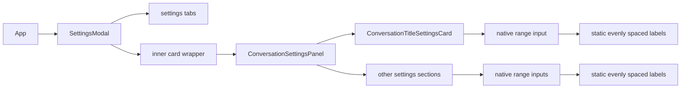
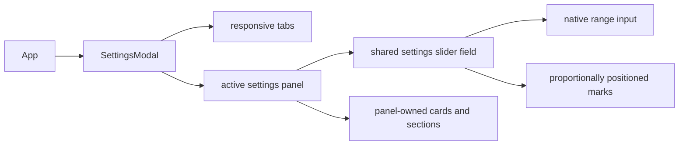
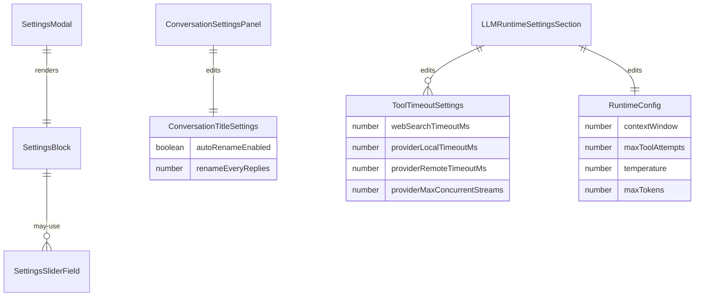

# Plan: settings slider UX and spacing fix

## Goal

Naprawic mylace skale suwakow w `Settings`, uporzadkowac nadmiarowe marginesy/paddingi w modalu i potwierdzic poprawiony render na zywej aplikacji.

## Acceptance Criteria

- [x] Suwaki z nierownymi punktami odniesienia nie pokazuja juz etykiet rozlozonych jakby byly rownoodlegle.
- [x] Ekran `Settings` ma mniej zbednego zagniezdzenia kart i lepsze spacingi na desktopie oraz sensowny uklad na mniejszych szerokosciach.
- [x] Jest test regresyjny dla pozycjonowania znacznikow skali.
- [x] Focused testy frontendowe, typecheck i build przechodza.
- [x] Manualne QA potwierdza brak rozjazdu value vs skala na poprawionych ekranach.

## Execution Checklist

- [x] Zidentyfikowac wszystkie suwaki i wspolny wzorzec blednego oznaczania skali.
- [x] Dodac wspolny komponent/utility do renderowania suwaka i proporcjonalnych znacznikow.
- [x] Przepiac settingsowe suwaki na wspolny wzorzec.
- [x] Ograniczyc zbedne wrappery i poprawic spacing/layout `SettingsModal`.
- [x] Dodac/regresyjnie zaktualizowac testy.
- [x] Zweryfikowac testy, typecheck, build i manualne UI QA.
- [x] Dopisac notatki z wynikami i ryzykami.

## Current Architecture

## Target Architecture

## Affected Models

## Progress Notes

- 2026-06-26: root cause potwierdzony na screenie i w kodzie. Kilka suwakow renderuje tekstowe punkty odniesienia przez `flex justify-between`, co falszuje polozenie dla nierownych wartosci jak `1 / 3 / 5 / 10`.
- 2026-06-26: modal ma tez podwojny/trzykrotny wrapper (`SettingsModal` -> inner card -> panel card -> inner card), co zjada miejsce i daje zbyt duze marginesy wizualne.
- 2026-06-26: do sprawdzenia po implementacji: `ConversationTitleSettingsCard`, `LLMPanel.RuntimeSettings`, `ProviderStreamsSection`, `ModelSettingsSection`, `ToolTimeoutsSection`.
- 2026-06-26: dodano wspolny `SettingsRangeField` i helper `getSettingsRangeMarkPosition()`, a markery skali sa teraz pozycjonowane proporcjonalnie do realnego zakresu zamiast rownomiernego `justify-between`.
- 2026-06-26: poprawiono modal na uklad responsywny `mobile grid -> desktop rail`, usunieto dodatkowy wrapper-kafelek w panelu i lekko zwiekszono uzyteczny obszar tresci.

## Final Verification

- Focused tests:
  `npm.cmd exec vitest run src/features/settings/settings-range.test.ts src/features/settings/ConversationSettingsPanel.test.tsx src/features/settings/ProviderStreamsSection.test.tsx src/features/settings/ModelSettingsSection.test.tsx src/features/settings/LLMPanel.test.tsx src/features/settings/SettingsModal.test.tsx`
  -> `6 passed`, `71 passed`.
- Typecheck:
  `corepack pnpm --filter kalio-web run typecheck`
  -> passed.
- Build:
  `corepack pnpm --filter kalio-web run build`
  -> passed with the existing large chunk warning.
- Manual QA:
  isolated QA stack via `node scripts/stack-manager.mjs start --backend-port 0 --frontend-port 0`
  -> backend `60914`, frontend `60915`, health ok.
  In-browser verification confirmed:
  `conversation-title-rename-every-slider` value `3` with mark positions `1=0%`, `3=22.222%`, `5=44.444%`, `10=100%`.
  Runtime sliders also reported proportional marks, for example:
  `context-window-slider` marks `32k=2.811%`, `128k=12.45%`, `1M=100%`;
  `provider-max-streams-slider` marks `4=15.789%`, `8=36.842%`, `20=100%`;
  `max-tool-attempts-slider` marks `8=7.071%`, `25=24.242%`, `100=100%`.
  No browser console warnings/errors were reported in the checked flow.

## Risks / Follow-up

- Full `kalio-web` Vitest suite still has unrelated existing failures in `src/App.test.tsx` and `src/features/chat/ChatInterface.test.tsx`; this slice did not touch those modules and did not attempt to repair them.
- Build still reports the pre-existing large JS chunk warning.
