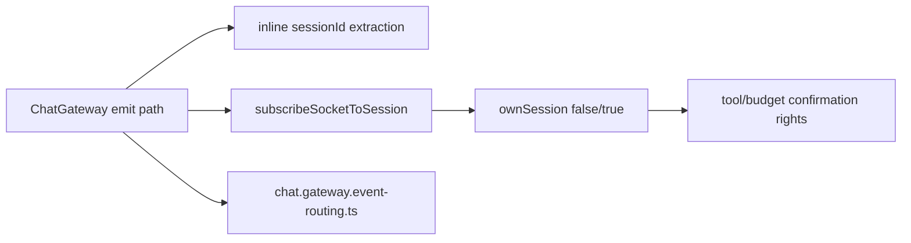
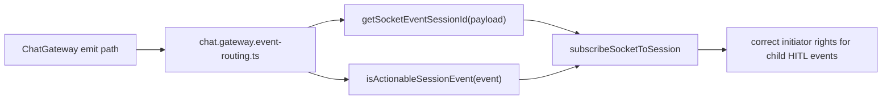
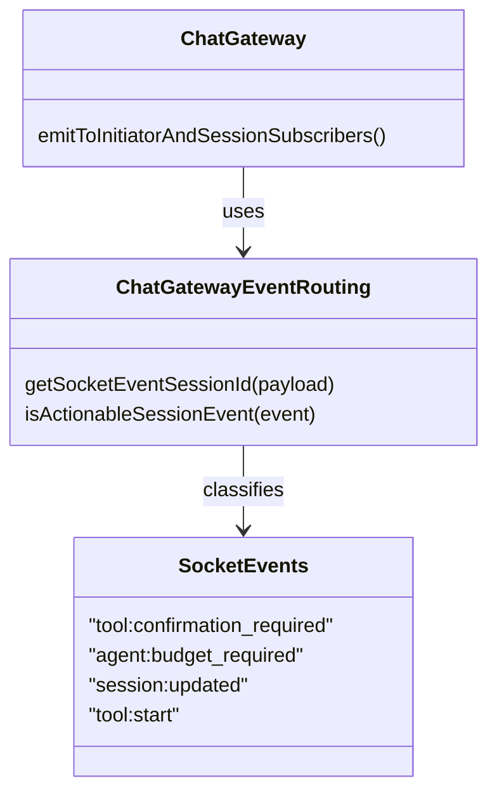

# 2026-06-26 Test Gap Detection: chat gateway event routing

- [x] Review automation memory, current diff, and existing chat gateway tests.
- [x] Narrow scope to one changed path with missing direct regression coverage.
- [x] Add a focused unit test for `chat.gateway.event-routing.ts`.
- [x] Run the focused backend Vitest target and capture evidence.
- [x] Record residual risk and next best action.

## Acceptance

- `getSocketEventSessionId()` returns the session id only for object payloads with a string `sessionId`.
- `getSocketEventSessionId()` returns `undefined` for malformed payloads used by unrelated socket events.
- `isActionableSessionEvent()` returns `true` only for immediate HITL approval events introduced in this routing split.

## Current Architecture

## Target Architecture

## Models Affected

## Notes

- Scope stays inside the newly added helper file used by [`apps/kalio-api/src/modules/chat/chat.gateway.ts`](C:/Projekty/kalio-forever/apps/kalio-api/src/modules/chat/chat.gateway.ts).
- This slice avoids broader gateway refactors and does not change production behavior unless the new focused test exposes a defect.

## Verification

- `corepack pnpm --filter kalio-api exec vitest run src/modules/chat/chat.gateway.event-routing.spec.ts`
- `corepack pnpm --filter kalio-api exec vitest run src/modules/chat/__tests__/chat.gateway.spec.ts --testNamePattern "child HITL|logs lifecycle queue recovery"`

## Residual risk

- This helper still has no browser-level or socket E2E coverage; verification here is unit + targeted gateway regression only.
