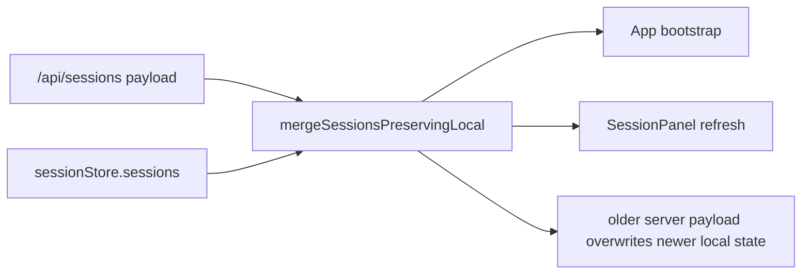
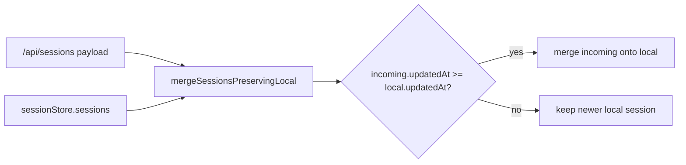
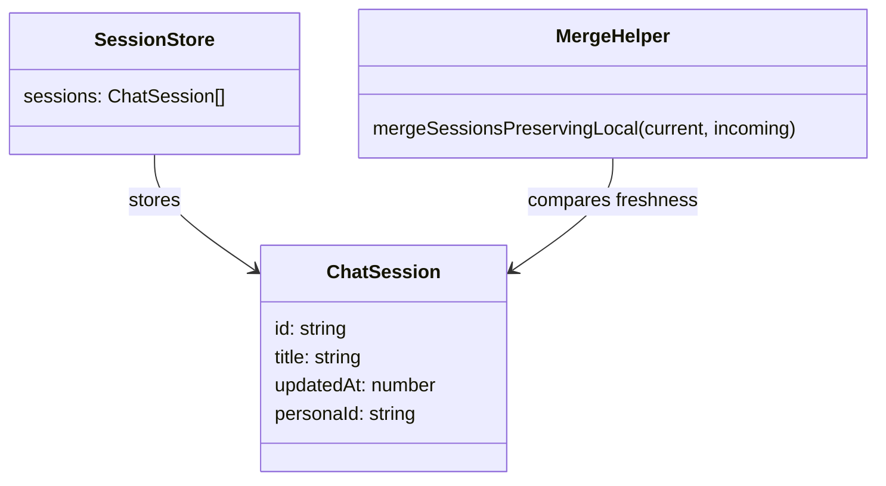

# 2026-06-26 Test Gap Detection: stale session merge

- [x] Review changed session merge extraction and its call sites.
- [x] Confirm the extracted helper dropped the old `updatedAt` freshness guard from `App.tsx`.
- [x] Add a focused regression test proving stale API payloads must not overwrite newer local session state.
- [x] Restore the minimal merge guard in `mergeSessionsPreservingLocal.ts`.
- [x] Run focused frontend verification and record evidence.

## Acceptance

- If `incoming.updatedAt` is older than the current local session, the merge keeps the newer local session fields.
- Pending local host sessions still survive when they are not present in the server response.
- Sorting and unrelated session panel behavior stay out of scope for this slice.

## Current Architecture

## Target Architecture

## Models Affected

## Notes

- The extracted helper in [`apps/kalio-web/src/features/sessions/mergeSessionsPreservingLocal.ts`](C:/Projekty/kalio-forever/apps/kalio-web/src/features/sessions/mergeSessionsPreservingLocal.ts) no longer preserves the old freshness rule that existed in [`apps/kalio-web/src/App.tsx`](C:/Projekty/kalio-forever/apps/kalio-web/src/App.tsx).
- This slice is a better fit for the automation goal than the backend helper-only check because it produces a real failing regression first.

## Verification

- Red: `corepack pnpm --filter kalio-web exec vitest run src/features/sessions/mergeSessionsPreservingLocal.test.ts`
- Green: `corepack pnpm --filter kalio-web exec -- vitest run src/features/sessions/mergeSessionsPreservingLocal.test.ts`
- Consumer check: `corepack pnpm --filter kalio-web exec -- vitest run src/features/sessions/SessionPanel.test.tsx`

## Residual risk

- [`apps/kalio-web/src/App.tsx`](C:/Projekty/kalio-forever/apps/kalio-web/src/App.tsx) uses the same helper during bootstrap, but this run verified only the helper and `SessionPanel` consumer path, not the full app bootstrap flow.
