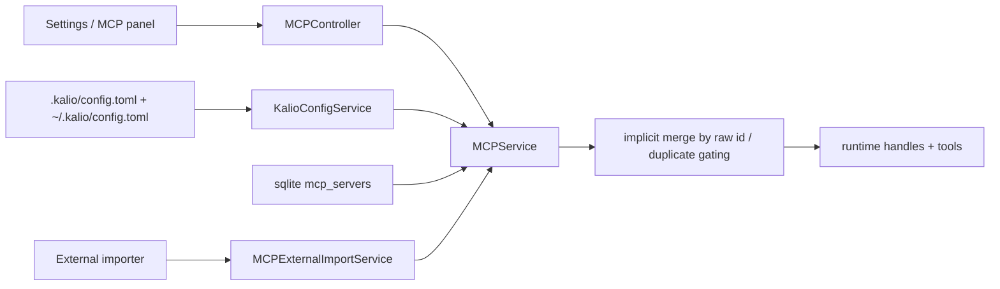
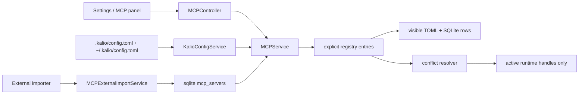
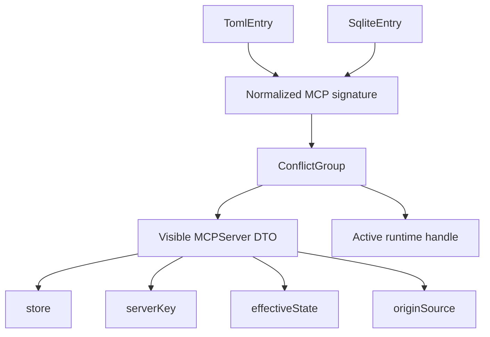

# Kalio MCP Dual-Store Runtime Rewire

## Summary

- [x] Keep `.kalio/config.toml` and SQLite `mcp_servers` as two durable MCP config stores.
- [x] Make TOML the canonical repo/dev-managed store without pretending SQLite no longer exists.
- [x] Stop implicit merge/shadow-by-raw-id behavior and expose both TOML and SQLite entries separately.
- [x] Resolve equivalent config by `visible != active`, with current winner policy `TOML > SQLite`.
- [x] Move Settings/API actions from raw `id` to `serverKey`.
- [x] Update durable repo docs to describe the dual-store model instead of a TOML-only runtime story.

## Current Architecture

## Target Architecture

## Models And Relations

## Checklist

- [x] Extend shared MCP contracts with `serverKey`, `store`, `originSource`, `effectiveState`, and `conflictGroup`.
- [x] Add SQLite provenance column `origin_source` plus migration/backfill guard.
- [x] Introduce explicit registry/signature utilities for TOML and SQLite comparison.
- [x] Rewire `MCPService.findAll()` and runtime reconciliation around registry entries instead of raw-id collapse.
- [x] Change restart/remove endpoints and clients to use `serverKey`.
- [x] Rework importer semantics from hard duplicate to informational `equivalentToExisting`.
- [x] Render TOML and SQLite rows separately in Settings and MCP panel UI.
- [x] Show store/state/origin badges and keep shadowed rows visible.
- [x] Update durable docs and AGENTS guidance to the dual-store model.

## Verification

- [x] `corepack pnpm --filter @kalio/types run build`
- [x] `corepack pnpm --filter kalio-api typecheck`
- [x] `corepack pnpm --filter kalio-web typecheck`
- [x] `corepack pnpm --filter kalio-api test -- src/modules/mcp/mcp-external-import.service.spec.ts src/modules/mcp/mcp.controller.spec.ts`
- [x] `corepack pnpm --filter kalio-web test -- src/features/settings/MCPSettingsPanel.test.tsx src/features/mcp/MCPPanel.test.tsx`
- [x] `corepack pnpm --filter kalio-api exec vitest run src/modules/mcp/mcp.service.spec.ts src/database/drizzle.service.spec.ts`

## Notes

- 2026-06-27: backend-focused service/db specs are now verified in this environment via `corepack pnpm --filter kalio-api exec vitest run src/modules/mcp/mcp.service.spec.ts src/database/drizzle.service.spec.ts`.
- 2026-06-27: dual-store policy is intentionally fixed to `TOML > SQLite`; there is no manual winner override yet.
- 2026-06-27: frontend allow-list and MCP panel now prefer canonical `serverKey` names; legacy `serverId` aliases remain only as temporary compatibility fallbacks and are marked with `TODO: legacy fallback`.
- 2026-06-27: frontend canonical MCP surfaces are verified by `corepack pnpm --filter kalio-web exec vitest run src/features/mcp/MCPPanel.test.tsx src/features/settings/MCPSettingsPanel.test.tsx src/features/persona/PersonaToolPicker.test.tsx`.
- 2026-06-27: `corepack pnpm --filter kalio-web run typecheck` and `corepack pnpm --filter kalio-web run build` both pass after the serverKey migration.
- 2026-06-27: backend allow-list helper naming now uses `serverKeyPart` internally while keeping the one-release legacy alias path intact; verified by `tool-policy.service.spec.ts` and `kalio-api` typecheck.
- 2026-06-27: Persona allow-list picker now normalizes unambiguous legacy `mcp_<serverId>_<tool>` entries to canonical `serverKey` names after MCP catalog load, so new saves drift toward the canonical format instead of preserving old names indefinitely.
- 2026-06-27: Settings row keys now derive from canonical `serverKey` and store only; raw row `id` is no longer part of the React key surface.
- 2026-06-27: MCP runtime status events now emit canonical `serverKey` in the legacy `serverId` field too, so the visible client payload no longer depends on raw row ids.
- 2026-06-27: the remaining compatibility edges are intentional and narrow: `MCPPanel` tool filtering, persona allow-list normalization, and backend allow-list alias acceptance. They stay until the one-release window closes, then the fallback removal pass can delete them together.
- 2026-06-27: Tool catalog canonicalization is now verified by focused web tests for the MCP bucket and `serverKey` badge, plus `kalio-web` typecheck/build.
- 2026-06-27: backend MCP helper naming now uses `serverKey` in canonical lookup paths; only the explicit one-release alias bridges still mention legacy `serverId`.
- 2026-06-27: targeted backend MCP runtime tests passed after the naming refactor: `tool-dispatch.service.spec.ts`, `mcp.service.spec.ts`, and `kalio-api` typecheck.
- 2026-06-27: external import discovery now calls the source config identifier `sourceKey` so the UI no longer conflates it with canonical Kalio `serverKey`.
- 2026-06-27: external import flow verification passed after the `sourceKey` rename: `mcp-external-import.service.spec.ts`, `MCPExternalImportModal.test.tsx`, `parseMcpJson.spec.ts`, plus `kalio-api` and `kalio-web` typecheck.
- 2026-06-27: `resolveServerKey()` now enforces the intended `TOML > SQLite` precedence when both stores share the same raw key, and the regression test covers that conflict case.
- 2026-06-27: backend MCP service spec now covers the conflicting raw-key precedence case in addition to the existing legacy sqlite/TOML compatibility tests.
- 2026-06-27: `restartServer('docs')` no longer reuses a stale SQLite handle when TOML owns the same raw key; verified with `mcp.service.spec.ts` and `kalio-api` typecheck.
