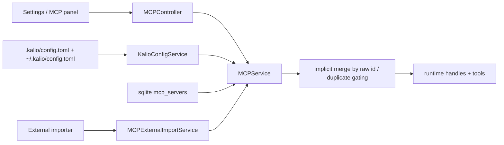
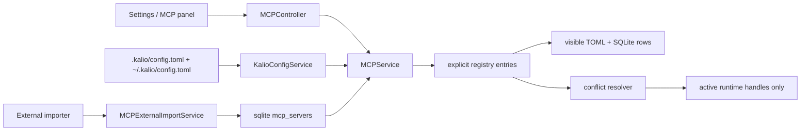
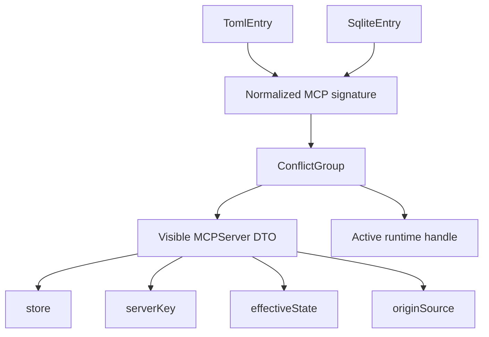

# Kalio MCP Dual-Store Runtime Rewire

## Summary

- [x] Keep `.kalio/config.toml` and SQLite `mcp_servers` as two durable MCP config stores.
- [x] Make TOML the canonical repo/dev-managed store without pretending SQLite no longer exists.
- [x] Stop implicit merge/shadow-by-raw-id behavior and expose both TOML and SQLite entries separately.
- [x] Resolve equivalent config by `visible != active`, with current winner policy `TOML > SQLite`.
- [x] Move Settings/API actions from raw `id` to `serverKey`.
- [x] Update durable repo docs to describe the dual-store model instead of a TOML-only runtime story.

## Current Architecture

## Target Architecture

## Models And Relations

## Checklist

- [x] Extend shared MCP contracts with `serverKey`, `store`, `originSource`, `effectiveState`, and `conflictGroup`.
- [x] Add SQLite provenance column `origin_source` plus migration/backfill guard.
- [x] Introduce explicit registry/signature utilities for TOML and SQLite comparison.
- [x] Rewire `MCPService.findAll()` and runtime reconciliation around registry entries instead of raw-id collapse.
- [x] Change restart/remove endpoints and clients to use `serverKey`.
- [x] Rework importer semantics from hard duplicate to informational `equivalentToExisting`.
- [x] Render TOML and SQLite rows separately in Settings and MCP panel UI.
- [x] Show store/state/origin badges and keep shadowed rows visible.
- [x] Update durable docs and AGENTS guidance to the dual-store model.

## Verification

- [x] `corepack pnpm --filter @kalio/types run build`
- [x] `corepack pnpm --filter kalio-api typecheck`
- [x] `corepack pnpm --filter kalio-web typecheck`
- [x] `corepack pnpm --filter kalio-api test -- src/modules/mcp/mcp-external-import.service.spec.ts src/modules/mcp/mcp.controller.spec.ts`
- [x] `corepack pnpm --filter kalio-web test -- src/features/settings/MCPSettingsPanel.test.tsx src/features/mcp/MCPPanel.test.tsx`
- [ ] `corepack pnpm --filter kalio-api test -- src/modules/mcp/mcp.service.spec.ts src/database/drizzle.service.spec.ts`

## Notes

- 2026-06-27: backend-focused service/db specs are still blocked in this environment by missing native `better-sqlite3` bindings, so full runtime/unit verification could not be completed.
- 2026-06-27: dual-store policy is intentionally fixed to `TOML > SQLite`; there is no manual winner override yet.
