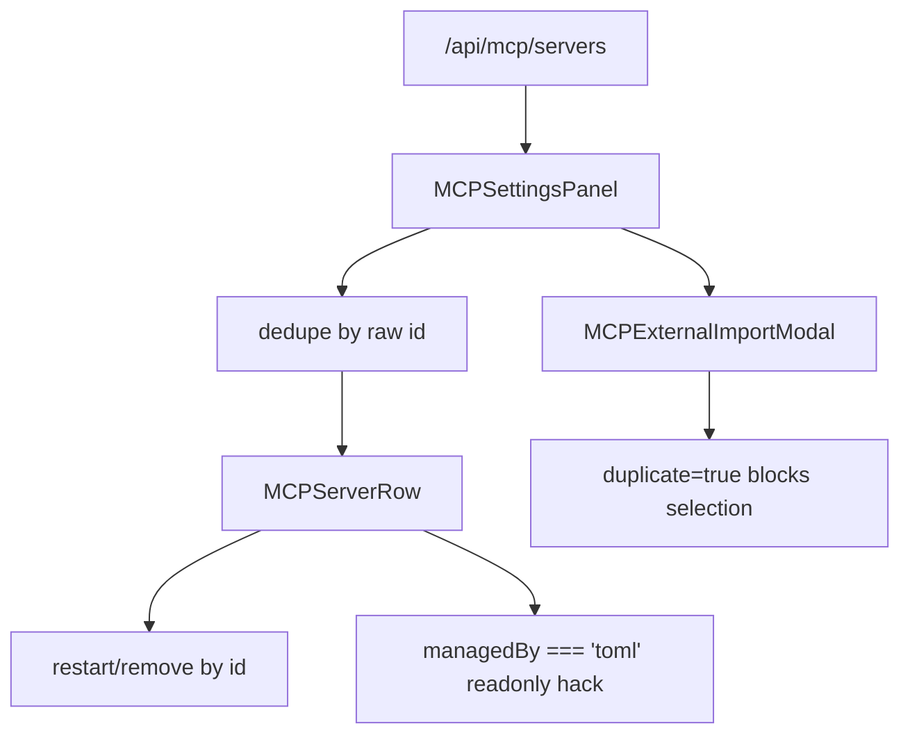
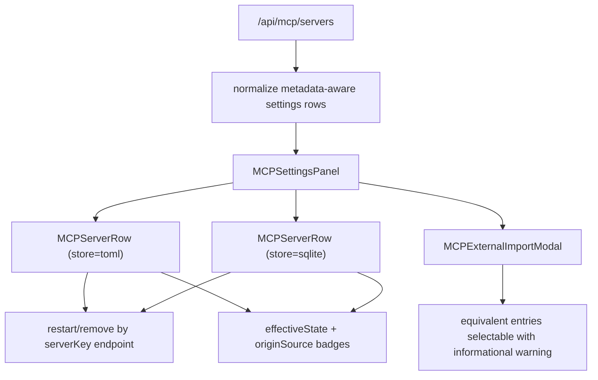
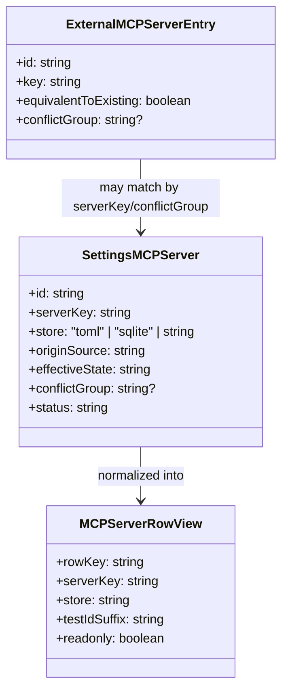

# MCP Settings Dual-Store Rewire

## Acceptance Criteria

- [x] Settings MCP UI consumes shared metadata fields when present: `serverKey`, `store`, `originSource`, `effectiveState`, `conflictGroup`.
- [x] TOML and SQLite variants of the same logical server render as separate rows instead of being collapsed by `id`.
- [x] Restart and remove actions target the backend using `serverKey`, not the raw row `id`.
- [x] MCP row test ids use `serverKey` plus store-aware suffixes so equivalent rows remain individually addressable.
- [x] External import modal treats equivalent entries as selectable informational items, not blocked duplicates.
- [x] Focused frontend tests cover the touched MCP settings slice and pass.

## Current Architecture

## Target Architecture

## Models And Relations

## Notes

- Scope started in `apps/kalio-web/src/features/settings/**`, then widened slightly to shared MCP contracts and the panel/runtime call sites required by `serverKey`.
- Shared `@kalio/types` now exposes the dual-store MCP metadata directly; the settings slice remains legacy-tolerant while older responses age out.
- 2026-06-27: focused frontend Vitest passed for `MCPSettingsPanel` and `MCPPanel`.
