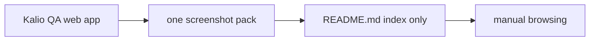
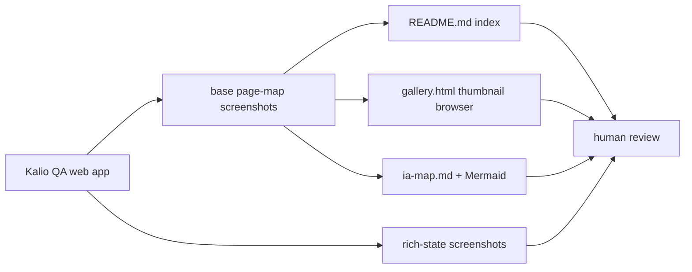
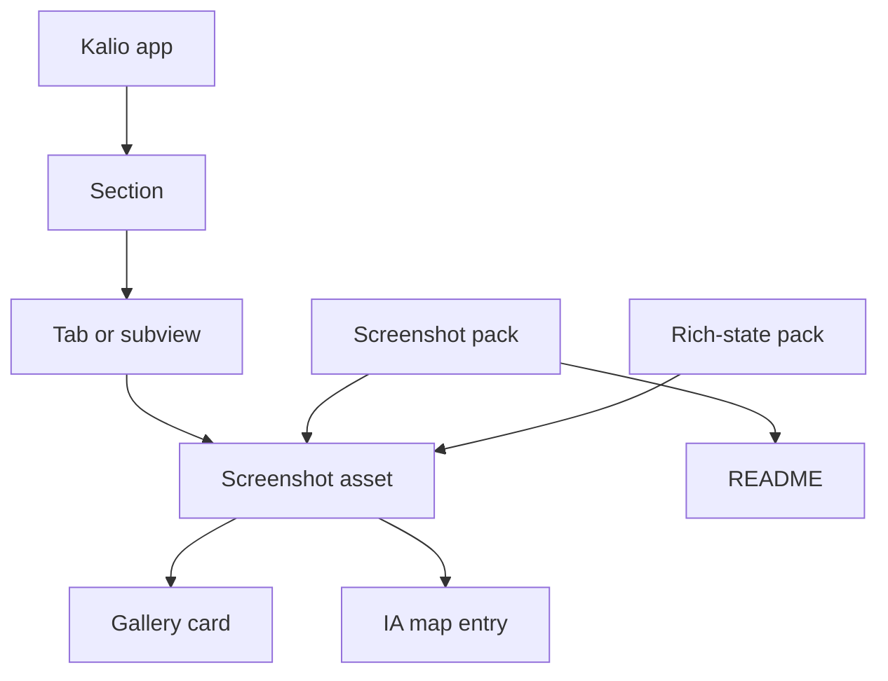

# Kalio Page Map Gallery And Rich-State Capture

## Summary

- [x] Extend the existing page-map pack with a browsable HTML gallery based on the captured screenshots.
- [x] Add an IA map in Markdown + Mermaid that maps `section -> tab -> screenshot`.
- [x] Produce a second richer screenshot pack that shows non-empty runtime states instead of mostly empty default panels.
- [x] Prefer the historical rich-state pack as the canonical richer package because it is cleaner than the fresh live-run pack.

## Current Architecture

## Target Architecture

## Models And Relations

## Checklist

- [x] Keep the original base page-map pack as the source for the full IA map.
- [x] Add `gallery.html` with thumbnail cards and section filters.
- [x] Add `ia-map.md` with Mermaid coverage for top-level sections and settings tabs.
- [x] Update the base pack `README.md` with links to the new gallery, IA map, and richer pack.
- [x] Capture a fresh live rich-state pack from Quick Chat plus architecture mode.
- [x] Capture a cleaner historical rich-state pack from existing QA database sessions.
- [x] Choose the historical rich-state pack as the recommended one because it has richer content and fewer runtime banners.

## Verification

- [x] QA stack booted successfully on random ports and returned `200` for web + backend health before captures.
- [x] Base pack exists at `output/playwright/page-map-2026-06-27T19-05-49-729Z`.
- [x] Live rich-state pack exists at `output/playwright/rich-state-2026-06-27T19-44-10-640Z`.
- [x] Historical rich-state pack exists at `output/playwright/rich-state-historical-2026-06-27T19-49-07-933Z`.
- [x] Manual image spot-checks were done for landing, architect, MCP settings, and the historical rich-state graph/conversation.

## Notes

- 2026-06-27: the first live rich-state pass proved the flow worked, but it carried reconnect/scope-error banners; it is kept as a raw runtime artifact, not the preferred gallery target.
- 2026-06-27: the historical `Architecture E2E` session from the QA database produced the cleanest rich-state graph pack, so the base README points there first.
