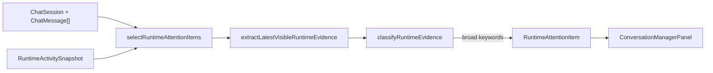
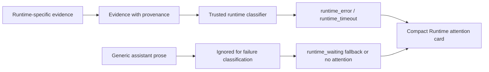
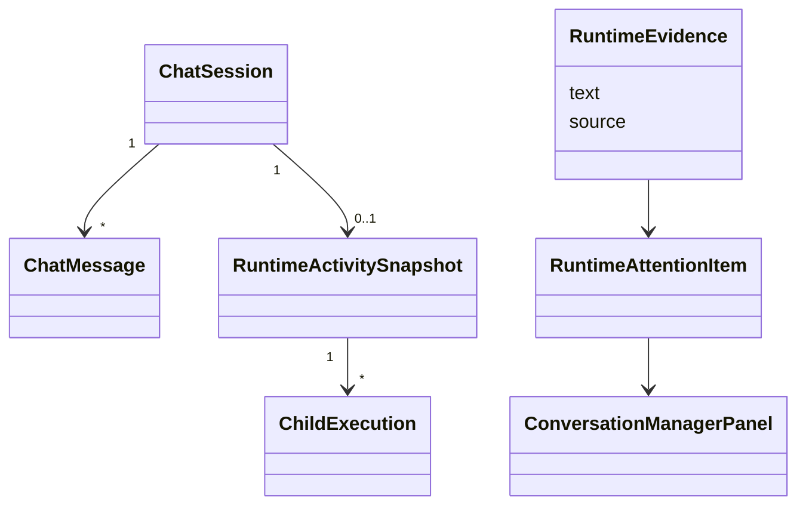

# Runtime Attention False Positive Fix

## Summary

- [x] Stop generic assistant prose from being classified as runtime failure evidence.
- [x] Preserve real timeout and runtime-error attention for durable runtime sessions.
- [x] Keep the attention UI compact so long details do not consume the whole sidebar.
- [x] Add regression tests for selector and panel behavior.
- [x] Verify with targeted tests, `typecheck`, and `build`.

## Current Architecture

## Target Architecture

## Models And Relations

## Checklist

- [x] Add selector regression for generic assistant text containing `errors` or `blockers`.
- [x] Keep timeout/tool-result positive cases green.
- [x] Extract runtime evidence logic out of `agentRuntimeSelectors.ts` so the file shrinks under the touched slice.
- [x] Clamp or compact long `Runtime attention` details and keep the full detail available through accessible text.
- [x] Run `corepack pnpm --filter kalio-web test -- src/store/agentRuntimeSelectors.test.ts src/features/sessions/ConversationManagerPanel.test.tsx`.
- [x] Run `corepack pnpm --filter kalio-web run typecheck`.
- [x] Run `corepack pnpm --filter kalio-web run build`.

## Verification

- [x] `corepack pnpm --filter kalio-web test -- src/store/agentRuntimeSelectors.test.ts src/features/sessions/ConversationManagerPanel.test.tsx`
- [x] `corepack pnpm --filter kalio-web run typecheck`
- [x] `corepack pnpm --filter kalio-web run build`
- [x] Playwright QA snapshot against `http://127.0.0.1:5288/` captured at `C:\Projekty\mcp-playwrigh-master\.local-data\mcp-playwright-orchestrator\snapshots\f527805d-6762-40b8-a8b7-f67a3f191238--240fc8dc-0411-4870-a78e-f0d19f76273c--runtime-attention-fix-qa-home--document\2026-06-27T20-19-15-651Z-99022029-1395-432f-afc1-ce25e28be9ef.png`

## Notes

- 2026-06-27: root cause confirmed in `agentRuntimeSelectors.ts`; generic assistant text was treated as runtime evidence and broad substring matching on `error/failed/blocked/cancelled` created false positives.
- 2026-06-27: independent subagent review agreed on narrowing runtime evidence to trusted provenance/canonical runtime phrases and compacting oversized cards.
- 2026-06-27: runtime evidence now flows through dedicated support modules: `agentRuntimeEvidence.ts` and `agentRuntimeAttentionSupport.ts`. `agentRuntimeSelectors.ts` dropped from 618 lines to 468 lines.
- 2026-06-27: browser proof on the built QA stack confirmed the shell still loads cleanly after the change. A seeded live `Runtime attention` row was not reproduced end-to-end in the running app during this slice, so row-specific UI proof rests on the new component regressions plus the snapshot-based shell check.
