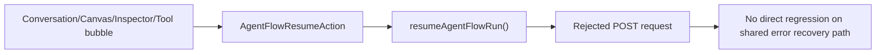
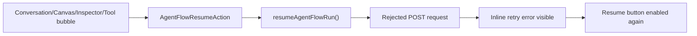
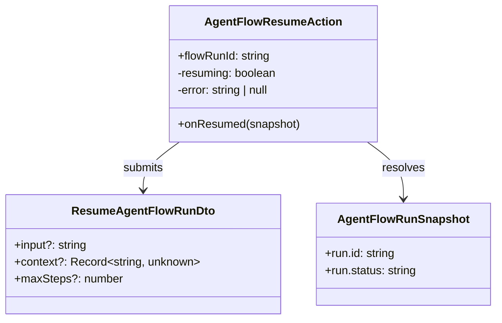

# 2026-06-27 Test Gap Detection: AgentFlow resume error path

- [x] Review the current uncommitted runtime/AgentFlow diff and avoid yesterday's already-covered gaps.
- [x] Confirm the new `AgentFlowResumeAction` is exercised only through success-path integration tests.
- [x] Add a focused component regression for failed resume requests and verify UI recovery.
- [x] Add a focused selector regression for persisted `agent-flow-root` timeout evidence after reload.
- [x] Run the narrowest practical frontend Vitest checks and record the result.

## Acceptance

- When resuming a waiting AgentFlow run fails, the shared resume action shows the inline error copy.
- The resume button re-enables after the failed request so the user can retry.
- Scope stays limited to the new AgentFlow resume surface and its shared component.

## Current Architecture

## Target Architecture

## Models Affected

## Notes

- Current integration tests in `AgentTurnBubble`, `CanvasPanel`, `ExecutionGraphInspector`, and `ToolCallBubble` only prove the happy-path POST call.
- A direct component test is the smallest reliable place to lock the shared failure-mode behavior once for all new call sites.
- Frontend diff review also exposed a selector-only reload gap: persisted timeout evidence for a fresh root session with `runtimeContext.runtimeKind = 'agent-flow-root'` was implemented but not asserted.
- Both new tests passed without production changes, so this run closed coverage gaps rather than fixing a newly exposed behavior bug.

## Verification

- `corepack pnpm --filter kalio-web exec vitest run src/features/agent-flow/AgentFlowResumeAction.test.tsx`
- `corepack pnpm --filter kalio-web exec vitest run src/store/agentRuntimeSelectors.test.ts`
- `corepack pnpm --filter kalio-web exec vitest run src/App.test.tsx src/store/agentRuntimeSelectors.test.ts src/features/agent-flow/AgentFlowResumeAction.test.tsx`

## Residual Risk

- Backend diff still has small unverified edge paths around malformed `agent:budget_required` payloads and `tool:confirmation_required` event summaries.
