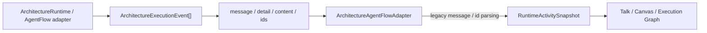
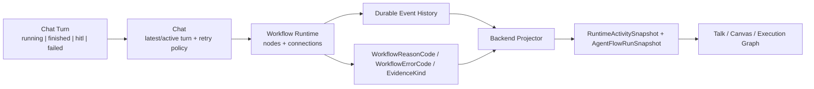
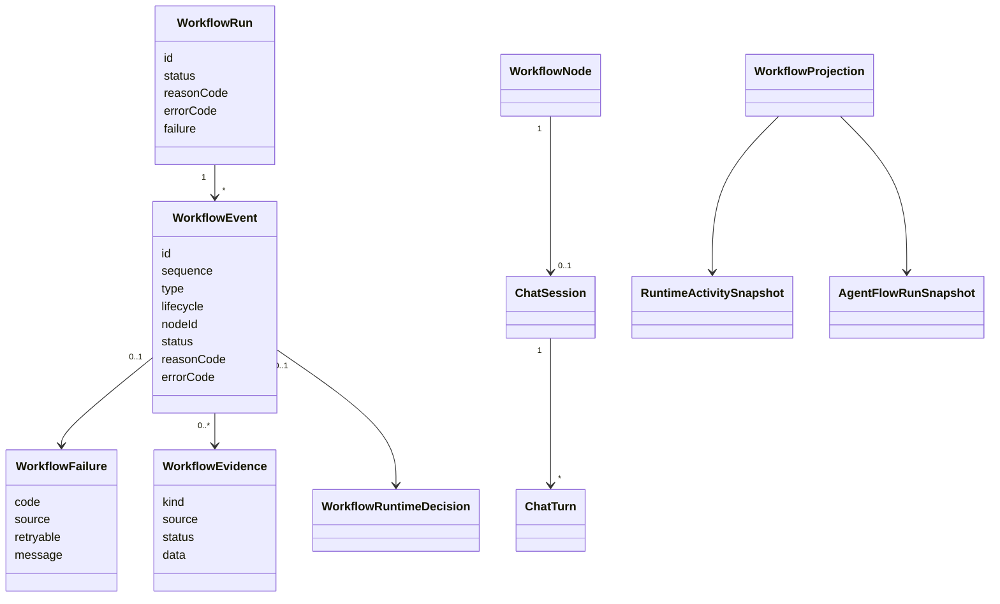

# AAA Workflow Runtime Contract

Status: implemented and verified for backend runtime, CLI turn mapping, provider-native structured output, typed-first router/finalizer consumers, and touched UI projection fallback paths.

## Goal

Make workflow, chat, turn, AgentFlow, CLI/subagent, and runtime projection logic depend on typed statuses, reason codes, error codes, structured evidence, and runtime decisions instead of free-form LLM text, `error.message`, or ID prefix parsing.

## Current Architecture

## Target Architecture

## Model Relations

## Implementation Checklist

- [x] Add shared contracts in `@kalio/types`: `WorkflowReasonCode`, `WorkflowErrorCode`, `WorkflowEvidenceKind`, `WorkflowFailure`, `WorkflowEvidence`, `WorkflowEventData`, and `WorkflowRuntimeDecision`.
- [x] Extend `ArchitectureExecutionEvent`, `AgentFlowTraceItem`, `ArchitectureRun`, and `AgentFlowRun` with typed reason/error/failure/evidence/decision fields.
- [x] Add backend workflow error helpers: `createWorkflowError`, `isWorkflowError`, `workflowFailureFromError`, and retryable code selection.
- [x] Make AgentFlow adapter finalization depend on typed `runtimeDecision` and `WorkflowEvidence`, not finalization text.
- [x] Make graph runtime retry and incomplete decisions depend on `WorkflowErrorCode`, `WorkflowReasonCode`, and structured event data.
- [x] Emit typed max-step, max-node-visit, return-to-orchestrator, stop, failure, and audit fields from architecture runtime.
- [x] Convert CLI/subagent/RAApp/chat runtime error branches from `error.message` checks to typed workflow errors.
- [x] Convert durable architecture replay primary lookup to `SessionRuntimeContext.architectureContext.architectureRunId`, `message.architectureRun.runId`, or tool arg `architectureRunId`.
- [x] Replace vector-store duplicate-column detection from `err.message.includes(...)` with deterministic SQLite schema inspection.
- [x] Strengthen `string-business-logic` audit and tests: typed comparisons are allowed; `message/error.message` branching and runtime ID-prefix parsing are flagged.
- [x] Run focused backend tests and typecheck.
- [x] Run `npm.cmd run audit:report`.
- [x] UI projection hardening: remove remaining Execution Graph/session tree ID-prefix fallbacks from:
  `executionGraphArchitectureRoot.ts`, `executionGraphArchitectureRun.ts`, `executionGraphFocus.ts`, `executionGraphHydration.ts`, and `sessionTreeDisplay.ts`.
- [x] Use existing backend-owned graph/session metadata so FE does not need to discover architecture runs from `message.id`, `toolCallId`, `taskId`, or `session.id` in touched projection paths.
- [x] Add structured-output contract for LLM-originated graph routing: `ArchitectureRouterOutput.nextAction='route_to'` with `targetNodeId` and `response`; prose `route_to(...)` no longer drives routing.
- [x] Durable graph replay uses typed `architectureEventId` / `eventId` tool-call args for event correlation instead of parsing `toolCallId` prefixes.
- [x] Fix router/finalizer trace rendering crash when a projected trace step is missing `content`; trace cleanup now normalizes `null` / `undefined` before display-only string cleanup.
- [x] Map CLI current stream to the chat turn contract: `cli_agent:progress` now carries `turnId` from `CLIAgentSessionRuntimeService` through pipe and PTY runners, and FE CLI child projections retain it.
- [x] Add `RunSubagentResult.structuredOutput` and make `ArchitectureRoleExecutorService` prefer typed structured router/finalizer payloads before legacy text fallbacks.
- [x] Add provider-native structured output support to `ILLMSource` / `LLMTurnRuntimeService` for architecture router/finalizer JSON schema contracts instead of relying on assistant text fallbacks.
- [x] Make CLI child projection prefer typed `SessionRuntimeContext.cliAgentContext.agentId` over arbitrary title parsing; keep title parsing only as a documented legacy fallback.

## Runtime Rules

- Terminal and waiting states must carry typed `reasonCode` or `errorCode`.
- Retry decisions must use `WorkflowErrorCode`; retryable: `RATE_LIMITED`, `TIMEOUT`, `PROVIDER_UNAVAILABLE`.
- Non-retryable: `PROVIDER_UNAUTHORIZED`, `INVALID_ARGUMENT`, `CONTRACT_VIOLATION`.
- Finalization must use `WorkflowEvidence` or `WorkflowRuntimeDecision`.
- `message`, `detail`, `summary`, `actionSummary`, and human text are display-only.
- IDs are opaque. Prefix parsing is allowed only in documented legacy compatibility paths and must not drive runtime state or durable projection joins.

## Verification Notes

- `corepack pnpm --filter kalio-api test -- src/common/utils/workflow-error.util.spec.ts src/modules/agent-flow/architecture-agent-flow.adapter.spec.ts src/modules/agent-flow/agent-flow-launch-context.spec.ts src/modules/architecture/architecture-durable-graph.spec.ts src/modules/architecture/architecture-graph-runtime.max-visits.spec.ts src/modules/architecture/architecture-role-executor.spec.ts src/modules/architecture/architecture-router-output.spec.ts src/modules/architecture/architecture-runtime.llm-integration.spec.ts src/modules/architecture/architecture-runtime.service.spec.ts src/modules/chat/audit-tool-data.spec.ts src/modules/chat/chat.runtime-snapshot.spec.ts src/modules/memory/vector-store.service.spec.ts src/modules/raapp/raapp.controller.spec.ts` passed: 13 files, 273 tests.
- `corepack pnpm --filter kalio-web test -- src/features/chat/architectureChatSummary.test.ts src/features/chat/workflowTurnProjection.test.ts src/features/chat/architectureTurnProjection.test.ts src/features/chat/graph/executionGraphFocus.test.ts src/features/chat/graph/executionGraphArchitectureRoot.test.ts src/features/chat/graph/executionGraphHydration.test.ts src/features/sessions/sessionTreeDisplay.test.ts src/features/chat/agentRuntimeSelectors.test.ts` passed: 7 files, 62 tests.
- `corepack pnpm --filter kalio-api typecheck` passed.
- `corepack pnpm --filter kalio-web typecheck` passed.
- `node --test scripts/code-audit/audit-scripts.test.mjs` passed: 9 tests.
- `npm.cmd run audit:report` passed; `docs/audit/2026-06-28-report.md` totals are CRITICAL 25, HIGH 4, MEDIUM 96, LOW 64. Remaining HIGH rows are circular dependencies, not string-driven runtime control flow.
- Continuation verification after CLI/structured-output hardening:
- `corepack pnpm --filter kalio-api test -- src/modules/architecture/architecture-role-executor.spec.ts src/modules/cli-agent/cli-agent.service.spec.ts src/modules/cli-agent/cli-agent-pty.service.spec.ts src/modules/cli-agent/cli-agent-session-runtime.service.spec.ts src/modules/agent-flow/architecture-agent-flow.adapter.spec.ts src/modules/cli-agent/cli-agent-session.service.spec.ts src/modules/cli-agent/cli-agent-outcome.spec.ts` passed: 7 files, 136 tests.
- `corepack pnpm --filter kalio-web test -- src/features/chat/ArchitectureRunTimeline.test.tsx src/features/chat/hooks/useChatSocketEvents.cliChild.test.ts src/features/chat/CLIChildConversationCard.test.tsx src/features/sessions/mergeSessionsPreservingLocal.test.ts src/features/chat/hooks/useContextPreview.test.ts src/features/chat/ChatInterface.Parts.test.tsx` passed: 6 files, 51 tests.
- `corepack pnpm --filter kalio-api test -- src/modules/tool/tools/run-cli-agent.tool.spec.ts` passed: 1 file, 30 tests.
- Provider-native structured output verification:
- `corepack pnpm --filter kalio-api test -- src/modules/chat/__tests__/llm-turn-runtime.service.spec.ts src/modules/chat/__tests__/llm-service.adapter.spec.ts src/modules/chat/__tests__/subagent-runtime.service.spec.ts src/modules/llm/providers/base-openai-compatible.provider.spec.ts src/modules/architecture/architecture-role-executor.spec.ts` passed: 5 files, 110 tests.
- `corepack pnpm --filter kalio-api typecheck` passed.
- `corepack pnpm --filter kalio-web typecheck` passed.
- `corepack pnpm --filter kalio-api typecheck` passed.
- `corepack pnpm --filter kalio-web typecheck` passed.

## References Checked

- Temporal workflow determinism and replay history: https://docs.temporal.io/workflows
- LangGraph persistence/checkpoints: https://docs.langchain.com/oss/python/langgraph/persistence
- Node.js typed errors and `error.code`: https://nodejs.org/api/errors.html
- OpenAI Structured Outputs: https://platform.openai.com/docs/guides/structured-outputs
- React Flow controlled state pattern: https://reactflow.dev/learn/advanced-use/state-management
