# AAA Workflow Runtime Contract

Status: implemented and verified for backend runtime, CLI turn mapping, provider-native structured output, typed-first router/finalizer consumers, and touched UI projection fallback paths.

## Goal

Make workflow, chat, turn, AgentFlow, CLI/subagent, and runtime projection logic depend on typed statuses, reason codes, error codes, structured evidence, and runtime decisions instead of free-form LLM text, `error.message`, or ID prefix parsing.

## Current Architecture

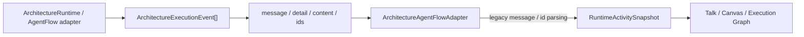

## Target Architecture

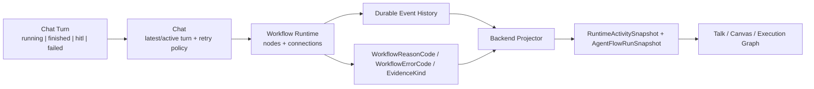

## Model Relations

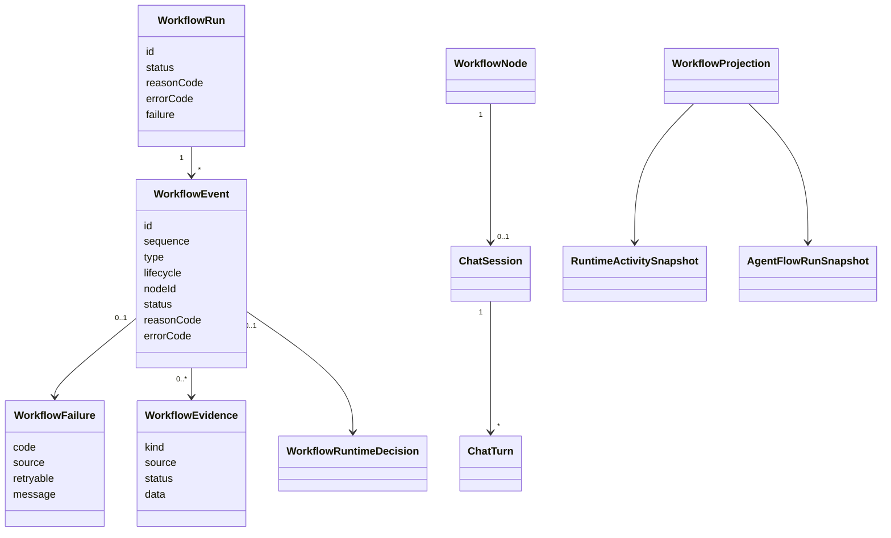

## Implementation Checklist

- [x] Add shared contracts in `@kalio/types`: `WorkflowReasonCode`, `WorkflowErrorCode`, `WorkflowEvidenceKind`, `WorkflowFailure`, `WorkflowEvidence`, `WorkflowEventData`, and `WorkflowRuntimeDecision`.
- [x] Extend `ArchitectureExecutionEvent`, `AgentFlowTraceItem`, `ArchitectureRun`, and `AgentFlowRun` with typed reason/error/failure/evidence/decision fields.
- [x] Add backend workflow error helpers: `createWorkflowError`, `isWorkflowError`, `workflowFailureFromError`, and retryable code selection.
- [x] Make AgentFlow adapter finalization depend on typed `runtimeDecision` and `WorkflowEvidence`, not finalization text.
- [x] Make graph runtime retry and incomplete decisions depend on `WorkflowErrorCode`, `WorkflowReasonCode`, and structured event data.
- [x] Emit typed max-step, max-node-visit, return-to-orchestrator, stop, failure, and audit fields from architecture runtime.
- [x] Convert CLI/subagent/RAApp/chat runtime error branches from `error.message` checks to typed workflow errors.
- [x] Convert durable architecture replay primary lookup to `SessionRuntimeContext.architectureContext.architectureRunId`, `message.architectureRun.runId`, or tool arg `architectureRunId`.
- [x] Replace vector-store duplicate-column detection from `err.message.includes(...)` with deterministic SQLite schema inspection.
- [x] Strengthen `string-business-logic` audit and tests: typed comparisons are allowed; `message/error.message` branching and runtime ID-prefix parsing are flagged.
- [x] Run focused backend tests and typecheck.
- [x] Run `npm.cmd run audit:report`.
- [x] UI projection hardening: remove remaining Execution Graph/session tree ID-prefix fallbacks from:
  `executionGraphArchitectureRoot.ts`, `executionGraphArchitectureRun.ts`, `executionGraphFocus.ts`, `executionGraphHydration.ts`, and `sessionTreeDisplay.ts`.
- [x] Use existing backend-owned graph/session metadata so FE does not need to discover architecture runs from `message.id`, `toolCallId`, `taskId`, or `session.id` in touched projection paths.
- [x] Add structured-output contract for LLM-originated graph routing: `ArchitectureRouterOutput.nextAction='route_to'` with `targetNodeId` and `response`; prose `route_to(...)` no longer drives routing.
- [x] Update seeded graph-router descriptions so prompts ask for structured `routerOutput.nextAction='route_to'` / `routerOutput.targetNodeId` instead of legacy `routeToNodeId`.
- [x] Durable graph replay uses typed `architectureEventId` / `eventId` tool-call args for event correlation instead of parsing `toolCallId` prefixes.
- [x] Fix router/finalizer trace rendering crash when a projected trace step is missing `content`; trace cleanup now normalizes `null` / `undefined` before display-only string cleanup.
- [x] Map CLI current stream to the chat turn contract: `cli_agent:progress` now carries `turnId` from `CLIAgentSessionRuntimeService` through pipe and PTY runners, and FE CLI child projections retain it.
- [x] Add `RunSubagentResult.structuredOutput` and make `ArchitectureRoleExecutorService` require typed structured router/finalizer payloads for control fields instead of legacy assistant-text JSON fallbacks.
- [x] Add provider-native structured output support to `ILLMSource` / `LLMTurnRuntimeService` for architecture router/finalizer JSON schema contracts instead of assistant text fallbacks.
- [x] Make CLI child projection prefer typed `SessionRuntimeContext.cliAgentContext.agentId` over arbitrary title parsing; keep title parsing only as a documented legacy fallback.
- [x] Harden MCP/persona review findings: preserve native selected tools during MCP normalization, translate unique legacy MCP aliases at read boundaries, include `env`/`headers` in MCP registry signatures, make migration drift warnings depend on real schema/journal mismatch, and keep MCP service unit tests from opening real HTTP/npm transports.

## Runtime Rules

- Terminal and waiting states must carry typed `reasonCode` or `errorCode`.
- Retry decisions must use `WorkflowErrorCode`; retryable: `RATE_LIMITED`, `TIMEOUT`, `PROVIDER_UNAVAILABLE`.
- Non-retryable: `PROVIDER_UNAUTHORIZED`, `INVALID_ARGUMENT`, `CONTRACT_VIOLATION`.
- Finalization must use `WorkflowEvidence` or `WorkflowRuntimeDecision`.
- `message`, `detail`, `summary`, `actionSummary`, and human text are display-only.
- IDs are opaque. Prefix parsing is allowed only in documented legacy compatibility paths and must not drive runtime state or durable projection joins.

## Next AAA Audit Queue

- [x] `architecture-graph-runtime.ts`: replace untyped `routeRequest()` result-data routing (`routeToNodeId` / `targetNodeId` / `route_to`) with the typed router decision contract only.
- [x] `architecture-graph-runtime.ts`: make `selectedOutgoingNodeIds()` prefer explicit graph edge metadata via `ArchitectureSchemaEdge.selection`.
- [x] Add edge-level `selection: 'continuation'` and use it for Goal Master / release-guard continuation paths instead of treating default/final edges as retry targets.
- [x] Runtime convergence routing no longer falls back to node-level `behavior.convergeToNodeId`; fan-out convergence is derived from explicit `edge.selection='converge'` branch edges.
- [x] Remove deprecated `behavior.convergeToNodeId` from shared schema types, Architect UI controls, seed fixtures, and API/frontend schema normalization; custom graph editor now edits convergence through `edge.selection`.
- [x] `architecture-graph-runtime.ts`: replace build-proof path substring checks such as `/dist` with structured `WorkflowEvidenceKind.BUILD_RESULT` evidence.
- [x] `pendingHostSession.ts`: replace `sessionId.startsWith('pending-host-session:')` classification with typed `runtimeContext.pendingHostSession` plus a local placeholder registry.
- [x] `cliChildProjection.model.ts`: prefer typed backend child-execution projection over parsing `tool_result` message JSON for CLI child reconstruction.
- [x] `sessionTreeDisplay.ts`: remove the remaining legacy `architecture:<runId>:` parent-tool-call grouping fallback once backend runtime context is present on old sessions.

## Verification Notes

- `corepack pnpm --filter kalio-api test -- src/common/utils/workflow-error.util.spec.ts src/modules/agent-flow/architecture-agent-flow.adapter.spec.ts src/modules/agent-flow/agent-flow-launch-context.spec.ts src/modules/architecture/architecture-durable-graph.spec.ts src/modules/architecture/architecture-graph-runtime.max-visits.spec.ts src/modules/architecture/architecture-role-executor.spec.ts src/modules/architecture/architecture-router-output.spec.ts src/modules/architecture/architecture-runtime.llm-integration.spec.ts src/modules/architecture/architecture-runtime.service.spec.ts src/modules/chat/audit-tool-data.spec.ts src/modules/chat/chat.runtime-snapshot.spec.ts src/modules/memory/vector-store.service.spec.ts src/modules/raapp/raapp.controller.spec.ts` passed: 13 files, 273 tests.
- `corepack pnpm --filter kalio-web test -- src/features/chat/architectureChatSummary.test.ts src/features/chat/workflowTurnProjection.test.ts src/features/chat/architectureTurnProjection.test.ts src/features/chat/graph/executionGraphFocus.test.ts src/features/chat/graph/executionGraphArchitectureRoot.test.ts src/features/chat/graph/executionGraphHydration.test.ts src/features/sessions/sessionTreeDisplay.test.ts src/features/chat/agentRuntimeSelectors.test.ts` passed: 7 files, 62 tests.
- `corepack pnpm --filter kalio-api typecheck` passed.
- `corepack pnpm --filter kalio-web typecheck` passed.
- `corepack pnpm --filter kalio-api build` passed.
- `corepack pnpm --filter kalio-web build` passed with the existing Vite chunk-size warning for a ~2 MB JS chunk.
- `node --test scripts/code-audit/audit-scripts.test.mjs` passed: 9 tests.
- `npm.cmd run audit:report` passed; `docs/audit/2026-06-28-report.md` totals are CRITICAL 25, HIGH 4, MEDIUM 96, LOW 64. Remaining HIGH rows are circular dependencies, not string-driven runtime control flow.
- Continuation verification after CLI/structured-output hardening:
- `corepack pnpm --filter kalio-api test -- src/modules/architecture/architecture-role-executor.spec.ts src/modules/cli-agent/cli-agent.service.spec.ts src/modules/cli-agent/cli-agent-pty.service.spec.ts src/modules/cli-agent/cli-agent-session-runtime.service.spec.ts src/modules/agent-flow/architecture-agent-flow.adapter.spec.ts src/modules/cli-agent/cli-agent-session.service.spec.ts src/modules/cli-agent/cli-agent-outcome.spec.ts` passed: 7 files, 136 tests.
- `corepack pnpm --filter kalio-web test -- src/features/chat/ArchitectureRunTimeline.test.tsx src/features/chat/hooks/useChatSocketEvents.cliChild.test.ts src/features/chat/CLIChildConversationCard.test.tsx src/features/sessions/mergeSessionsPreservingLocal.test.ts src/features/chat/hooks/useContextPreview.test.ts src/features/chat/ChatInterface.Parts.test.tsx` passed: 6 files, 51 tests.
- `corepack pnpm --filter kalio-api test -- src/modules/tool/tools/run-cli-agent.tool.spec.ts` passed: 1 file, 30 tests.
- Provider-native structured output verification:
- `corepack pnpm --filter kalio-api test -- src/modules/chat/__tests__/llm-turn-runtime.service.spec.ts src/modules/chat/__tests__/llm-service.adapter.spec.ts src/modules/chat/__tests__/subagent-runtime.service.spec.ts src/modules/llm/providers/base-openai-compatible.provider.spec.ts src/modules/architecture/architecture-role-executor.spec.ts` passed: 5 files, 110 tests.
- `corepack pnpm --filter kalio-api typecheck` passed.
- `corepack pnpm --filter kalio-web typecheck` passed.
- `corepack pnpm --filter kalio-api typecheck` passed.
- `corepack pnpm --filter kalio-web typecheck` passed.
- Review-fix verification:
- `corepack pnpm --filter kalio-web test -- src/features/persona/PersonaToolPicker.test.tsx src/features/persona/mcpToolAllowList.test.ts` passed: 2 files, 13 tests.
- `corepack pnpm --filter kalio-api test -- src/modules/mcp/mcp-registry.utils.spec.ts src/modules/mcp/mcp-external-import.service.spec.ts src/modules/mcp/mcp.service.spec.ts src/modules/chat/__tests__/mcp-tool-allow-list.spec.ts src/modules/chat/__tests__/tool-policy.service.spec.ts src/database/drizzle.service.spec.ts` passed cleanly after stubbing test runtime MCP connects: 6 files, 72 tests.
- `corepack pnpm --filter kalio-api test -- src/modules/chat/__tests__/mcp-tool-allow-list.spec.ts src/modules/chat/__tests__/tool-policy.service.spec.ts src/modules/chat/__tests__/tool-dispatch.service.spec.ts` passed: 3 files, 55 tests.
- `corepack pnpm --filter kalio-api typecheck` passed.
- `corepack pnpm --filter kalio-web typecheck` passed.
- `node --test scripts/code-audit/audit-scripts.test.mjs` passed: 9 tests.
- `npm.cmd run audit:report` passed; `docs/audit/2026-06-28-report.md` totals are CRITICAL 25, HIGH 4, MEDIUM 90, LOW 65. Remaining HIGH rows are circular dependencies, not string-driven runtime control flow. New legacy fallback marker is LOW only.
- Typed graph-routing test cleanup:
- `corepack pnpm --filter kalio-api test -- src/modules/architecture/architecture-runtime.service.spec.ts` first failed with 8 legacy-route regressions while high-level mocks still emitted `routeToNodeId` / `route_to`; after migrating those mocks to `routerOutput`, it passed: 1 file, 85 tests.
- Router/finalizer assistant-text fallback removal:
- `corepack pnpm --filter kalio-api test -- src/modules/architecture/architecture-role-executor.spec.ts` first failed when embedded assistant-text `routerOutput` / `finalArtifact` JSON still drove control fields; after removing those fallbacks, it passed: 1 file, 55 tests.
- `corepack pnpm --filter kalio-api test -- src/modules/architecture/architecture-router-output.spec.ts src/modules/architecture/architecture-role-executor.spec.ts src/modules/architecture/architecture-runtime.service.spec.ts src/modules/architecture/architecture-graph-runtime.max-visits.spec.ts` passed: 4 files, 146 tests.
- `corepack pnpm --filter kalio-api typecheck` passed.
- `npm.cmd run audit:report` passed; `docs/audit/2026-06-28-report.md` totals are CRITICAL 25, HIGH 4, MEDIUM 92, LOW 63. Remaining HIGH rows are circular dependencies, not string-driven runtime control flow.
- Structured build-proof evidence hardening:
- `corepack pnpm --filter kalio-api test -- src/modules/architecture/architecture-runtime.service.spec.ts` first failed because `/dist` target paths without `BUILD_RESULT` still finalized; after replacing the runtime check with typed `BUILD_RESULT/passed/exitCode:0`, it passed: 1 file, 86 tests.
- Edge-selection metadata hardening:
- `corepack pnpm --filter kalio-api test -- src/modules/architecture/architecture-graph-runtime.max-visits.spec.ts` first failed because `selection: 'converge'` was ignored and the first outgoing edge was selected; after adding `ArchitectureSchemaEdge.selection` and preferring it in graph runtime, it passed: 1 file, 5 tests.
- `corepack pnpm --filter kalio-api test -- src/modules/architecture/architecture-router-output.spec.ts src/modules/architecture/architecture-graph-runtime.max-visits.spec.ts src/modules/architecture/architecture-runtime.service.spec.ts` passed: 3 files, 93 tests.
- `corepack pnpm --filter @kalio/types typecheck` passed.
- `corepack pnpm --filter @kalio/types test -- src/__tests__/contracts.test.ts` passed: 1 file, 13 tests.
- `corepack pnpm --filter kalio-api typecheck` passed.
- `node --test scripts/code-audit/audit-scripts.test.mjs` passed: 9 tests.
- `npm.cmd run audit:report` passed; `docs/audit/2026-06-28-report.md` totals are CRITICAL 25, HIGH 4, MEDIUM 92, LOW 63.
- Continuation-edge and structured-output test-runtime hardening:
- `corepack pnpm --filter kalio-api test -- src/modules/architecture/architecture-runtime.llm-integration.spec.ts` first failed after removing implicit finalization fallback because dry Goal Master tests still used text-only router JSON and a test subagent runtime that dropped `structuredOutput`; after moving the test runtime to `structured_output`, it passed: 1 file, 6 tests.
- `corepack pnpm --filter kalio-api test -- src/modules/architecture/architecture-router-output.spec.ts src/modules/architecture/architecture-graph-runtime.max-visits.spec.ts src/modules/architecture/architecture-runtime.service.spec.ts src/modules/architecture/architecture-runtime.llm-integration.spec.ts src/modules/architecture/architecture-role-executor.spec.ts` passed: 5 files, 155 tests.
- `corepack pnpm --filter @kalio/types test -- src/__tests__/contracts.test.ts` passed: 1 file, 13 tests.
- `corepack pnpm --filter @kalio/types typecheck` passed.
- `corepack pnpm --filter kalio-api typecheck` passed.
- `corepack pnpm --filter kalio-web test -- src/features/persona/PersonaToolPicker.test.tsx` passed: 1 file, 9 tests.
- `corepack pnpm --filter kalio-api test -- src/modules/mcp/mcp-registry.utils.spec.ts src/modules/chat/__tests__/mcp-tool-allow-list.spec.ts` passed: 2 files, 7 tests.
- `corepack pnpm --filter kalio-api test -- src/database/drizzle.service.spec.ts src/modules/mcp/mcp.service.spec.ts` passed: 2 files, 39 tests.
- Final verification for this continuation:
- `corepack pnpm --filter kalio-api typecheck` passed.
- `corepack pnpm --filter kalio-web typecheck` passed.
- `node --test scripts/code-audit/audit-scripts.test.mjs` passed: 9 tests.
- `npm.cmd run audit:report` passed; `docs/audit/2026-06-28-report.md` totals are CRITICAL 25, HIGH 4, MEDIUM 92, LOW 63. There are no HIGH `string-business-logic` rows; the remaining string-derived runtime-like row is MEDIUM in `pendingHostSession.ts` and is recorded in `docs/bugs.md`.
- Pending host session typed-id hardening:
- Red: `corepack pnpm --filter kalio-web test -- src/features/chat/pendingHostSession.test.ts` failed because arbitrary `pending-host-session:*` ids were classified as pending.
- Green: `corepack pnpm --filter kalio-web test -- src/features/chat/pendingHostSession.test.ts src/features/chat/activeConversationSession.test.ts src/features/chat/hooks/useContextPreview.test.ts src/features/chat/hooks/useChatSessionActivation.test.ts src/features/chat/ChatInterface.Parts.test.tsx` passed: 5 files, 47 tests.
- `corepack pnpm --filter kalio-web typecheck` passed.
- `node --test scripts/code-audit/audit-scripts.test.mjs` passed: 9 tests.
- `npm.cmd run audit:report` passed; `docs/audit/2026-06-29-report.md` totals are CRITICAL 25, HIGH 4, MEDIUM 91, LOW 63. The previous `pendingHostSession.ts` `identifier-fragment-branch` row is gone.
- CLI child typed projection hardening:
- Red: `corepack pnpm --filter kalio-web test -- src/features/chat/hooks/useChatSocketEvents.cliChild.test.ts` failed because stale persisted `tool_result` history rebuilt `failed/stale persisted error` even when typed `RuntimeActivitySnapshot.childExecutions` said `running/typed runtime tail`.
- Green: `corepack pnpm --filter kalio-web test -- src/features/chat/hooks/useChatSocketEvents.cliChild.test.ts` passed: 1 file, 10 tests.
- `corepack pnpm --filter kalio-web test -- src/features/chat/cliChildProjection.model.test.ts src/features/chat/hooks/useChatSocketEvents.cliChild.test.ts src/features/chat/hooks/useChatSocketEvents.reconnect.test.ts` passed: 3 files, 28 tests.
- `corepack pnpm --filter kalio-web typecheck` passed.
- `node --test scripts/code-audit/audit-scripts.test.mjs` passed: 9 tests.
- `npm.cmd run audit:report` passed; `docs/audit/2026-06-29-report.md` totals are CRITICAL 25, HIGH 4, MEDIUM 91, LOW 63. No new HIGH `string-business-logic` row was introduced by the CLI projection fallback marker.
- Session tree typed architecture context hardening:
- Red: `corepack pnpm --filter kalio-web test -- src/features/sessions/sessionTreeDisplay.test.ts` failed because `architectureRunIdForSession()` still parsed `architecture:encoded-run:router` from `runtimeContext.parentToolCallId`.
- Green: `corepack pnpm --filter kalio-web test -- src/features/sessions/sessionTreeDisplay.test.ts` passed: 1 file, 13 tests.
- `corepack pnpm --filter kalio-web test -- src/features/sessions/SessionPanel.test.tsx src/features/chat/hooks/useChatSocketEvents.reconnect.test.ts src/features/chat/CanvasPanel.test.tsx` passed: 3 files, 97 tests.
- `corepack pnpm --filter kalio-web test -- src/features/sessions/sessionTreeDisplay.test.ts src/features/sessions/conversationTreeModel.test.ts src/features/sessions/sessionListModel.test.ts src/features/sessions/sessionRenderableFilter.test.ts src/features/sessions/sessionRowRuntimeState.test.ts` passed: 5 files, 36 tests.
- `corepack pnpm --filter kalio-web typecheck` passed.
- `node --test scripts/code-audit/audit-scripts.test.mjs` passed: 9 tests.
- `npm.cmd run audit:report` passed; `docs/audit/2026-06-29-report.md` totals are CRITICAL 25, HIGH 4, MEDIUM 90, LOW 63. The slice removed the production `architecture:<runId>:` parent-tool-call parser plus title/id technical-node heuristics from `sessionTreeDisplay.ts`.
- Edge-selection convergence runtime hardening:
- Red: `corepack pnpm --filter kalio-api test -- src/modules/architecture/architecture-graph-runtime.max-visits.spec.ts` failed because `route.convergeToNodeId` still came from node-level `behavior.convergeToNodeId`.
- Green: `corepack pnpm --filter kalio-api test -- src/modules/architecture/architecture-graph-runtime.max-visits.spec.ts` passed: 1 file, 6 tests.
- `corepack pnpm --filter kalio-api test -- src/modules/architecture/architecture-runtime.service.spec.ts src/modules/architecture/architecture-graph-runtime.max-visits.spec.ts` passed: 2 files, 92 tests.
- `corepack pnpm --filter kalio-api typecheck` passed.
- `node --test scripts/code-audit/audit-scripts.test.mjs` passed: 9 tests.
- `npm.cmd run audit:report` passed; `docs/audit/2026-06-29-report.md` totals are CRITICAL 25, HIGH 4, MEDIUM 90, LOW 63. Remaining `behavior.convergeToNodeId` references are deprecated schema/editor fixtures, not runtime fallback.
- Edge-selection contract cleanup:
- Red: `corepack pnpm --filter kalio-web test -- src/features/architect/ArchitectPage.graph.test.ts src/features/architect/architect.schema.test.ts` failed because edge selection editing was missing and schema normalization still preserved legacy node-level convergence.
- Green: the same frontend graph/schema tests passed after adding `setEdgeSelection()` and preserving edge `selection` metadata while dropping legacy node behavior convergence: 2 files, 6 tests.
- Red: `corepack pnpm --filter kalio-web test -- src/features/architect/ArchitectInspector.test.tsx` failed because `architect-edge-selection-pragmatist-review` did not exist.
- Green: `corepack pnpm --filter kalio-web test -- src/features/architect/ArchitectInspector.test.tsx` passed after adding outgoing-edge role editing: 1 file, 8 tests.
- `corepack pnpm --filter kalio-web test -- src/features/architect/ArchitectPage.graph.test.ts src/features/architect/architect.schema.test.ts src/features/architect/ArchitectInspector.test.tsx src/features/architect/ArchitectPage.test.tsx src/features/architect/architect.api.test.ts src/features/architect/ArchitectGraphCanvas.test.tsx src/features/architect/ArchitectGraphGeometry.test.ts` passed: 7 files, 93 tests.
- `corepack pnpm --filter @kalio/types test -- src/__tests__/contracts.test.ts` passed: 1 file, 13 tests.
- `corepack pnpm --filter kalio-api test -- src/modules/architecture/architecture-runtime.service.spec.ts src/modules/architecture/architecture-graph-runtime.max-visits.spec.ts src/modules/architecture/architecture-runtime.llm-integration.spec.ts` passed: 3 files, 98 tests.
- `corepack pnpm --filter @kalio/types typecheck`, `corepack pnpm --filter kalio-web typecheck`, and `corepack pnpm --filter kalio-api typecheck` passed.
- `corepack pnpm --filter @kalio/e2e exec playwright test tests/architecture-chat-subagent-turn.spec.ts --list` loaded the migrated E2E spec and listed 4 tests.
- `rg -n "convergeToNodeId" apps packages` now shows only `ArchitectureRouteDecision.convergeToNodeId`, route telemetry validation/tests, and two legacy regression tests that prove node-level convergence is ignored.
- `node --test scripts/code-audit/audit-scripts.test.mjs` passed: 9 tests.
- `npm.cmd run audit:report` passed; `docs/audit/2026-06-29-report.md` totals are CRITICAL 25, HIGH 4, MEDIUM 89, LOW 64.
- `git diff --check` passed with only existing LF-to-CRLF warnings.
- Router/finalizer undefined-display-text hardening:
- Red: `corepack pnpm --filter kalio-api test -- src/modules/architecture/architecture-parent-chat-projection.spec.ts` failed with `Cannot read properties of undefined (reading 'replace')` when a typed router/finalizer event omitted legacy `message` text.
- Green: the same spec passed after parent-chat projection normalized optional display text and used typed route/finalizer fallback summaries: 1 file, 7 tests.
- Red: `corepack pnpm --filter kalio-api test -- src/modules/architecture/architecture-role-executor.spec.ts -t "projects finalizer JSON contract into structured artifact status data"` failed because structured finalizer `answer` was dropped.
- Green: the same focused role-executor test passed after preserving `answer` as `finalArtifactAnswer`.
- `corepack pnpm --filter kalio-api test -- src/modules/architecture/architecture-parent-chat-projection.spec.ts src/modules/architecture/architecture-role-executor.spec.ts src/modules/architecture/architecture-runtime.service.spec.ts src/modules/architecture/architecture-runtime.llm-integration.spec.ts` passed: 4 files, 154 tests.
- `corepack pnpm --filter kalio-api typecheck` passed.
- Frontend partial-projection hardening:
- Red: `corepack pnpm --filter kalio-web test -- src/features/chat/graph/executionGraphArchitectureRoot.test.ts` failed with `normalizeNodeId(undefined).replace` for a malformed architecture graph node.
- Red: `corepack pnpm --filter kalio-web test -- src/features/chat/graph/ExecutionGraphInspector.test.tsx -t "renders architecture route fallback labels"` failed with `shortNodeLabel(undefined).replace` for partial route payloads.
- Red: `corepack pnpm --filter kalio-web test -- src/features/chat/graph/executionGraphModel.helpers.test.ts -t "copied file artifact fallbacks"` failed with `basename(undefined).replace` for copied-file artifacts without `toPath`.
- Green: `corepack pnpm --filter kalio-web test -- src/features/chat/graph/executionGraphArchitectureRoot.test.ts src/features/chat/graph/ExecutionGraphInspector.test.tsx src/features/chat/graph/executionGraphModel.helpers.test.ts src/features/chat/graph/executionGraphModel.test.ts src/features/chat/graph/ExecutionGraphView.test.tsx` passed: 5 files, 100 tests.
- `corepack pnpm --filter kalio-web typecheck` passed.
- `node --test scripts/code-audit/audit-scripts.test.mjs` passed: 9 tests.
- `npm.cmd run audit:report` passed; `docs/audit/2026-06-29-report.md` totals remain CRITICAL 25, HIGH 4, MEDIUM 89, LOW 64.
- `git diff --check` passed with only existing LF-to-CRLF warnings.
- Review findings and typed failure projection hardening:
- `corepack pnpm --filter kalio-web test -- src/features/persona/mcpToolAllowList.test.ts src/features/persona/PersonaToolPicker.test.tsx` passed: 2 files, 13 tests. This verifies native tools are preserved while MCP aliases normalize.
- `corepack pnpm --filter kalio-api test -- src/modules/mcp/mcp-registry.utils.spec.ts src/modules/chat/__tests__/mcp-tool-allow-list.spec.ts src/database/drizzle.service.spec.ts` passed: 3 files, 13 tests. This verifies MCP signatures include `env`/`headers`, legacy MCP aliases map only when unique, and migration drift warnings require a real mismatch.
- Red: `corepack pnpm --filter kalio-api test -- src/modules/architecture/architecture-parent-chat-projection.spec.ts` failed because typed `WorkflowFailure` did not render a failure reason unless `event.message === 'Architecture run failed.'`.
- Green: the same parent-chat projection spec passed after failure reason extraction moved to typed `event.failure` / `data.failure`, with `data.error` left only as `TODO: legacy fallback`: 1 file, 9 tests.
- `corepack pnpm --filter kalio-api test -- src/modules/architecture/architecture-parent-chat-projection.spec.ts src/modules/mcp/mcp-registry.utils.spec.ts src/modules/chat/__tests__/mcp-tool-allow-list.spec.ts src/database/drizzle.service.spec.ts` passed: 4 files, 22 tests.
- `corepack pnpm --filter kalio-web test -- src/features/persona/mcpToolAllowList.test.ts src/features/persona/PersonaToolPicker.test.tsx` passed: 2 files, 13 tests.
- `corepack pnpm --filter kalio-api typecheck` first rejected lowercase `provider_unauthorized`; after fixing the test to `PROVIDER_UNAUTHORIZED`, it passed. This confirms the typed error-code contract catches code casing drift.
- `node --test scripts/code-audit/audit-scripts.test.mjs` passed: 9 tests.
- `npm.cmd run audit:report` passed; `docs/audit/2026-06-29-report.md` totals remain CRITICAL 25, HIGH 4, MEDIUM 89, LOW 64.
- `git diff --check` passed with only existing LF-to-CRLF warnings.
- Scoped runtime search: `rg -n "error\.message\.(includes|startsWith|endsWith|match)|message\.(includes|startsWith|endsWith|match)|content\.(includes|startsWith|endsWith|match)" apps/kalio-api/src/modules/architecture apps/kalio-api/src/modules/agent-flow apps/kalio-api/src/modules/chat apps/kalio-api/src/modules/cli-agent apps/kalio-web/src/features/chat` now finds no production workflow routing/finalization/retry classifier. Remaining production hits are documented CLI metadata legacy fallback and session title parsing.
- Provider API error-code hardening:
- Red: `corepack pnpm --filter kalio-api test -- src/modules/llm/providers/base-openai-compatible.provider.spec.ts` failed because a plain-text HTTP error body containing the word `quota` was classified as `LLM_QUOTA`.
- Green: the same provider spec passed after quota mapping was moved to structured provider error payload fields `error.code` / `error.type`: 1 file, 18 tests.
- `corepack pnpm --filter kalio-api typecheck` passed.
- `node --test scripts/code-audit/audit-scripts.test.mjs` passed: 9 tests.
- `npm.cmd run audit:report` passed; `docs/audit/2026-06-29-report.md` totals remain CRITICAL 25, HIGH 4, MEDIUM 89, LOW 64.
- `git diff --check` passed with only existing LF-to-CRLF warnings.
- Mock provider structured-history hardening:
- Red: `corepack pnpm --filter kalio-api test -- src/modules/llm/providers/mock.provider.spec.ts` failed because plain tool text mentioning `"flowRunId"` / `"childSessionId"` was treated as a completed AgentFlow result.
- Red: the same spec failed because plain tool text or assistant tool-call content mentioning `e2e/mock-tool-trigger.txt` was treated as completed `vfs_write` evidence.
- Green: the same mock provider spec passed after history guards were moved to structured JSON object parsing and exact nested value matching: 1 file, 27 tests.
- `corepack pnpm --filter kalio-api typecheck` passed.
- `node --test scripts/code-audit/audit-scripts.test.mjs` passed: 9 tests.
- `npm.cmd run audit:report` passed; `docs/audit/2026-06-29-report.md` totals are CRITICAL 25, HIGH 4, MEDIUM 87, LOW 64. The two `mock.provider.helpers.ts` free-form branch rows are gone.
- `git diff --check` passed with only existing LF-to-CRLF warnings.
- CLI semantic failure code hardening:
- Red: `corepack pnpm --filter kalio-api test -- src/modules/cli-agent/cli-agent-outcome.spec.ts` failed because non-zero output text `Please run codex login before retrying.` was classified as `auth_required`.
- Green: the same outcome spec passed after `applySemanticCliOutcome()` stopped deriving `auth_required` from regex/text fallback and now requires typed `failureCode`: 1 file, 3 tests.
- `corepack pnpm --filter kalio-api test -- src/modules/cli-agent/cli-agent-session-runtime.service.spec.ts` passed: 1 file, 15 tests.
- `corepack pnpm --filter kalio-api test -- src/modules/cli-agent/cli-agent.service.spec.ts` passed after updating the old test that encoded text-based auth classification: 1 file, 23 tests.
- `corepack pnpm --filter kalio-api test -- src/modules/cli-agent/cli-agent-utils.spec.ts` passed: 1 file, 7 tests.
- CLI process termination hardening:
- Red: `corepack pnpm --filter kalio-api test -- src/modules/cli-agent/cli-agent-process-kill.spec.ts` failed because localized `taskkill` stderr still led to SIGTERM even when a structured OS check reported `ESRCH`.
- Green: the same process-kill spec passed after removing stderr substring matching and checking `process.kill(pid, 0)` for `ESRCH`: 1 file, 6 tests.
- `corepack pnpm --filter kalio-api test -- src/modules/cli-agent/cli-agent-pty.service.spec.ts` passed: 1 file, 4 tests.
- `corepack pnpm --filter kalio-api test -- src/modules/cli-agent/cli-agent.service.spec.ts` passed: 1 file, 23 tests.
- `corepack pnpm --filter kalio-api test -- src/modules/cli-agent/cli-agent-outcome.spec.ts src/modules/cli-agent/cli-agent-utils.spec.ts src/modules/cli-agent/cli-agent-session-runtime.service.spec.ts` passed: 3 files, 25 tests.
- MCP typed alias hardening:
- Red: `corepack pnpm --filter kalio-api test -- src/modules/chat/__tests__/mcp-tool-allow-list.spec.ts` failed because `resolveToolAlias('mcp_docs_search')` still inferred `mcp_toml::docs_search` from the canonical tool name without alias metadata.
- Green: `ToolMeta`/`MCPTool` now expose optional `aliases`, MCP projections publish the pre-serverKey alias explicitly, and `resolveToolAlias()` accepts only exact canonical names or explicit aliases: `corepack pnpm --filter kalio-api test -- src/modules/chat/__tests__/mcp-tool-allow-list.spec.ts src/modules/chat/__tests__/tool-policy.service.spec.ts` passed: 2 files, 25 tests.
- `corepack pnpm --filter kalio-api test -- src/modules/mcp/mcp-projections.spec.ts src/modules/chat/__tests__/tool-dispatch.service.spec.ts src/modules/tool/tool.controller.spec.ts` passed: 3 files, 40 tests.
- `corepack pnpm --filter @kalio/types test -- src/__tests__/contracts.test.ts` passed: 1 file, 13 tests.
- CLI metadata runtime-read hardening:
- Red: `corepack pnpm --filter kalio-api test -- src/modules/cli-agent/cli-agent-session.service.spec.ts` failed because `loadSessionMetadata()` still loaded `agentId/workdir` from a legacy `__kalio_cli_agent_meta__:` system message, and because no explicit migration method existed.
- Green: `loadSessionMetadata()` now reads only typed `runtimeContext.cliAgentContext`; `migrateLegacySessionMetadata()` converts legacy prefixed messages into typed `runtimeContext` before runtime reads them: `corepack pnpm --filter kalio-api test -- src/modules/cli-agent/cli-agent-session.service.spec.ts` passed: 1 file, 3 tests.
- `corepack pnpm --filter kalio-api test -- src/modules/cli-agent/cli-agent-session-runtime.service.spec.ts` passed: 1 file, 15 tests.
- `corepack pnpm --filter kalio-api test -- src/modules/cli-agent/cli-agent.service.spec.ts` passed: 1 file, 23 tests.
- `corepack pnpm --filter kalio-api test -- src/modules/cli-agent/cli-agent-outcome.spec.ts src/modules/cli-agent/cli-agent-process-kill.spec.ts src/modules/cli-agent/cli-agent-pty.service.spec.ts src/modules/cli-agent/cli-agent-utils.spec.ts` passed: 4 files, 20 tests.
- CLI Codex JSONL parser hardening:
- `extractCodexAgentMessage()` no longer gates by line prefix `startsWith('{')`; it attempts structured JSON event parsing and only accepts `item.completed` / `agent_message` payloads.
- Green: `corepack pnpm --filter kalio-api test -- src/modules/cli-agent/cli-agent-utils.spec.ts` passed: 1 file, 7 tests.
- Final review gate for this slice:
- Green: `corepack pnpm --filter kalio-web test -- src/features/persona/PersonaToolPicker.test.tsx src/features/persona/mcpToolAllowList.test.ts` passed: 2 files, 13 tests.
- Green: `corepack pnpm --filter kalio-api test -- src/modules/mcp/mcp-registry.utils.spec.ts src/modules/chat/__tests__/mcp-tool-allow-list.spec.ts src/modules/chat/__tests__/tool-policy.service.spec.ts src/database/drizzle.service.spec.ts` passed: 4 files, 35 tests.
- Green: `corepack pnpm --filter kalio-api test -- src/modules/cli-agent/cli-agent-session.service.spec.ts src/modules/cli-agent/cli-agent-session-runtime.service.spec.ts src/modules/cli-agent/cli-agent.service.spec.ts src/modules/cli-agent/cli-agent-outcome.spec.ts src/modules/cli-agent/cli-agent-process-kill.spec.ts src/modules/cli-agent/cli-agent-utils.spec.ts` passed: 6 files, 57 tests.
- Green: `corepack pnpm --filter kalio-api typecheck`, `corepack pnpm --filter kalio-web typecheck`, `corepack pnpm --filter @kalio/types typecheck`, and `corepack pnpm --filter @kalio/types test` passed.
- Green: `node --test scripts/code-audit/audit-scripts.test.mjs` passed: 9 tests.
- Green: `npm.cmd run audit:report` passed; `docs/audit/2026-06-29-report.md` totals are CRITICAL 25, HIGH 4, MEDIUM 88, LOW 62. The HIGH rows are circular-dependency findings, not `string-business-logic`; remaining string-driven rows are MEDIUM/LOW display/search/tool grouping candidates.
- Green: `git diff --check` passed with only existing LF-to-CRLF warnings.

## Continuation: Raw XML Tool-Call Opt-In Hardening

Raw XML tool-call parsing is no longer enabled by default. Assistant text such as `<tool_call><name>run_cli_agent</name>...</tool_call>` stays display text unless the caller explicitly supplies `rawXmlToolNames`. `LLMTurnRuntimeService` no longer populates raw XML parsing from every available `toolMeta`; subagent runtime still opts in explicitly as a documented legacy fallback for providers that emit textual tool markup instead of typed tool-call chunks.

The same slice fixed a typed tool-policy ambiguity: `explicitToolNames: []` now means "runtime explicitly provided no tools" instead of falling back to persona tools, and explicit runtime tools can be resolved from `explicitTools` even when they are absent from the global tool catalog.

Verification:

- Red: `corepack pnpm --filter kalio-api test -- src/modules/chat/__tests__/raw-tool-call.parser.spec.ts` failed because raw XML became a `run_cli_agent` call without an explicit allow-list.
- Red: `corepack pnpm --filter kalio-api test -- src/modules/chat/__tests__/done.handler.spec.ts` failed because raw XML subagent text was stripped into a tool call without opt-in.
- Red: `corepack pnpm --filter kalio-api test -- src/modules/chat/__tests__/llm-turn-runtime.service.spec.ts` failed because `rawXmlToolNames` was auto-filled from `toolMetas`.
- Red: `corepack pnpm --filter kalio-api test -- src/modules/chat/__tests__/tool-policy.service.spec.ts` failed because an explicit empty subagent tool list fell back to persona policy and explicit runtime tools outside the global catalog were dropped.
- Green: `corepack pnpm --filter kalio-api test -- src/modules/chat/__tests__/raw-tool-call.parser.spec.ts src/modules/chat/__tests__/done.handler.spec.ts src/modules/chat/__tests__/llm-turn-runtime.service.spec.ts src/modules/chat/__tests__/tool-policy.service.spec.ts src/modules/chat/__tests__/subagent-runtime.service.spec.ts` passed: 5 files, 69 tests.
- Green: `corepack pnpm --filter kalio-api typecheck` passed.
- Green: `node --test scripts/code-audit/audit-scripts.test.mjs` passed: 9 tests.
- Green: `npm.cmd run audit:report` passed; `docs/audit/2026-06-29-report.md` totals are CRITICAL 25, HIGH 4, MEDIUM 87, LOW 63. The previous transient `silent-catch` regression in `raw-tool-call.parser.ts` is gone.
- Green: `git diff --check` passed with only existing LF-to-CRLF warnings.

## Continuation: Browser-Backed FE Runtime Proof

The missing FE release-readiness proof was exercised on a fresh random-port Playwright stack with production builds for both backend and frontend. The selected E2E subset covers the explicit AAA runtime UI contract gaps: reconnect hydration from backend state, stop/follow-up drain without queue ghosts, workflow stop cleanup, and architecture child-session visibility across Talk, Canvas, Session Panel, and Execution Graph after reload.

Verification:

- Green: `corepack pnpm --filter @kalio/e2e exec playwright test tests/chat-reconnect-hydration.spec.ts tests/regression-stop-follow-up.spec.ts tests/workflow-stop-runtime.spec.ts tests/architecture-chat-subagent-turn.spec.ts -g "reconnect clears|stop drains|workflow stop clears|renders council branches" --list` listed exactly 4 tests.
- Green: `corepack pnpm --filter @kalio/e2e run test:e2e -- tests/chat-reconnect-hydration.spec.ts tests/regression-stop-follow-up.spec.ts tests/workflow-stop-runtime.spec.ts tests/architecture-chat-subagent-turn.spec.ts -g "reconnect clears|stop drains|workflow stop clears|renders council branches"` passed: 4 tests, 4 files.
- The runner built backend with `nest build` and frontend with `tsc && vite build`, then started an isolated random-port stack (`backend http://127.0.0.1:61397`, `frontend http://127.0.0.1:61396`) before running Chromium tests.
- Covered cases:
- `chat-reconnect-hydration.spec.ts`: forced browser offline/online and verified stale HITL confirmation disappears after backend resync without page reload.
- `regression-stop-follow-up.spec.ts`: verified stop drains an active turn so follow-up starts fresh and `chat-queued-badge` remains absent.
- `workflow-stop-runtime.spec.ts`: verified workflow stop clears stop action, composer returns, queued badge is absent, and no pending agent bubble remains.
- `architecture-chat-subagent-turn.spec.ts` / `renders council branches...`: verified architecture branches, router/finalizer technical sessions, Session Panel agent filter, Canvas sub-conversations, reload hydration, Execution Graph node statuses, and `Open child chat` navigation for branch sessions.

## References Checked

- Temporal workflow determinism and replay history: https://docs.temporal.io/workflows
- LangGraph persistence/checkpoints: https://docs.langchain.com/oss/python/langgraph/persistence
- Node.js typed errors and `error.code`: https://nodejs.org/api/errors.html
- OpenAI Structured Outputs: https://platform.openai.com/docs/guides/structured-outputs
- React Flow controlled state pattern: https://reactflow.dev/learn/advanced-use/state-management
- Socket.IO connection-state recovery: https://socket.io/docs/v4/connection-state-recovery/

## Continuation: Runtime Attention And Incomplete Reason Typed Gate

Frontend runtime attention no longer derives timeout/error state from assistant prose or child `lastOutput`. Assistant content and child output remain display-only; child execution attention is now driven by typed `RuntimeChildExecution.status`, and tool/architecture evidence is still accepted only through explicit evidence sources.

Backend graph routing no longer treats display-only `incompleteReason` as a control signal. `ArchitectureGraphRuntime.incompleteResultReason()` now requires a typed recoverable `failure`, recoverable `errorCode`, `boundedToolLoopExhausted`, or `reasonCode='max_steps'` before it can force continuation routing. The display string can explain a typed cause, but it cannot create one.

Verification:

- Red: `corepack pnpm --filter kalio-web test -- src/store/agentRuntimeSelectors.test.ts` failed because assistant text `Sub-agent timed out after...` produced `runtime_timeout` without typed runtime state, and child `lastOutput` text containing `failed/blocked/timed out` produced runtime error while typed child status was still `running`.
- Green: `corepack pnpm --filter kalio-web test -- src/store/agentRuntimeSelectors.test.ts` passed: 1 file, 25 tests.
- Green: `corepack pnpm --filter kalio-web typecheck` passed.
- Red: `corepack pnpm --filter kalio-api test -- src/modules/architecture/architecture-graph-runtime.max-visits.spec.ts -t "does not let display-only incompleteReason override typed route output"` failed while display text overrode typed route output.
- Green: `corepack pnpm --filter kalio-api test -- src/modules/architecture/architecture-graph-runtime.max-visits.spec.ts` passed: 1 file, 7 tests.
- Green: `corepack pnpm --filter kalio-api typecheck` passed.
- Green: `node --test scripts/code-audit/audit-scripts.test.mjs` passed: 9 tests.
- Partial audit: `npm.cmd run audit:report` exceeded the tool timeout after raw audit files were refreshed. `node scripts/code-audit/aggregate.mjs` then produced `docs/audit/2026-06-30-report.md` with totals CRITICAL 25, HIGH 4, MEDIUM 87, LOW 63.
- String-business-logic gate: fresh `docs/audit/raw/file-stats.json` has 34 total string-driven leads, 0 HIGH, and 0 runtime HIGH rows.
- Green: `git diff --check` passed with only LF-to-CRLF warnings.

Read-only subagent audit notes kept for follow-up:

- Remaining FE review leads: `architectureChatSummary.ts` legacy assistant-content reconstruction, `AgentTurnBubble.tsx` display detection for architecture output prefixes, `executionGraphFocus.ts` `[Architecture:` user-message focus heuristic, and `executionGraphHydration.ts` VFS failure text matching. These are not all runtime routing blockers, but each should be either typed or explicitly downgraded as display/search-only.
- Remaining backend review leads: raw XML parsing is now explicit opt-in but still a legacy text-to-tool compatibility path for subagent runtime; final/block status has remaining legacy fallback seams in artifact status paths; durable graph prompt/content reconstruction should remain behind `TODO: legacy fallback` and never become primary runtime state.

## Continuation: FE Projection Text Fallback Removal

Execution Graph and architecture chat projections no longer use user/assistant prose as workflow state:

- `executionGraphHydration.ts` classifies missing VFS reads only from structured tool-result payload fields such as `errorCode` / `toolResultErrorCode`; text containing `ENOENT`, `VFS_FILE_NOT_FOUND`, or "no such file" is display text and does not create a warning.
- `executionGraphFocus.ts` counts and focuses architecture runs from typed run ids in `architectureRun`, tool-call args, or structured tool-result JSON. User prompts like `[Architecture: ...]` do not create graph runs.
- `architectureChatSummary.ts` fallback replay no longer creates router/finalizer trace steps, final artifacts, incomplete reasons, or completed status from assistant markdown headers. Without typed persisted `architectureRun`, fallback replay can only rebuild participant steps from typed `run_subagent` tool calls/results and leaves the run `running`.
- `AgentTurnBubble.tsx` no longer treats `### Router` / `### Finalizer` markdown as architecture membership or as duplicate architecture output unless the message itself carries typed `architectureRun` metadata.

Verification:

- Red: `corepack pnpm --filter kalio-web test -- src/features/chat/graph/executionGraphHydration.test.ts` failed because free-form tool-result text mentioning `ENOENT`/`VFS_FILE_NOT_FOUND` produced `VFS 1 missing`.
- Red: `corepack pnpm --filter kalio-web test -- src/features/chat/graph/executionGraphFocus.test.ts` failed because `[Architecture: Fake]` user text produced `architectureRunCount=2`.
- Red: `corepack pnpm --filter kalio-web test -- src/features/chat/architectureChatSummary.test.ts -t "does not infer router or finalizer state"` failed because assistant markdown created `status='completed'` and router/finalizer trace.
- Red: `corepack pnpm --filter kalio-web test -- src/features/chat/AgentTurnBubble.test.tsx -t "does not hide markdown router prose"` failed because `### Router` markdown without typed metadata was hidden.
- Green: `corepack pnpm --filter kalio-web test -- src/features/chat/graph/executionGraphHydration.test.ts src/features/chat/graph/executionGraphFocus.test.ts src/features/chat/architectureChatSummary.test.ts src/features/chat/AgentTurnBubble.test.tsx` passed: 4 files, 85 tests.
- Green: `corepack pnpm --filter kalio-web typecheck` passed.
- Green: `node --test scripts/code-audit/audit-scripts.test.mjs` passed: 9 tests.
- Fresh scoped scanner: production `apps/kalio-web/src/features/chat` plus `apps/kalio-web/src/store` returned 103 files scanned, 0 `string-business-logic` hits, 0 HIGH.
- Green: `git diff --check` passed with only LF-to-CRLF warnings.

Remaining follow-up:

- FE projection still needs a broader browser-backed proof after this specific fallback removal to make sure Talk, Canvas, Session Panel, and Execution Graph remain aligned after F5/reconnect with old and new persisted histories.
- Backend artifact status/final blocker fallback paths should be the next typed-evidence target.

## Continuation: Typed Reload Projection E2E Closure

The browser-backed F5 proof after FE fallback removal exposed and then closed a typed projection gap. Raw host messages with `run_subagent` tool-call metadata identified the architecture run, but `hydrateArchitectureProjectionFromDescendants()` returned a synthetic workflow envelope from that fallback immediately. Because the fallback is intentionally non-terminal, the host timeline stayed `running` after reload even though the backend graph projection was already `completed`.

The fix keeps the fallback as run-id discovery only. When a workflow-envelope is inferred from host messages, FE now fetches `/api/architecture-runs/:id/events`, `/graph`, and `/chat`, builds `message.architectureRun` from typed backend projection, and only then renders the synthetic host summary. `ArchitectureChatRunSummary` now declares optional typed graph projection metadata (`graphNodes`, `graphEdges`, `graphChildAgents`) because that is part of the durable FE rebuild contract.

Execution Graph route rendering now uses typed `graphNodes` labels/session ids. Route labels show `Final Artifact` instead of raw `final-artifact`, and `parallel` fan-out routes are labeled/routed as their target branch (`Pragmatist`, etc.) rather than the aggregator (`Parallel Deliberation`). `Open child chat` now opens the branch session id from `graphNodes[toNodeId].sessionId`.

Verification:

- Red: `corepack pnpm --filter kalio-web test -- src/features/chat/architectureReloadHydration.test.ts` failed because the host fallback did not call `fetchArchitectureRunProjection('run-1')`.
- Green: `corepack pnpm --filter kalio-web test -- src/features/chat/architectureReloadHydration.test.ts` passed: 1 file, 3 tests.
- Green: `corepack pnpm --filter kalio-web test -- src/features/chat/architectureReloadHydration.test.ts src/features/chat/architectureChatSummary.test.ts src/features/chat/AgentTurnBubble.test.tsx src/features/chat/graph/executionGraphHydration.test.ts src/features/chat/graph/executionGraphFocus.test.ts` passed: 5 files, 88 tests.
- Red: the first E2E rerun failed after reload with `architecture-run-timeline data-status="running"` instead of `completed`.
- Red: the next E2E rerun progressed past status but failed because Execution Graph did not show `Final Artifact`.
- Red: `corepack pnpm --filter kalio-web test -- src/features/chat/graph/executionGraphArchitectureRun.test.ts` failed until route subtitles used typed `graphNodes` labels.
- Red: the next E2E rerun progressed past `Final Artifact` but selected/opened `...-parallel-deliberation` instead of the target branch chat.
- Green: `corepack pnpm --filter kalio-web test -- src/features/chat/graph/executionGraphArchitectureRun.test.ts` passed: 1 file, 5 tests.
- Green: `corepack pnpm --filter @kalio/types test -- src/__tests__/contracts.test.ts` passed: 1 file, 13 tests.
- Green: `corepack pnpm --filter kalio-web typecheck` passed.
- Green: `corepack pnpm --filter kalio-web test -- src/features/chat/architectureReloadHydration.test.ts src/features/chat/graph/executionGraphArchitectureRun.test.ts src/features/chat/graph/executionGraphHydration.test.ts src/features/chat/graph/executionGraphFocus.test.ts` passed: 4 files, 21 tests.
- Green: `corepack pnpm --filter @kalio/e2e run test:e2e -- tests/architecture-chat-subagent-turn.spec.ts -g "renders council branches as sub-agent chips and restores them after reload"` passed: 1 Chromium test after backend `nest build` and frontend `tsc && vite build`.

Remaining follow-up:

- Backend artifact/final blocker fallback paths remain the next typed-evidence target.
- This proof uses the mock-provider random-port stack. Live-provider rate limits, malformed provider output, and generated answer quality need a separate gate.

## Continuation: Final Artifact Typed Evidence Gate

Backend final-artifact projection no longer treats display-only structured-output explanation fields as workflow control state.

- `architecture-final-artifact-status.ts` now accepts only explicit `finalArtifactStatus` / `acceptanceStatus` enum values from event data.
- `architecture-agent-flow.adapter.ts` also accepts typed `WorkflowEvidenceKind.FINAL_ARTIFACT` evidence as the control-plane source for final artifact acceptance/block/reject/incomplete state.
- `blockingReason` and `incompleteReason` remain diagnostic/display payload only; they cannot create a `blocked` or `incomplete` AgentFlow snapshot without explicit typed status/evidence.

Verification:

- Red: `corepack pnpm --filter kalio-api test -- src/modules/agent-flow/architecture-agent-flow.adapter.spec.ts` failed because reason-only final artifact data produced `blocked`, and typed `FINAL_ARTIFACT` blocker evidence was ignored.
- Green: `corepack pnpm --filter kalio-api test -- src/modules/agent-flow/architecture-agent-flow.adapter.spec.ts` passed: 1 file, 40 tests.
- Green: `corepack pnpm --filter kalio-api typecheck` passed.
- Green: `node --test scripts/code-audit/audit-scripts.test.mjs` passed: 9 tests.

Remaining follow-up:

- Run broader backend/runtime gate if the next slice touches `architecture-role-executor.ts` or structured-output production.
- Continue live-provider reliability gates separately; this slice proves state classification, not provider answer quality.

## Continuation: Runtime Attention Typed Error Codes

Frontend runtime attention no longer classifies timeout/error/waiting state from tool-result or architecture trace display text.

- `agentRuntimeEvidence.ts` now requires typed `toolResultErrorCode`, `errorCode`, or `code` before a tool-result message can create `runtime_timeout` or `runtime_error` attention.
- `errorMessage`, `toolResultErrorMessage`, `recoverableRuntimeError`, and `message` are display detail only.
- Timeout classification is by typed code (`TIMEOUT`, `SUBAGENT_TIMEOUT`), not by words like `timeout` or `timed out`.
- `sessionTreeDisplay.ts` no longer lets legacy trace `incompleteReason` override typed branch `stream.status`; typed stream status owns branch session state.

Verification:

- Red: `corepack pnpm --filter kalio-web test -- src/store/agentRuntimeSelectors.test.ts src/features/sessions/sessionTreeDisplay.test.ts` failed because text-only tool-result `errorMessage` produced `runtime_timeout`, typed `TIMEOUT` was ignored, and `incompleteReason` overrode typed completed stream status.
- Green: `corepack pnpm --filter kalio-web test -- src/store/agentRuntimeSelectors.test.ts src/features/sessions/sessionTreeDisplay.test.ts` passed: 2 files, 41 tests.
- Green: `corepack pnpm --filter kalio-web typecheck` passed.
- Green: `node --test scripts/code-audit/audit-scripts.test.mjs` passed: 9 tests.

Remaining follow-up:

- A future contract cleanup should add typed reason/error fields to `ArchitectureChatTraceStep` so FE projections can preserve richer detail without falling back to text-only trace heuristics.
- Run broader FE-first F5/reconnect parity when the next slice touches Talk/Canvas/Execution Graph rendering, not only selectors.

## Continuation: Typed Architecture Trace Projection

The future cleanup above is now implemented for the architecture trace contract.

- `ArchitectureExecutionEvent` carries optional typed `lifecycle` and `status` alongside existing reason/error/failure/evidence/runtimeDecision fields.
- `ArchitectureChatTraceStep` now carries `lifecycle`, `status`, `reasonCode`, `errorCode`, `failure`, `evidence`, and `runtimeDecision`.
- `buildArchitectureRunMetadata()` copies those typed fields from execution events to FE trace metadata.
- `sessionTreeDisplay.ts` maps typed trace `status` to session runtime state before using legacy stream fallback; display-only `incompleteReason` stays explanatory.

Verification:

- Red: `corepack pnpm --filter kalio-web test -- src/features/chat/architectureChatSummary.test.ts src/features/sessions/sessionTreeDisplay.test.ts` failed because typed event fields were missing from trace and typed waiting status did not drive branch state.
- Initial typecheck caught the missing shared event fields: `corepack pnpm --filter @kalio/types typecheck` and `corepack pnpm --filter kalio-web typecheck` failed until `ArchitectureExecutionEvent.lifecycle/status` were added.
- Green: `corepack pnpm --filter kalio-web test -- src/features/chat/architectureChatSummary.test.ts src/features/sessions/sessionTreeDisplay.test.ts` passed: 2 files, 40 tests.
- Green: `corepack pnpm --filter @kalio/types test -- src/__tests__/contracts.test.ts` passed: 13 tests.
- Green: `corepack pnpm --filter @kalio/types typecheck` passed.
- Green: `corepack pnpm --filter kalio-web typecheck` passed.
- Green: `corepack pnpm --filter kalio-api typecheck` passed.
- Green: `node --test scripts/code-audit/audit-scripts.test.mjs` passed: 9 tests.

Remaining follow-up:

- Broaden browser-backed FE parity only if the next slice changes rendered graph/timeline behavior.
- Continue backend graph projector hardening for remaining `incompleteReason` display paths that are not yet backed by explicit typed fields.

## Continuation: Execution Graph Typed Route Status

Execution Graph route-node status now uses typed trace status before run-level or stream fallback state.

- `executionGraphArchitectureRun.ts` passes `traceStep.status` into route status mapping.
- Typed `done` renders as success even when the parent workflow is still running.
- Typed `failed` / `cancelled` renders as error.
- Typed `running`, `waiting_on_orchestrator`, and `blocked` render as active because the current graph status model has `idle | running | success | error`; no new UI status was added in this slice.

Verification:

- Red: `corepack pnpm --filter kalio-web test -- src/features/chat/graph/executionGraphArchitectureRun.test.ts` failed because a typed `done` route inside a running workflow still rendered `running`.
- Green: `corepack pnpm --filter kalio-web test -- src/features/chat/graph/executionGraphArchitectureRun.test.ts` passed: 6 tests.
- Green: `corepack pnpm --filter kalio-web test -- src/features/chat/graph/executionGraphArchitectureRun.test.ts src/features/chat/architectureChatSummary.test.ts src/features/sessions/sessionTreeDisplay.test.ts` passed: 3 files, 46 tests.
- Green: `corepack pnpm --filter kalio-web typecheck` passed.
- Green: `node --test scripts/code-audit/audit-scripts.test.mjs` passed: 9 tests.

Remaining follow-up:

- Consider extending `ExecutionGraphNodeStatus` with a visible `waiting` state only if product/UI wants a distinct non-running visual. For now, this slice keeps UI semantics stable and only fixes typed precedence.

## Continuation: Router Structured Output Contract

Router/finalizer execution now preserves provider-native structured router decisions even when the router returns a non-targeted action such as `nextAction: "finalize"`.

Before this slice, `ArchitectureRoleExecutorService.routeData()` only accepted structured router output when it could be converted into `route_to(targetNodeId)`. A valid typed router contract with `nextAction: "finalize"` and no `targetNodeId` was silently dropped, so later projection rebuilt a generic router output from deterministic fallback metadata.

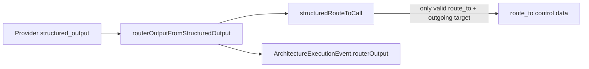

Implemented:

- `routerOutputFromStructuredOutput()` is exported and accepts all typed `ArchitectureRouterNextAction` enum values.
- Structured `acceptedInputs`, `rejectedInputs`, `unresolvedConflicts`, and `risks` are preserved instead of flattened to empty arrays.
- Nullable provider schema fields such as `whyAccepted: null` / `whyRejected: null` are narrowed to the shared TypeScript contract by omitting those optional fields.
- `routeData()` now stores typed non-routing `routerOutput` without inventing `route_to`; target routing still requires `nextAction: "route_to"` and a target present in the node's outgoing edges.

Verification:

- Red: `corepack pnpm --filter kalio-api test -- src/modules/architecture/architecture-role-executor.spec.ts` failed because structured `nextAction: "finalize"` produced `result.data.routerOutput === undefined`.
- Red: `corepack pnpm --filter kalio-api test -- src/modules/architecture/architecture-structured-output.spec.ts` failed because typed router inputs/risks/conflicts were flattened to empty arrays.
- Green: `corepack pnpm --filter kalio-api test -- src/modules/architecture/architecture-role-executor.spec.ts src/modules/architecture/architecture-structured-output.spec.ts` passed with 57 tests.
- Green: `corepack pnpm --filter kalio-api typecheck` passed.
- Green: `node --test scripts/code-audit/audit-scripts.test.mjs` passed with 9 tests.
- Green: scoped `git diff --check` passed for touched backend files with only LF-to-CRLF warnings.

Remaining follow-up:

- Continue auditing GraphRuntime terminal-state decisions for any remaining display-message or fallback-derived route metadata.
- Add browser-backed proof only when the next slice changes FE projection/rendering; this slice is backend contract preservation only.

## Continuation: Typed Router HITL Gate

Router `nextAction: "ask_human"` is now a typed runtime pause instead of a display-only router note that can still fall through to the fallback route and finalize.

Before this slice:

- fallback router policy could produce `routerOutput.nextAction = "ask_human"`;
- router-role structured output could also return `nextAction = "ask_human"`;
- GraphRuntime still returned fallback selected node ids, so the workflow could continue to an artifact/finalizer despite the typed human decision.

Target behavior for this slice:

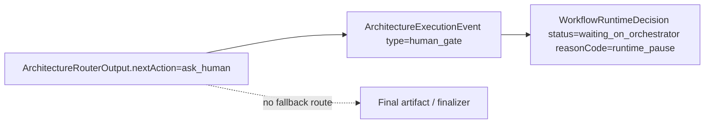

Implemented:

- Both sync fallback routers and subagent-executed router-role nodes emit `human_gate` when typed router output asks for human input.
- The human gate carries typed `reasonCode: "runtime_pause"` and `runtimeDecision.status: "waiting_on_orchestrator"`.
- The router returns no selected node ids in that branch, so fallback routing cannot silently continue into finalization.
- `ArchitectureRun.status` remains `running` for now because the shared `ArchitectureRunStatus` union does not yet include a dedicated waiting/HITL value; typed pause lives on the event/runtime decision.

Verification:

- Red: `corepack pnpm --filter kalio-api test -- src/modules/architecture/architecture-runtime.service.spec.ts` failed because fallback `ask_human` created no `human_gate`.
- Red: after covering the fallback path, the router-role/subagent execution test failed because structured `ask_human` from the router slot still created no `human_gate`.
- Green: `corepack pnpm --filter kalio-api test -- src/modules/architecture/architecture-runtime.service.spec.ts` passed with 88 tests.
- Green: `corepack pnpm --filter kalio-api test -- src/modules/architecture/architecture-runtime.service.spec.ts src/modules/architecture/architecture-graph-runtime.max-visits.spec.ts src/modules/architecture/architecture-structured-output.spec.ts` passed with 98 tests.
- Green: `corepack pnpm --filter kalio-api typecheck` passed.
- Green: `node --test scripts/code-audit/audit-scripts.test.mjs` passed with 9 tests.
- Green: scoped `git diff --check` passed for touched files with only LF-to-CRLF warnings.

Remaining follow-up:

- Decide whether `ArchitectureRunStatus` should gain a wire-compatible `waiting_on_human`/`hitl` status or whether event-level `runtimeDecision` remains the durable pause source.
- Handle typed `run_more_research` / `rerun_with_different_personas` explicitly instead of leaving them as router metadata.

## Continuation: Typed Router Research Route

Router `nextAction: "run_more_research"` is now a control-plane decision when it has a typed route target, not a display-only note that can still fall through to the default artifact/finalizer path.

Target behavior for this slice:

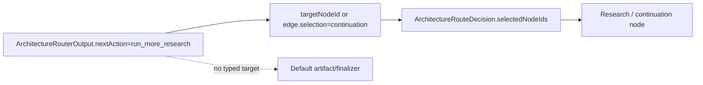

Implemented:

- Sync fallback routers can route `run_more_research` through an explicit `edge.selection = "continuation"` instead of selecting the first fallback edge.
- Subagent-executed router-role nodes can route `run_more_research` through typed provider `routerOutput.targetNodeId`.
- The route event and router output now stay aligned: `selectedNodeIds`, `rejectedNodeIds`, `nextNodeId`, `selectedStrategy`, and `targetNodeId` point to the same typed target.
- Runtime does not infer research targets from display messages, node labels, legacy `routeToNodeId`, node-level convergence hints, or arbitrary rejected route text.

Verification:

- Red: `corepack pnpm --filter kalio-api test -- src/modules/architecture/architecture-runtime.service.spec.ts` failed because fallback `run_more_research` still selected `artifact`.
- Green: `corepack pnpm --filter kalio-api test -- src/modules/architecture/architecture-runtime.service.spec.ts` passed with 89 tests.
- Regression caught and fixed: the first implementation used rejected inputs too broadly and broke legacy route/convergence guards.
- Green: `corepack pnpm --filter kalio-api test -- src/modules/architecture/architecture-runtime.service.spec.ts src/modules/architecture/architecture-graph-runtime.max-visits.spec.ts src/modules/architecture/architecture-structured-output.spec.ts src/modules/architecture/architecture-router-output.spec.ts` passed with 101 tests.
- Green: `corepack pnpm --filter kalio-api typecheck` passed.
- Green: `node --test scripts/code-audit/audit-scripts.test.mjs` passed with 9 tests.
- Green: scoped `git diff --check` passed with only LF-to-CRLF warnings.

Remaining follow-up:

- Decide whether waiting/research continuation should also project a distinct run-level status, or remain event/route-level typed state.
- Define a richer automatic persona-rerun execution contract if the runtime should spawn replacement branches without orchestrator input.

## Continuation: Typed Router Persona Rerun Pause

Router `nextAction: "rerun_with_different_personas"` is now an explicit runtime pause instead of display metadata that can fall through to the fallback artifact/finalizer path.

Target behavior for this slice:

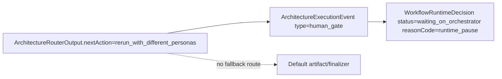

Implemented:

- Router-role structured output with `rerun_with_different_personas` emits a typed `human_gate`.
- The gate carries `reasonCode: "runtime_pause"` and `runtimeDecision.status: "waiting_on_orchestrator"`.
- The router returns no selected node ids in this branch, so fallback artifact/finalizer execution is not queued.
- This slice does not invent a persona replacement algorithm; automatic rerun requires a future typed contract for persona set selection and branch replacement.

Verification:

- Red: `corepack pnpm --filter kalio-api test -- src/modules/architecture/architecture-runtime.service.spec.ts` failed because typed `rerun_with_different_personas` produced no `human_gate`.
- Green: `corepack pnpm --filter kalio-api test -- src/modules/architecture/architecture-runtime.service.spec.ts` passed with 90 tests.
- Green: `corepack pnpm --filter kalio-api test -- src/modules/architecture/architecture-runtime.service.spec.ts src/modules/architecture/architecture-graph-runtime.max-visits.spec.ts src/modules/architecture/architecture-structured-output.spec.ts src/modules/architecture/architecture-router-output.spec.ts` passed with 102 tests.
- Green: `corepack pnpm --filter kalio-api typecheck` passed.
- Green: `node --test scripts/code-audit/audit-scripts.test.mjs` passed with 9 tests.
- Green: `npm.cmd run audit:report` passed; `docs/audit/2026-06-30-report.md` totals are CRITICAL 25, HIGH 4, MEDIUM 87, LOW 63. The HIGH rows are circular dependencies, not string-driven runtime control flow.
- Green: scoped `git diff --check` passed with only LF-to-CRLF warnings.

Remaining follow-up:

- Decide whether `ArchitectureRun.status` should expose a run-level waiting/HITL state in addition to event-level `runtimeDecision`.
- Define the typed branch replacement model for fully automatic persona reruns if the product wants that beyond orchestrator pause/resume.

## Continuation: Typed Session Title Project Scope

Session title fallback no longer derives architecture project names from free-form prompt text such as `C:\...` paths. Typed `runtimeContext.architectureContext.projectPath` / `executionCwd` is now the only source for the project name in the `Architecture Review <project>` fallback.

Target behavior for this slice:

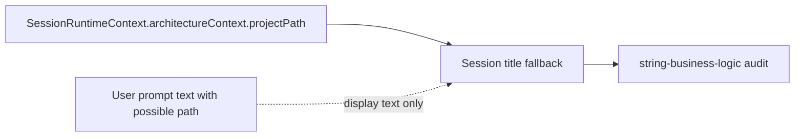

Implemented:

- `SessionsService.generateTitle()` now reads the session row once and passes typed `runtimeContext` into deterministic fallback title generation.
- `Architecture Review <project>` uses `projectPathFromRuntimeContext()` and no longer scans the prompt for Windows paths.
- Prompt-only architecture requests without typed project scope fall back to neutral `Architecture Review` instead of extracting a project name from text.
- Removed the `content.match(...)` path parser that produced the backend chat `string-business-logic` audit row.

Verification:

- Red: `corepack pnpm --filter kalio-api test -- src/modules/chat/__tests__/sessions.service.spec.ts` failed because prompt-only text still produced `Architecture Review FamilyQuest`.
- Green: `corepack pnpm --filter kalio-api test -- src/modules/chat/__tests__/sessions.service.spec.ts` passed with 27 tests.
- Green: `corepack pnpm --filter kalio-api typecheck` passed.
- Green: `node --test scripts/code-audit/audit-scripts.test.mjs` passed with 9 tests.
- Green: `npm.cmd run audit:report` passed; `docs/audit/2026-06-30-report.md` totals are CRITICAL 25, HIGH 4, MEDIUM 86, LOW 63. The previous `apps/kalio-api/src/modules/chat/sessions.service.ts content.match(...)` row is gone.
- Green: scoped `git diff --check` passed with only LF-to-CRLF warnings.

Remaining follow-up:

- Remaining backend MEDIUM string rows are outside chat/workflow runtime: memory/web-search chunking, RAApp helpers, and tool grouping/search/display paths.
- Full goal remains open for a broader requirement-by-requirement audit across workflow, turn, CLI/subagent, and FE projection.

## Continuation: Explicit Tool Audit Domains

Chat turn audit/projection metadata no longer infers file/VFS domains from tool-name prefixes or substrings such as `vfs_`, `fs_`, `file_search`, or `grep`.

Target behavior for this slice:

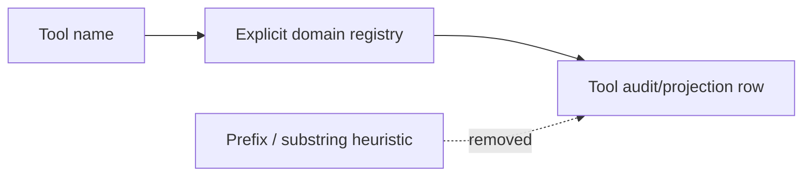

Implemented:

- `audit-tool-data.ts` now uses explicit `SUBAGENT_TOOL_NAMES`, `VFS_TOOL_NAMES`, and `FILE_TOOL_NAMES` sets.
- Unknown tools with matching-looking names such as `vfs_fake` or `debug_grep_notes` remain `generic`.
- Existing typed architecture context still wins through explicit `architectureRunId`.
- Removed the backend chat audit rows for `toolName.startsWith(...)` / `toolName.includes(...)` in this file.

Verification:

- Red: `corepack pnpm --filter kalio-api test -- src/modules/chat/audit-tool-data.spec.ts` failed because `vfs_fake` was classified as `vfs`.
- Green: `corepack pnpm --filter kalio-api test -- src/modules/chat/audit-tool-data.spec.ts` passed with 4 tests.
- Green: `corepack pnpm --filter kalio-api test -- src/modules/chat/audit-tool-data.spec.ts src/modules/chat/__tests__/llm-turn-runtime.service.spec.ts src/modules/chat/chat.runtime-snapshot.spec.ts` passed with 42 tests.
- Green: `corepack pnpm --filter kalio-api typecheck` passed.
- Green: `node --test scripts/code-audit/audit-scripts.test.mjs` passed with 9 tests.
- Green: `npm.cmd run audit:report` passed; `docs/audit/2026-06-30-report.md` totals are CRITICAL 25, HIGH 4, MEDIUM 86, LOW 63. `audit-tool-data.ts` no longer appears in the string-business-logic section.

Remaining follow-up:

- Consider moving tool audit domain to shared `ToolMeta` if/when the tool catalog exposes a stable domain field at this boundary.
- Remaining backend rows in the audit are outside primary chat/turn runtime control flow: memory chunking, RAApp metadata extraction, and tool search/display definitions.

## Continuation: Shared ToolMeta Domain Contract

Tool catalog domain classification moved from backend/FE name-prefix heuristics into shared `ToolMeta.domain`.

Current architecture before this slice:

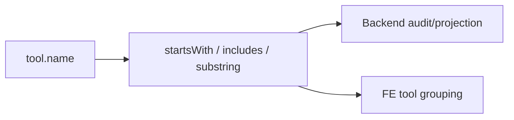

Target architecture after this slice:

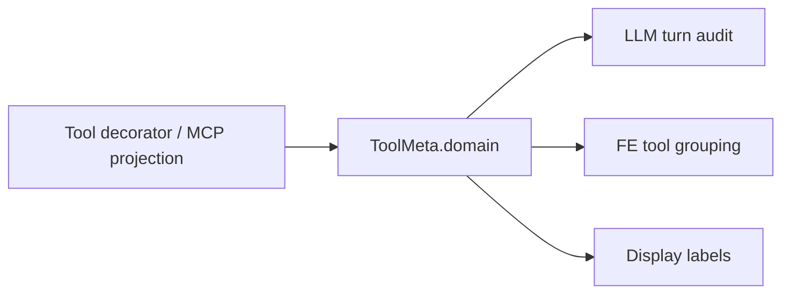

Affected models:

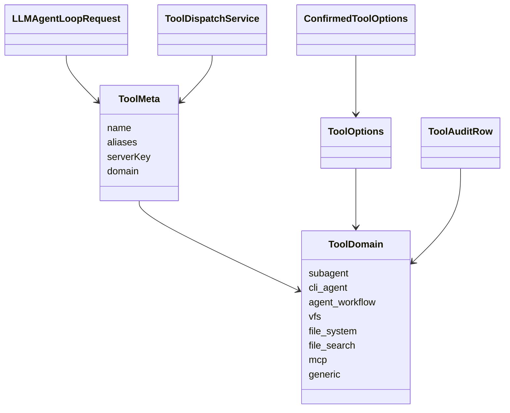

Implemented:

- Added shared `ToolDomain` and optional `ToolMeta.domain` to `@kalio/types`.
- Added `domain?: ToolDomain` to backend `ToolOptions` / `ConfirmedToolOptions`.
- Native tool decorators now declare their stable domain.
- MCP tool projection now emits `domain: "mcp"` from `ToolDispatchService.getToolMetas()`.
- `LLMTurnRuntimeService` passes matched `ToolMeta` into audit rows; audit classification uses typed domains first and only exact legacy name sets as compatibility fallback.
- `tool.utils.ts` groups tools by `ToolMeta.domain`; legacy compatibility is exact-name only with `TODO: legacy fallback`, not prefix/substr matching.
- Removed the redundant `fs_` prefix branch from `toolTargetLabel.ts`; target labels now use explicit VFS handling plus generic path argument display.

Verification:

- Red/green: `corepack pnpm --filter kalio-api test -- src/modules/chat/audit-tool-data.spec.ts` first failed because typed domain metadata was ignored, then passed.
- Red/green: `corepack pnpm --filter kalio-web test -- src/features/tools/tool.utils.test.ts` first failed because `vfs_fake`/`fs_fake`/`mcp_fake` were grouped by prefixes, then passed.
- Green: `corepack pnpm --filter @kalio/types test -- src/__tests__/contracts.test.ts` passed with 13 tests.
- Green: `corepack pnpm --filter kalio-api test -- src/modules/chat/audit-tool-data.spec.ts src/modules/chat/__tests__/llm-turn-runtime.service.spec.ts src/modules/chat/__tests__/tool-dispatch.service.spec.ts` passed with 45 tests.
- Green: `corepack pnpm --filter kalio-web test -- src/features/tools/tool.utils.test.ts` passed with 6 tests.
- Green: `corepack pnpm --filter @kalio/types typecheck`, `corepack pnpm --filter kalio-api typecheck`, and `corepack pnpm --filter kalio-web typecheck` passed.
- Green: `node --test scripts/code-audit/audit-scripts.test.mjs` passed with 9 tests.
- Green: `npm.cmd run audit:report` passed; `docs/audit/2026-06-30-report.md` totals are CRITICAL 25, HIGH 4, MEDIUM 75, LOW 63. The HIGH rows are circular dependencies, not string-driven runtime control flow, and touched tool-domain files do not appear in the string-driven business logic section.

Remaining follow-up:

- `mcpToolAllowList.ts` still contains legacy `mcp_` prefix compatibility for persisted allow-list migration; this is not workflow routing, but should eventually move to explicit alias metadata everywhere.
- Remaining `string-driven business logic` MEDIUM rows are outside this tool-domain slice: memory/web-search chunking, RAApp metadata extraction, list-tools/skill search, Architect graph name search, Observability label heuristics, and RAApp manager display filtering.

## Continuation: MCP Allow-List Alias Metadata

MCP allow-list normalization no longer derives legacy aliases by parsing `mcp_` name prefixes or suffixes.

Current architecture before this slice:

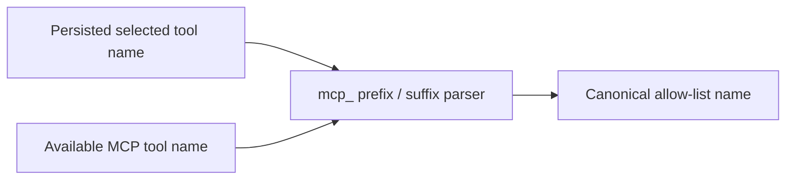

Target architecture after this slice:

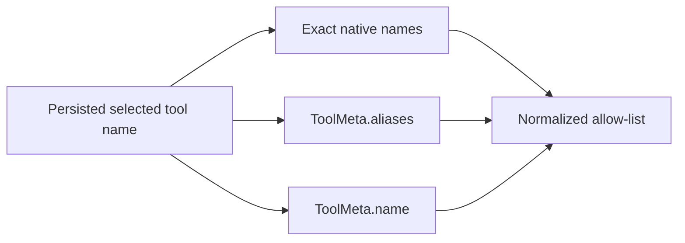

Implemented:

- `normalizeMcpAllowList()` now accepts MCP `ToolMeta.aliases` and maps legacy selections only when alias metadata explicitly points to one canonical tool.
- Ambiguous aliases are rejected through the alias map instead of guessed by suffix.
- Unknown names without native/canonical/alias evidence are preserved to avoid deleting native selections while the catalog is incomplete.
- `PersonaToolPicker` groups loaded tools through `ToolMeta.domain` via `getToolGroupKey(tool)`.
- `PersonaToolBadges` no longer splits selected tools with `startsWith("mcp_")`; it groups known native exact names and treats unknown selected names as MCP summary items only when MCP policy is enabled.

Verification:

- Red: `corepack pnpm --filter kalio-web test -- src/features/persona/mcpToolAllowList.test.ts` failed because metadata-less `mcp_docs_search` was still guessed to `mcp_toml::docs_search`.
- Green: `corepack pnpm --filter kalio-web test -- src/features/persona/mcpToolAllowList.test.ts src/features/persona/PersonaToolPicker.test.tsx` passed with 14 tests.
- Green: `corepack pnpm --filter kalio-web test -- src/features/tools/tool.utils.test.ts` passed with 6 tests.
- Green: `corepack pnpm --filter kalio-web typecheck` passed.
- Green: scoped `rg` found no `startsWith` / legacy MCP suffix parser in `apps/kalio-web/src/features/persona` or `apps/kalio-web/src/features/tools`.
- Green: `node --test scripts/code-audit/audit-scripts.test.mjs` passed with 9 tests.
- Green: `npm.cmd run audit:report` passed; `docs/audit/2026-06-30-report.md` totals are CRITICAL 25, HIGH 4, MEDIUM 75, LOW 63.

Remaining follow-up:

- Persona badge MCP counting still has limited data because persisted persona selected tool names do not carry `ToolMeta` metadata. It no longer parses prefixes, but a future richer persisted selection model could remove the unknown-name display fallback entirely.

## Continuation: Timeline Typed Labels And Partial Trace Guard

Execution Timeline no longer infers router actor labels from free-form trace content such as `Orchestrator hit a recoverable branch error...`.

Current architecture before this slice:

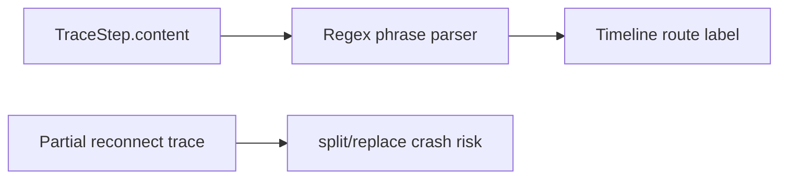

Target architecture after this slice:

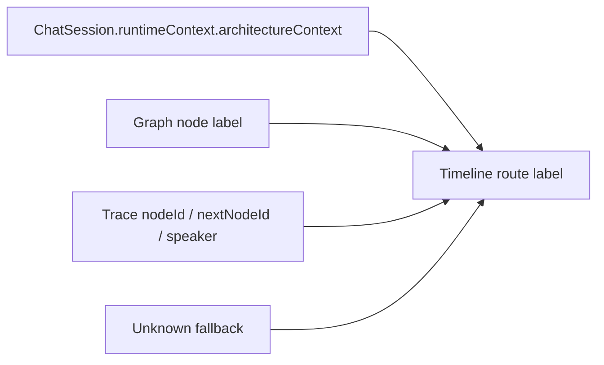

Implemented:

- Removed `inferRouterActorLabel()` from `ArchitectureRunTimeline.stages.ts`.
- Router labels now come from planned graph label, typed session metadata, or deterministic ids; trace content is display text only.
- `nodeLabel()` now narrows runtime values with `firstNonEmptyString()` before string operations and falls back to `Unknown` for partial reconnect/projection events.

Verification:

- Red: `corepack pnpm --filter kalio-web test -- src/features/chat/ArchitectureRunTimeline.test.tsx -t "does not infer router labels"` failed because timeline still rendered `Orchestrator` from degraded content.
- Green: same focused test passed after removing content inference.
- Red: `corepack pnpm --filter kalio-web test -- src/features/chat/ArchitectureRunTimeline.test.tsx -t "partial trace step"` failed with `Cannot read properties of undefined (reading 'split')`.
- Green: same focused test passed after runtime narrowing/fallback.
- Green: `corepack pnpm --filter kalio-web test -- src/features/chat/ArchitectureRunTimeline.test.tsx` passed with 13 tests.
- Green: `corepack pnpm --filter kalio-web typecheck` passed.
- Green: `node --test scripts/code-audit/audit-scripts.test.mjs` passed with 9 tests.
- Green: `npm.cmd run audit:report` passed; `docs/audit/2026-06-30-report.md` totals are CRITICAL 25, HIGH 4, MEDIUM 75, LOW 63.

Remaining follow-up:

- This fixes one timeline projection crash class and removes one content-derived label fallback. It is not a full browser-backed reconnect/F5 proof yet.

## Continuation: Chat Turn Content Runtime Guard

Frontend chat turn dedupe no longer assumes hydrated assistant message content is always a string before calling string methods.

Current architecture before this slice:

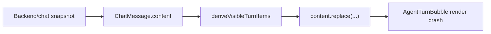

Target architecture after this slice:

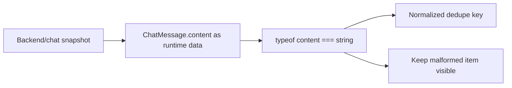

Implemented:

- `normalizeAssistantContent()` now accepts `unknown` and returns an empty normalized value for non-string runtime data.
- Malformed assistant text items remain visible instead of being deduped or crashing `AgentTurnBubble`.
- The guard stays at the projection/dedupe boundary; it does not infer workflow state from message text.

Verification:

- Red: `corepack pnpm --filter kalio-web test -- src/features/chat/agentTurnVisibleItems.test.ts -t "malformed assistant"` failed with `Cannot read properties of undefined (reading 'replace')`.
- Green: same focused test passed after runtime narrowing.
- Green: `corepack pnpm --filter kalio-web test -- src/features/chat/agentTurnVisibleItems.test.ts` passed with 7 tests.

## Continuation: Backend Session Title Content Guard

Backend session title generation no longer assumes persisted chat history message content is always a string before normalizing title prompt context.

Current architecture before this slice:

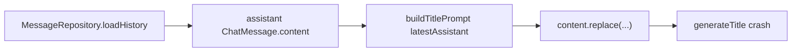

Target architecture after this slice:

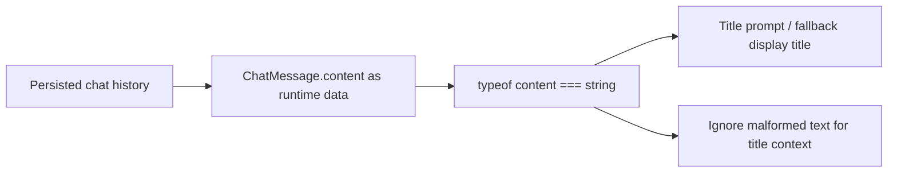

Implemented:

- `normalizeConversationLine()` now accepts `unknown` and returns an empty normalized value for non-string runtime data.
- Malformed assistant history is ignored while building latest-assistant title context instead of crashing `SessionsService.generateTitle()`.
- This remains display/title generation only; it does not infer chat or workflow runtime state from message text.

Verification:

- Red: `corepack pnpm --filter kalio-api test -- src/modules/chat/__tests__/sessions.service.spec.ts -t "malformed assistant"` failed with `Cannot read properties of undefined (reading 'replace')`.
- Green: same focused test passed after runtime narrowing.
- Green: `corepack pnpm --filter kalio-api test -- src/modules/chat/__tests__/sessions.service.spec.ts` passed with 28 tests.

## Continuation: Runtime Evidence Tool Result Content Guard

Frontend runtime attention selection no longer assumes persisted `tool_result.content` is a string before deciding whether a typed runtime error exists.

Current architecture before this slice:

```mermaid
flowchart LR
  History["Session messages after reconnect/F5"]
  ToolResult["tool_result.content"]
  Attention["selectRuntimeAttentionItems"]
  StringOp["content.trim()"]
  Crash["Runtime attention selector crash"]

  History --> ToolResult
  ToolResult --> Attention
  Attention --> StringOp
  StringOp --> Crash
```

Target architecture after this slice:

```mermaid
flowchart LR
  History["Session messages after reconnect/F5"]
  ToolResult["tool_result.content as runtime data"]
  Guard["typeof content === string"]
  TypedJson["JSON with typed errorCode/code"]
  Attention["runtime_timeout/runtime_error attention"]
  Ignore["Ignore malformed/non-typed payload"]

  History --> ToolResult
  ToolResult --> Guard
  Guard --> TypedJson
  TypedJson --> Attention
  Guard --> Ignore
```

Implemented:

- `extractToolResultEvidence()` now accepts `unknown` and ignores non-string or blank payloads.
- `extractLatestVisibleRuntimeEvidence()` delegates content validation to the evidence parser instead of calling `.trim()` on raw persisted content.
- Runtime attention still requires a typed `toolResultErrorCode`, `errorCode`, or `code`; malformed content cannot become control-flow.

Verification:

- Red: `corepack pnpm --filter kalio-web test -- src/store/agentRuntimeSelectors.test.ts -t "malformed tool result"` failed with `Cannot read properties of undefined (reading 'trim')`.
- Green: same focused test passed after runtime narrowing.
- Green: `corepack pnpm --filter kalio-web test -- src/store/agentRuntimeSelectors.test.ts` passed with 28 tests.

## Continuation: Reconnect Hydration Runtime Data Guards

Frontend reconnect/F5 hydration boundaries now reject malformed runtime data before string operations.

Current architecture before this slice:

```mermaid
flowchart LR
  Socket["session:runtime_snapshot"]
  RuntimeStore["agentStore.setRuntimeActivitySnapshot"]
  CliChild["CLI child projection merge"]
  ArchProjection["architecture run chat projection"]
  StringOps["sessionId.trim / lastOutput.trim / content.trim"]
  Crash["Reconnect/F5 hydration crash"]

  Socket --> RuntimeStore
  Socket --> CliChild
  ArchProjection --> StringOps
  RuntimeStore --> StringOps
  CliChild --> StringOps
  StringOps --> Crash
```

Target architecture after this slice:

```mermaid
flowchart LR
  RuntimeData["Socket/API runtime data"]
  Guard["typeof value === string"]
  Store["Runtime snapshot store"]
  CliProjection["CLI child projection"]
  ArchFallback["Typed graph/event fallback"]
  Ignore["Ignore malformed payload"]

  RuntimeData --> Guard
  Guard --> Store
  Guard --> CliProjection
  Guard --> ArchFallback
  Guard --> Ignore
```

Implemented:

- `agentStore` ignores malformed `sessionId` values for runtime/status snapshot ingestion instead of crashing before state sync.
- CLI child projection sanitizes runtime child `lastOutput`; non-string runtime output falls back to stored projection output.
- Architecture reload hydration ignores malformed chat projection content and rebuilds visible child transcript from typed graph/event data.

Verification:

- Red/green: `corepack pnpm --filter kalio-web test -- src/store/agentStore.test.ts -t "runtime snapshot ingestion"` reproduced and fixed `snapshot.sessionId.trim is not a function`.
- Green: `corepack pnpm --filter kalio-web test -- src/store/agentStore.test.ts` passed with 18 tests.
- Red/green: `corepack pnpm --filter kalio-web test -- src/features/chat/cliChildProjection.model.test.ts -t "malformed"` reproduced and fixed `runtimeProjection.lastOutput.trim is not a function`.
- Green: `corepack pnpm --filter kalio-web test -- src/features/chat/cliChildProjection.model.test.ts` passed with 12 tests.
- Red/green: `corepack pnpm --filter kalio-web test -- src/features/chat/architectureReloadHydration.test.ts -t "malformed"` reproduced and fixed `latestChatMessage?.content?.trim is not a function`.
- Green: `corepack pnpm --filter kalio-web test -- src/features/chat/architectureReloadHydration.test.ts` passed with 4 tests.

## Continuation: FE-First Reconnect/F5 Runtime Proof

The repaired runtime/projection guards were verified against a browser-backed architecture workflow reload path.

Current proof gap before this slice:

```mermaid
flowchart LR
  UnitTests["Unit guards"]
  Runtime["Backend runtime snapshots/projections"]
  FE["Talk / Canvas / Session Panel / Execution Graph"]
  Reload["F5 reconnect"]
  Gap["No live FE proof"]

  UnitTests --> Gap
  Runtime --> Reload
  Reload --> FE
  FE --> Gap
```

Target proof after this slice:

```mermaid
flowchart LR
  BuiltBackend["Built kalio-api random port"]
  BuiltFrontend["Built kalio-web preview random port"]
  Workflow["Strategic Decision Council workflow"]
  Reload["Browser reload / socket re-identify"]
  Surfaces["Talk + Canvas + Session Panel + Execution Graph"]
  ChildChat["Open child chat"]

  BuiltBackend --> Workflow
  BuiltFrontend --> Workflow
  Workflow --> Reload
  Reload --> Surfaces
  Surfaces --> ChildChat
```

Verification:

- Green: `corepack pnpm --filter @kalio/e2e run test:e2e -- tests/architecture-chat-subagent-turn.spec.ts -g "renders council branches as sub-agent chips and restores them after reload"` passed.
- The E2E built backend and frontend, started a random-port Playwright stack, completed the five-branch Strategic Decision Council workflow, reloaded the browser, re-identified root/branch/router/finalizer sessions, verified Talk timeline status, Canvas, Session Panel agent filter, Execution Graph nodes, and `Open child chat` for branch sessions.

Remaining follow-up:

- This is a strong browser-backed reconnect/F5 proof for architecture workflow projection.
- It does not yet prove stop/follow-up drain, queue state visibility, or every CLI/subagent/AgentFlow variant.

## Continuation: Stop/Queue Typed Drop And Reconnect Projection Fallback

Current gap before this slice:

```mermaid
flowchart LR
  Queue["Queued follow-up turns"]
  Stop["chat:stop / disconnect cleanup"]
  Delete["queues.delete(sessionId)"]
  FE["Frontend queue badge / active turn"]
  ProjectionFetch["Reconnect architecture projection fetch"]
  NetworkError["Network/CORS/provider outage"]
  Hydration["History hydration"]

  Queue --> Stop
  Stop --> Delete
  Delete --> FE
  ProjectionFetch --> NetworkError
  NetworkError --> Hydration
```

Target contract after this slice:

```mermaid
flowchart LR
  Queue["Queued follow-up turns"]
  Stop["chat:stop / disconnect cleanup"]
  Dropped["chat:error code=QUEUE_DROPPED"]
  FEQueue["Reset queue depth only"]
  ActiveTurn["Active turn preserved until own terminal status"]
  Projection["Typed architecture projection"]
  StructuralFallback["Structured host history fallback"]
  Hydration["Workflow-envelope hydration"]

  Queue --> Stop
  Stop --> Dropped
  Dropped --> FEQueue
  Dropped --> ActiveTurn
  Projection --> Hydration
  Projection --> StructuralFallback
  StructuralFallback --> Hydration
```

Affected model relation:

```mermaid
classDiagram
  ChatSession "1" --> "*" ChatTurn
  ChatTurn "0..*" --> QueuedFollowUp
  QueuedFollowUp --> ChatError
  RuntimeActivitySnapshot --> RuntimeQueueProjection
  ArchitectureHostHistory --> ArchitectureRunSummary

  class QueuedFollowUp {
    sessionId
    emit
  }
  class ChatError {
    code QUEUE_DROPPED
    hadContent false
  }
  class RuntimeQueueProjection {
    queueLength
  }
  class ArchitectureRunSummary {
    runId
    hostProjectionKind workflow-envelope
  }
```

Implemented:

- Added shared socket error code `QUEUE_DROPPED`.
- `SessionPipelineService.stop()`, `stopAndDrain()`, and `abortAll()` now emit typed `chat:error` for each dropped queued follow-up instead of silently deleting queue entries.
- Frontend `chat:error` handles `QUEUE_DROPPED` as queued follow-up cleanup: reset queue depth, do not remove the active turn or mark tool activities failed.
- Reconnect hydration now supports dependency-injected `fetchArchitectureRunProjection` through `handleSocketReconnect -> hydrateActiveConversationSession -> hydrateSessionHistoryIntoStore -> reloadSessionHistoryWithArchitectureProjection`.
- Architecture reconnect hydration treats typed projection fetch as primary, but falls back to already-structured host history when the projection endpoint is temporarily unavailable. It does not infer terminal status from prose.
- Terminal `session:runtime_snapshot` test now asserts `queueLength: 0` resets visible queued depth.

Verification:

- Red: `corepack pnpm --filter kalio-api test -- src/modules/chat/__tests__/session-pipeline.service.spec.ts -t "stopAndDrain aborts|disconnect/abortAll purges"` failed because queued items only had `chat:queued`.
- Green: same backend test passed after `QUEUE_DROPPED`.
- Red: `corepack pnpm --filter kalio-web test -- src/features/chat/hooks/useChatSocketEvents.queued.test.ts -t "QUEUE_DROPPED"` failed because queue depth stayed at 2.
- Green: same frontend test passed after the typed `QUEUE_DROPPED` branch.
- Green: `corepack pnpm --filter kalio-web test -- src/features/chat/hooks/useChatSocketEvents.queued.test.ts src/features/chat/hooks/useChatSocketEvents.reconnect.test.ts src/store/agentRuntimeSelectors.test.ts src/store/agentStore.test.ts src/features/chat/ChatInput.spec.tsx src/features/chat/architectureReloadHydration.test.ts` passed with 73 tests.
- Green: `corepack pnpm --filter kalio-api test -- src/modules/chat/__tests__/session-pipeline.service.spec.ts src/modules/chat/__tests__/session-pipeline-bugs.spec.ts src/modules/chat/__tests__/chat.gateway.spec.ts` passed with 58 tests.
- Green: `corepack pnpm --filter kalio-web typecheck`.
- Green: `corepack pnpm --filter kalio-api typecheck`.
- Green: `corepack pnpm --filter @kalio/types test -- src/__tests__/contracts.test.ts` passed with 13 tests.
- Green: `corepack pnpm --filter @kalio/e2e run test:e2e -- tests/regression-stop-follow-up.spec.ts tests/workflow-stop-runtime.spec.ts tests/chat-reconnect-hydration.spec.ts` passed with 3 browser tests. The gate built backend/frontend, verified reconnect clears stale pending confirmation, stop drains active turn before follow-up starts fresh instead of queueing, and workflow stop clears the stop action plus queued badge.

Additional implementation: Execution Graph CLI live-action gate

Current gap:

```mermaid
flowchart LR
  CliNode["CLI graph node"]
  KindCheck["payload.kind == cli-agent"]
  SessionCheck["child session exists"]
  Actions["Send follow-up / Stop run"]

  CliNode --> KindCheck
  KindCheck --> SessionCheck
  SessionCheck --> Actions
```

Target behavior:

```mermaid
flowchart LR
  CliNode["CLI graph node"]
  Snapshot["CLIAgentSessionSnapshot"]
  Status["snapshot.status"]
  Running["running"]
  LiveActions["Send follow-up / Stop run"]
  Completed["completed / failed / stopped"]
  OpenChat["Open child chat only"]

  CliNode --> Snapshot
  Snapshot --> Status
  Status --> Running
  Running --> LiveActions
  Status --> Completed
  Completed --> OpenChat
```

Affected model relation:

```mermaid
classDiagram
  ExecutionGraphNode --> CliAgentPayload
  CliAgentPayload --> CLIAgentSessionSnapshot
  CLIAgentSessionSnapshot --> CLIStatus
  CLIStatus --> GraphInspectorActions

  class CliAgentPayload {
    kind cli-agent
    snapshot
  }
  class CLIAgentSessionSnapshot {
    status running|completed|failed|stopped
  }
```

Implemented:

- `GraphInspectorActions` now renders CLI live controls only when `node.payload.kind === 'cli-agent'` and `node.payload.snapshot.status === 'running'`.
- Completed CLI child nodes still expose `Open child chat`, but no longer expose live runtime controls.
- Added regression coverage proving a completed nested CLI child does not render `Send follow-up` or `Stop run`.

Verification:

- Red: `corepack pnpm --filter kalio-web test -- src/features/chat/graph/ExecutionGraphView.test.tsx -t "nested subagent to CLI-agent chain"` failed because completed CLI still rendered `Send follow-up`.
- Green: same test passed after typed status gating.
- Green: `corepack pnpm --filter kalio-web test -- src/features/chat/graph/ExecutionGraphView.test.tsx -t "CLI child"` passed with 3 tests, preserving running CLI controls and stop-failure notice.
- Green: `corepack pnpm --filter kalio-web test -- src/features/chat/graph/ExecutionGraphView.test.tsx` passed with 29 tests.
- Green: `corepack pnpm --filter kalio-web typecheck`.
- Green: `node --test scripts/code-audit/audit-scripts.test.mjs` passed with 9 tests.
- Green: `npm.cmd run audit:report` passed; `docs/audit/2026-06-30-report.md` totals are CRITICAL 25, HIGH 4, MEDIUM 74, LOW 64. HIGH rows remain existing circular dependencies, not string-driven runtime control flow.

Remaining follow-up:

- Broader CLI/subagent/AgentFlow variant proof remains open across live and reconnect paths.

## Continuation: AgentFlow Waiting F5 And No-Prose Backend Reconstruction

Current gap:

```mermaid
flowchart LR
  AgentFlowWaiting["AgentFlow waiting_on_orchestrator"]
  Reload["Browser reload / socket re-identify"]
  Talk["Talk result bubble"]
  Canvas["AgentFlow canvas"]
  Graph["Execution Graph"]
  RawXml["Subagent raw XML text"]
  ToolDispatch["Tool dispatch"]
  Markdown["### Router / ### Finalizer prose"]
  DurableGraph["Durable graph reconstruction"]

  AgentFlowWaiting --> Reload
  Reload --> Talk
  Reload --> Canvas
  Reload --> Graph
  RawXml --> ToolDispatch
  Markdown --> DurableGraph
```

Target behavior:

```mermaid
flowchart LR
  TypedRun["Typed AgentFlow run status"]
  Waiting["waiting_on_orchestrator + runId"]
  Resume["Resume AgentFlow action"]
  Reload["Browser reload / reconnect"]
  Surfaces["Talk + Canvas + Execution Graph"]
  CompatTool["raw XML compat tool: run_cli_agent only"]
  TypedRoutes["architectureRun.routeHops / typed tool-call args"]
  DurableGraph["Durable graph projection"]

  TypedRun --> Waiting
  Waiting --> Resume
  Reload --> Surfaces
  Waiting --> Surfaces
  CompatTool --> DurableGraph
  TypedRoutes --> DurableGraph
```

Affected model relation:

```mermaid
classDiagram
  AgentFlowRun --> AgentFlowResult
  AgentFlowResult --> RuntimeActivitySnapshot
  RuntimeActivitySnapshot --> RuntimeChildExecution
  ChatMessage --> ArchitectureChatRunSummary
  ArchitectureChatRunSummary --> ArchitectureRouteHop
  LLMText --> RawXmlCompatTool

  class AgentFlowResult {
    status waiting_on_orchestrator
    runId
  }
  class RuntimeChildExecution {
    kind agent_flow
    status waiting
    flowRunId
  }
  class RawXmlCompatTool {
    name run_cli_agent
  }
```

Implemented:

- Extended deterministic AgentFlow E2E so `waiting_on_orchestrator` plus `Resume AgentFlow` survives browser reload across Talk, AgentFlow canvas, and Execution Graph.
- Extended stopped CLI child E2E so after reload the Execution Graph CLI inspector shows typed stopped state details but no live `Send follow-up` or `Stop run` controls.
- Added `getFinalAnswerMessage()` runtime guard so malformed/non-string persisted final-answer content cannot crash Execution Graph projection during reload.
- Raw XML tool-call fallback now accepts only the explicit compatibility tool `run_cli_agent`; non-compat XML such as `vfs_read`/`vfs_write` remains display text even if present in the normal tool allow-list.
- `SubagentRuntimeService` no longer passes every assembled tool name into `rawXmlToolNames`; it passes only `run_cli_agent` when that compatibility tool is actually available.
- Durable architecture graph reconstruction no longer completes router/finalizer nodes or synthesizes router route hops from `### Router` / `### Finalizer` assistant markdown. Completion comes from typed `architectureRun.status`, typed `architectureRun.routeHops`, or typed tool-call args.

Verification:

- Green: `corepack pnpm --filter @kalio/e2e run test:e2e -- tests/regression-cli-child-canvas-preview.spec.ts` passed with 1 browser test after backend/frontend build; reload proved stopped CLI graph node has no live controls.
- Green: `corepack pnpm --filter @kalio/e2e run test:e2e -- tests/agentflow-goal-guard.spec.ts -g "renders parent run_sub_agentflow history bubble"` passed with 1 browser test after backend/frontend build; reload proved waiting AgentFlow status/resume across Talk, Canvas, and Execution Graph.
- Red/green: `corepack pnpm --filter kalio-web test -- src/features/chat/graph/executionGraphModel.helpers.test.ts -t "malformed final-answer"` failed on `content.trim`, then passed after runtime narrowing.
- Green: `corepack pnpm --filter kalio-web test -- src/features/chat/graph/executionGraphModel.helpers.test.ts src/features/chat/graph/ExecutionGraphView.test.tsx` passed with 41 tests.
- Green: `corepack pnpm --filter kalio-web typecheck`.
- Green: `corepack pnpm --filter kalio-api test -- src/modules/chat/__tests__/raw-tool-call.parser.spec.ts src/modules/chat/__tests__/done.handler.spec.ts src/modules/chat/__tests__/subagent-runtime.service.spec.ts -t "raw XML|MiMo|run_cli_agent raw XML|non-compat"` passed with 11 tests. Existing real `run_cli_agent` integration path logs a CLI failure after pass, but assertions pass.
- Red/green: `corepack pnpm --filter kalio-api test -- src/modules/architecture/architecture-durable-graph.spec.ts -t "markdown headers"` failed while markdown still created route hops, then passed after typed-only reconstruction.
- Green: `corepack pnpm --filter kalio-api test -- src/modules/architecture/architecture-durable-graph.spec.ts` passed with 6 tests.
- Green: `corepack pnpm --filter kalio-api typecheck`.
- Scoped grep: production architecture/chat/agent-flow/CLI paths no longer contain backend `### Router` / `### Finalizer` markdown control-flow matches.
- Green: `node --test scripts/code-audit/audit-scripts.test.mjs` passed with 9 tests.
- Green: `npm.cmd run audit:report` passed; `docs/audit/2026-06-30-report.md` totals are CRITICAL 25, HIGH 4, MEDIUM 74, LOW 64. HIGH rows remain existing circular dependencies, not string-driven runtime control flow.

Remaining follow-up:

- Frontend display fallbacks still derive some labels from session titles/ids and architecture trace content cleanup. They are presentation debt, but should move to typed labels when the backend projection can supply them everywhere.
- Existing `run_cli_agent` raw XML compatibility remains a deliberate legacy fallback; the next cleanup should replace it with provider-native structured tool calls where the provider supports them.

## Continuation: AgentFlow Adapter Typed Projection Selectors

Current gap:

```mermaid
flowchart LR
  Event["ArchitectureExecutionEvent"]
  Ids["roleSlotId/nodeId literals"]
  Text["message placeholder"]
  Stop["run_stopped"]
  Mapper["AgentFlow adapter + trace mapping"]
  Snapshot["AgentFlowRunSnapshot"]

  Event --> Ids
  Event --> Text
  Stop --> Mapper
  Ids --> Mapper
  Text --> Mapper
  Mapper --> Snapshot
```

Target behavior:

```mermaid
flowchart LR
  Event["ArchitectureExecutionEvent"]
  Decision["runtimeDecision / data.runtimeDecision"]
  Evidence["WorkflowEvidence"]
  Data["data.slotType / finalArtifactStatus / finalArtifactAnswer"]
  Reason["reasonCode + pendingNodeIds"]
  Mapper["AgentFlow adapter + trace mapping"]
  Snapshot["AgentFlowRunSnapshot"]

  Event --> Decision
  Event --> Evidence
  Event --> Data
  Event --> Reason
  Decision --> Mapper
  Evidence --> Mapper
  Data --> Mapper
  Reason --> Mapper
  Mapper --> Snapshot
```

Affected model relation:

```mermaid
classDiagram
  ArchitectureExecutionEvent --> WorkflowRuntimeDecision
  ArchitectureExecutionEvent --> WorkflowEvidence
  ArchitectureExecutionEvent --> AgentFlowTraceItem
  AgentFlowTraceItem --> AgentFlowRunSnapshot

  class ArchitectureExecutionEvent {
    reasonCode
    data.slotType
    data.finalArtifactStatus
    data.finalArtifactAnswer
  }
  class WorkflowRuntimeDecision {
    status
    reasonCode
    accepted
    nextNodeId
  }
  class WorkflowEvidence {
    kind
    status
  }
```

Implemented:

- `ArchitectureAgentFlowAdapter` now treats `runtimeDecision.reasonCode === 'final_artifact_accepted'` plus typed build/git evidence as the primary finalization acceptance signal, without requiring canonical `goal-master` / `final-artifact` IDs.
- Final artifact summaries prefer structured `data.finalArtifactAnswer` before display `message`; empty-output prose remains only a `TODO: legacy fallback` display compatibility path.
- `agent-flow-trace-mapping` now recognizes guard results from `data.slotType === 'judge'`, top-level `runtimeDecision`, and durable `data.runtimeDecision`.
- Blocked/rejected/incomplete final artifact trace items now project lifecycle/status `blocked` instead of `done`.
- Typed `run_stopped` events with `reasonCode: max_steps` and `pendingNodeIds` now project `waiting_on_orchestrator` and build an AgentFlow continuation cursor.
- Host verification after stale CLI-child evidence now prefers typed `WorkflowEvidence` (`VFS_WRITE` + `BUILD_RESULT`) over legacy `toolEvidence.successfulToolNames`.

Verification:

- Red/green: `corepack pnpm --filter kalio-api test -- src/modules/agent-flow/architecture-agent-flow.adapter.spec.ts src/modules/agent-flow/agent-flow-trace-mapping.spec.ts -t "canonical node ids|structured final artifact answer|renamed judge"` failed on ID/prose selectors, then passed after typed selectors.
- Red/green: `corepack pnpm --filter kalio-api test -- src/modules/agent-flow/agent-flow-trace-mapping.spec.ts` failed on nested `data.runtimeDecision` and blocked final artifact lifecycle, then passed after typed trace mapping.
- Red/green: `corepack pnpm --filter kalio-api test -- src/modules/agent-flow/architecture-agent-flow.adapter.spec.ts src/modules/agent-flow/agent-flow-trace-mapping.spec.ts -t "run-stopped max-step|max-step run stops"` failed on cancelled/failed mapping, then passed after reason-code continuation support.
- Red/green: `corepack pnpm --filter kalio-api test -- src/modules/agent-flow/architecture-agent-flow.adapter.spec.ts -t "typed host evidence"` failed on unresolved CLI blocking, then passed after typed host evidence selectors.
- Green: `corepack pnpm --filter kalio-api test -- src/modules/agent-flow/architecture-agent-flow.adapter.spec.ts src/modules/agent-flow/agent-flow-trace-mapping.spec.ts` passed with 48 tests.
- Green: `corepack pnpm --filter kalio-api typecheck`.
- Green: `node --test scripts/code-audit/audit-scripts.test.mjs` passed with 9 tests.
- Green: `git -C . diff --check` passed; output contains only existing LF/CRLF warnings.
- Green: `npm.cmd run audit:report` passed; `docs/audit/2026-06-30-report.md` totals are CRITICAL 25, HIGH 4, MEDIUM 71, LOW 67.

Remaining follow-up:

- `FLOW_SCHEMA_ALIASES` is still a compatibility bridge for old `goal_guard_delivery_loop` naming.
- Legacy Goal Master summary fallback still exists behind `TODO: legacy fallback` for durable events that predate `runtimeDecision/evidence`.
- Host verification still retains old `toolEvidence.successfulToolNames` and raw `tool_call` name compatibility paths, but they are marked `TODO: legacy fallback`; new runtime evidence should use `WorkflowEvidence`.

## 2026-06-30 Continuation: Real Workflow QA + Stale Pending Removal

Current gap found by Playwright QA:

```mermaid
flowchart LR
  Run["ArchitectureRun.status=completed"]
  Events["ArchitectureExecutionEvent history"]
  NullTyped["final_artifact reason/status/evidence null"]
  Sidebar["Session Panel"]
  OldBranches["old arch-* child sessions"]
  FalsePending["Pending / N pending"]

  Run --> Sidebar
  Events --> NullTyped
  OldBranches --> FalsePending
  FalsePending --> Sidebar
```

Target behavior:

```mermaid
flowchart LR
  Runtime["ArchitectureGraphRuntime"]
  Event["final_artifact event"]
  Evidence["FINAL_ARTIFACT passed"]
  Decision["runtimeDecision done"]
  Projection["Backend/FE projection"]
  Sidebar["Session Panel"]
  Graph["Execution Graph"]

  Runtime --> Event
  Event --> Evidence
  Event --> Decision
  Evidence --> Projection
  Decision --> Projection
  Projection --> Sidebar
  Projection --> Graph
```

Affected model relation:

```mermaid
classDiagram
  ArchitectureExecutionEvent --> WorkflowRuntimeDecision
  ArchitectureExecutionEvent --> WorkflowEvidence
  ChatSession --> SessionRuntimeContext
  SessionRuntimeContext --> SessionRuntimeState

  class ArchitectureExecutionEvent {
    lifecycle
    status
    reasonCode
    evidence
    runtimeDecision
  }
  class WorkflowRuntimeDecision {
    status
    accepted
    reasonCode
  }
  class WorkflowEvidence {
    kind
    status
    source
  }
```

Implemented:

- `ArchitectureGraphRuntime` now emits `run_created` / `node_started` / `node_completed` lifecycle and status fields.
- `final_artifact` events now emit typed `reasonCode: final_artifact_accepted`, `runtimeDecision.status: done`, and `WorkflowEvidenceKind.FINAL_ARTIFACT` evidence.
- Session row runtime state no longer infers `pending` from architecture branch metadata alone; stale historical child sessions without typed live state become neutral instead of false active state.
- Added regression coverage for typed finalizer events and for removing fallback pending from session rows/panels.

Verification:

- Red/green: `corepack pnpm --filter kalio-api test -- src/modules/architecture/architecture-graph-runtime.typed-events.spec.ts`.
- Green: `corepack pnpm --filter kalio-api test -- src/modules/architecture/architecture-graph-runtime.typed-events.spec.ts src/modules/architecture/architecture-graph-runtime.max-visits.spec.ts src/modules/architecture/architecture-graph-projection.spec.ts src/modules/agent-flow/architecture-agent-flow.adapter.spec.ts src/modules/cli-agent/cli-agent-session-runtime.service.spec.ts src/common/utils/workflow-error.util.spec.ts src/modules/chat/__tests__/tool-policy.service.spec.ts` passed with 103 tests.
- Green: `corepack pnpm --filter kalio-web test -- src/store/agentStore.test.ts src/features/sessions/sessionRowRuntimeState.test.ts src/features/sessions/conversationTreeModel.test.ts src/features/sessions/SessionPanel.test.tsx src/features/sessions/SessionPanel.spec.tsx` passed with 98 tests.
- Green: `corepack pnpm --filter @kalio/types test -- src/__tests__/contracts.test.ts` passed with 13 tests.
- Green: `corepack pnpm --filter kalio-web typecheck`.
- Green: `node scripts\stack-manager.mjs start --backend-port 3016 --frontend-port 5188 --force-restart --force-env-llm --rebuild`.
- Manual QA: Playwright orchestrator ran Architecture Debate with project path `C:\Projekty\FamilyQuest` on the built QA stack (`3016/5188`, provider `mock`). Run `Vbq1qh4xMS7CCi2W6JLrL` completed and its event 28 projected `lifecycle=done`, `status=done`, `reasonCode=final_artifact_accepted`, `runtimeDecision.status=done`, `FINAL_ARTIFACT:passed:finalizer`.
- Manual QA after F5: Execution Graph rendered the completed graph; stale rows `Live Mimo orchestrator delegation proof 2026-06-28` and `Architecture E2E 1782156561423` no longer displayed false `Pending` / `N pending`.

Remaining:

- This QA used mock LLM because the fixed QA stack effective provider was `mock`; it does not prove live Mimo structured-output reliability.
- Historical completed runs created before typed terminal event fields may display neutral `Default` after F5 if they have no durable typed state. This is preferable to false pending but is still weaker than a future one-time projection migration.

## 2026-06-30 Continuation: CLI Child Projection Cycle Hardening

Current gap:

```mermaid
flowchart LR
  Store["agentStore.ts"]
  Projection["cliChildProjection.model.ts"]
  Status["ToolActivityStatus"]
  Madge["audit: madge HIGH cycle"]

  Store --> Projection
  Projection --> Store
  Store --> Status
  Projection --> Status
  Projection --> Madge
```

Target behavior:

```mermaid
flowchart LR
  RuntimeTypes["agentRuntimeTypes.ts"]
  Store["agentStore.ts"]
  Projection["cliChildProjection.model.ts"]
  RuntimeSnapshot["RuntimeActivitySnapshot.childExecutions"]
  UI["Canvas / Execution Graph / Session Panel"]

  RuntimeTypes --> Store
  RuntimeTypes --> Projection
  RuntimeSnapshot --> Projection
  Projection --> UI
  Store --> UI
```

Affected model relation:

```mermaid
classDiagram
  AgentStore --> CLIChildProjection
  AgentStore --> ToolActivityStatus
  CLIChildProjection --> ToolActivityStatus
  CLIChildProjection --> RuntimeActivitySnapshot

  class ToolActivityStatus {
    awaiting_confirmation
    running
    success
    error
    cancelled
    expired
  }
  class CLIChildProjection {
    status
    childSessionId
    parentCallId
  }
```

Implemented:

- Extracted `ToolActivityStatus` from `agentStore.ts` into neutral `apps/kalio-web/src/store/agentRuntimeTypes.ts`.
- Kept `agentStore.ts` re-exporting `ToolActivityStatus` for compatibility.
- Changed `cliChildProjection.model.ts` to import the status type from `agentRuntimeTypes.ts`, not from Zustand store.
- Added an audit regression test proving CLI-child projection models cannot import `agentStore`.

Verification:

- Red: `node --test scripts/code-audit/audit-scripts.test.mjs` failed on `CLI child projection model stays decoupled from Zustand agent store` because `cliChildProjection.model.ts` imported `../../store/agentStore`.
- Green: `node --test scripts/code-audit/audit-scripts.test.mjs` passed with 10 tests.
- Green: `corepack pnpm --filter kalio-web test -- src/features/chat/cliChildProjection.model.test.ts src/store/agentStore.test.ts` passed with 31 tests.
- Green: `corepack pnpm --filter kalio-web typecheck`.
- Green: `npm.cmd run audit:report` passed; `docs/audit/2026-06-30-report.md` totals are CRITICAL 25, HIGH 3, MEDIUM 67, LOW 71. `docs/audit/raw/madge-circular-apps-kalio-web.json` now contains only the RAApp cycle, not the CLI-child/store cycle.

Remaining:

- `agentStore.ts` is still a CRITICAL god object by size. This slice removed one runtime projection cycle; future AAA cleanup should keep extracting store-neutral runtime contracts and selectors.

## 2026-06-30 Continuation: Restart Recovery Watchlist

Current gap:

```mermaid
flowchart LR
  Restart["Backend restart / hot reload"]
  Journal["RunJournalService"]
  Run["ChatRunSnapshot status=interrupted_needs_retry"]
  Pipeline["SessionPipeline active ids"]
  Watchlist["runtime-watchlist"]
  FE["F5 / reconnect runtime replay"]

  Restart --> Journal
  Journal --> Run
  Pipeline --> Watchlist
  Run -.ignored before.-> Watchlist
  Watchlist --> FE
```

Target behavior:

```mermaid
flowchart LR
  Journal["RunJournalService current run"]
  Status["run.status"]
  Reason["RuntimeWatchReason: run_recovery_required"]
  Watchlist["SessionRuntimeWatchlistService"]
  Replay["FE runtime history bootstrap"]
  UI["Talk / Session Panel / Execution Graph"]

  Journal --> Status
  Status --> Reason
  Reason --> Watchlist
  Watchlist --> Replay
  Replay --> UI
```

Affected model relation:

```mermaid
classDiagram
  RuntimeWatchTarget --> RuntimeWatchReason
  RuntimeWatchTarget --> ChatRunSnapshot
  ChatRunSnapshot --> ChatRunStatus

  class RuntimeWatchTarget {
    sessionId
    reasons
  }
  class RuntimeWatchReason {
    active
    pending_confirmation
    pending_budget
    agent_flow_live
    run_recovery_required
  }
  class ChatRunSnapshot {
    status
    errorCode
    safeResume
  }
```

Implemented:

- Added shared `RuntimeWatchReason` and `RuntimeWatchTarget` contracts in `@kalio/types`.
- `SessionRuntimeWatchlistService` now checks `pipeline.getSessionStatusWithRun(session.id)` and adds `run_recovery_required` when `run.status === 'interrupted_needs_retry'`.
- API controller/spec and web `sessionBootstrap` now use the shared watchlist contract.
- This surfaces backend restart recovery from durable run journal after reconnect/F5 even when the in-memory active slot disappeared.

Verification:

- Red: `corepack pnpm --filter kalio-api test -- src/modules/chat/session-runtime-watchlist.service.spec.ts` failed because `root-retry` with `run.status='interrupted_needs_retry'` was missing from the watchlist.
- Green: `corepack pnpm --filter kalio-api test -- src/modules/chat/session-runtime-watchlist.service.spec.ts src/modules/chat/sessions.controller.spec.ts` passed with 19 tests.
- Green: `corepack pnpm --filter @kalio/types test -- src/__tests__/contracts.test.ts` passed with 14 tests.
- Green: `corepack pnpm --filter kalio-web test -- src/features/chat/runtimeWatchHistoryBootstrap.test.ts src/services/sessionBootstrap.test.ts src/features/chat/cliChildProjection.model.test.ts src/store/agentStore.test.ts` passed with 39 tests.
- Green: `corepack pnpm --filter kalio-api typecheck`, `corepack pnpm --filter kalio-web typecheck`, and `corepack pnpm --filter @kalio/types typecheck`.
- Green: `node --test scripts/code-audit/audit-scripts.test.mjs` passed with 10 tests.
- Green: `npm.cmd run audit:report` passed; `docs/audit/2026-06-30-report.md` totals are CRITICAL 25, HIGH 3, MEDIUM 67, LOW 71.

Remaining:

- This does not auto-resume or auto-retry a recovered run. It makes the recovered state visible and replayable through typed status so the UI can stop showing an ambiguous stale running state.

## 2026-06-30 Continuation: AgentFlow Launch Context Runtime Port

Current gap:

```mermaid
flowchart LR
  AgentFlow["agent-flow-launch-context.ts"]
  Runtime["architecture-runtime.service.ts"]
  Context["architecture run context"]
  Audit["madge HIGH circular dependency"]

  AgentFlow --> Runtime
  Runtime --> AgentFlow
  Runtime --> Context
  AgentFlow --> Audit
```

Target behavior:

```mermaid
flowchart LR
  AgentFlow["AgentFlow launch context"]
  Port["findRunDurable(id): { context }"]
  Types["@kalio/types ArchitectureRun"]
  Runtime["ArchitectureRuntimeService"]

  AgentFlow --> Port
  Port --> Types
  Runtime --> Port
```

Affected model relation:

```mermaid
classDiagram
  AgentFlowLaunchContextDeps --> ArchitectureRunLookupPort
  ArchitectureRunLookupPort --> ArchitectureRun

  class AgentFlowLaunchContextDeps {
    sessions.get
    architectureRuntime.findRunDurable
  }
  class ArchitectureRunLookupPort {
    findRunDurable(id)
  }
  class ArchitectureRun {
    context
  }
```

Implemented:

- Removed the type import from `agent-flow-launch-context.ts` to `../architecture/architecture-runtime.service`.
- Replaced `Pick<ArchitectureRuntimeService, 'findRunDurable'>` with a narrow local port returning `Pick<ArchitectureRun, 'context'> | null`.
- Added an audit regression test proving launch context cannot import the concrete architecture runtime service again.

Verification:

- Red: `node --test scripts/code-audit/audit-scripts.test.mjs` failed on `AgentFlow launch context stays decoupled from ArchitectureRuntimeService implementation`.
- Green: `node --test scripts/code-audit/audit-scripts.test.mjs` passed with 11 tests.
- Green: `corepack pnpm --filter kalio-api test -- src/modules/agent-flow/agent-flow-launch-context.spec.ts` passed with 9 tests.
- Green: `corepack pnpm --filter kalio-api typecheck`.
- Green: `npm.cmd run audit:report` passed with extended timeout after one timeout retry; `docs/audit/2026-06-30-report.md` totals are CRITICAL 25, HIGH 2, MEDIUM 67, LOW 71. `docs/audit/raw/madge-circular-apps-kalio-api.json` now contains only `credentials.module.ts -> llm.module.ts`.

Remaining:

- The architecture runtime and AgentFlow adapter remain large CRITICAL files by size. This slice removed a runtime coupling edge but did not split the services.

## 2026-07-01 Continuation: Recovered Run Runtime Attention

Current gap:

```mermaid
flowchart LR
  Watchlist["runtime-watchlist"]
  Snapshot["RuntimeActivitySnapshot"]
  Run["ChatRunSnapshot status=interrupted_needs_retry"]
  Tree["Session tree"]
  Attention["Runtime Attention"]

  Watchlist --> Snapshot
  Snapshot --> Run
  Run --> Tree
  Run -.silent before.-> Attention
```

Target behavior:

```mermaid
flowchart LR
  Snapshot["RuntimeActivitySnapshot"]
  RunStatus["run.status"]
  SafeResume["run.safeResume"]
  Selector["selectRuntimeAttentionItems"]
  Item["runtime_error recovery item"]
  UI["Talk / Session Panel attention surfaces"]

  Snapshot --> RunStatus
  Snapshot --> SafeResume
  RunStatus --> Selector
  SafeResume --> Selector
  Selector --> Item
  Item --> UI
```

Affected model relation:

```mermaid
classDiagram
  RuntimeActivitySnapshot --> ChatRunSnapshot
  RuntimeAttentionItem --> ChatRunSnapshot

  class ChatRunSnapshot {
    status interrupted_needs_retry
    safeResume
    errorCode
  }
  class RuntimeAttentionItem {
    kind runtime_error
    detail
    actionable
  }
```

Implemented:

- Added a frontend regression test proving a recovered `interrupted_needs_retry` run creates a Runtime Attention `runtime_error` item.
- `selectRuntimeAttentionItems()` now derives restart recovery detail from typed `snapshot.run.status` and `snapshot.run.safeResume`.
- Recovery detail remains display-only, but the decision to surface it is typed-state driven.

Verification:

- Red: `corepack pnpm --filter kalio-web test -- src/store/agentRuntimeSelectors.test.ts` failed because recovered runtime snapshots produced no Runtime Attention item.
- Green: `corepack pnpm --filter kalio-web test -- src/store/agentRuntimeSelectors.test.ts` passed with 29 tests.
- Green: `corepack pnpm --filter kalio-web test -- src/store/agentRuntimeSelectors.test.ts src/features/sessions/sessionRowRuntimeState.test.ts src/features/sessions/sessionTreeDisplay.test.ts` passed with 50 tests.
- Green: `corepack pnpm --filter kalio-web typecheck`.
- Green: `node --test scripts/code-audit/audit-scripts.test.mjs` passed with 11 tests.

Residual evidence gap:

- `App.test.tsx` still has an unrelated failing test, `preserves pending host sessions when the bootstrap response arrives late`; the failure predates this selector branch in the current dirty worktree and needs a separate slice before claiming full FE app gate.
- No Playwright hot-reload/manual QA was completed in this slice.

## 2026-07-01 Continuation: Runtime Attention Tool Projection Fix

Current gap found through MCP Playwright Orchestrator:

```mermaid
flowchart LR
  Snapshot["RuntimeActivitySnapshot"]
  Run["run.status = interrupted_needs_retry"]
  Tool["global ToolActivity status = running"]
  Panel["Runs panel"]

  Snapshot --> Run
  Tool --> Panel
  Run -.attention only.-> Panel
```

Target behavior:

```mermaid
flowchart LR
  Snapshot["RuntimeActivitySnapshot"]
  RunStatus["run.status"]
  Tool["ToolActivity"]
  Projector["ConversationManagerPanel projection"]
  Attention["Runtime attention"]
  Row["Tool row status = expired"]

  Snapshot --> RunStatus
  RunStatus --> Projector
  Tool --> Projector
  Projector --> Attention
  Projector --> Row
```

Affected model relation:

```mermaid
classDiagram
  RuntimeActivitySnapshot --> ChatRunSnapshot
  RuntimeActivitySnapshot --> RuntimeToolActivity
  ToolActivity --> ChatRunSnapshot

  class ChatRunSnapshot {
    status interrupted_needs_retry
    safeResume
    updatedAt
  }
  class ToolActivity {
    sessionId
    status
    finishedAt
  }
```

Implemented:

- `ConversationManagerPanel` now projects active `ToolActivity` rows through typed `RuntimeActivitySnapshot.run.status`.
- If the owning session has `run.status === 'interrupted_needs_retry'`, stale `running` or `awaiting_confirmation` tool rows become non-active `expired` rows with `finishedAt` from the snapshot.
- Updated stale assistant-prose tests to structured `tool_result` evidence with typed error codes.

Verification:

- Red: `corepack pnpm --filter kalio-web test -- src/features/sessions/ConversationManagerPanel.test.tsx` exposed stale assistant-prose runtime tests.
- Green: `corepack pnpm --filter kalio-web test -- src/features/sessions/ConversationManagerPanel.test.tsx` passed with 13 tests.
- Green: `corepack pnpm --filter kalio-web test -- src/store/agentRuntimeSelectors.test.ts src/features/sessions/sessionRowRuntimeState.test.ts src/features/sessions/sessionTreeDisplay.test.ts src/features/sessions/ConversationManagerPanel.test.tsx src/App.test.tsx src/features/sessions/mergeSessionsPreservingLocal.test.ts` passed with 89 tests.
- Green: `corepack pnpm --filter kalio-web typecheck`.
- MCP Playwright Orchestrator clean run on rebuilt QA stack `http://127.0.0.1:54996/`: Runtime Attention still shows the recovered `j15mKdQIGxR24TK4Wblu_` run, but `vfs_write` renders as `confirmation expired` instead of `running`; `collect_runtime_signals` passed with zero findings in fresh session `39192f01-bb81-44de-a7b0-842981dbd59e`.

## 2026-07-01 Continuation: CLI Child Typed Failure Propagation

Current gap:

```mermaid
flowchart LR
  CLI["CLI child runtime"]
  ToolResult["tool:result"]
  Snapshot["CLIAgentSessionSnapshot"]
  Child["RuntimeChildExecution"]
  FE["CLI child projection"]
  Text["lastOutput / errorMessage"]

  CLI --> ToolResult
  CLI --> Snapshot
  ToolResult --> Text
  Snapshot --> Text
  Text -.display and weak fallback.-> Child
  Child --> FE
```

Target behavior:

```mermaid
flowchart LR
  CLI["CLI child runtime"]
  Failure["WorkflowFailure"]
  Code["WorkflowErrorCode"]
  ToolResult["tool:result.failure"]
  Snapshot["CLIAgentSessionSnapshot.failure"]
  Child["RuntimeChildExecution.failure"]
  FE["CLI child projection"]

  CLI --> Failure
  Failure --> Code
  Failure --> ToolResult
  Failure --> Snapshot
  Snapshot --> Child
  Child --> FE
```

Affected model relation:

```mermaid
classDiagram
  ToolResult --> WorkflowFailure
  CLIAgentSessionSnapshot --> WorkflowFailure
  RuntimeChildExecution --> WorkflowFailure
  CLIChildProjection --> WorkflowFailure

  class WorkflowFailure {
    WorkflowErrorCode code
    retryable
    source
    message
  }
  class CLIAgentSessionSnapshot {
    status
    errorCode
    failure
  }
  class RuntimeChildExecution {
    status
    errorCode
    failure
  }
```

Implemented:

- Added shared `WORKFLOW_ERROR_CODES` runtime contract and derived `WorkflowErrorCode` from that list.
- Extended `ToolResult`, `CLIAgentSessionSnapshot`, and `RuntimeChildExecution` with typed `WorkflowFailure`.
- `CLIAgentSessionRuntimeService` now persists and emits `WorkflowFailure` for terminal CLI process failures and contract/acceptance failures.
- Backend runtime snapshot projection copies CLI `errorCode/failure` into `RuntimeChildExecution`.
- FE CLI child projection carries typed `errorCode/failure` from durable snapshots and runtime child executions; invalid free-form error strings are ignored instead of cast to typed failure.

Verification:

- Red: `corepack pnpm --filter kalio-api test -- src/modules/cli-agent/cli-agent-session-runtime.service.spec.ts -t "typed workflow error code"` failed because persisted CLI failure lacked `failure`.
- Red: `corepack pnpm --filter kalio-web test -- src/features/chat/cliChildProjection.model.test.ts -t "typed CLI failure|typed runtime child"` failed because FE CLI projection dropped `errorCode/failure`.
- Green: `corepack pnpm --filter @kalio/types build` updated runtime exports used by API/web tests.
- Green: `corepack pnpm --filter kalio-api test -- src/modules/cli-agent/cli-agent-session-runtime.service.spec.ts src/modules/chat/chat.runtime-snapshot.spec.ts` passed with 48 tests.
- Green: `corepack pnpm --filter kalio-web test -- src/features/chat/cliChildProjection.model.test.ts src/features/sessions/ConversationManagerPanel.test.tsx` passed with 28 tests.
- Green: `corepack pnpm --filter @kalio/types typecheck`.
- Green: `corepack pnpm --filter kalio-api typecheck`.
- Green: `corepack pnpm --filter kalio-web typecheck`.
- Green: `node --test scripts/code-audit/audit-scripts.test.mjs` passed with 11 tests.

## 2026-07-01 Continuation: Default Tool Budget, HITL Snapshot, And Workflow Terminal Proof

Current affected flow:

```mermaid
flowchart LR
  FE["Talk / Architect launch"]
  Context["ArchitectureRuntimeContext"]
  Executor["ArchitectureRoleExecutor"]
  Subagent["SubagentRuntime"]
  Snapshot["RuntimeActivitySnapshot"]
  UI["Session Panel / Chat / Graph"]

  FE -->|old default 8| Context
  Context --> Executor
  Executor -->|old tool_executor fallback 2| Subagent
  Subagent --> Snapshot
  Snapshot --> UI
```

Target flow:

```mermaid
flowchart LR
  Settings["Global runtime maxToolAttempts"]
  FE["Talk / Architect launch default 30"]
  Context["Typed run context"]
  Executor["Role executor typed budget resolver"]
  Evidence["Typed evidence / failure"]
  Snapshot["RuntimeActivitySnapshot"]
  UI["Status projection"]

  Settings --> Executor
  FE --> Context
  Context --> Executor
  Executor --> Evidence
  Evidence --> Snapshot
  Snapshot --> UI
```

Model relation:

```mermaid
classDiagram
  ArchitectureRuntimeContext --> ArchitectureRoleExecutionInput
  ArchitectureRoleExecutionInput --> SubagentRunRequest
  RuntimeActivitySnapshot --> RuntimeToolActivity
  RuntimeToolActivity --> ToolConfirmationRequest

  class ArchitectureRuntimeContext {
    maxArchitectureSubagentIterations
    maxArchitectureSubagentIterationsBySlot
  }
  class SubagentRunRequest {
    maxIterations
    timeoutMs
  }
  class RuntimeToolActivity {
    status pending_confirmation
  }
```

Implemented:

- Raised the shared default tool-call budget to `30` across backend global runtime settings, normal chat subagent fallback, architecture role executor fallback, and FE runtime settings fallback.
- Removed the special `tool_executor` fallback of `2`; all architecture slots now fall back to `30` unless node/persona/context/global settings override it.
- Raised architecture subagent default timeout to `300_000ms` to avoid participant nodes failing after only a small evidence batch.
- Updated Talk/Architect launch context default from `8` to `30`, removing the FE override that could silently defeat the backend default.
- Added browser reconnect watchdog logic that resets the socket when browser/network state returns but the typed UI connection state is still non-connected.
- Verified HITL through backend runtime watchlist and Socket.IO `session:runtime_snapshot` with `pendingConfirmations: 1` and tool activity `pending_confirmation`.
- Updated runtime documentation so `maxToolAttempts` precedence and TOML defaults match the implementation.

Verification:

- Green: `corepack pnpm --filter kalio-api test -- src/modules/architecture/architecture-role-executor.spec.ts --reporter verbose` passed with 56 tests.
- Green: `corepack pnpm --filter kalio-web test -- src/features/settings/LLMPanel.test.tsx src/features/architect/useArchitectRunOptions.test.ts --reporter verbose` passed with 54 tests.
- Green: `corepack pnpm --filter kalio-web test -- src/features/chat/hooks/useChatSocketEvents.lifecycle.test.ts src/features/chat/hooks/useChatSocketEvents.helpers.test.ts --reporter verbose` passed with 13 tests.
- Green: `corepack pnpm --filter kalio-web typecheck`.
- Green: `corepack pnpm --filter kalio-api build`.
- Green: `corepack pnpm --filter kalio-web build`.
- QA stack `3316/5288`: `/api/llm/config` returned `maxToolAttempts: 30`.
- Live API `lab_solo` run `vV16-Tnjijuf5M9rvGQV8` ended terminally as `failed` with typed `CONTRACT_VIOLATION`; downstream final artifact was `cancelled`, with no pending nodes.
- Live API `strategic-decision-council` run `AwEm6MZ3Vyd6jG3AatTNB` ended `completed`; all graph nodes including `final-artifact` were `completed`, with no pending nodes.
- HITL socket proof session `XrMEGtCmtll2fIkDxImt_` emitted `session:runtime_snapshot` with `pendingConfirmations: 1` and `toolActivities[0].status === 'pending_confirmation'`.

Residual risks:

- `tests/chat-reconnect-hydration.spec.ts` still fails on the rebuilt QA stack: the UI reconnect banner can remain visible after Playwright `context.setOffline(false)`. This is now isolated as a Socket.IO/browser offline-recovery regression, not a HITL/runtime-snapshot failure.
- `tests/hitl-tool-confirmation-runtime.spec.ts` timed out in the Settings modal cleanup path on this QA run. Backend/socket HITL proof passed, but the full UI confirm-click flow still needs a stable E2E pass.
- The completed strategic QA run used runtime events labelled `Mock structured routing decision` / `Mock structured final artifact`; it proves terminal projection and graph status, not full live-provider reasoning quality.
