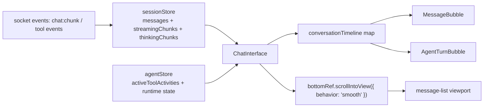
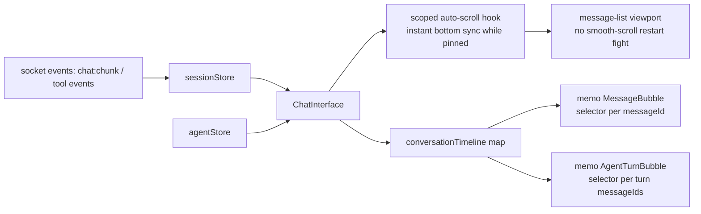
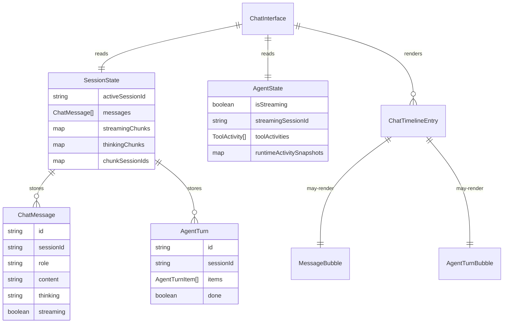

# Plan: chat stream jitter stability

## Goal

Zatrzymac drganie widoku rozmowy podczas streamingu odpowiedzi LLM przez ustabilizowanie auto-scrolla i ograniczenie niepotrzebnych rerenderow babli oraz turnow.

## Acceptance Criteria

- [x] Streaming odpowiedzi nie restartuje juz plynnego scrolla na kazdym chunku.
- [x] Niezwiazany chunk lub thinking update nie wymusza rerenderu obcych `MessageBubble` / `AgentTurnBubble`.
- [x] Jest regresja testowa dla auto-scrolla i dla scoped render path na chunkach.
- [x] Focused frontend tests i `kalio-web` typecheck przechodza.
- [x] Realny browser check na overflow case trzyma dol listy bez restartowanego smooth-scrolla; nie ma dowodu na stare "telepanie" od auto-scrolla.

## Execution Checklist

- [x] Zapisac plan i hipoteze root cause.
- [x] Wyizolowac logike auto-scrolla z `ChatInterface` i usunac smooth-scroll restartowany per chunk.
- [x] Ograniczyc subskrypcje store do per-message / per-turn scope i dodac memoizacje tam, gdzie parent rerender nie powinien ruszac historycznych babli.
- [x] Dodac lub zaktualizowac testy regresyjne.
- [x] Zweryfikowac focused tests, typecheck i browser QA.
- [x] Dopisac finalne notatki z wynikami i ryzykami.

## Current Architecture

## Target Architecture

## Affected Models

## Progress Notes

- 2026-06-28: root cause mial dwa skladniki. Pierwszy: `ChatInterface` odpalal `scrollIntoView({ behavior: 'smooth' })` przy zmianach `messages` / `activeToolActivities`, co przy streamingu restartowalo animowany scroll wielokrotnie. Drugi: `MessageBubble` i `AgentTurnBubble` czytaly zbyt szerokie fragmenty Zustand store, przez co chunki ruszaly za duzo komponentow.
- 2026-06-28: dwa niezalezne explorery potwierdzily ten sam kierunek naprawy: usunac smooth auto-scroll per chunk oraz zawezic subskrypcje/render path do per-message/per-turn scope.
- 2026-06-28: auto-scroll zostal wyciagniety do `useChatAutoScroll`, message list dostal `overflowAnchor: 'none'`, `MessageBubble` zostal zmemoizowany per `message.id`, a `AgentTurnBubble` dostal scoped selectory i custom comparator.
- 2026-06-28: `AgentTurnBubble.tsx` zostal zredukowany ponizej limitu 500 LOC przez wyciagniecie helperow do `AgentTurnBubble.selectors.ts`.

## Final Verification

- Focused tests: `corepack pnpm --filter kalio-web test -- src/features/chat/MessageBubble.test.tsx src/features/chat/AgentTurnBubble.test.tsx src/features/chat/ChatInterface.test.tsx`
  Result: passed.
- Typecheck: `corepack pnpm --filter kalio-web run typecheck`
  Result: passed.
- Build: `corepack pnpm --filter kalio-web run build`
  Result: passed. Existing large-chunk Vite warning remains unrelated.
- Browser QA artifact: `output/qa/chat-jitter-postfix-live-overflow.json`
  Result: overflow case reached with `finalScrollTop=1012`, `finalScrollHeight=2002`, `finalClientHeight=990`, `distanceFromBottom=0`, `scrollIntoViewCalls=0`.
- Browser QA artifact: `output/qa/chat-jitter-postfix-live.png`
  Result: real app rendered post-fix after live streaming run.
- Browser QA note: one backward `scrollTop` delta matched a `scrollHeight` drop of `-90` at stream finalization. That points to content height shrinking at the end of the run, not to the old repeated smooth-scroll restart loop.

## Risks / Follow-up

- `useContextUsage.ts` nadal czyta szeroki stan i buduje kosztowny sygnaturyzujacy `JSON.stringify`; to moze dalej dokladac pracy przy streamingu, mimo ze glowny jitter zostal zbity.
- Browser check byl wykonany na prawdziwej aplikacji i prawdziwym overflow case, ale przez lokalny skrypt Playwright z metrykami, nie przez video diff. Jesli user dalej zauwazy mikrodrgania, nastepny krok to nagrac trace albo podpiac probe do scrollTop/resize juz w repo QA harness.
