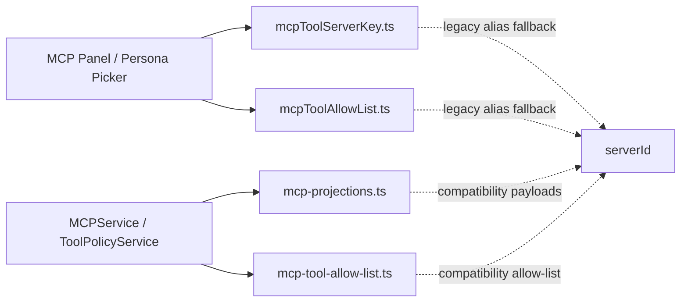
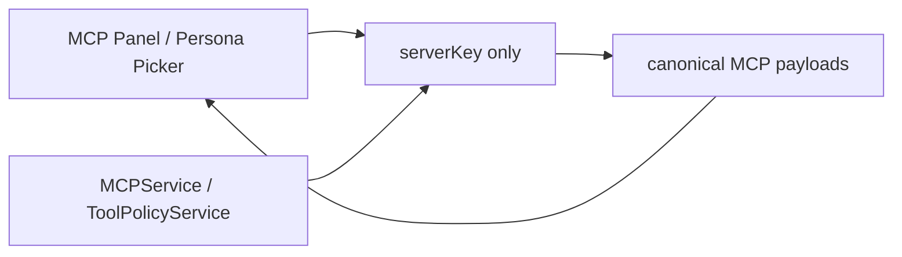
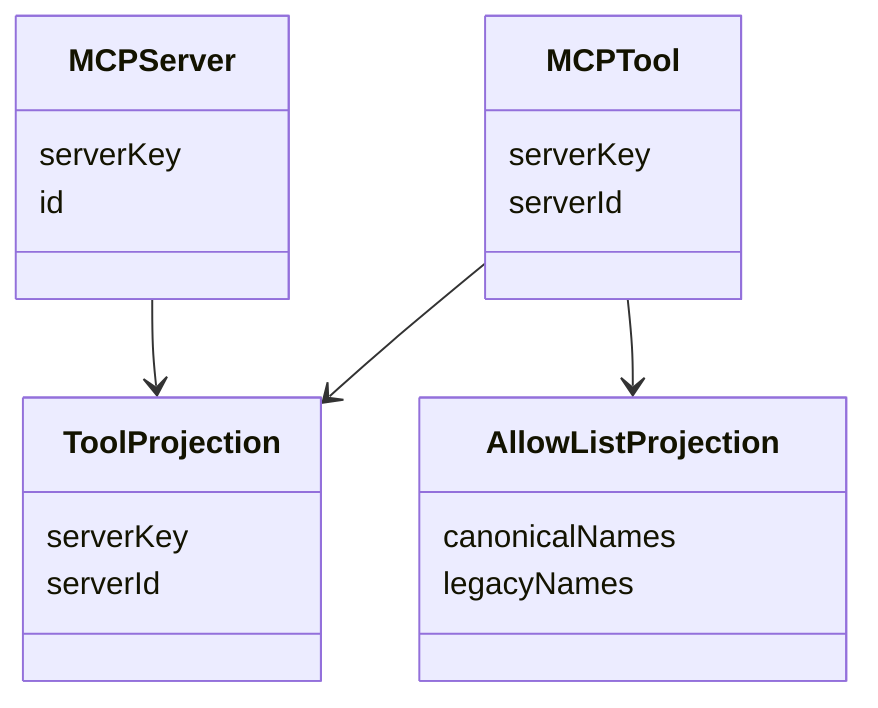

## Summary

One-release compatibility window for MCP/serverKey migration is still active.
Current production state:
- canonical `serverKey` is already the primary surface for endpoints, client actions, and tool/status projections
- legacy `serverId` remains only in narrow compatibility boundaries
- those compatibility boundaries are centralized into dedicated helpers, which makes the future removal pass mechanical

## Current Architecture

## Target Architecture

## Model Relations

## Removal Checklist

- remove `apps/kalio-web/src/features/mcp/mcpToolServerKey.ts`
- remove `apps/kalio-web/src/features/persona/mcpToolAllowList.ts`
- remove `apps/kalio-api/src/modules/mcp/mcp-projections.ts`
- remove `apps/kalio-api/src/modules/chat/mcp-tool-allow-list.ts`
- remove `serverId` alias usage from `packages/@kalio/types/src/index.ts`
- remove fallback TODO comments after the one-release compatibility window closes
- run focused MCP/web/backend regression tests after removal

## Notes

- 2026-06-28: compatibility helpers are centralized and verified; no production MCP endpoint/client call sites still build on raw `id`.
- 2026-06-28: this note intentionally does not remove fallback behavior yet.
