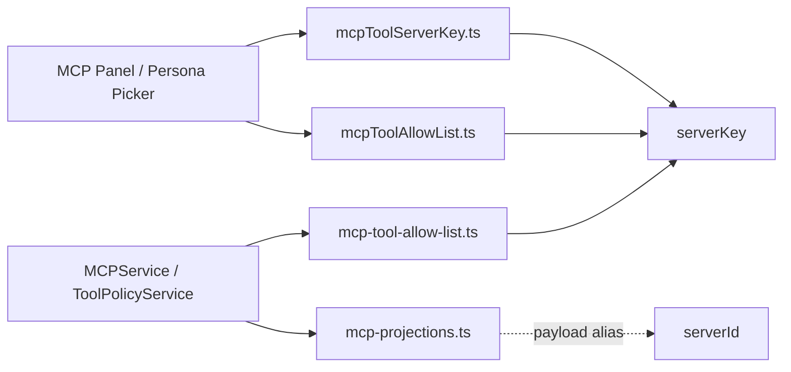
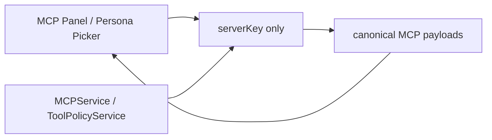
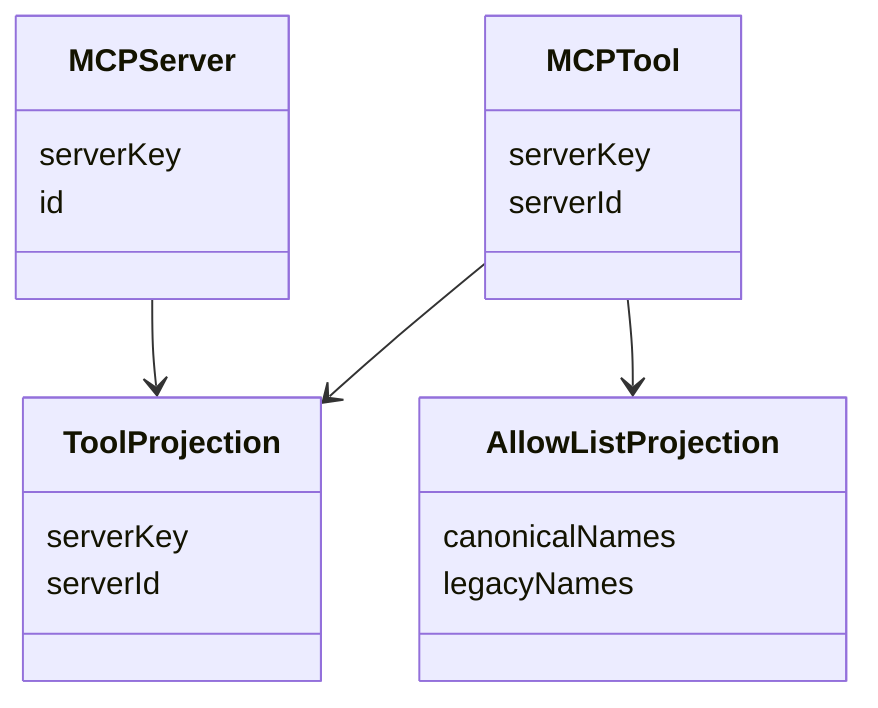

## Summary

MCP/serverKey fallback removal is complete.
Current production state:
- canonical `serverKey` is the only lookup key used by MCP clients, allow-lists, and service resolution
- legacy `serverId` is no longer used as a fallback path
- payload aliases still emit `serverId` where existing external contracts expect it

## Current Architecture

## Target Architecture

## Model Relations

## Removal Checklist

- remove `apps/kalio-web/src/features/mcp/mcpToolServerKey.ts`
- remove `apps/kalio-web/src/features/persona/mcpToolAllowList.ts`
- remove `apps/kalio-api/src/modules/mcp/mcp-projections.ts`
- remove `apps/kalio-api/src/modules/chat/mcp-tool-allow-list.ts`
- remove `serverId` alias usage from `packages/@kalio/types/src/index.ts`
- remove fallback TODO comments after the one-release compatibility window closes
- run focused MCP/web/backend regression tests after removal

## Notes

- 2026-06-28: fallback removal is implemented; backend and web targeted tests plus typecheck/build passed on the canonical-only lookup path.
- 2026-06-28: shared `@kalio/types` makes `MCPTool.serverKey` canonical and required while `serverId` survives only as a payload alias.
- 2026-06-28: the previous compatibility window is closed; no lookup or allow-list path should depend on `serverId`.
- 2026-06-28: AC-07 MCP e2e helper now requires canonical `serverKey` on returned servers and passed against the playwright stack.
- 2026-06-28: web search confirmed no direct `mcp:*` event consumers in `apps/kalio-web/src`, so the remaining `serverId` event aliases are transport contracts only, not active frontend call sites.
