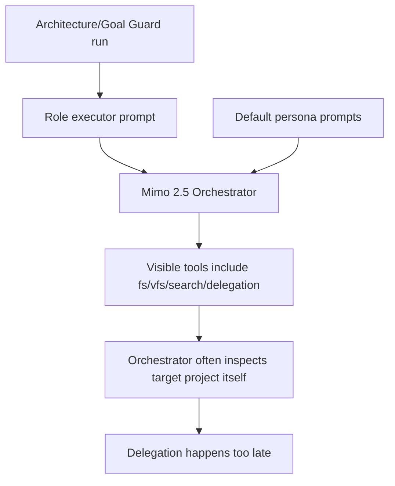
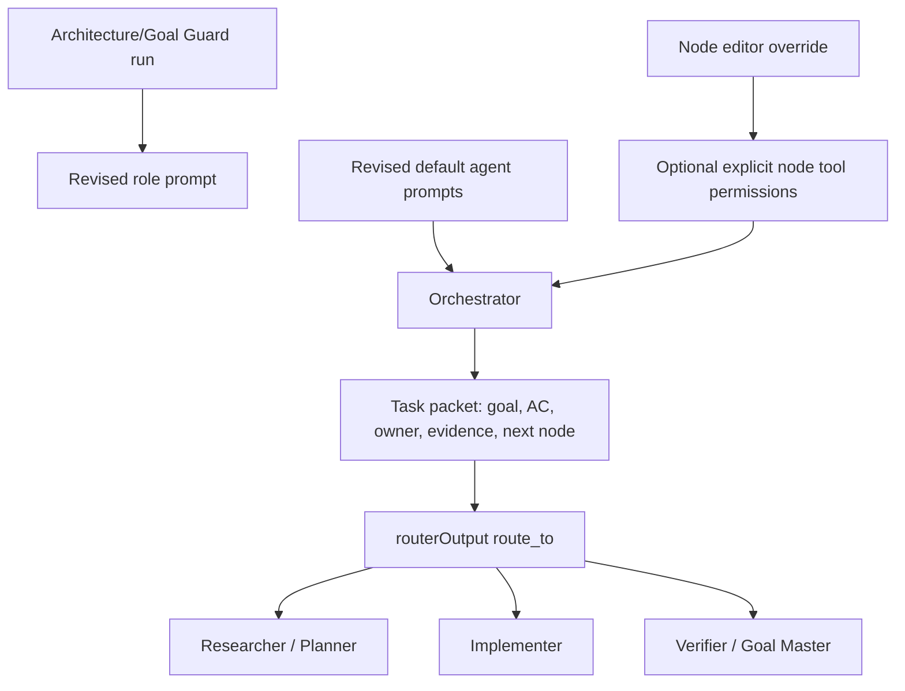
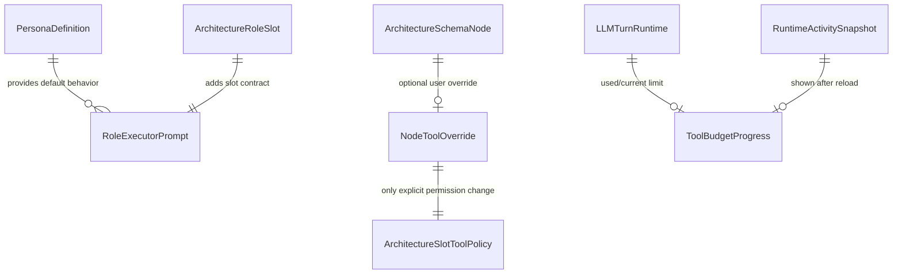

# Rewizja Promptów Orchestratora I Widoczności Budżetu

## Goal

Make default architecture Orchestrator behavior role-correct without hard-denying tools: Orchestrator should define acceptance criteria, create a delegation packet, and route/delegate to the responsible node or child agent instead of inspecting the target project itself. Explicit node-level tool permission overrides remain user-controlled in the Architect editor.

## Current Architecture Affected

## Target Architecture

## Affected Model Relations

## Checklist

- [x] Add tests proving Orchestrator prompt avoids default file-inspection instructions.
- [x] Add tests proving default tool policy is unchanged unless an explicit node override exists.
- [x] Add tests for node-level tool permission override behavior.
- [x] Add tests for tool-loop budget progress visibility and snapshot hydration.
- [x] Revise `orchestrator`, `agent-orchestrator`, and architecture superpower prompts.
- [x] Revise orchestration slot prompt in `architecture-role-executor.ts`.
- [x] Add explicit node-level tool override UI/runtime support only if missing.
- [x] Surface tool-loop budget `used/current` in Graph and Session/Conversation panels.
- [x] Run focused tests, affected typecheck/build, QA stack, and real Mimo smoke when provider is available.
- [x] Write session note with verification evidence and remaining risks.

## Notes

- 2026-06-28: Serena MCP is not exposed in this Codex session after repeated tool discovery attempts, so project activation through Serena could not be performed.
- 2026-06-28: Worktree was already dirty before this slice; preserve unrelated existing changes.
- 2026-06-28: Current agent/orchestration guidance checked against Anthropic orchestrator-workers guidance and OpenAI Agents tools/handoff guidance; implementation keeps default tool visibility but makes Orchestrator role-bound by prompt and slot contract.
- 2026-06-28: Implemented node-level tool override as an explicit exact allowed-tool list in Architect editor; blank value inherits runtime/persona/slot policy.
- 2026-06-28: Implemented tool budget progress event/snapshot plumbing and visible `used/current` counters in Conversation Manager, Session Panel rows, and architecture graph branch details.
- 2026-06-28: Focused API/web/shared unit tests, affected typechecks, and affected builds passed. E2E Goal Guard and budget HITL specs passed.
- 2026-06-28: QA stack is running on backend `57708`, frontend `57709`, provider `xiaomimimo`, model `mimo-v2.5`.
- 2026-06-28: Real Mimo structured AgentFlow run reached Orchestrator but failed on provider structured output parsing: `[XiaomiMiMo] Structured output response was not valid JSON`.
- 2026-06-28: Real Mimo direct chat prompt smoke passed: first response was a delegation task packet, with no file-inspection intent.
- 2026-06-28: Session note written to `docs/sessions/2026-06-28-orchestrator-prompts-budget.md`; this path is ignored by `.gitignore`, so it is a local process artifact unless the ignore rule is changed.
