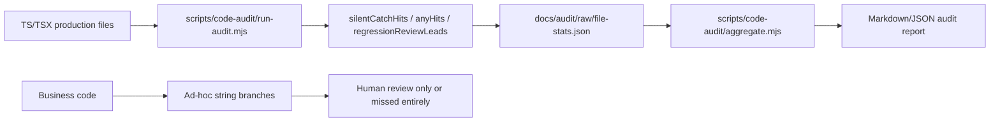
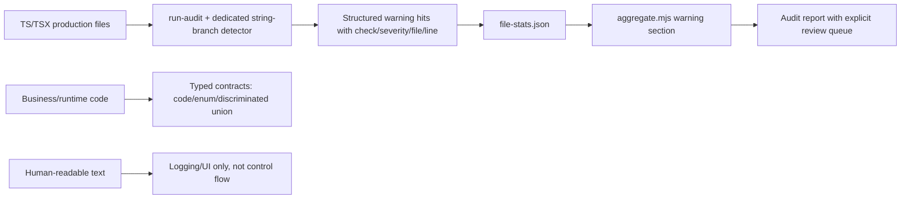
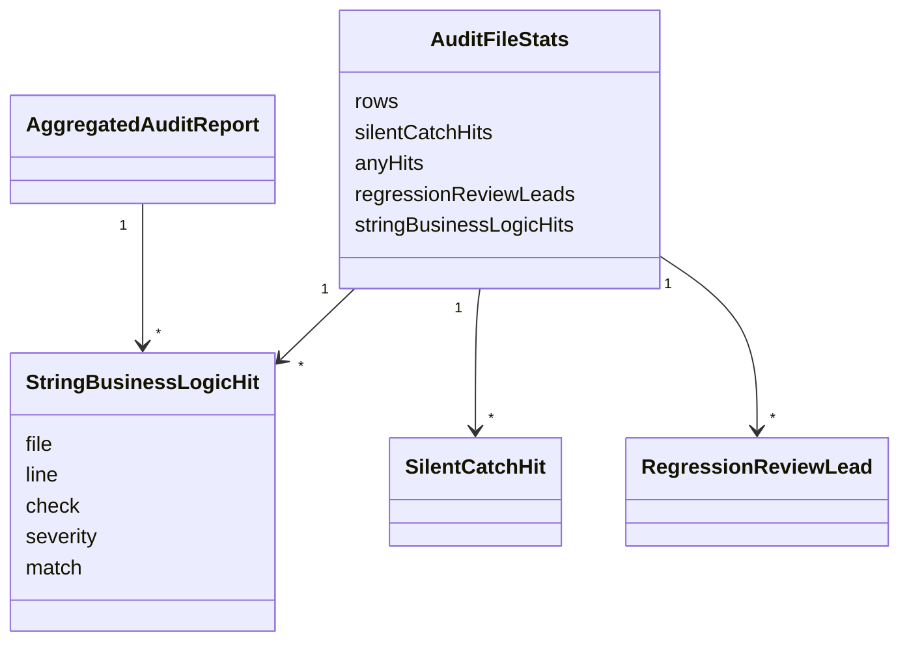

# String-Driven Business Logic Audit

## Summary

- [x] Detect string-driven business logic in the audit pipeline as warnings by default.
- [x] Prefer machine-readable contracts (`code`, enum, discriminated union, typed status) over message-text branching.
- [x] Cover the new detector with regression tests.
- [x] Publish concrete findings in `docs/bugs.md`.
- [x] Verify with targeted tests and a fresh audit report.

## Current Architecture

## Target Architecture

## Models And Relations

## Checklist

- [x] Add tests for message-text error branching detection.
- [x] Add tests for free-form text parsing and identifier-fragment detection.
- [x] Avoid flagging typed-contract status unions and plain test code.
- [x] Extend raw audit output and aggregate report.
- [x] Update `scripts/code-audit/README.md`.
- [x] Run targeted audit tool tests.
- [x] Run `npm.cmd run audit:report`.
- [x] Record highest-signal findings and repo pain points in `docs/bugs.md`.

## Verification

- [x] `node --test scripts/code-audit/audit-scripts.test.mjs`
- [x] `npm.cmd run audit:report`

## Notes

- 2026-06-28: user clarified the target is broader than `"error"` keyword checks; the audit should surface business logic that branches on human-readable strings instead of typed contracts.
- 2026-06-28: detector should treat those cases as warnings by default, not silently ignore them.
- 2026-06-28: first heuristic pass was too broad because it also flagged typed `status/type` discriminated unions. The detector was narrowed to message-text, free-form text parsing, and identifier-fragment matching so the warning queue stays focused on real contract drift.
- 2026-06-28: final verification artifacts are `docs/audit/2026-06-28-report.md`, `docs/audit/2026-06-28-report.json`, and the curated hotspot log in `docs/bugs.md`.
