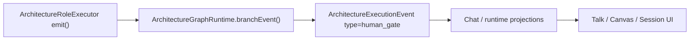
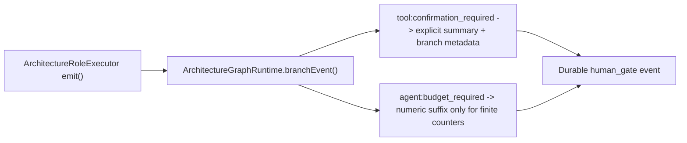
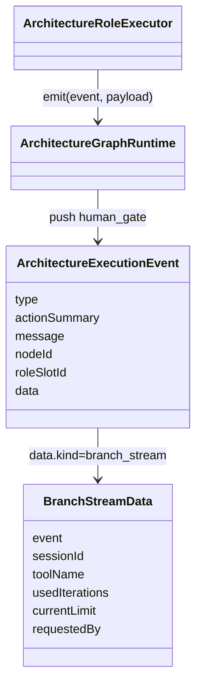

# Test Gap Detection: Architecture Human Gates

## Goal

Cover untested backend runtime paths introduced by recent `architecture-graph-runtime` human-gate handling changes, without widening scope beyond the touched architecture/chat runtime slice.

## Acceptance Criteria

- Add a focused regression test proving `tool:confirmation_required` emits a `human_gate` event with the explicit action summary and branch-stream metadata.
- Add a focused regression test proving malformed or non-finite `agent:budget_required` counters do not render a `(used/current)` suffix and do not leak invalid numeric fields into event data.
- Verify only the affected backend spec file(s).

## Current Architecture Affected

## Target Architecture

## Affected Model Relations

## Checklist

- [x] Review automation memory and current diff for the changed runtime slice.
- [x] Confirm nearby testing pattern in `architecture-graph-runtime.max-visits.spec.ts`.
- [x] Add targeted backend regression tests for branch human-gate edge paths.
- [x] Run focused backend verification.
- [x] Record outcomes and remaining nearby gaps.

## Notes

- 2026-06-30: Scope intentionally limited to backend runtime tests because prior automation memory already identified these exact uncovered paths.
- 2026-06-30: No production code change is planned unless the new tests expose a real regression.
- 2026-06-30: Verification passed with `corepack pnpm --filter kalio-api exec vitest run src/modules/architecture/architecture-graph-runtime.max-visits.spec.ts` (9 tests).
- 2026-06-30: `git diff --check` for touched files stayed clean apart from existing LF->CRLF working-tree warnings.
- 2026-06-30: Read-only frontend subagent review found follow-up gaps around `toolBudgetProgress` lifecycle, manual-scroll autoscroll suppression, and `SessionPanelRow` budget badge coverage.
