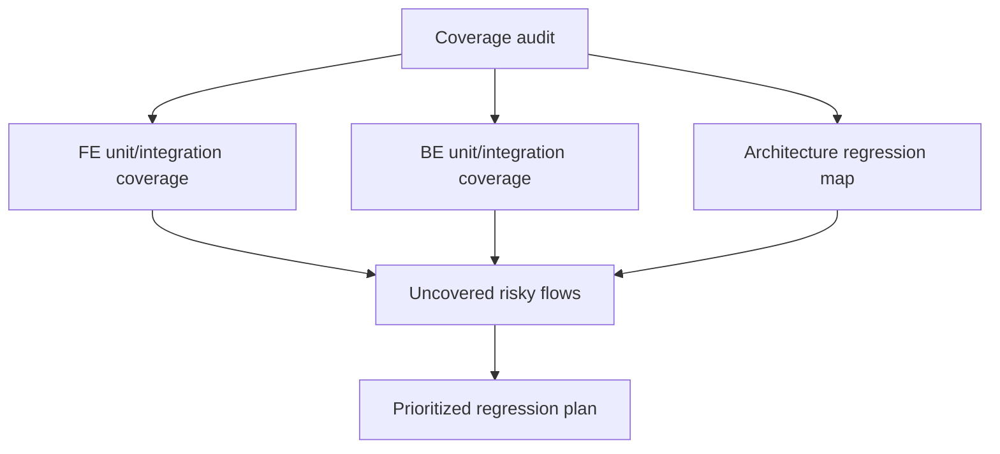
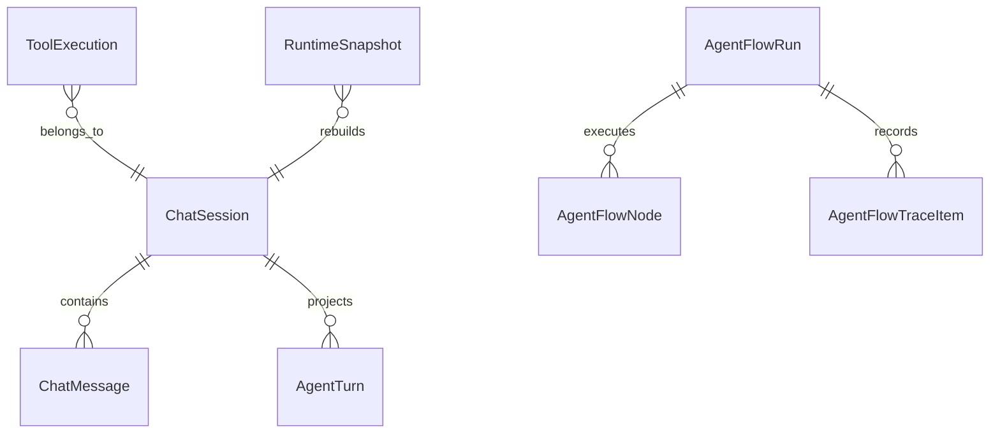

# FE/BE coverage audit and regression targets - 2026-07-01

## Goal

Measure current frontend and backend coverage, inspect what it really protects, and identify the highest-value regression tests for architecture and logic.

## Current Architecture

```mermaid
flowchart TD
  FE[React frontend] --> SDK[@kalio/sdk Socket.IO client]
  SDK --> API[NestJS backend]
  API --> Runtime[Chat / AgentFlow runtime]
  API --> Storage[SQLite + memory + VFS]
  Runtime --> Tools[Native tools + MCP + CLI agents]
  Runtime --> Events[Socket events]
  Events --> FE
```

## Target Audit Architecture



## Affected Models



## Checklist

- [x] Inspect scripts, thresholds, and existing test topology.
- [x] Attempt current backend coverage run and record blockers when full-suite measurement is red.
- [x] Attempt current frontend coverage run and record blockers when full-suite measurement is red.
- [x] Identify high-risk uncovered architecture and logic paths.
- [x] Summarize meaningful regression test recommendations.
- [x] Record commands, evidence, and residual risks.

## Notes

- Started audit from repo root with Serena project activation and test-focused review workflow.

## Evidence

- Coverage configs:
  - Backend `apps/kalio-api/vitest.config.ts`: thresholds lines/functions/statements `80`, branches `70`, provider `v8`, explicit `include` and `exclude`.
  - Frontend `apps/kalio-web/vitest.config.ts`: thresholds lines `38`, functions `30`, statements `36`, branches `30`, provider `v8`, explicit `include` and `exclude`.
- Commands run:
  - `corepack pnpm --filter kalio-api run test:cov` on system Node outside sandbox.
  - `corepack pnpm --filter kalio-api exec vitest run --coverage.enabled=true --coverage.reporter=text-summary --coverage.reporter=json-summary --coverage.reportsDirectory=coverage-audit` on system Node outside sandbox.
  - `corepack pnpm --filter kalio-web run test:cov`.
- Current backend full-suite coverage run is blocked by failing tests in the current worktree:
  - `apps/kalio-api/src/modules/chat/runtime-audit-logger.service.spec.ts`: missing `./runtime-audit-logger.service`.
  - `apps/kalio-api/src/modules/raapp/raapp-hitl.service.spec.ts`: `getPendingForSession()` timeout expectations no longer match runtime behavior.
  - `apps/kalio-api/src/modules/chat/__tests__/tool-dispatch.service.spec.ts`: configurable HITL timeout contract changed from expected `0` to emitted `600000`.
- Current frontend full-suite coverage run is blocked by failing tests in the current repo state:
  - `apps/kalio-web/src/services/sessionWatchRegistry.test.ts`: pending host sessions are currently being identified once.
  - `apps/kalio-web/src/features/sessions/sessionRenderableFilter.test.ts`: role-slot graph status and reload runtime-state expectations drifted.
  - `apps/kalio-web/src/features/tools/ToolPanel.test.tsx`: MCP grouping/badge expectation drifted to `Other`.
  - `apps/kalio-web/src/features/chat/hooks/useChatSocketEvents.reconnect.test.ts`: reconnect hydration no longer drives the expected `setMessages()` path.
- Latest repo-wide green coverage evidence found in repo docs:
  - `docs/todos/2026-06-23-workflow-node-qa-coverage.md`
  - Backend: statements `87.62%`, branches `81.29%`, functions `89.38%`, lines `87.62%`.
  - Frontend: statements `84.04%`, branches `76.78%`, functions `84.34%`, lines `85.40%`.
- Latest architecture/runtime baseline also recorded in `docs/sub-agentflow-target-architecture.md`:
  - Backend: statements `87.64%`, branches `80.94%`, functions `89.45%`, lines `87.64%`.
  - Frontend: statements `80.98%`, branches `73.09%`, functions `79.78%`, lines `82.97%`.

## Findings

- The repo has meaningful historical FE/BE coverage, but today's tree is not in a clean enough state to produce a truthful fresh full-suite percentage.
- Backend thresholds are already architecture-sensitive; frontend thresholds are too low to act as a regression gate despite historically achieving much higher real coverage.
- The current red tests are not random UI noise. They cluster around exactly the architecture surfaces that matter:
  - reconnect and hydration,
  - runtime/session projection,
  - HITL timeout and pending approval semantics,
  - tool metadata projection for MCP/native boundaries.
- That makes the current failure list a better guide for regression priorities than chasing net-new raw line coverage.

## Recommended Regression Targets

1. Reconnect and hydration parity across FE surfaces.
   - Strengthen `useChatSocketEvents.reconnect`, `sessionWatchRegistry`, `sessionRenderableFilter`, and browser-backed reload/F5 proofs so Talk, Canvas, Session Panel, and Execution Graph stay aligned after reconnect or restored history.
2. HITL contract tests across backend and frontend.
   - Lock down `ToolDispatchService` and `RAAppHITLService` for manual timeout vs no-timeout semantics, pending approval listing, cancelled vs pending state, emitted `timeoutMs`, and audit trail shape.
3. Architecture runtime restart-abuse and wait-state proofs.
   - Add broader process-restart or resume tests around `AgentFlowRun` checkpoints, waiting runs, stale worker projections, budget-before-timeout, and stop/follow-up drain.
4. Gateway event-routing unit coverage.
   - Add direct tests for `chat.gateway.event-routing.ts`, especially actionable-event table coverage and malformed payload rejection, because repo notes still call this out as only indirectly covered.
5. MCP/native tool metadata compatibility tests.
   - Cover grouping behavior when tool `domain` is absent but `serverKey` implies MCP, so legacy or partially hydrated tool metadata does not silently move to `Other`.
6. Direct FE selector/helper tests where docs already note residual gaps.
   - `agentRuntimeAttentionNotice.ts`.
   - `registerConnectionRecoveryHandlers` listener/interval lifecycle behavior.
7. Stable end-to-end proof for human gates.
   - Finish a deterministic E2E path for UI confirm-click and HITL modal cleanup, since repo notes still describe timeout instability there.

## Risk

- Without first re-greening the current FE and BE suites, any new coverage number would be misleading because it would be measured on a broken baseline.
- Frontend threshold values are low enough that a future green coverage run could still miss architecture regressions unless thresholds are ratcheted upward after the suite is stable.
